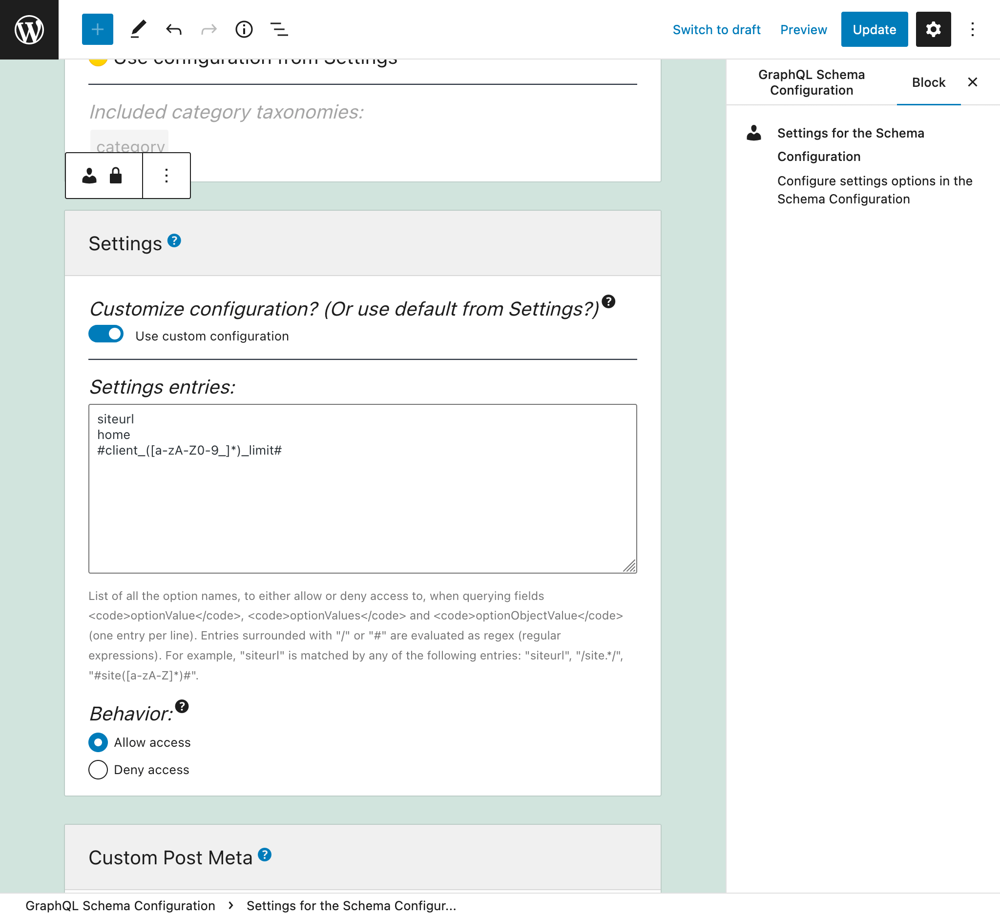
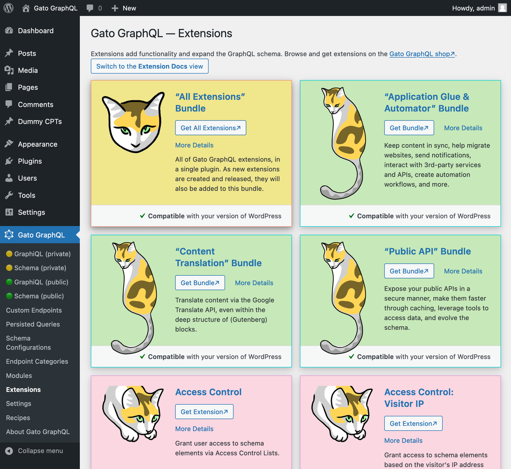

<p align="center"></p>

# Gato GraphQL

Gato GraphQL is a **tool for interacting with data in your WordPress site**. You can think of it as a Swiss Army Knife for dealing with data, as it allows to retrieve, manipulate and store again any piece of data, in any desired way, using the [GraphQL language](https://graphql.org/).

With Gato GraphQL, you can:

- Query data to create headless sites
- Expose public and private APIs
- Map JS components to Gutenberg blocks
- Synchronize content across sites
- Automate tasks
- Complement WP-CLI to execute admin tasks
- Search/replace content for site migrations
- Send notifications when something happens (new post published, new comment added, etc)
- Interact with cloud services
- Convert the data from a 3rd-party API into the required format
- Translate content in the site
- Update thousands of posts with a single action
- Insert or remove Gutenberg blocks in bulk
- Validate that a new post contains a mandatory block
- And much more...

Check out the [Recipes section in gatographql.com](https://gatographql.com/recipes/intro) to browse examples demonstrating these use cases.

## Screenshots

GraphiQL client to execute queries in the wp-admin:


Interactively browse the GraphQL schema, exploring all connections among entities:


The GraphiQL client for the single endpoint is exposed to the Internet:


Interactively browse the GraphQL schema exposed for the single endpoint:


Persisted queries are pre-defined and stored in the server:


Requesting a persisted query URL will retrieve its pre-defined GraphQL response:


We can create multiple custom endpoints, each for a different target:


Endpoints are configured via Schema Configurations:


We can create many Schema Configurations, customizing them for different users or applications:


Custom endpoints and Persisted queries can be public, private and password-protected:


We can configure exactly what custom post types, options and meta keys can be queried:


Configure every aspect from the plugin via the Settings page:



Modules with different functionalities and schema extensions can be enabled and disabled:


Augment the plugin functionality and GraphQL schema via extensions:


The Recipes section contains example queries ready to copy/paste and use:



## Installing the Gato GraphQL plugin in WordPress

_For alternative installation methods, check [Installing Gato GraphQL](docs/installing-gatographql-for-wordpress.md)._

Download the latest release of the plugin<!-- @todo Fix when plugin released in wp.org [the latest release of the plugin][latest-release-url]--> as a .zip file.

Then, in the WordPress admin:

- Go to `Plugins => Add New`
- Click on `Upload Plugin`
- Select the .zip file
- Click on `Install Now` (it may take a few minutes)
- Once installed, click on `Activate`

Requirements:

- WordPress 5.4+
- PHP 7.2+

## Development

Check instructions in: [Setting-up the development environment](docs/development-environment.md).

### Supported PHP features

Check the list of [Supported PHP features](docs/supported-php-features.md)

### Gutenberg JS builds

Compiled JavaScript code (such as all files under a block's `build/` folder) is added to the repo, but only as compiled for production, i.e. after running `npm run build`.

Code compiled for development, i.e. after running `npm start`, cannot be commited/pushed to the repo.

<details>

<summary>Architectural resources</summary>

### PHP Architecture

Articles explaining how the plugin is "downgraded", using PHP 8.1 for development but deployable to PHP 7.2 for production:

1. [Transpiling PHP code from 8.0 to 7.x via Rector](https://blog.logrocket.com/transpiling-php-code-from-8-0-to-7-x-via-rector/)
2. [Coding in PHP 7.4 and deploying to 7.1 via Rector and GitHub Actions](https://blog.logrocket.com/coding-in-php-7-4-and-deploying-to-7-1-via-rector-and-github-actions/)
3. [Tips for transpiling code from PHP 8.0 down to 7.1](https://blog.logrocket.com/tips-transpiling-code-from-php-8-0-to-7-1/)
4. [Including both PHP 7.1 and 8.0 code in the same plugin … or not?](https://blog.logrocket.com/including-php-7-1-and-8-0-code-same-plugin-or-not/)

Service container implementation:

- [Building extensible PHP apps with Symfony DI](https://blog.logrocket.com/building-extensible-php-apps-with-symfony-di/)

Explanation of how the codebase is split into granular packages, to enable CMS-agnosticism:

1. [Abstracting WordPress Code To Reuse With Other CMSs: Concepts (Part 1)](https://www.smashingmagazine.com/2019/11/abstracting-wordpress-code-cms-concepts/)
2. [Abstracting WordPress Code To Reuse With Other CMSs: Implementation (Part 2)](https://www.smashingmagazine.com/2019/11/abstracting-wordpress-code-reuse-with-other-cms-implementation/)

Description of how the plugin is scoped:

- [Gato GraphQL is now scoped, thanks to PHP-Scoper!](https://gatographql.com/blog/gatographql-is-now-scoped-thanks-to-php-scoper/)

### GraphQL by PoP documentation

Gato GraphQL is powered by the CMS-agnostic GraphQL server [GraphQL by PoP](https://graphql-by-pop.com).

Technical information on how the GraphQL server works:

- [GraphQL by PoP documentation](https://graphql-by-pop.com/docs/getting-started/intro.html).

Description of how a GraphQL server using server-side components works:

- [Implementing a GraphQL server with components in PHP](https://www.wpkube.com/implementing-graphql-server/)

These articles explain the concepts, design and implementation of GraphQL by PoP:

1. [Designing a GraphQL server for optimal performance](https://blog.logrocket.com/designing-graphql-server-optimal-performance/)
2. [Simplifying the GraphQL data model](https://blog.logrocket.com/simplifying-the-graphql-data-model/)
3. [Schema-first vs code-first development in GraphQL](https://blog.logrocket.com/code-first-vs-schema-first-development-graphql/)
4. [Speeding-up changes to the GraphQL schema](https://blog.logrocket.com/speeding-up-changes-to-the-graphql-schema/)
5. [Versioning fields in GraphQL](https://blog.logrocket.com/versioning-fields-graphql/)
6. [GraphQL directives are underrated](https://blog.logrocket.com/graphql-directives-are-underrated/)
7. [Treating GraphQL directives as middleware](https://blog.logrocket.com/treating-graphql-directives-as-middleware/) 
8. [Creating an @export GraphQL directive](https://blog.logrocket.com/creating-an-export-graphql-directive/)
9. [Adding directives to the schema in code-first GraphQL servers](https://blog.logrocket.com/adding-directives-schema-code-first-graphql-servers/)
10. [Coding a GraphQL server in JavaScript vs. WordPress](https://blog.logrocket.com/coding-a-graphql-server-in-javascript-vs-wordpress/)
11. [Supporting opt-in nested mutations in GraphQL](https://blog.logrocket.com/supporting-opt-in-nested-mutations-in-graphql/)
12. [HTTP caching in GraphQL](https://blog.logrocket.com/http-caching-graphql/)

### Gutenberg

These articles explain the integration with Gutenberg (the WordPress editor).

1. [Adding a Custom Welcome Guide to the WordPress Block Editor](https://css-tricks.com/adding-a-custom-welcome-guide-to-the-wordpress-block-editor/)
2. [Using Markdown and Localization in the WordPress Block Editor](https://css-tricks.com/using-markdown-and-localization-in-the-wordpress-block-editor/)

</details>

## Monorepo documentation

`leoloso/PoP` is a monorepo containing several projects. Check [Monorepo_README.md](Monorepo_README.md) for documentation.

## Standards

[PSR-1](https://www.php-fig.org/psr/psr-1), [PSR-4](https://www.php-fig.org/psr/psr-4) and [PSR-12](https://www.php-fig.org/psr/psr-12).

To check the coding standards via [PHP CodeSniffer](https://github.com/squizlabs/PHP_CodeSniffer), run:

``` bash
composer check-style
```

To automatically fix issues, run:

``` bash
composer fix-style
```

## Release notes

- **[1.0](docs/release-notes/1.0/en.md)** (current)
- [0.10](docs/release-notes/0.10/en.md)
- [0.9](docs/release-notes/0.9/en.md)
- [0.8](docs/release-notes/0.8/en.md)
- [0.7](docs/release-notes/0.7/en.md)
- [0.6](docs/release-notes/0.6/en.md)

## Change log

Please see [CHANGELOG](CHANGELOG.md) for more information on what has changed recently.

## Testing

To execute [PHPUnit](https://phpunit.de/), run:

``` bash
composer test
```

## Static Analysis

To execute [PHPStan](https://github.com/phpstan/phpstan), run:

``` bash
composer analyse
```

## Downgrading code

To visualize how [Rector](https://github.com/rectorphp/rector) will downgrade the code to PHP 7.2:

```bash
composer preview-code-downgrade
```

## Report issues

To report a bug or request a new feature please do it on the [PoP monorepo issue tracker](https://github.com/leoloso/PoP/issues).

## Contributing

We welcome contributions for this package on the [PoP monorepo](https://github.com/leoloso/PoP) (where the source code for this package is hosted).

Please see [CONTRIBUTING](CONTRIBUTING.md) and [CODE_OF_CONDUCT](CODE_OF_CONDUCT.md) for details.

## Security

If you discover any security related issues, please email leo@getpop.org instead of using the issue tracker.

## Credits

- [Leonardo Losoviz][link-author]

## License

GPLv2 or later. Please see [License File](LICENSE.md) for more information.

[ico-license]: https://img.shields.io/badge/license-GPL%20(%3E%3D%202)-brightgreen.svg?style=flat-square
[ico-travis]: https://img.shields.io/travis/GatoGraphQL/gatographql/master.svg?style=flat-square
[ico-scrutinizer]: https://img.shields.io/scrutinizer/coverage/g/GatoGraphQL/gatographql.svg?style=flat-square
[ico-code-quality]: https://img.shields.io/scrutinizer/g/GatoGraphQL/gatographql.svg?style=flat-square
[ico-release]: https://img.shields.io/github/release/GatoGraphQL/gatographql.svg
[ico-downloads]: https://img.shields.io/github/downloads/GatoGraphQL/gatographql/total.svg

[link-travis]: https://travis-ci.com/github/GatoGraphQL/gatographql
[link-scrutinizer]: https://scrutinizer-ci.com/g/GatoGraphQL/gatographql/code-structure
[link-code-quality]: https://scrutinizer-ci.com/g/GatoGraphQL/gatographql
[link-downloads]: https://GitHub.com/GatoGraphQL/gatographql/releases/
[link-release]: https://GitHub.com/GatoGraphQL/gatographql/releases/
[link-downloads]: https://GitHub.com/GatoGraphQL/gatographql/releases/
[link-contributors]: ../../../../../../contributors
[link-author]: https://github.com/leoloso

[latest-release-url]: https://github.com/leoloso/PoP/releases/latest/download/gatographql.zip
