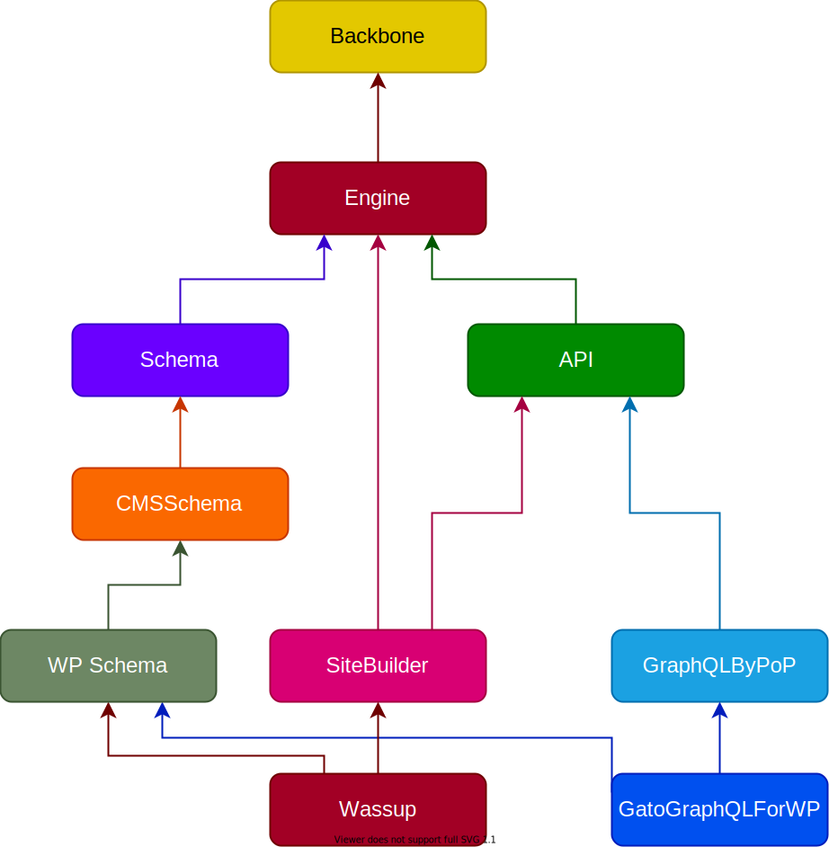

# PoP

This is a monorepo containing all layers from the PoP project:

[Engine](layers/Engine):<br/>A server-side component model in PHP.

[Schema](layers/Schema):<br/>The definitions for data entities (posts, users, comments, etc).

[API](layers/API):<br/>Packages to access the schema data through an API, including REST and GraphQL.

[GraphQL by PoP](layers/GraphQLByPoP):<br/>Implementation of a CMS-agnostic GraphQL server in PHP, living in [graphql-by-pop.com](https://graphql-by-pop.com).

[GraphQL API for WordPress](layers/GraphQLAPIForWP):<br/>Implementation of the CMS-agnostic GraphQL server for WordPress, involving [the main plugin](layers/GraphQLAPIForWP/plugins/graphql-api-for-wp) and extensions, and living in [graphql-api.com](https://graphql-api.com).

[Site Builder](layers/SiteBuilder):<br/>Packages to build a website using the component-model architecture.

[Wassup](layers/Wassup):<br/>Implementation of a PoP website for WordPress (powering [MESYM](https://www.mesym.com) and [TPP Debate](https://my.tppdebate.org)).

[Misc](layers/Misc):<br/>Collection of packages, clients, and others, related to PoP or any of its layers.

## Dependency graph

This is how the layers in PoP relate to each other:

<p align="center"></p>

## PHP versions

All packages in this monorepo require PHP 8.0 for development, but contain only PHP code that can be transpiled to PHP 7.1 for production.

### Supported PHP features

| PHP Version | Features |
| --- | --- |
| 7.1 | Everything |
| 7.2 | [`object` type](https://www.php.net/manual/en/migration72.new-features.php#migration72.new-features.object-type)<br/><br/>[parameter type widening](https://www.php.net/manual/en/migration72.new-features.php#migration72.new-features.param-type-widening)<br/><br/>[`PREG_UNMATCHED_AS_NULL` flag in `preg_match`](https://www.php.net/manual/en/function.preg-match.php#refsect1-function.preg-match-parameters)<br/><br/>Functions:<ul><li>[`spl_object_id`](https://php.net/spl_object_id)</li><li>[`utf8_encode`](https://php.net/utf8_encode)</li><li>[`utf8_decode`](https://php.net/utf8_decode)</li></ul>Constants:<ul><li>[`PHP_FLOAT_*`](https://php.net/reserved.constants#constant.php-float-dig)</li><li>[`PHP_OS_FAMILY`](https://php.net/reserved.constants#constant.php-os-family)</li></ul> |
| 7.3 | [Reference assignments in `list()`/array destructuring](https://www.php.net/manual/en/migration73.new-features.php#migration73.new-features.core.destruct-reference) => `[&$a, [$b, &$c]] = $d`<br/>_Except inside `foreach` ([#4376](https://github.com/rectorphp/rector/issues/4376))_<br/><br/>[Flexible Heredoc and Nowdoc syntax](https://www.php.net/manual/en/migration73.new-features.php#migration73.new-features.core.heredoc)<br/><br/>[Trailing commans in functions calls](https://www.php.net/manual/en/migration73.new-features.php#migration73.new-features.core.trailing-commas)<br/><br/>[`set(raw)cookie` accepts $option argument](https://www.php.net/manual/en/migration73.other-changes.php#migration73.other-changes.core.setcookie)<br/><br/>Functions:<ul><li>[`array_key_first`](https://php.net/array_key_first)</li><li>[`array_key_last`](https://php.net/array_key_last)</li><li>[`hrtime`](https://php.net/function.hrtime)</li><li>[`is_countable`](https://php.net/is_countable)</li></ul>Exceptions:<ul><li>[`JsonException`](https://php.net/JsonException)</li></ul> |
| 7.4 | [Typed properties](https://www.php.net/manual/en/migration74.new-features.php#migration74.new-features.core.typed-properties)<br/><br/>[Arrow functions](https://www.php.net/manual/en/functions.arrow.php)<br/><br/>[Null coalescing assignment operator](https://www.php.net/manual/en/migration74.new-features.php#migration74.new-features.core.null-coalescing-assignment-operator) => `??=`<br/><br/>[Unpacking inside arrays](https://www.php.net/manual/en/migration74.new-features.php#migration74.new-features.core.unpack-inside-array) => `$nums = [3, 4]; $merged = [1, 2, ...$nums, 5];`<br/><br/>[Numeric literal separator](https://www.php.net/manual/en/migration74.new-features.php#migration74.new-features.core.numeric-literal-separator) => `1_000_000`<br/><br/>[`strip_tags()` with array of tag names](https://www.php.net/manual/en/migration74.new-features.php#migration74.new-features.standard.strip-tags) => `strip_tags($str, ['a', 'p'])`<br/><br/>[covariant return types and contravariant param types](https://www.php.net/manual/en/migration74.new-features.php#migration74.new-features.core.type-variance)<br/><br/>Functions:<ul><li>[`get_mangled_object_vars`](https://php.net/get_mangled_object_vars)</li><li>[`mb_str_split`](https://php.net/mb_str_split)</li><li>[`password_algos`](https://php.net/password_algos)</li></ul> |
| 8.0 | [Union types](https://php.watch/versions/8.0/union-types)<br/><br/>[`mixed` pseudo type](https://php.watch/versions/8.0/mixed-type)<br/><br/>[`static` return type](https://php.watch/versions/8.0/static-return-type)<br/><br/>[`::class` magic constant on objects](https://php.watch/versions/8.0/class-constant-on-objects)<br/><br/>[`match` expressions](https://php.watch/versions/8.0/match-expression)<br/><br/>[`catch` exceptions only by type](https://php.watch/versions/8.0/catch-exception-type)<br/><br/>[Null-safe operator](https://php.watch/versions/8.0/null-safe-operator)<br/><br/>[Class constructor property promotion](https://php.watch/versions/8.0/constructor-property-promotion)<br/><br/>[Trailing commas in parameter lists and closure `use` lists](https://php.watch/versions/8.0/trailing-comma-parameter-use-list)<br/><br/>Interfaces:<ul><li>`Stringable`</li></ul>Classes:<ul><li>`ValueError`</li><li>`UnhandledMatchError`</li></ul>Constants:<ul><li>`FILTER_VALIDATE_BOOL`</li></ul>Functions:<ul><li>[`fdiv`](https://php.net/fdiv)</li><li>[`get_debug_type`](https://php.net/get_debug_type)</li><li>[`preg_last_error_msg`](https://php.net/preg_last_error_msg)</li><li>[`str_contains`](https://php.net/str_contains)</li><li>[`str_starts_with`](https://php.net/str_starts_with)</li><li>[`str_ends_with`](https://php.net/str_ends_with)</li><li>[`get_resource_id`](https://php.net/get_resource_id)</li></ul> |

### Preview downgrade to PHP 7.1

Via [Rector](https://github.com/rectorphp/rector) (dry-run mode):

```bash
composer preview-code-downgrade
```

## Lando server for the GraphQL API for WordPress

Launch a development server, with WordPress installed and the GraphQL API plugin activated, through [Lando](https://lando.dev/).

Please make sure you have Lando installed, with version `3.0.26` or upwards (or install it from [here](https://github.com/lando/lando/releases/tag/v3.0.26)).

The first time, to install the server, execute:

```bash
composer build-server
```

From then on, to start the server, execute:

```bash
composer start-server
```

The site will be available under `http://graphql-api.lndo.site`.

To access the [wp-admin](http://graphql-api.lndo.site/wp-admin/):

- User: `admin`
- Password: `admin`

More instructions on the [GraphQL API for WordPress README](layers/GraphQLAPIForWP/plugins/graphql-api-for-wp).

## Standards

[PSR-1](https://www.php-fig.org/psr/psr-1), [PSR-4](https://www.php-fig.org/psr/psr-4) and [PSR-12](https://www.php-fig.org/psr/psr-12).

To check the coding standards via [PHP CodeSniffer](https://github.com/squizlabs/PHP_CodeSniffer), run:

``` bash
composer check-style
```

To automatically fix issues, run:

``` bash
composer fix-style
```

## Testing

To execute [PHPUnit](https://phpunit.de/), run:

``` bash
composer test
```

## Static analysis

To execute [PHPStan](https://github.com/phpstan/phpstan), run:

``` bash
composer analyse
```


## Report issues

Use the [issue tracker](https://github.com/leoloso/PoP/issues) to report a bug or request a new feature for all packages in the monorepo.

## Contributing

Please see [CONTRIBUTING](CONTRIBUTING.md) and [CODE_OF_CONDUCT](CODE_OF_CONDUCT.md) for details.

## Security

If you discover any security related issues, please email leo@getpop.org instead of using the issue tracker.

## Credits

- [Leonardo Losoviz][link-author]
- [All Contributors][link-contributors]

## License

GNU General Public License v2 (or later). Please see [License File](LICENSE.md) for more information.

[link-author]: https://github.com/leoloso
[link-contributors]: ../../contributors
