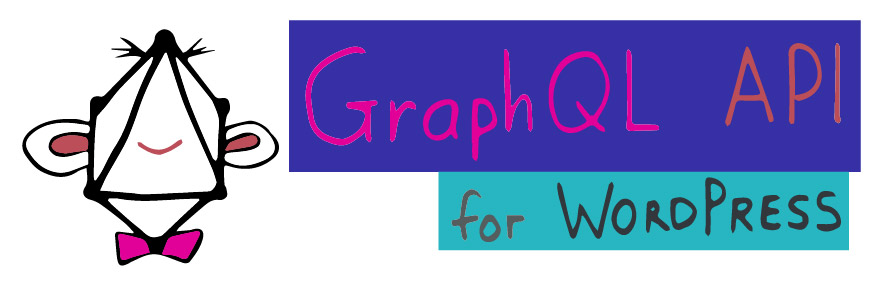
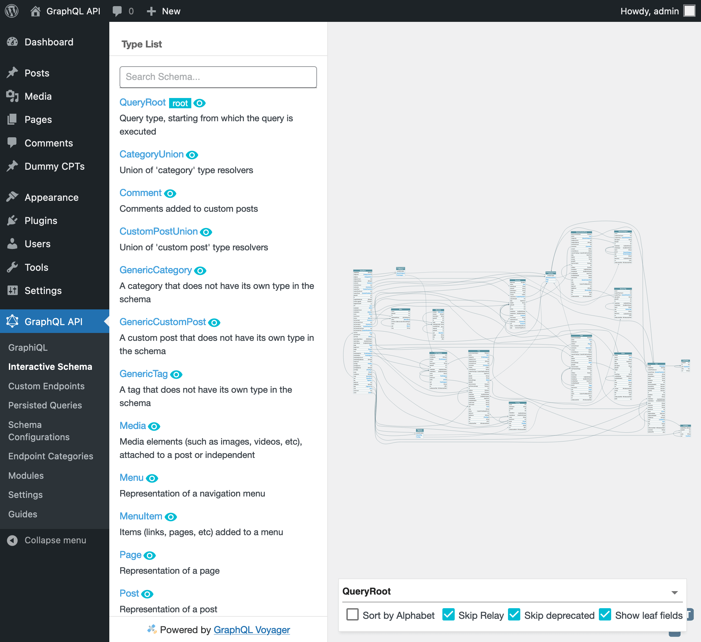

# GraphQL API for WordPress layer

Transform your WordPress site into a modern GraphQL server: [gato-graphql.com](https://gato-graphql.com).

This layer provides the implementation for WordPress of [GraphQL by PoP](https://graphql-by-pop.com/). It comprises:

- The main plugin, [GraphQL API for WordPress](plugins/gato-graphql-for-wp) ([gato-graphql.com](https://gato-graphql.com)).
- An [extension demo](layers/GatoGraphQLForWP/plugins/extension-demo) plugin, demonstrating how to extend the GraphQL schema.
