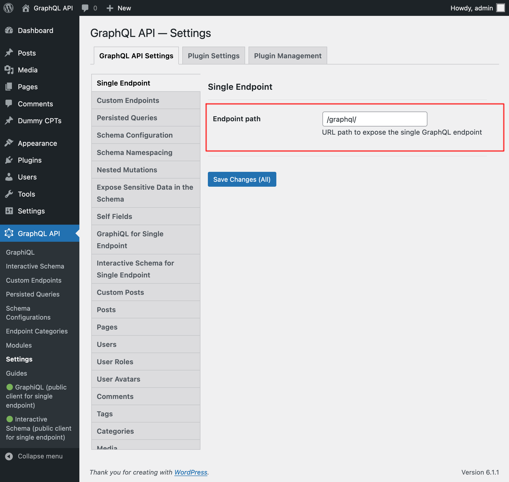
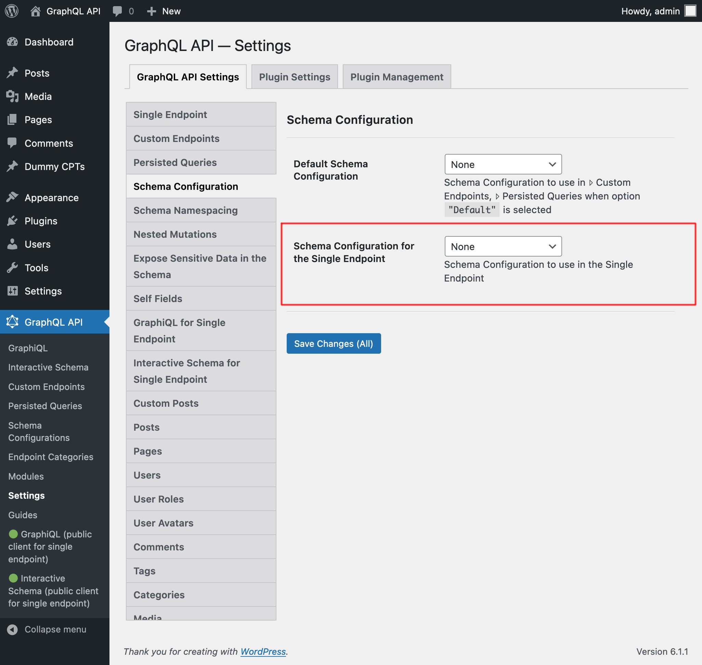
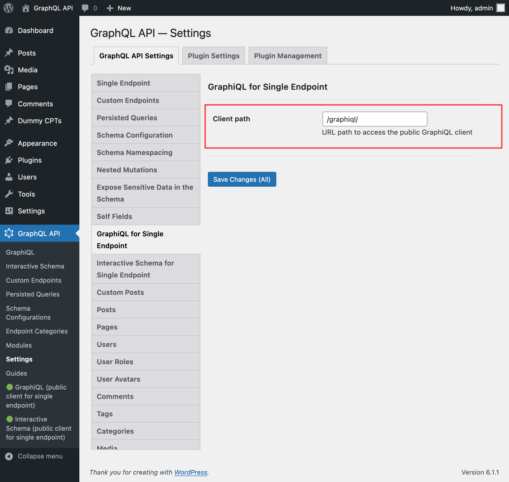
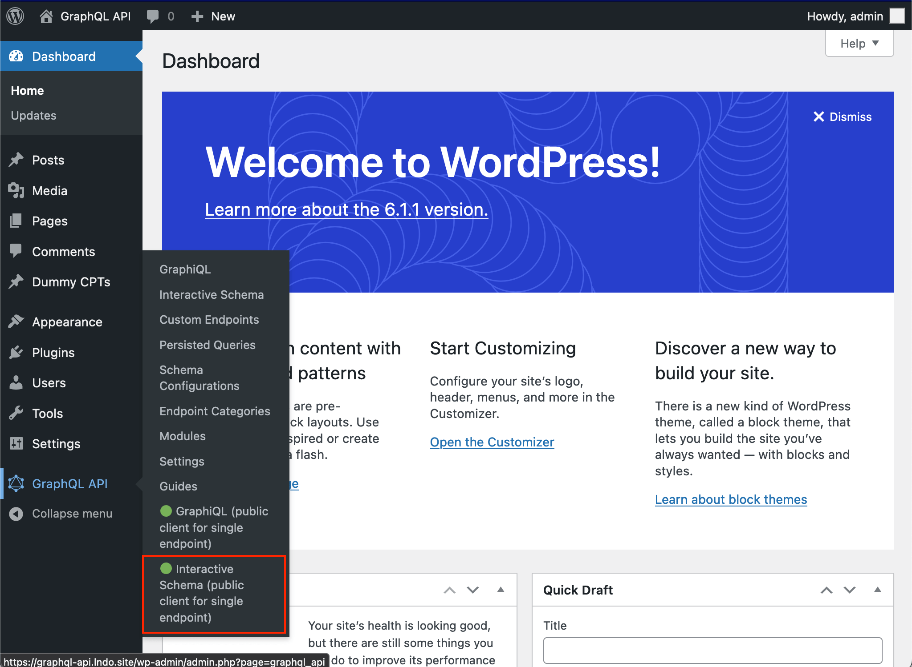
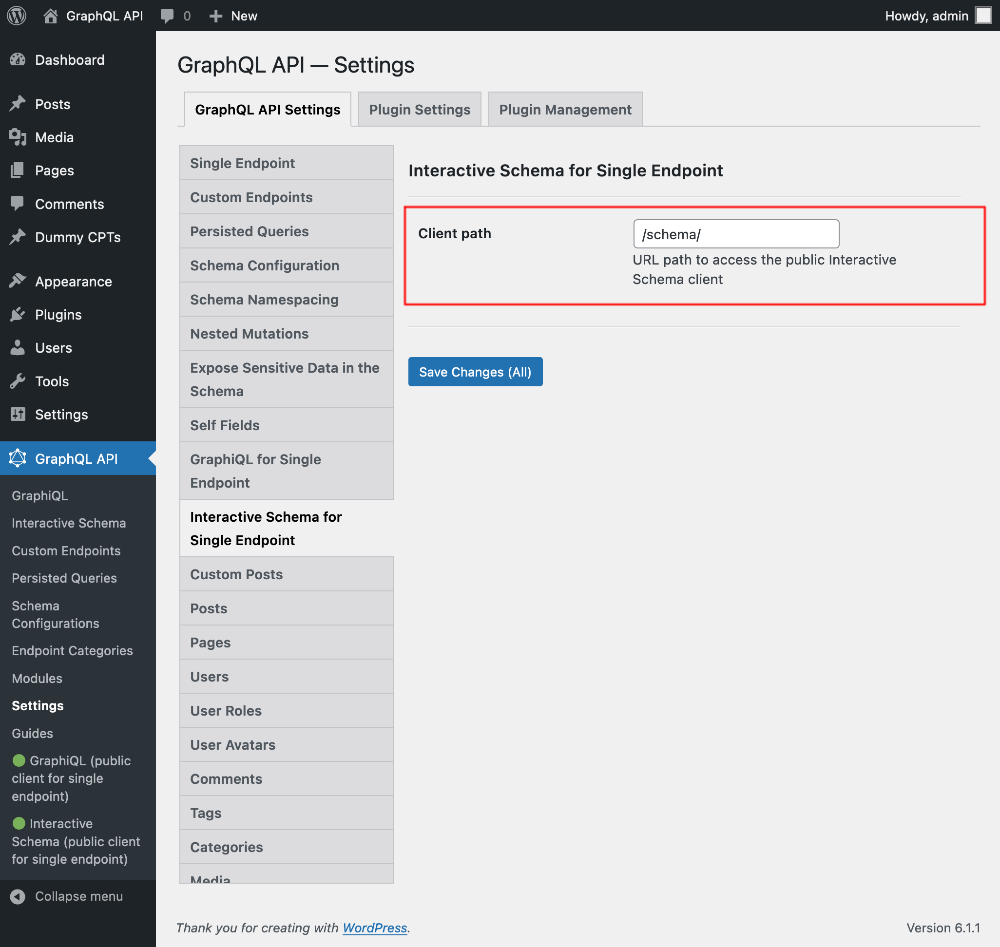

# Single Endpoint

Execute queries against the GraphQL server through the public single endpoint.

By default the endpoint is `/graphql/`, and the path can be configured through the Settings.

The GraphQL single endpoint can be configured by assigning a Schema Configuration to it. To do this, on section "Schema Configuration" select the desired entry from the dropdown for "Schema Configuration for the Single Endpoint":

## Clients

Interact with the single endpoint via the available clients.

### GraphiQL

If module "GraphiQL for Single Endpoint" is enabled, then the single endpoint's GraphiQL client becomes publicly available.

To open it, click on link "🟢 GraphiQL (public)" on the plugin's menu:

By default, the client is exposed under `/graphiql/`. This path can be modified on the Settings, under tab "GraphiQL for Single Endpoint":

### Interactive Schema (Voyager)

If module "Interactive Schema for Single Endpoint" is enabled, then the single endpoint's Voyager client becomes publicly available.

To open it, click on link "🟢 Schema (public)" on the plugin's menu:

By default, the client is exposed under `/schema/`. This path can be modified on the Settings, under tab "Interactive Schema for Single Endpoint":

