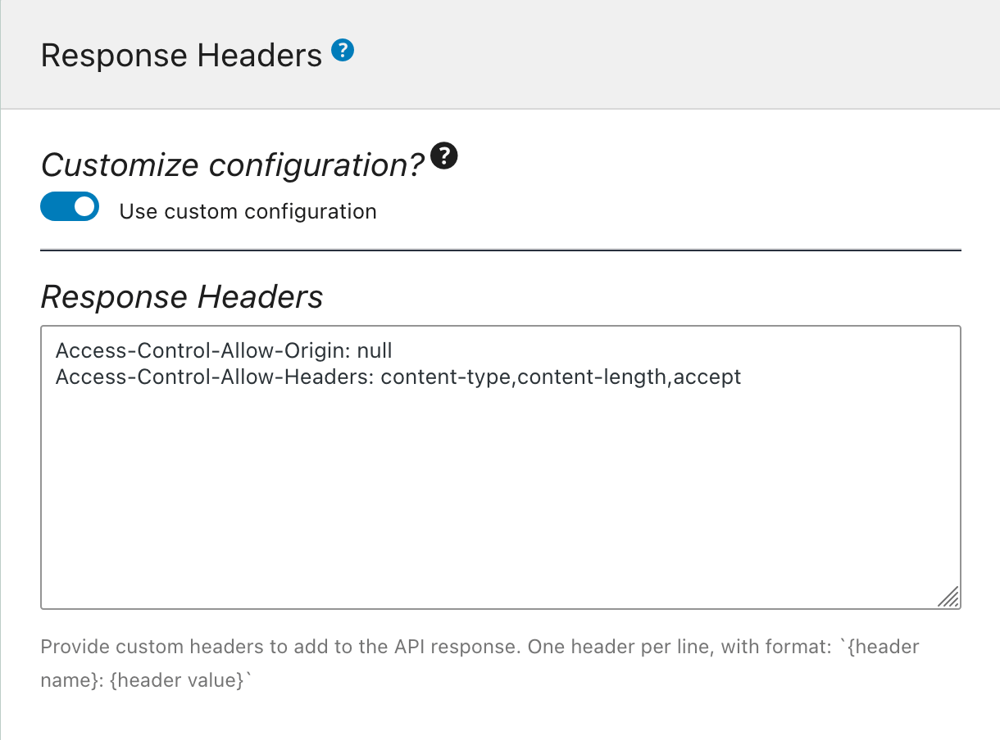
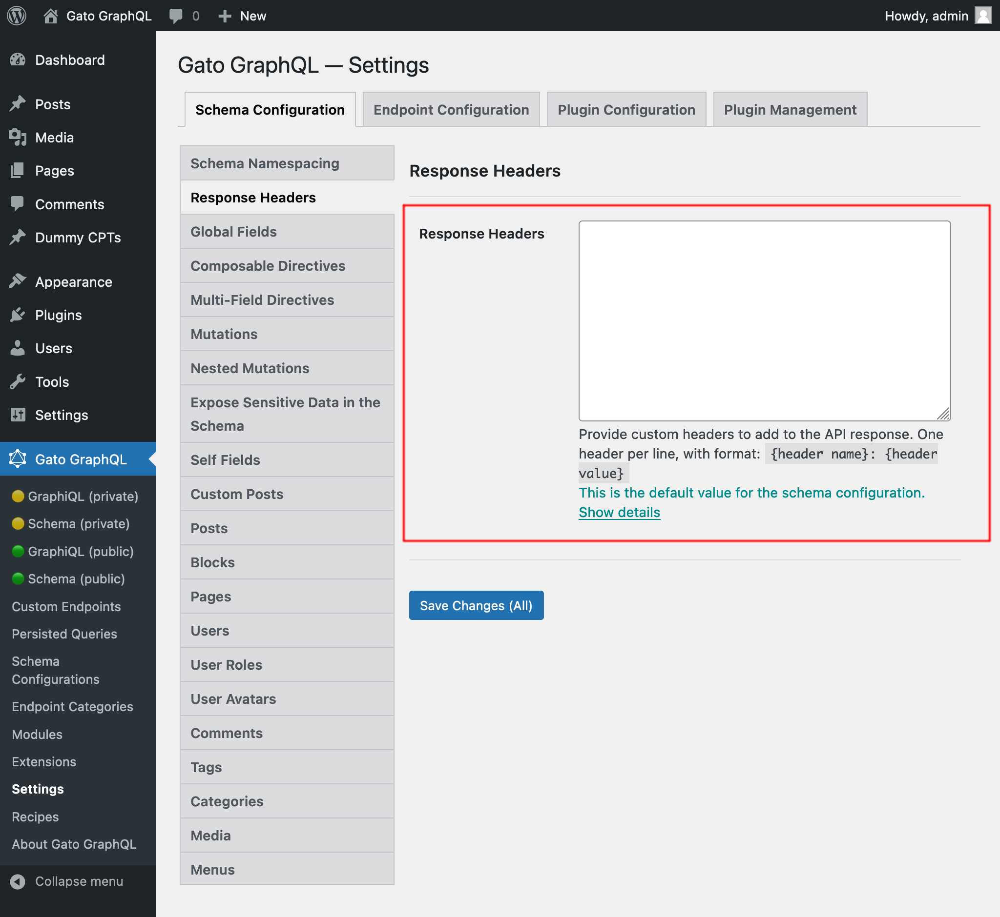

# Response Headers

Provide custom headers to add to the API response.

## Description

Configure what custom headers will be added to the GraphQL response, including:

- `Access-Control-Allow-Origin` to support CORS
- `Access-Control-Allow-Headers` to support clients providing data via headers
- any other

## Defining the Response Headers

The response headers can be configured in 2 places.

In the Schema Configuration applied to the endpoint under block "Response Headers", by selecting option `"Use custom configuration"` and then providing the desired headers (at one entry per line), with format `{header name}: {header value}`.

For instance, provide value:

```apacheconf
Access-Control-Allow-Origin: null
Access-Control-Allow-Headers: content-type,content-length,accept
```

<div class="img-width-610" markdown=1>



</div>

Otherwise, the value defined in the Settings page for `Response Headers` is used:

<div class="img-width-1024" markdown=1>



</div>
