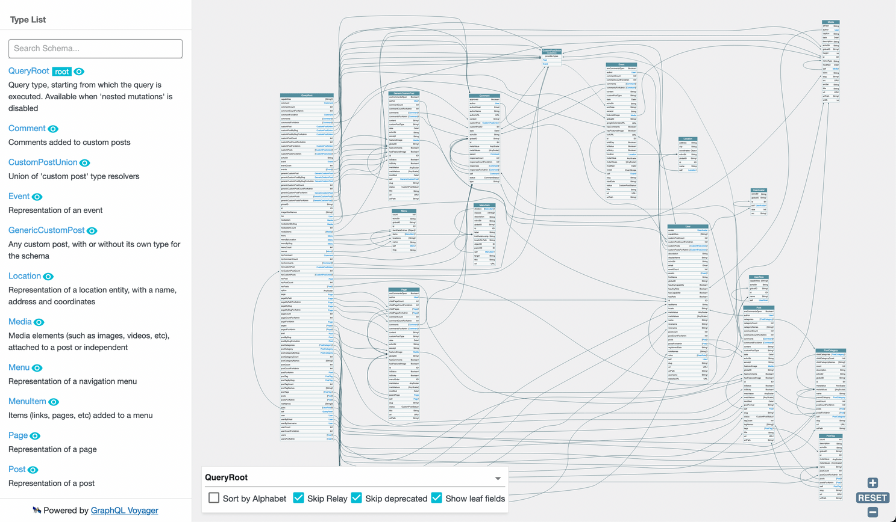
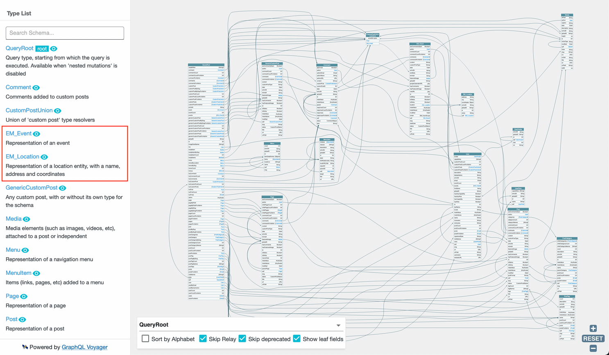
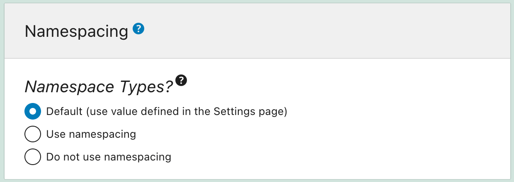
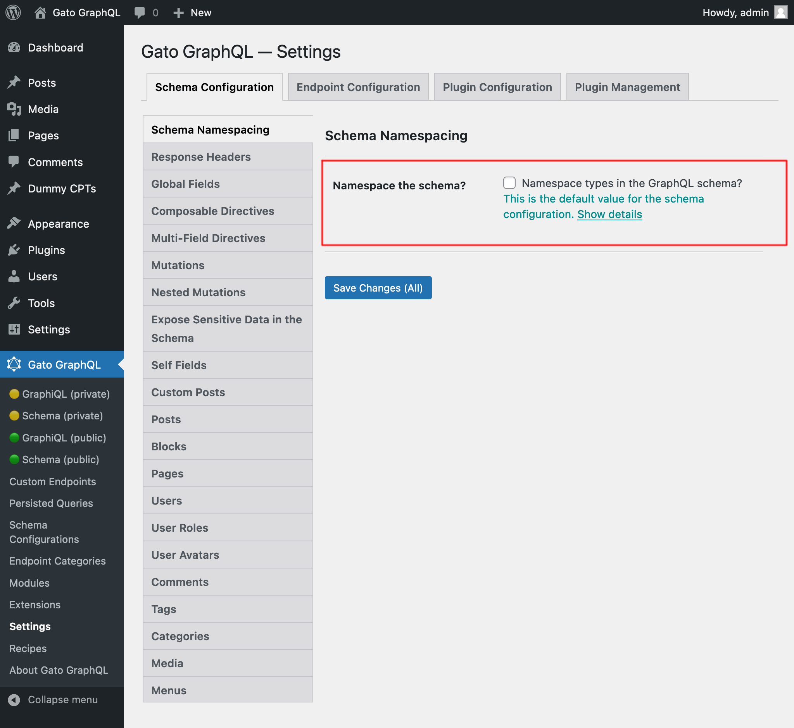

# Schema Namespacing

This module allows to have all types added to the schema by plugins be automatically namespaced, by prepending their names with the corresponding PHP package's owner and name (by default) or providing a specific prefix for them.

Namespacing the schema avoids naming conflicts, which happens when different owners (eg: different teams in the company, or 3rd party plugins) use the same name for a type or interface.

The WordPress data model is considered canonical, and its GraphQL schema types (such as `Post` and `User`) and interfaces (such as `Commentable` and `WithMeta`) are not namespaced.

## How it works

In the namespaced schema, types `Event` and `Location` become `EM_Event` and `EM_Location` respectively, following the addition of prefix `EM_` to the types from a certain plugin.

While the schema normally looks like this:

...its namespaced version looks like this:

## How to use

Namespacing the schema can be configured as follows, in order of priority:

✅ Specific mode for the custom endpoint or persisted query, defined in the schema configuration

✅ Default mode, defined in the Settings

If the schema configuration has value `"Default"`, it will use the mode defined in the Settings:

### Namespacing the schema in the Admin clients

Namespacing the schema in the wp-admin can be selected on the Settings. It will be applied on the GraphiQL and Interactive Schema clients, on the configuration in Access/Cache Control Lists, and possibly on other extensions.

## When to use

If plugins WooCommerce and Easy Digital Downloads both implemented a `Product` type for Gato GraphQL, then we could not normally install both plugins at the same time. The Schema namespacing module helps avert this conflict, because their type names would be converted into `WC_Product` and `EDD_Product` respectively.

Similarly, the Marketing and Tutorials teams from the same company can release their own type `Discount`, instead of `Marketing_Discount` and `Tutorial_Discount`.

## GraphQL spec

This functionality is currently not part of the GraphQL spec, but it has been requested:

- [Issue #163 - Namespaces](https://github.com/graphql/graphql-spec/issues/163)
