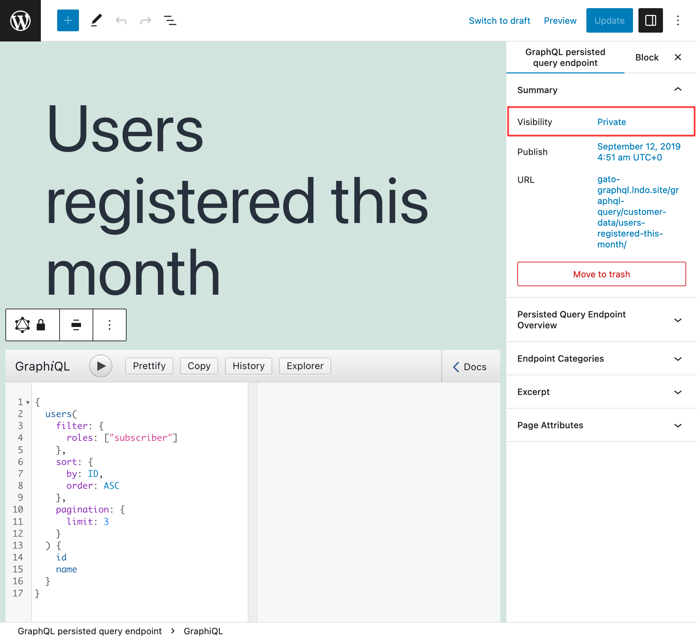
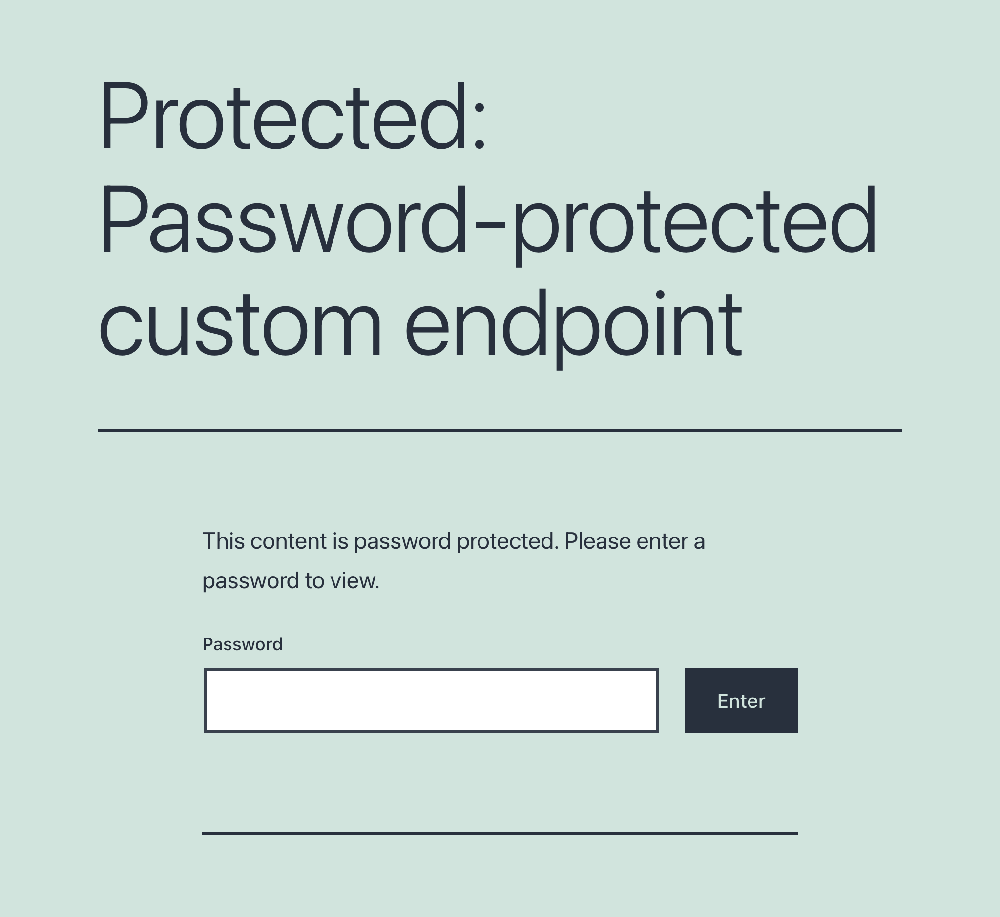
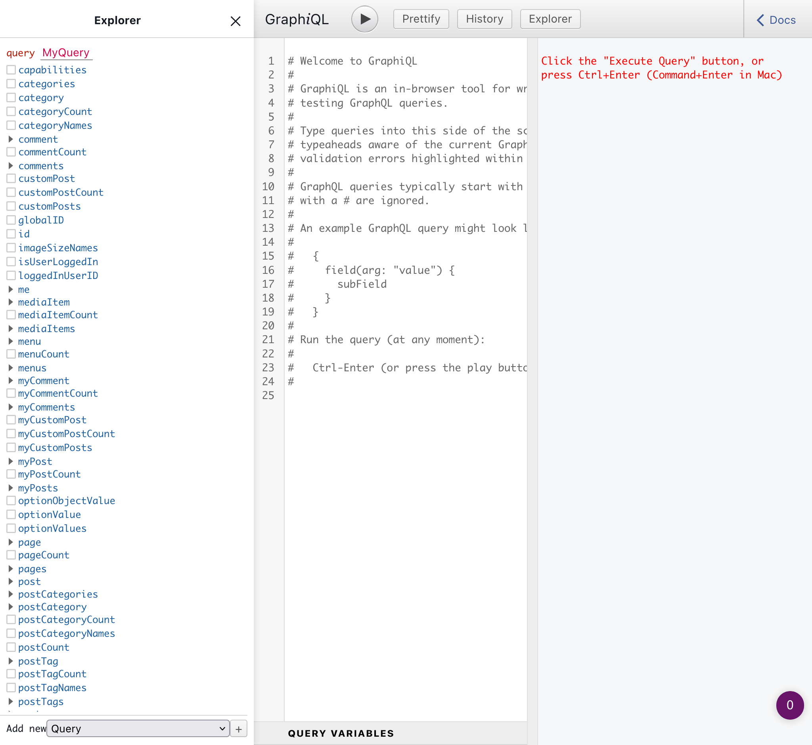
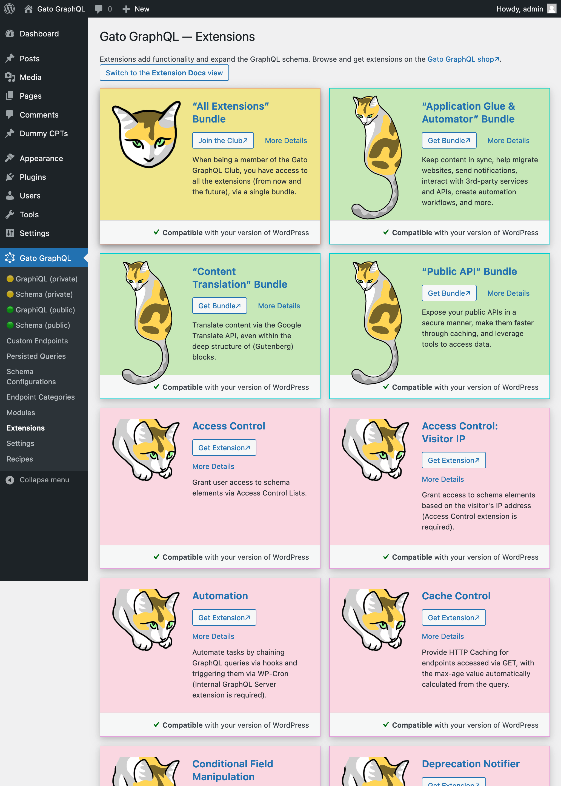
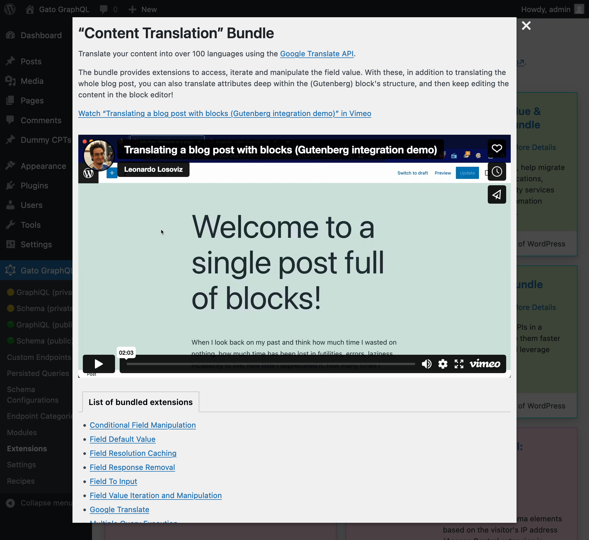
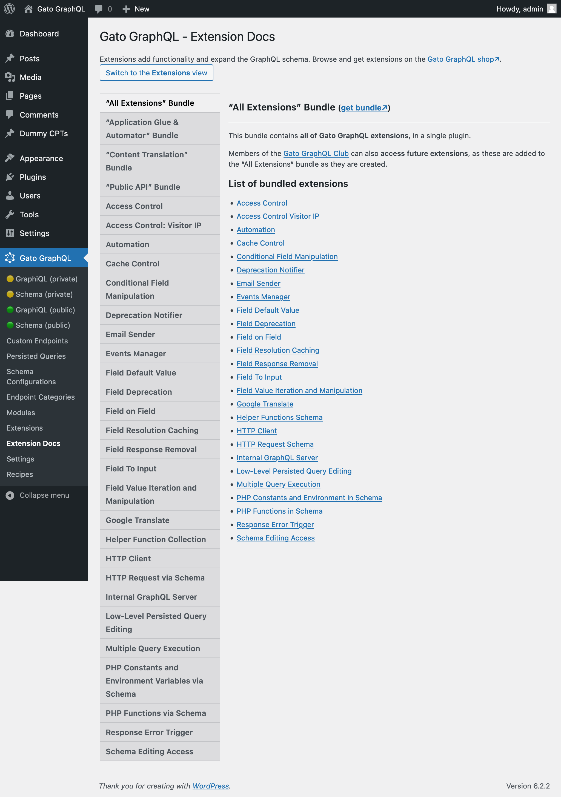
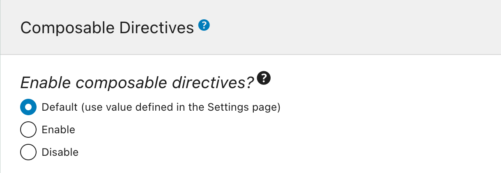
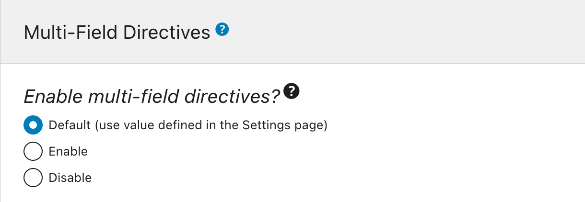
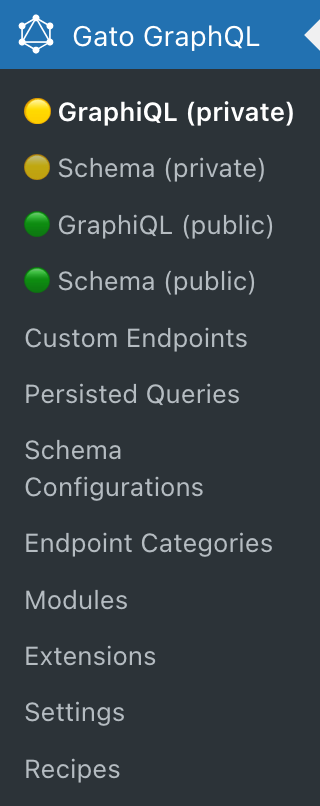
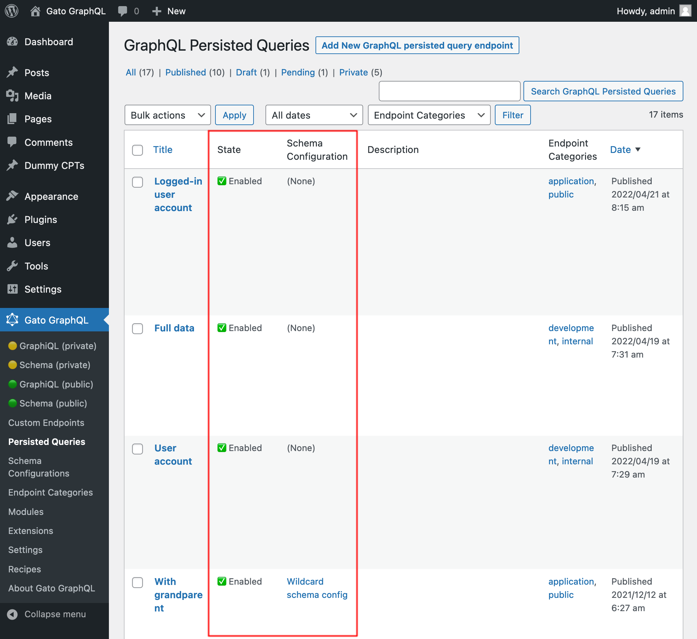

# Release Notes: 1.0

After a reaaaaaaally long time (spanning several years), development of the Gato GraphQL plugin has finally reached v1.0! Yaaaaaaaaaaay 🎉🍾🎊🥳🍻👏🥂🎈🙌

Starting from this version, the plugin will be released in the [WordPress plugins directory](https://wordpress.org/plugins/) (submission process currently ongoing), so you'll be able to install the plugin directly from your WordPress dashboard.

Version 1.0 brings plenty of improvements, including the **integration with the (Gutenberg) block editor**, support for **private and password-protected endpoints**, and the **availability of (commercial) extensions** to extend the GraphQL schema and provide further functionality.

Here's a description of all the changes.

## Integration of Gutenberg blocks into the GraphQL schema

_This integration is based on <a href="https://github.com/Automattic/vip-block-data-api/" target="_blank">`Automattic/vip-block-data-api`</a>. My deepest gratitude to this project's contributors, as their contribution has also benefitted Gato GraphQL. ❤️_

_🔗 The following is a short description of the feature. Please check the [Blocks module documentation](https://github.com/leoloso/PoP/blob/master/layers/GatoGraphQLForWP/plugins/gato-graphql/docs/modules/schema-blocks/en.md) for a more thorough description._

The newly-added "Blocks" module adds `Block` types to the GraphQL schema, retrieved via the following fields added to all `CustomPost` types (such as `Post` and `Page`):

- `blocks`
- `blockDataItems`
- `blockFlattenedDataItems`

This module is disabled if the [Classic Editor](https://wordpress.org/plugins/classic-editor/) plugin is active.

### `blocks`

Field `CustomPost.blocks: [BlockUnion!]` retrieves the list of all the blocks contained in the custom post.

`blocks` returns a List of the Block types that have been mapped to the GraphQL schema. These Block types are all part of the `BlockUnion` type, and implement the `Block` interface.

The plugin implements one Block type, `GenericBlock`, which is already sufficient to retrieve the data for any block (via field `attributes: JSONObject`).

This query:

```graphql
{
  post(by: { id: 1 }) {
    blocks {
      ...on Block {
        name
        attributes
        innerBlocks {
          ...on Block {
              name
              attributes
              innerBlocks {
                ...on Block {
                  name
                  attributes
                }
              }
            }
          }
        }
      }
    }
  }
}
```

...will produce this response:

```json
{
  "data": {
    "post": {
      "blocks": [
        {
          "name": "core/gallery",
          "attributes": {
            "linkTo": "none",
            "className": "alignnone",
            "images": [
              {
                "url": "https://d.pr/i/zd7Ehu+",
                "alt": "",
                "id": "1706"
              },
              {
                "url": "https://d.pr/i/jXLtzZ+",
                "alt": "",
                "id": "1705"
              }
            ],
            "ids": [],
            "shortCodeTransforms": [],
            "imageCrop": true,
            "fixedHeight": true,
            "sizeSlug": "large",
            "allowResize": false
          },
          "innerBlocks": null
        },
        {
          "name": "core/heading",
          "attributes": {
            "content": "List Block",
            "level": 2
          },
          "innerBlocks": null
        },
        {
          "name": "core/list",
          "attributes": {
            "ordered": false,
            "values": "<li>List item 1</li><li>List item 2</li><li>List item 3</li><li>List item 4</li>"
          },
          "innerBlocks": null
        },
        {
          "name": "core/heading",
          "attributes": {
            "className": "has-top-margin",
            "content": "Columns Block",
            "level": 2
          },
          "innerBlocks": null
        },
        {
          "name": "core/columns",
          "attributes": {
            "isStackedOnMobile": true
          },
          "innerBlocks": [
            {
              "name": "core/column",
              "attributes": {},
              "innerBlocks": [
                {
                  "name": "core/image",
                  "attributes": {
                    "id": 1701,
                    "className": "layout-column-1",
                    "url": "https://d.pr/i/fW6V3V+",
                    "alt": ""
                  },
                  "innerBlocks": null
                }
              ]
            },
            {
              "name": "core/column",
              "attributes": {},
              "innerBlocks": [
                {
                  "name": "core/paragraph",
                  "attributes": {
                    "className": "layout-column-2",
                    "content": "Phosfluorescently morph intuitive relationships rather than customer directed human capital.",
                    "dropCap": false
                  },
                  "innerBlocks": null
                }
              ]
            }
          ]
        },
        {
          "name": "core/heading",
          "attributes": {
            "content": "Columns inside Columns (nested inner blocks)",
            "level": 2
          },
          "innerBlocks": null
        },
        {
          "name": "core/columns",
          "attributes": {
            "isStackedOnMobile": true
          },
          "innerBlocks": [
            {
              "name": "core/column",
              "attributes": {},
              "innerBlocks": [
                {
                  "name": "core/image",
                  "attributes": {
                    "id": 1701,
                    "className": "layout-column-1",
                    "url": "https://d.pr/i/fW6V3V+",
                    "alt": ""
                  },
                  "innerBlocks": null
                },
                {
                  "name": "core/columns",
                  "attributes": {
                    "isStackedOnMobile": true
                  },
                  "innerBlocks": [
                    {
                      "name": "core/column",
                      "attributes": {
                        "width": "33.33%"
                      },
                      "innerBlocks": [
                        {
                          "name": "core/heading",
                          "attributes": {
                            "fontSize": "large",
                            "content": "Life is so rich",
                            "level": 2
                          },
                          "innerBlocks": null
                        },
                        {
                          "name": "core/heading",
                          "attributes": {
                            "level": 3,
                            "content": "Life is so dynamic"
                          },
                          "innerBlocks": null
                        }
                      ]
                    },
                    {
                      "name": "core/column",
                      "attributes": {
                        "width": "66.66%"
                      },
                      "innerBlocks": [
                        {
                          "name": "core/paragraph",
                          "attributes": {
                            "content": "This rhyming poem is the spark that can reignite the fires within you. It challenges you to go out and live your life in the present moment as a \u201chero\u201d and leave your mark on this world.",
                            "dropCap": false
                          },
                          "innerBlocks": null
                        },
                        {
                          "name": "core/columns",
                          "attributes": {
                            "isStackedOnMobile": true
                          },
                          "innerBlocks": [
                            {
                              "name": "core/column",
                              "attributes": {},
                              "innerBlocks": [
                                {
                                  "name": "core/image",
                                  "attributes": {
                                    "id": 361,
                                    "sizeSlug": "large",
                                    "linkDestination": "none",
                                    "url": "https://gato-graphql.lndo.site/wp-content/uploads/2022/05/graphql-voyager-public-1024x622.jpg",
                                    "alt": ""
                                  },
                                  "innerBlocks": null
                                }
                              ]
                            },
                            {
                              "name": "core/column",
                              "attributes": {},
                              "innerBlocks": null
                            },
                            {
                              "name": "core/column",
                              "attributes": {},
                              "innerBlocks": [
                                {
                                  "name": "core/image",
                                  "attributes": {
                                    "id": 362,
                                    "sizeSlug": "large",
                                    "linkDestination": "none",
                                    "url": "https://gato-graphql.lndo.site/wp-content/uploads/2022/05/namespaced-interactive-schema-1024x598.png",
                                    "alt": ""
                                  },
                                  "innerBlocks": null
                                }
                              ]
                            }
                          ]
                        }
                      ]
                    }
                  ]
                }
              ]
            }
          ]
        }
      ]
    }
  }
}
```

### `blockDataItems`

This field differs from `blocks` in that it returns `[JSONObject!]` (instead of `[BlockUnion!]`):

```graphql
type CustomPost {
  blockDataItems: [JSONObject!]
}
```

In other words, instead of following the typical GraphQL way of having entities relate to entities and navigate across them, every Block entity at the top level already produces the whole block data for itself and all of its children, within a single `JSONObject` result.

The JSON object contains the properties for the block (under entries `name` and `attributes`) and for its inner blocks (under entry `innerBlocks`), recursively.

For instance, the following query:

```graphql
{
  post(by: { id: 1 }) {
    blockDataItems
  }
}
```

...will produce:

```json
{
  "data": {
    "post": {
      "blockDataItems": [
        {
          "name": "core/gallery",
          "attributes": {
            "linkTo": "none",
            "className": "alignnone",
            "images": [
              {
                "url": "https://d.pr/i/zd7Ehu+",
                "alt": "",
                "id": "1706"
              },
              {
                "url": "https://d.pr/i/jXLtzZ+",
                "alt": "",
                "id": "1705"
              }
            ],
            "ids": [],
            "shortCodeTransforms": [],
            "imageCrop": true,
            "fixedHeight": true,
            "sizeSlug": "large",
            "allowResize": false
          }
        },
        {
          "name": "core/heading",
          "attributes": {
            "content": "List Block",
            "level": 2
          }
        },
        {
          "name": "core/list",
          "attributes": {
            "ordered": false,
            "values": "<li>List item 1</li><li>List item 2</li><li>List item 3</li><li>List item 4</li>"
          }
        },
        {
          "name": "core/heading",
          "attributes": {
            "className": "has-top-margin",
            "content": "Columns Block",
            "level": 2
          }
        },
        {
          "name": "core/columns",
          "attributes": {
            "isStackedOnMobile": true
          },
          "innerBlocks": [
            {
              "name": "core/column",
              "attributes": {},
              "innerBlocks": [
                {
                  "name": "core/image",
                  "attributes": {
                    "id": 1701,
                    "className": "layout-column-1",
                    "url": "https://d.pr/i/fW6V3V+",
                    "alt": ""
                  }
                }
              ]
            },
            {
              "name": "core/column",
              "attributes": {},
              "innerBlocks": [
                {
                  "name": "core/paragraph",
                  "attributes": {
                    "className": "layout-column-2",
                    "content": "Phosfluorescently morph intuitive relationships rather than customer directed human capital.",
                    "dropCap": false
                  }
                }
              ]
            }
          ]
        },
        {
          "name": "core/heading",
          "attributes": {
            "content": "Columns inside Columns (nested inner blocks)",
            "level": 2
          }
        },
        {
          "name": "core/columns",
          "attributes": {
            "isStackedOnMobile": true
          },
          "innerBlocks": [
            {
              "name": "core/column",
              "attributes": {},
              "innerBlocks": [
                {
                  "name": "core/image",
                  "attributes": {
                    "id": 1701,
                    "className": "layout-column-1",
                    "url": "https://d.pr/i/fW6V3V+",
                    "alt": ""
                  }
                },
                {
                  "name": "core/columns",
                  "attributes": {
                    "isStackedOnMobile": true
                  },
                  "innerBlocks": [
                    {
                      "name": "core/column",
                      "attributes": {
                        "width": "33.33%"
                      },
                      "innerBlocks": [
                        {
                          "name": "core/heading",
                          "attributes": {
                            "fontSize": "large",
                            "content": "Life is so rich",
                            "level": 2
                          }
                        },
                        {
                          "name": "core/heading",
                          "attributes": {
                            "level": 3,
                            "content": "Life is so dynamic"
                          }
                        }
                      ]
                    },
                    {
                      "name": "core/column",
                      "attributes": {
                        "width": "66.66%"
                      },
                      "innerBlocks": [
                        {
                          "name": "core/paragraph",
                          "attributes": {
                            "content": "This rhyming poem is the spark that can reignite the fires within you. It challenges you to go out and live your life in the present moment as a \u201chero\u201d and leave your mark on this world.",
                            "dropCap": false
                          }
                        },
                        {
                          "name": "core/columns",
                          "attributes": {
                            "isStackedOnMobile": true
                          },
                          "innerBlocks": [
                            {
                              "name": "core/column",
                              "attributes": {},
                              "innerBlocks": [
                                {
                                  "name": "core/image",
                                  "attributes": {
                                    "id": 361,
                                    "sizeSlug": "large",
                                    "linkDestination": "none",
                                    "url": "https://gato-graphql.lndo.site/wp-content/uploads/2022/05/graphql-voyager-public-1024x622.jpg",
                                    "alt": ""
                                  }
                                }
                              ]
                            },
                            {
                              "name": "core/column",
                              "attributes": {}
                            },
                            {
                              "name": "core/column",
                              "attributes": {},
                              "innerBlocks": [
                                {
                                  "name": "core/image",
                                  "attributes": {
                                    "id": 362,
                                    "sizeSlug": "large",
                                    "linkDestination": "none",
                                    "url": "https://gato-graphql.lndo.site/wp-content/uploads/2022/05/namespaced-interactive-schema-1024x598.png",
                                    "alt": ""
                                  }
                                }
                              ]
                            }
                          ]
                        }
                      ]
                    }
                  ]
                }
              ]
            }
          ]
        }
      ]
    }
  }
}
```

### `blockFlattenedDataItems`

Both fields `blocks` and `blockDataItems` allow to filter what blocks are retrieved, via the `filterBy` argument. In both cases, if a block satisfies the inclusion condition, but is nested within a block that does not, then it will be excluded.

For instance, this query:

```graphql
{
  post(by: { id: 1 }) {
    id
    blockDataItems(
      filterBy: {
        include: [
          "core/heading"
        ]
      }
    )
  }
}
```

...will produce:

```json
{
  "data": {
    "post": {
      "blockDataItems": [
        {
          "name": "core/heading",
          "attributes": {
            "content": "List Block",
            "level": 2
          },
          "innerBlocks": null
        },
        {
          "name": "core/heading",
          "attributes": {
            "className": "has-top-margin",
            "content": "Columns Block",
            "level": 2
          },
          "innerBlocks": null
        },
        {
          "name": "core/heading",
          "attributes": {
            "content": "Columns inside Columns (nested inner blocks)",
            "level": 2
          },
          "innerBlocks": null
        }
      ]
    }
  }
}
```

Please notice that not all blocks of type `core/heading` have been included: Those which are nested under `core/column` have been excluded, as there is no way to reach them (since blocks `core/columns` and `core/column` are themselves excluded).

There are occasions, though, when we need to retrieve all blocks of a certain type from the custom post, independently of where these blocks are located within the hierarchy. For instance, we may want to include all blocks of type `core/image`, to retrieve all images included in a blog post.

It is to satisfy this need that there is field `CustomPost.blockFlattenedDataItems`. Unlike fields `blocks` and `blockDataItems`, it flattens the block hierarchy into a single level.

This query:

```graphql
{
  post(by: { id: 1 }) {
    id
    blockFlattenedDataItems(
      filterBy: {
        include: [
          "core/heading"
        ]
      }
    )
  }
}
```

...will produce:

```json
{
  "data": {
    "post": {
      "blockFlattenedDataItems": [
        {
          "name": "core/heading",
          "attributes": {
            "content": "List Block",
            "level": 2
          }
        },
        {
          "name": "core/heading",
          "attributes": {
            "className": "has-top-margin",
            "content": "Columns Block",
            "level": 2
          }
        },
        {
          "name": "core/heading",
          "attributes": {
            "content": "Columns inside Columns (nested inner blocks)",
            "level": 2
          }
        },
        {
          "name": "core/heading",
          "attributes": {
            "fontSize": "large",
            "content": "Life is so rich",
            "level": 2
          }
        },
        {
          "name": "core/heading",
          "attributes": {
            "level": 3,
            "content": "Life is so dynamic"
          }
        }
      ]
    }
  }
}
```

## Support for private and password-protected endpoints

Both Custom Endpoints and Persisted Queries have been implemented as Custom Post Types. So far, Gato GraphQL has reacted to the "status" property of these CPTs as being either `publish` (in which case it is available online), or `draft` or `pending` (in which case it was not published yet, but available for modification in the wp-admin).

Now, status value `private` is also supported and, if the `post_password` property is provided, then the endpoint is also made password-protected.

As such, we can now create endpoints that are to be consumed internally only, or that the user needs to provided a password in order to access it, thus improving the security of our GraphQL APIs.

### Private endpoints

By setting the status of the Custom Endpoint or Persisted Query as `private`, the endpoint can only be accessed by the admin user. This prevents our data from being unintentionally shared with users who should not have access to the data.

For instance, we can create private Persisted Queries that help manage the application, such as retrieving data to create reports with our metrics.



### Password-protected endpoints

If we create a Custom Endpoint or Persisted Query for a specific client, we can now assign a password to it, to provide an additional level of security that only that client will access the endpoint.


When first accessing a password-protected endpoint (whether accessing the endpoint directly, or its GraphiQL or Interactive Schema clients), we encounter a screen requesting the password:



Once the password is provided and validated, only then the user will access the intended endpoint or client:



## Browse and install Gato GraphQL extensions

An Extensions page has been added, to browse the available (commercial) Gato GraphQL extensions:



Clicking on an Extension's title, it opens a modal window with documentation:



Clicking on "Switch to the Extension Docs view", we can browse the documentation for all extensions more easily:



## Browse Recipes, providing examples of GraphQL queries for different use cases

A new Recipes page has been added to the menu.

It provides examples of GraphQL queries for plenty of use cases. These can help us visualize what's doable with Gato GraphQL, and we can copy these queries and paste them into our applications to achieve our goals faster.


## Browse "Additional Documentation" when editing a Schema Configuration

Documentation for additional features in the Gato GraphQL can now be browsed when editing a Schema Configuration CPT, on the editor's sidebar:


When clicking on any of the links, a modal window is displayed with the corresponding documentation:


## Inspect properties when editing Custom Endpoints and Persisted Query Endpoints

A sidebar component has been added to the editor for Custom Endpoints and Persisted Query Endpoints, displaying links to:

- The endpoint URL
- Its source configuration
- Its GraphiQL client (for the Custom Endpoint)
- Its interactive schema client (for the Custom Endpoint)


## Added support for the "Global Fields" custom feature

<!-- _⚠️ This is a custom feature offered by Gato GraphQL (i.e. it is not mandated by the GraphQL spec)._ -->

_🔗 The following is a short description of the feature. Please check the [Global Fields module documentation](https://github.com/leoloso/PoP/blob/master/layers/GatoGraphQLForWP/plugins/gato-graphql/docs/modules/global-fields/en.md) for a more thorough description._

The GraphQL schema exposes types, such as `Post`, `User` and `Comment`, and the fields available for every type, such as `Post.title`, `User.name` and `Comment.responses`. These fields deal with "data", as they retrieve some specific piece of data from an entity.

However, there is also a different kind of fields: those providing "functionality" instead of data. These fields need not be restricted to a specific type, as they are potentially useful to all types.

For instance, functionality fields can be used to fetch data from another server, or for manipulating data once it has been retrieved (allowing us to transform a field value in whatever way it is required).

The following are examples of implemented global fields, offered via extensions:

The **HTTP Client** extension offers fields which connect to external API endpoints and retrieve data from them:

- `_sendHTTPRequest`
- `_sendJSONObjectItemHTTPRequest`
- `_sendJSONObjectCollectionHTTPRequest`
- `_sendGraphQLHTTPRequest`
- ...

The **PHP Functions via Schema** extension offers fields which expose functionalities commonly found in programming languages (such as PHP):

- `_not`
- `_if`
- `_equals`
- `_isEmpty`
- `_echo`
- `_sprintf`
- `_arrayItem`
- `_arrayAddItem`
- `_arrayUnique`
- ...

With the "Global Fields" feature, after indicating that a field is "global" in the corresponding resolver (in PHP code), it will be made accessible under every single type in the GraphQL schema.

In order to configure the level of exposure of global fields in the schema, the Schema Configuration now has a new element "Global Fields":


## Added support for the "Composable Directives" custom feature

<!-- _⚠️ This is a custom feature offered by Gato GraphQL (i.e. it is not mandated by the GraphQL spec)._ -->

_🔗 The following is a short description of the feature. Please check the [Composable Directives module documentation](https://github.com/leoloso/PoP/blob/master/layers/GatoGraphQLForWP/plugins/gato-graphql/docs/modules/composable-directives/en.md) for a more thorough description._

This feature allows directives to execute complex functionalities, by composing other directives inside. A directive that composes another directive is called a "meta" directive.

A use case is to convert the type of the field value to the type expected by the nested directive. For instance, each element from an array can be provided to a directive that expects a single value.

In this query, field `capabilities` returns `[String]` (an array of strings), and directive `@strUpperCase` (available via the **PHP Functions via Schema** extension) receives `String`. Hence, executing the following query:

```graphql
query {
  user(by: {id: 1}) {
    capabilities @strUpperCase
  }
}
```

...returns an error due to the type mismatch:

```json
{
  "errors": [
    {
      "message": "Directive 'strUpperCase' from field 'capabilities' cannot be applied on object with ID '1' because it is not a string"
    }
  ],
  "data": {
    "user": {
      "capabilities": null
    }
  }
}
```

The meta directive `@underEachArrayItem` (provided via extension **Data Iteration Meta Directives**) can solve this problem, as it iterates over an array of elements and applies its nested directive `@strUpperCase` on each of them, so that this latter directive receives a single element (of type `String`) instead of an array.

The query from above can be satisfied like this:

```graphql
query {
  user(by: {id: 1}) {
    capabilities
      @underEachArrayItem
        @strUpperCase
  }
}
```

...producing the intended response:

```json
{
  "data": {
    "user": {
      "capabilities": [
        "READ",
        "LEVEL_0"
      ]
    }
  }
}
```

In order to enable or disable composable directives in the schema for some specific endpoint, the Schema Configuration now has a new element "Composable Directives":

<!-- @todo Create image schema-config-composable-directives.png -->



## Added support for the "Multi-Field Directives" custom feature

<!-- _⚠️ This is a custom feature offered by Gato GraphQL (i.e. it is not mandated by the GraphQL spec)._ -->

_🔗 The following is a short description of the feature. Please check the [Multi-Field Directives module documentation](https://github.com/leoloso/PoP/blob/master/layers/GatoGraphQLForWP/plugins/gato-graphql/docs/modules/multifield-directives/en.md) for a more thorough description._

This feature allows directives to be applied to multiple fields, instead of only one. When enabled, an argument `affectAdditionalFieldsUnderPos` is added to all directives, to indicate the relative positions of the additional fields on which to apply the directive.

There are two main use cases for this feature:

1. **Performance:** Process a computation on multiple fields simultaneously (the gain can be significant when it involves a call to an external API)
2. **Extended functionality:** Gather/analyse fields from multiple fields at once, and do something with this extended dataset.

For instance, in the following query, directive `@strTranslate` is applied not only to field `content` but also to `excerpt`, so that a single call to the Google Translation API can process and translate the entries for both fields:

```graphql
{
  posts {
    excerpt
    content
      @strTranslate(
        affectAdditionalFieldsUnderPos: [1]
      )
  }
}
```

In order to enable or disable multi-field directives in the schema for some specific endpoint, the Schema Configuration now has a new element "Multi-Field Directives":

<!-- @todo Create image schema-config-multifield-directives.png -->



## Mutations `createPost`, `updatePost`, `addCommentToCustomPost` (and others) now receive a oneof input object for content

Prior to v1.0, the following mutation fields received a `content` argument of type `String` (to create/update the content on custom posts or comments):

- `Comment.reply`
- `CustomPost.addComment`
- `CustomPost.update`
- `Root.addCommentToCustomPost`
- `Root.createPost`
- `Root.updatePost`

This `content` argument has now been renamed to `contentAs`, and converted into a ["oneof" input object](https://github.com/leoloso/PoP/blob/master/layers/GatoGraphQLForWP/plugins/gato-graphql/docs/implicit-features/oneof-input-object/en.md) that contains a single property: `html: HTML!`.

This is to avoid potential breaking changes in the future, when it becomes possible to also create and update custom posts and comments by passing their `Block` data (instead of the single blob of HTML data).

When that feature is supported, the `contentAs` oneof input object will be added a second property: `blocks: [BlockUnion!]!`, and as the mutation will itself not suffer changes, it will not need be deprecated.

## The Settings page has been re-designed

Due to the great number of modules in the plugin, the Settings page required several rows to display all tabs, which was not very polished.

Now, the Settings page organizes all modules into 2 levels, and displays tabs vertically, making it easier to browse them:


## Reset settings, and choose to use the restrictive or non-restrictive default settings

A GraphQL API may be exposed publicly or only privately, and depending on which is the case there are options and features that need to be restricted or not.

For instance, querying values from the `wp_options` table can be unrestrained whenever building a static site (in which case the WordPress site may be on the developer's laptop, not exposed to the Internet), but must be limited to a handful of options (or even none at all) for a public API, for security reasons.

The plugin has provided restrictive and non-restrictive default behaviors for the Settings since v0.8, but it required to define a PHP constant in `wp-config.php` to switch from one to the other, and then manually delete all Settings values that had to be regenerated.

Now it is possible to do the switch directly via the UI: The new "Plugin Management" tab in the Settings Page has an item "Reset Settings" which restores the default settings values, and allows to decide if to use the restrictive or the non-restrictive default behaviors.


## Configuration blocks in the the Schema Configuration CPT editor can be removed (and added again)

When creating a Schema Configuration, the new entry contains the whole list of options to configure:


If we need to configure only a handful of items, displaying all blocks in the editor makes it difficult to visualize.

Now, the Gutenberg template (containing the blocks) is not locked anymore, then we can delete the blocks that we don't need. And if we need to add a block again, it can be done from the inserter (notice that every block can only be added once):


## Display warnings in the GraphQL response

The GraphQL response can now display warnings, raised while resolving the GraphQL query, added for instance by field or directive resolvers.

The warnings are printed under the `extensions` top-level entry in the JSON response.

For instance, the newly-added `CustomPost.blocks` field raises a warning when a block has not been registered on the server-side:

```json
{
  "extensions": {
    "warnings": [
      {
        "message": "Block type \"owner/block-name\" is not server-side registered. Sourced block attributes will not be available.",
        "locations": [
          {
            "line": 336,
            "column": 7
          }
        ],
        "extensions": {
          "path": [
            "blockFlattenedDataItems",
            "...on GenericCustomPost { ... }",
            "notServerSideRegisteredBlocks: customPost(by: {id: 660}) { ... }",
            "query { ... }"
          ],
          "type": "GenericCustomPost",
          "field": "blockFlattenedDataItems",
          "id": 660,
          "code": "PoP/ComponentModel@w1"
        }
      }
    ]
  },
  "data": {
    
  }
}
```

## Implementation of standard custom scalar types

Several standard custom scalar types have been implemented, so they are readily-available to be used in your GraphQL schema:

- `Domain`
- `IP`
- `IPv4`
- `IPv6`
- `MACAddress`
- `PhoneNumber`
- `PositiveInt`
- `StrictlyPositiveInt`
- `PositiveFloat`
- `StrictlyPositiveFloat`
- `UUID`

Please notice that these do not currently appear in the Interactive Schema client, as they are not being referenced anywhere within the WordPress model (as <a href="https://spec.graphql.org/October2021/#sec-Scalars.Built-in-Scalars" target="_blank">defined by the spec</a>, only types referenced by another type are reachable via introspection).

## Added internal endpoints to feed data to (Gutenberg) blocks

An internal GraphQL endpoint, called `blockEditor`, has been made accessible within the wp-admin only, to allow developers to fetch data for their Gutenberg blocks.

It is accessible under URL:

```
https://yoursite.com/wp-admin/edit.php?page=gato_graphql&action=execute_query&endpoint_group=blockEditor
```

This endpoint has a pre-defined configuration (i.e. it does not have the user preferences from the plugin applied to it), so its behavior is consistent.`

### Added JS variable `GATO_GRAPHQL_BLOCK_EDITOR_ADMIN_ENDPOINT` with URL of internal `blockEditor` endpoint

A new global JS variable `GATO_GRAPHQL_BLOCK_EDITOR_ADMIN_ENDPOINT` prints the URL for the `blockEditor` endpoint in the wp-admin editor, for all users who can access the GraphQL schema. This makes it easier to point to this endpoint within the block's JavaScript code.

Inspecting the source code in the wp-admin, you will find the following HTML:

```html
<script type="text/javascript">
var GATO_GRAPHQL_BLOCK_EDITOR_ADMIN_ENDPOINT = "https://yoursite.com/wp-admin/edit.php?page=gato_graphql&action=execute_query&endpoint_group=blockEditor"
</script>
```

## Create custom internal endpoints to feed data to (Gutenberg) blocks

Developers can create their own pre-defined internal endpoints (to feed data to their application or blocks), as to apply a specific configuration:

- Using nested mutations or not
- Using namespacing or not
- Pre-defining CPTs that can be queried
- Any other configuration available in the Schema Configuration

The following PHP code defines a custom internal endpoint with name `accessMyPortfolioData`, that configures field `Root.customPosts` (from the "Custom Posts" module) to access the `MyPortfolio` CPT only:

```php
<?php

declare(strict_types=1);

use GatoGraphQL\GatoGraphQL\PluginSkeleton\ExtensionHooks\AbstractAddCustomAdminEndpointHook;
use PoP\Root\Module\ModuleInterface;
use PoPCMSSchema\CustomPosts\Environment as CustomPostsEnvironment;
use PoPCMSSchema\CustomPosts\Module as CustomPostsModule;

class MyPortfolioCustomAdminEndpointHook extends AbstractAddCustomAdminEndpointHook
{
  protected function getAdminEndpointGroup(): string
  {
    return 'accessMyPortfolioData';
  }

  /**
   * Allow querying a specific CPT
   *
   * @param array<class-string<ModuleInterface>,array<string,mixed>> $moduleClassConfiguration [key]: Module class, [value]: Configuration
   * @return array<class-string<ModuleInterface>,array<string,mixed>> [key]: Module class, [value]: Configuration
   */
  protected function doGetPredefinedAdminEndpointModuleClassConfiguration(
    array $moduleClassConfiguration,
  ): array {
    $moduleClassConfiguration[CustomPostsModule::class][CustomPostsEnvironment::QUERYABLE_CUSTOMPOST_TYPES] = ['MyPortfolio'];
    return $moduleClassConfiguration;
  }

  /**
   * Do not disable any schema modules
   *
   * @param array<class-string<ModuleInterface>> $schemaModuleClassesToSkip List of `Module` class which must not initialize their Schema services
   * @return array<class-string<ModuleInterface>> List of `Module` class which must not initialize their Schema services
   */
  protected function doGetSchemaModuleClassesToSkip(
    array $schemaModuleClassesToSkip,
  ): array {
    return [];
  }
}
```

It must be initialized on the `plugins_loaded` hook:

```php
add_action('plugins_loaded', function () {
  // Validate Gato GraphQL is installed, or exit
  if (!class_exists(\GatoGraphQL\GatoGraphQL\Plugin::class)) {
    return;
  }

  new MyPortfolioCustomAdminEndpointHook();
});
```

Finally, the endpoint is accessed by replacing param `endpoint_group` with the chosen name:

```
https://yoursite.com/wp-admin/edit.php?page=gato_graphql&action=execute_query&endpoint_group=accessMyPortfolioData
```

## Endpoints: Use 🟢 (green) to denote "public", 🟡 (yellow) to denote "private"

The interface uses the following emojis to denote if an endpoint is public or private:

- 🟢 (green): The endpoint is public (i.e. accessible on the Internet, possibly to everyone)
- 🟡 (yellow): The endpoint is private (i.e. accessible within the wp-admin, to selected users only)

Examples are the menu navigation (when the single endpoint is enabled), and the "Overview" panels in the Custom Endpoint and Persisted Query editors.



## Sort the Schema Configuration entries by name

In the Custom Endpoint and Persisted Query editors, the Schema Configuration entries are now sorted by name:


## Configure returning a payload object or the mutated entity for mutations

Mutation fields can be configured to return either of these 2 different entities:

- A payload object type
- Directly the mutated entity

### Payload object type

A payload object type contains all the data concerning the mutation:

- The status of the mutation (success or failure)
- The errors (if any) using distinctive GraphQL types, or
- The successfully mutated entity

For instance, mutation `updatePost` returns an object of type `PostUpdateMutationPayload` (please notice that we still need to query its field `post` to retrieve the updated post entity):

```graphql
mutation UpdatePost {
  updatePost(input: {
    id: 1724,
    title: "New title",
    status: publish
  }) {
    # This is the status of the mutation: SUCCESS or FAILURE
    status
    errors {
      __typename
      ...on ErrorPayload {
        message
      }
    }
    post {
      id
      title
      # This is the status of the post: publish, pending, trash, etc
      status
    }
  }
}
```

The payload object allows us to represent better the errors, even having a unique GraphQL type per kind of error. This allows us to present different reactions for different errors in the application, thus improving the user experience.

In the example above, the `PostUpdateMutationPayload` type contains field `errors`, which returns a list of `CustomPostUpdateMutationErrorPayloadUnion`. This is a union type which includes the list of all possible errors that can happen when modifying a custom post (to be queried via introspection field `__typename`):

- `CustomPostDoesNotExistErrorPayload`
- `GenericErrorPayload`
- `LoggedInUserHasNoEditingCustomPostCapabilityErrorPayload`
- `LoggedInUserHasNoPermissionToEditCustomPostErrorPayload`
- `LoggedInUserHasNoPublishingCustomPostCapabilityErrorPayload`
- `UserIsNotLoggedInErrorPayload`

If the operation was successful, we will receive:

```json
{
  "data": {
    "updatePost": {
      "status": "SUCCESS",
      "errors": null,
      "post": {
        "id": 1724,
        "title": "Some title",
        "status": "publish"
      }
    }
  }
}
```

If the user is not logged in, we will receive:

```json
{
  "data": {
    "updatePost": {
      "status": "FAILURE",
      "errors": [
        {
          "__typename": "UserIsNotLoggedInErrorPayload",
          "message": "You must be logged in to create or update custom posts"
        }
      ],
      "post": null
    }
  }
}
```

If the user doesn't have the permission to edit posts, we will receive:

```json
{
  "data": {
    "updatePost": {
      "status": "FAILURE",
      "errors": [
        {
          "__typename": "LoggedInUserHasNoEditingCustomPostCapabilityErrorPayload",
          "message": "Your user doesn't have permission for editing custom posts."
        }
      ],
      "post": null
    }
  }
}
```

As a consequence of all the additional `MutationPayload`, `MutationErrorPayloadUnion` and `ErrorPayload` types added, the GraphQL schema will have a bigger size:


### Mutated entity

The mutation will directly return the mutated entity in case of success, or <code>null</code> in case of failure, and any error message will be displayed in the JSON response's top-level <code>errors</code> entry.

For instance, mutation `updatePost` will return the object of type `Post`:

```graphql
mutation UpdatePost {
  updatePost(input: {
    id: 1724,
    title: "New title",
    status: publish
  }) {
    id
    title
    status
  }
}
```

If the operation was successful, we will receive:

```json
{
  "data": {
    "updatePost": {
      "id": 1724,
      "title": "Some title",
      "status": "publish"
    }
  }
}
```

In case of errors, these will appear under the `errors` entry of the response. For instance, if the user is not logged in, we will receive:

```json
{
    "errors": [
      {
        "message": "You must be logged in to create or update custom posts'",
        "locations": [
          {
            "line": 2,
            "column": 3
          }
        ]
      }
  ],
  "data": {
    "updatePost": null
  }
}
```

We must notice that, as a result, the top-level `errors` entry will contain not only syntax, schema validation and logic errors (eg: not passing a field argument's name, requesting a non-existing field, or calling `_sendHTTPRequest` and the network is down respectively), but also "content validation" errors (eg: "you're not authorized to modify this post").

Because there are no additional types added, the GraphQL schema will look leaner:


## Added "State" and "Schema Configuration" columns to tables for Custom Endpoints and Persisted Queries

The tables for the Custom Endpoint and Persisted Query CPTs now display two new columns:

- "State", showing if entries are enabled or disabled
- "Schema Configuration", providing a link to the corresponding schema configuration (if any)



## Saving the Settings is faster, as it does not regenerate the service container anymore

The Plugin Settings has been completely decoupled from the services registered in the container. As such, the container does not need to be regenerated when updating the Settings, leading to a performance boost.

## Only activating/deactivating Gato GraphQL extension plugins will regenerate the service container

Before, the service container (upon which the GraphQL schema is based) was regenerated whenever any plugin (whether it was related to Gato GraphQL or not) was activated or deactivated.

Now, only Gato GraphQL extension plugins trigger this process.

## Generating the service container is faster (after upgrading to Symfony v6.3)

The plugin has upgraded its Symfony dependencies to the latest v6.3, which <a href="https://symfony.com/blog/new-in-symfony-6-3-performance-improvements" target="_blank">offers performance improvements</a>.

## Fixed

- Made field `Comment.type` of type `CommentTypeEnum` (previously was `String`)
- Avoid error from loading non-existing translation files
- Updated all documentation images

## Breaking changes

- Non-restrictive Settings values are used by default
- Env var `ENABLE_UNSAFE_DEFAULTS` has been removed and `SETTINGS_OPTION_ENABLE_RESTRICTIVE_DEFAULT_BEHAVIOR` added in its place, to indicate to use the restrictive Settings values by default
- Renamed plugin to "Gato GraphQL"

### Must update mutations `createPost`, `updatePost`, `addCommentToCustomPost` (and others)

The followng mutations:

- `Comment.reply`
- `CustomPost.addComment`
- `CustomPost.update`
- `Root.addCommentToCustomPost`
- `Root.createPost`
- `Root.updatePost`

must be updated, passing a "oneof" input object for the `content` argument.

For instance, this GraphQL query:

```graphql
mutation CreatePost {
  createPost(input: {
    title: "New post"
    content: "New content"
  }) {
    status
  }
}
```

must be transformed like this:

```graphql
mutation CreatePost {
  createPost(input: {
    title: "New post"
    contentAs: { html: "New content" }
  }) {
    status
  }
}
```
