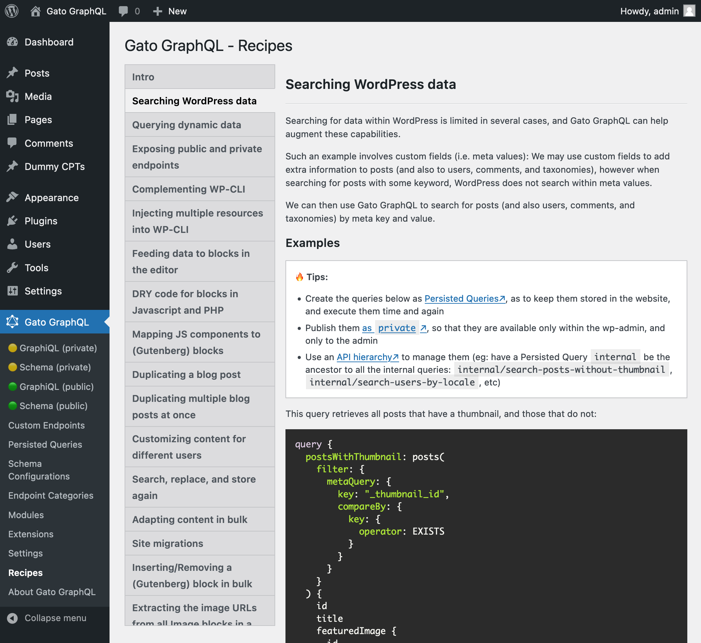

# Release Notes: 1.0

After a reaaaaaaally long time (spanning several years), development of the Gato GraphQL plugin has finally reached v1.0! Yaaaaaaaaaaay 🎉🍾🎊🥳🍻👏🥂🎈🙌

Starting from this version, the plugin will be released in the [WordPress plugins directory](https://wordpress.org/plugins/) (currently a work in progress), so you'll be able to install the plugin directly from your WordPress dashboard.

Version 1.0 brings plenty of improvements, including the **integration with the (Gutenberg) block editor**, and the **availability of (commercial) extensions** to extend the GraphQL schema and provide further functionality.

Here's an extensive description of all the changes.

## Integration of Gutenberg blocks into the GraphQL schema

## Browse "Additional Documentation" when editing a Schema Configuration

Documentation for additional features in the Gato GraphQL can now be browsed when editing a Schema Configuration CPT, on the editor's sidebar:


When clicking on any of the links, a modal window is displayed with the corresponding documentation:


## Inspect properties when editing Custom Endpoints and Persisted Query Endpoints

A sidebar component has been added to the editor for Custom Endpoints and Persisted Query Endpoints, displaying links to:

- The endpoint URL
- Its source configuration
- Its GraphiQL client (for the Custom Endpoint)
- Its interactive schema client (for the Custom Endpoint)


## The Settings page has been re-designed

Due to the great number of modules in the plugin, the Settings page required several rows to display all tabs, which was not very polished.

Now, the Settings page organizes all modules into 2 levels, and displays tabs vertically, making it easier to browse them:


## Reset settings, and choose to use the restrictive or non-restrictive default settings

A Gato GraphQL may be exposed publicly or only privately, and depending on which is the case there are options and features that need to be restricted or not.

For instance, querying values from the `wp_options` table can be unrestrained whenever building a static site (in which case the WordPress site may be on the developer's laptop, not exposed to the Internet), but must be limited to a handful of options (or even none at all) for a public API, for security reasons.

The plugin has provided restrictive and non-restrictive default behaviors for the Settings since v0.8, but it required to define a PHP constant in `wp-config.php` to switch from one to the other, and then manually delete all Settings values that had to be regenerated.

Now it is possible to do the switch directly via the UI: The new "Plugin Management" tab in the Settings Page has an item "Reset Settings" which restores the default settings values, and allows to decide if to use the restrictive or the non-restrictive default behaviors.


## Added the Extensions page, to browse and install Gato GraphQL extensions

@todo Complete Extensions page changelog!

## Added the Recipes page, providing use examples of GraphQL queries for different use cases

A new Recipes page has been added to the menu.

It provides examples of GraphQL queries for plenty of use cases. These can help us visualize the possibilities of what's doable with Gato GraphQL, and we can copy/paste these queries into our sites to achieve our goals faster.



## Configuration blocks in the the Schema Configuration CPT editor can be removed (and added again)

When creating a Schema Configuration, the new entry contains the whole list of options to configure:


If we need to configure only a handful of items, displaying all blocks in the editor makes it difficult to visualize.

Now, the Gutenberg template (containing the blocks) is not locked anymore, then we can delete the blocks that we don't need. And if we need to add a block again, it can be done from the inserter (notice that every block can only be added once):


## Implementation of standard custom scalar types

Several standard custom scalar types have been implemented, so they are readily-available to be used in your GraphQL schema:

- `Domain`
- `IP`
- `IPv4`
- `IPv6`
- `MACAddress`
- `PhoneNumber`
- `PositiveInt`
- `StrictlyPositiveInt`
- `PositiveFloat`
- `StrictlyPositiveFloat`
- `UUID`

Please notice that these do not currently appear in the Interactive Schema client, as they are not being referenced anywhere within the WordPress model (as [defined by the spec](https://spec.graphql.org/October2021/#sec-Scalars.Built-in-Scalars), only types referenced by another type are reachable via introspection).

## Sort the Schema Configuration entries by name

In the Custom Endpoint and Persisted Query editors, the Schema Configuration entries are now sorted by name:


## Configure returning a payload object or the mutated entity for mutations

Mutation fields can be configured to return either of these 2 different entities:

- A payload object type
- Directly the mutated entity

### Payload object type

A payload object type contains all the data concerning the mutation:

- The status of the mutation (success or failure)
- The errors (if any) using distinctive GraphQL types, or
- The successfully mutated entity

For instance, mutation `updatePost` returns an object of type `PostUpdateMutationPayload` (please notice that we still need to query its field `post` to retrieve the updated post entity):

```graphql
mutation UpdatePost {
  updatePost(input: {
    id: 1724,
    title: "New title",
    status: publish
  }) {
    # This is the status of the mutation: SUCCESS or FAILURE
    status
    errors {
      __typename
      ...on ErrorPayload {
        message
      }
    }
    post {
      id
      title
      # This is the status of the post: publish, pending, trash, etc
      status
    }
  }
}
```

The payload object allows us to represent better the errors, even having a unique GraphQL type per kind of error. This allows us to present different reactions for different errors in the application, thus improving the user experience.

In the example above, the `PostUpdateMutationPayload` type contains field `errors`, which returns a list of `CustomPostUpdateMutationErrorPayloadUnion`. This is a union type which includes the list of all possible errors that can happen when modifying a custom post (to be queried via introspection field `__typename`):

- `CustomPostDoesNotExistErrorPayload`
- `GenericErrorPayload`
- `LoggedInUserHasNoEditingCustomPostCapabilityErrorPayload`
- `LoggedInUserHasNoPermissionToEditCustomPostErrorPayload`
- `LoggedInUserHasNoPublishingCustomPostCapabilityErrorPayload`
- `UserIsNotLoggedInErrorPayload`

If the operation was successful, we will receive:

```json
{
  "data": {
    "updatePost": {
      "status": "SUCCESS",
      "errors": null,
      "post": {
        "id": 1724,
        "title": "Some title",
        "status": "publish"
      }
    }
  }
}
```

If the user is not logged in, we will receive:

```json
{
  "data": {
    "updatePost": {
      "status": "FAILURE",
      "errors": [
        {
          "__typename": "UserIsNotLoggedInErrorPayload",
          "message": "You must be logged in to create or update custom posts"
        }
      ],
      "post": null
    }
  }
}
```

If the user doesn't have the permission to edit posts, we will receive:

```json
{
  "data": {
    "updatePost": {
      "status": "FAILURE",
      "errors": [
        {
          "__typename": "LoggedInUserHasNoEditingCustomPostCapabilityErrorPayload",
          "message": "Your user doesn't have permission for editing custom posts."
        }
      ],
      "post": null
    }
  }
}
```

As a consequence of all the additional `MutationPayload`, `MutationErrorPayloadUnion` and `ErrorPayload` types added, the GraphQL schema will have a bigger size:


### Mutated entity

The mutation will directly return the mutated entity in case of success, or <code>null</code> in case of failure, and any error message will be displayed in the JSON response's top-level <code>errors</code> entry.

For instance, mutation `updatePost` will return the object of type `Post`:

```graphql
mutation UpdatePost {
  updatePost(input: {
    id: 1724,
    title: "New title",
    status: publish
  }) {
    id
    title
    status
  }
}
```

If the operation was successful, we will receive:

```json
{
  "data": {
    "updatePost": {
      "id": 1724,
      "title": "Some title",
      "status": "publish"
    }
  }
}
```

In case of errors, these will appear under the `errors` entry of the response. For instance, if the user is not logged in, we will receive:

```json
{
    "errors": [
      {
        "message": "You must be logged in to create or update custom posts'",
        "locations": [
          {
            "line": 2,
            "column": 3
          }
        ]
      }
  ],
  "data": {
    "updatePost": null
  }
}
```

We must notice that, as a result, the top-level `errors` entry will contain not only syntax, schema validation and logic errors (eg: not passing a field argument's name, requesting a non-existing field, or calling `_sendHTTPRequest` and the network is down respectively), but also "content validation" errors (eg: "you're not authorized to modify this post").

Because there are no additional types added, the GraphQL schema will look leaner:


## Added "state" column to tables for Custom Endpoints and Persisted Queries

The tables for the Custom Endpoint and Persisted Query CPTs now display the "state" column, showing if entries are enabled or disabled:


## Saving the Settings is faster, as it does not regenerate the service container anymore

The Plugin Settings has been completely decoupled from the services registered in the container. As such, the container does not need to be regenerated when updating the Settings, leading to a performance boost.

## Only activating/deactivating Gato GraphQL extension plugins will regenerate the service container

Before, the service container (upon which the GraphQL schema is based) was regenerated whenever any plugin (whether it was related to Gato GraphQL or not) was activated or deactivated.

Now, only Gato GraphQL extension plugins trigger this process.

## Fixed

- Made field `Comment.type` of type `CommentTypeEnum` (previously was `String`)
- Avoid error from loading non-existing translation files
- Updated all documentation images

## Breaking changes

- Non-restrictive Settings values are used by default
- Env var `ENABLE_UNSAFE_DEFAULTS` has been removed and `SETTINGS_OPTION_ENABLE_RESTRICTIVE_DEFAULT_BEHAVIOR` added in its place, to indicate to use the restrictive Settings values by default
- Renamed plugin to "Gato GraphQL"
