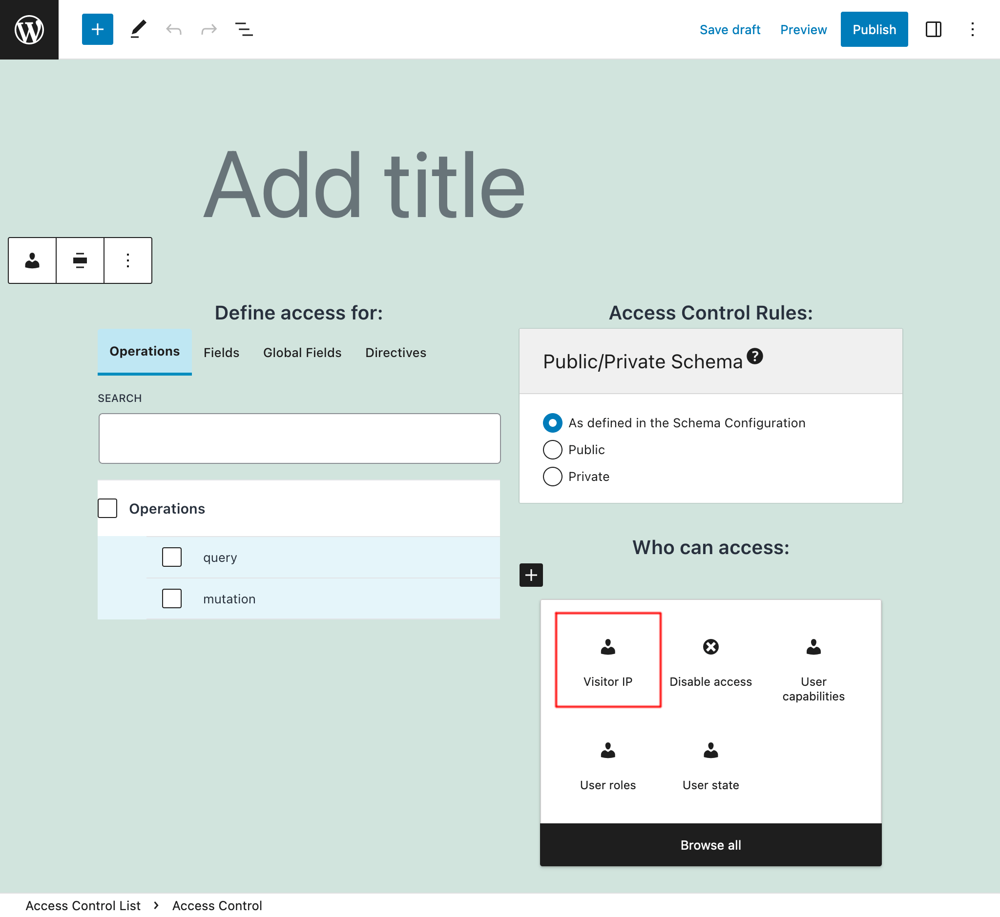

# Access Control: Visitor IP

Access Control rule "Visitor IP", to grant access to the selected schema elements based on the visitor coming from an allowed IP address.

## Description

In the Access Control editor, a new rule "Visitor IP" is made available:



We configure the rule with the list of IP addresses that can either access, or are denied access to, the schema elements.

Each entry can either be:

- A regex (regular expression), if it's surrounded by `/` or `#`, or
- The full IP address, otherwise

For instance, any of these entries match IP address `"203.23.88.100"`:

- `203.23.88.100`
- `#^203\.23\.[0-9]{1,3}\.[0-9]{1,3}$#`

And under Behavior, select if to "Allow access" or "Deny access" to the schema for those entries.


When access is denied, the response will contain an error message like this one (in the public mode):

```json
{
  "errors": [
    {
      "message": "The client IP address must satisfy constraint '#^255\\.[0-9]{1,3}\\.[0-9]{1,3}\\.[0-9]{1,3}$#' to access field 'karma' for type 'Comment' (your IP address is '172.19.0.2')",
      "locations": [
        {
          "line": 15,
          "column": 5
        }
      ]
    }
  ]
}
```

## Bundles including extension

- [“All Extensions” Bundle](../../../../../bundle-extensions/all-extensions/docs/modules/all-extensions/en.md)
- [“Public API” Bundle](../../../../../bundle-extensions/public-api/docs/modules/public-api/en.md)
