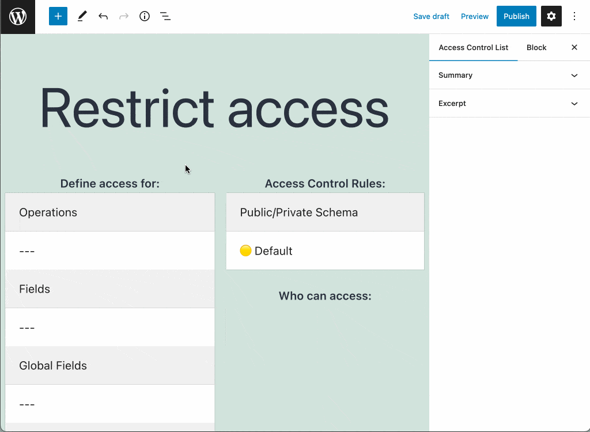
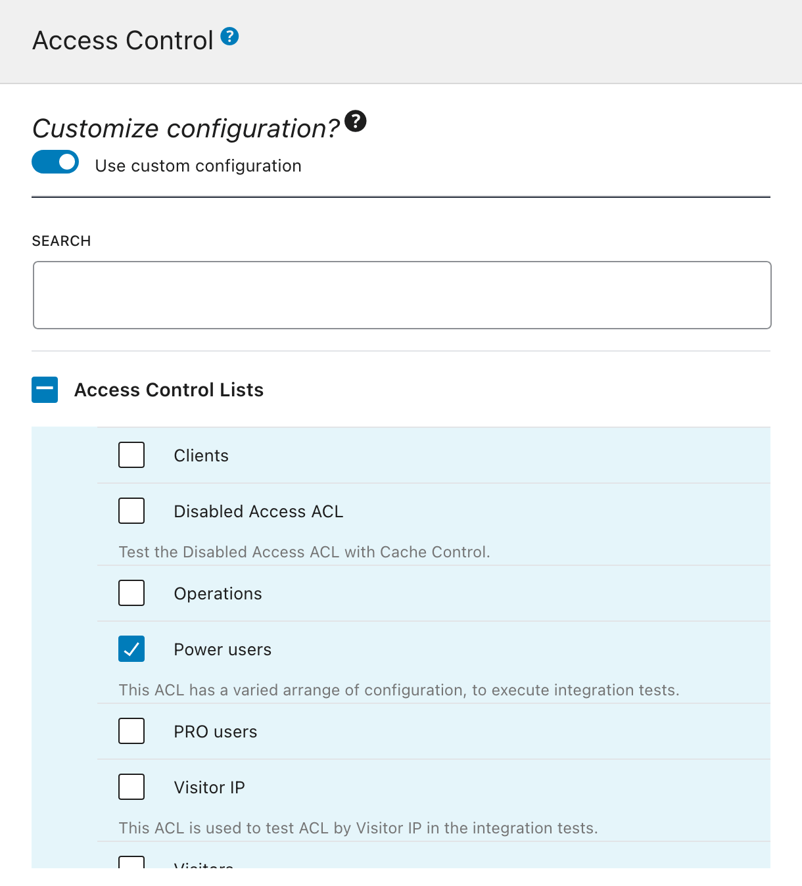

# Access Control

Manage access to the GraphQL schema through Access Control Lists.

## Description

This extension allows us to create Access Control Lists, to manage who can access the different elements (operations, fields and directives) from the GraphQL schema.

A new "Access Control Lists" page is made available on the menu:


When creating a new Access Control List, we indicate what rules must be satisfied as to access any of the following elements:

- Operations (`query` or `mutation`)
- Fields
- Global Fields
- Directives

<!--  -->



We assign the Access Control List to the endpoint via the Schema Configuration.



When executing a GraphQL query, if it contains one of the selected schema elements, the rules from the corresponding Access Control List are evaluated.

If any rule is not satisfied, access to that operation, field or directive is denied, and we can configure how the API must provide the response:

- Public mode: Provide an error message to the user, indicating why access is denied
- Private mode: The error message indicates that the operation, field or directive does not exist

For instance, in the _public mode_, we may get this response:

```json
{
  "errors": [
    {
      "message": "You must have role 'author' to access field 'title' for type 'Post'",
      "locations": [
        {
          "line": 86,
          "column": 3
        }
      ]
    }
  ]
}
```

While in the _private mode_ we may get this response:

```json
{
  "errors": [
    {
      "message": "There is no field 'title' on type 'Post'",
      "locations": [
        {
          "line": 86,
          "column": 3
        }
      ]
    }
  ]
}
```

## List of Access Control rules

The extension provides the following Access Control rules:

- Disable access
- Grant access only if the user is logged-in or out
- Grant access only if the user has some role
- Grant access only if the user has some capability
