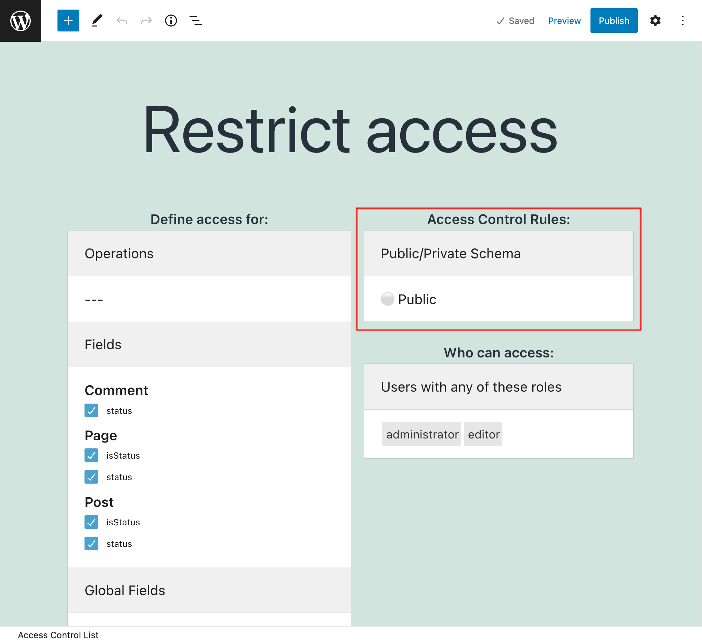

# Access Control

Define Access Control Lists to manage granular access to the API for your users.

---

This extension allows us to create **Access Control Lists**, to manage who can access the different elements (operations, fields and directives) from the GraphQL schema, using the following rules:

- Disable access
- Grant access only if the user is logged-in or out
- Grant access only if the user has some role
- Grant access only if the user has some capability
- Grant access only if the visitor comes from an allowed IP

We indicate what rules must be satisfied to access what schema elements, from among operations, fields, global fields, and directives.

When executing a GraphQL query, if it contains any of the selected schema elements in the Access Control List, the chosen rules are evaluated.

If any rule is not satisfied, access to that operation, field or directive is denied.

---

With the **Public/Private Schema Mode**, when access to some a field or directive is denied through Access Control, there are 2 ways for the API to behave:

**Public mode**: The fields in the schema are exposed, and when the permission is not satisfied, the user gets an error message with a description of why the permission was rejected. This behavior makes the metadata from the schema always available.

**Private mode**: The schema is customized to every user, containing only the fields available to him or her, and so when attempting to access a forbidden field, the error message says that the field doesn't exist. This behavior exposes the metadata from the schema only to those users who can access it.

<!-- ## List of bundled extensions

- [Access Control](../../../../../extensions/access-control/docs/modules/access-control/en.md)
- [Access Control Visitor IP](../../../../../extensions/access-control-visitor-ip/docs/modules/access-control-visitor-ip/en.md)
- [Schema Editing Access](../../../../../extensions/schema-editing-access/docs/modules/schema-editing-access/en.md) -->
