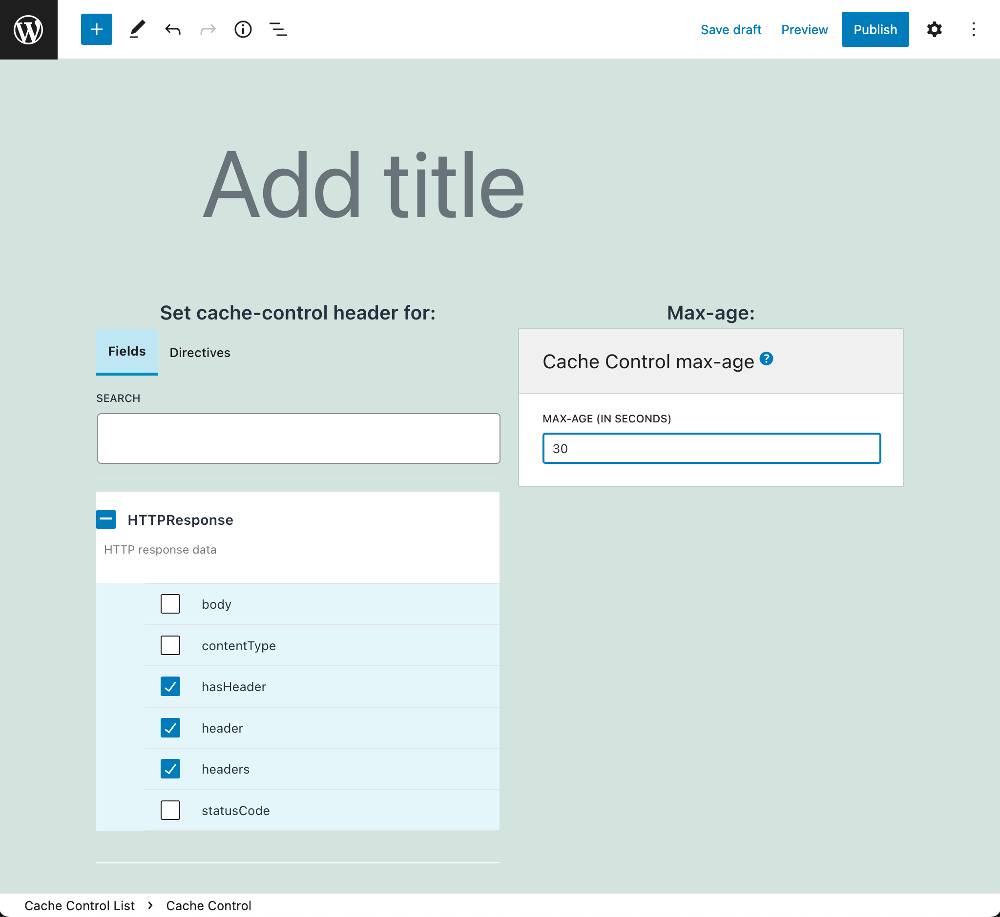

# Caching

Make your application faster by providing HTTP Caching for the GraphQL response, and by caching the results of expensive operations.

---

With **Cache Control**, use HTTP caching to send a `Cache-Control` header with a `max-age` value in the response of the GraphQL query, indicating for how long the response must be cached.

The Cache Control extension offers Cache Control Lists, where custom `max-age` values are defined for fields and directives.

The response's `max-age` value is automatically calculated by the GraphQL engine, from the fields and directives present in the query.

<div class="img-width-1024" markdown=1>



</div>

---

With **Field Resolution Caching**, the `@cache` directive is added to the GraphQL schema.

This directive stores the result from a field in disk for a requested amount of time. When executing the same field within that time span, the cached value is returned.

This directive can boost performance when executing expensive operations (such as when interacting with external APIs), as we can cache and reuse their response.

```graphql
query {
  posts {
    id
    title
      @strTranslate(from: "en", to: "es")
      @cache(time: 10)
  }
}
```

<!-- ## List of bundled extensions

- [Cache Control](../../../../../extensions/cache-control/docs/modules/cache-control/en.md)
- [Field Resolution Caching](../../../../../extensions/field-resolution-caching/docs/modules/field-resolution-caching/en.md) -->
