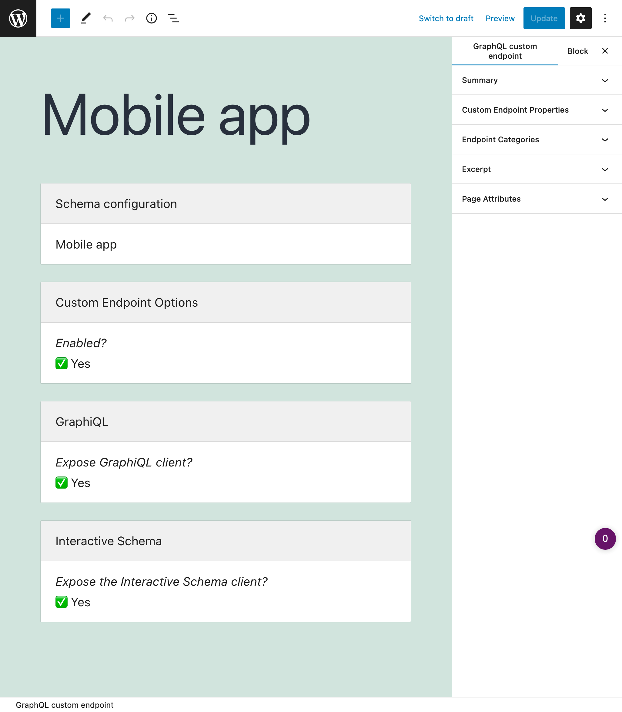
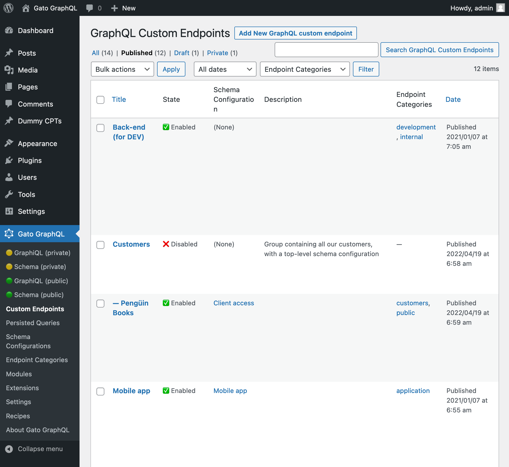

# Custom Endpoints

Create custom schemas, with custom access rules for different users, each available under its own endpoint.

---

A GraphQL server normally exposes a single endpoint for retrieving and posting data, providing a unique behavior for all users and applications.

With custom endpoints, we can create and expose custom GraphQL schemas under their own URL, and grant access to each endpoint to some specific target:

- A client or user
- A group of users with more access to features (such as PRO users)
- An application, like mobile app, newsletter, or website
- 3rd-party APIs
- Any other

Each custom endpoint is customized to some specific configuration, and is accessed via its own GraphiQL and Voyager clients.

The custom endpoints can be managed via categories and hierarchies.

<!-- ## List of bundled extensions

- [Custom Endpoints](../../../../../extensions/custom-endpoints/docs/modules/custom-endpoints/en.md) -->
