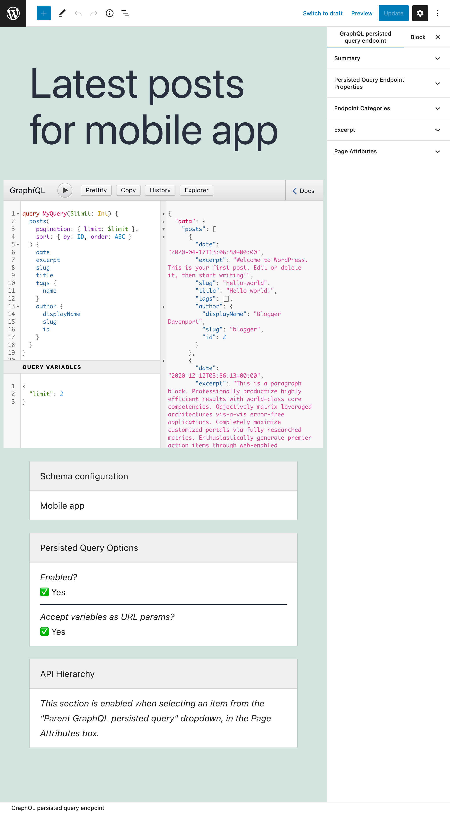
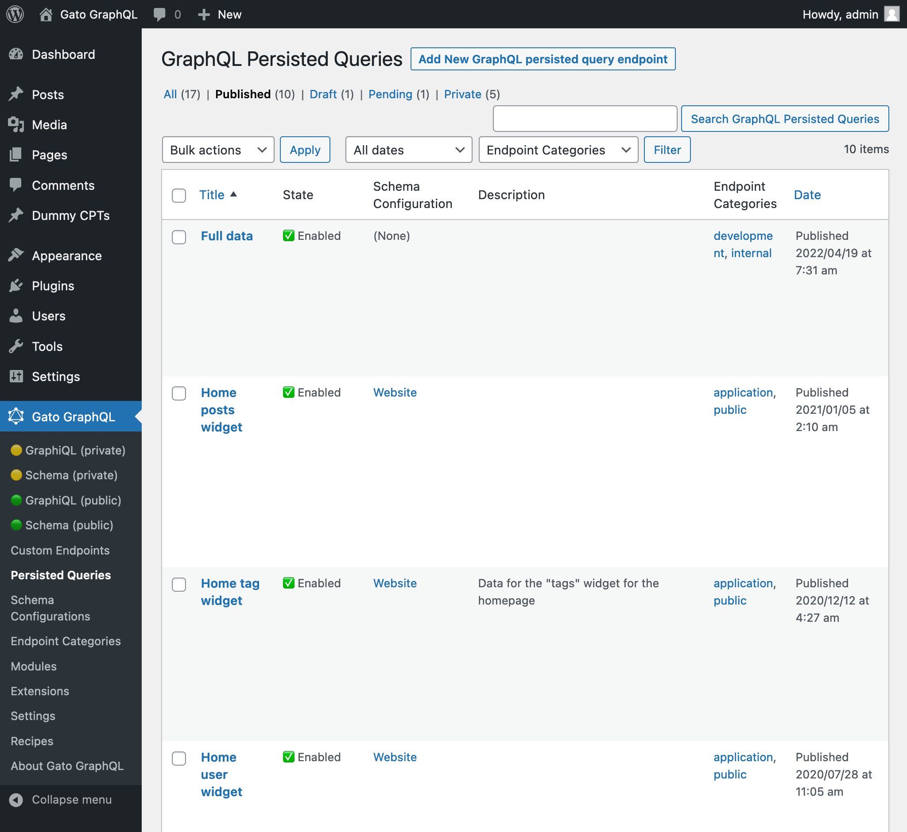

# Persisted Queries

Use GraphQL queries to create pre-defined endpoints as in REST, obtaining the benefits from both APIs.

---

In a REST API, we create multiple endpoints, each returning a pre-defined set of data. In a GraphQL API, in contrast, we provide any query to a single endpoint, which returns exactly the requested data.

Persisted queries are normal GraphQL queries, however they are stored in the server and accessed under their own URL, thus emulating a REST endpoint. They provide the advantages from these two APIs, while avoiding their disadvantages:

| Advantages | Disadvantages |
| --- | --- |
| ✅ Accessed via `GET` or `POST` | ~~❌ Accessed only via `POST`~~ |
| ✅ Can be cached on the server or CDN | ~~❌ Needs to provide an extra layer in client-side just for caching~~ |
| ✅ It's secure: only intended data is exposed | ~~❌ Data is exposed to anyone, including malicious actors~~ |
| ✅ No under/over fetching of data, all data is retrieved in a single request | ~~❌ It can be slow, since the application may need several requests to retrieve all the data~~ |
| ✅ It enables rapid iteration of the project | ~~❌ It's tedious to create all the endpoints~~ |
| ✅ It can be self-documented | ~~❌ Producing documentation is mandatory~~ |
| ✅ It provides clients to create and publish the query | ~~❌ Publishing endpoints is done via code~~ |

Once the persisted query is published, we can execute it via its permalink.

The persisted query can be executed via the GraphiQL client, or also directly in the browser (since it is accessed via `GET`), and we will obtain the requested data, in JSON format:

The persisted queries can be managed via categories and hierarchies.

<!-- ## List of bundled extensions

- [Low-Level Persisted Query Editing](../../../../../extensions/low-level-persisted-query-editing/docs/modules/low-level-persisted-query-editing/en.md)
- [Persisted Queries](../../../../../extensions/persisted-queries/docs/modules/persisted-queries/en.md) -->
