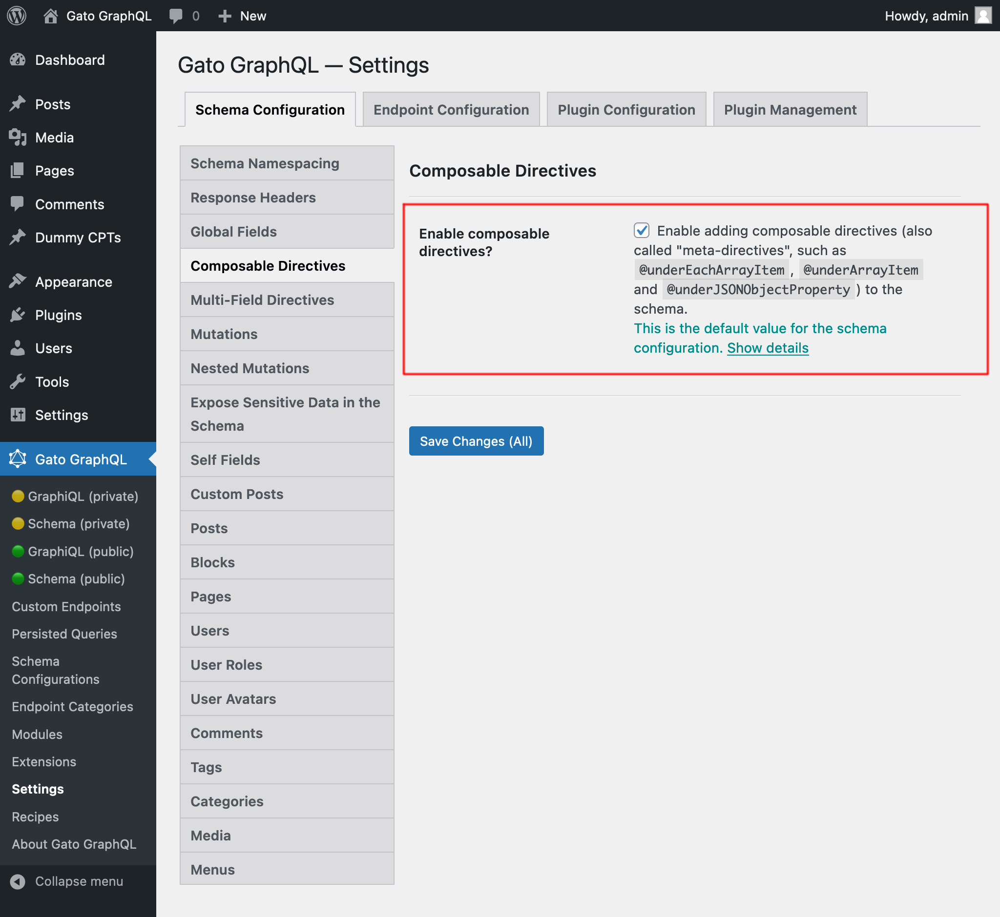
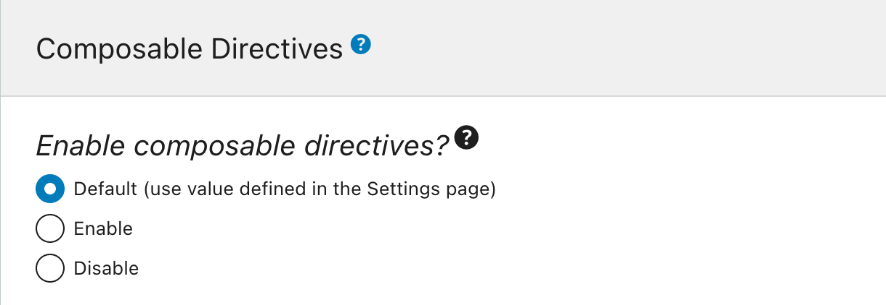

# Composable Directives

Allow directives to nest and modify the behavior of other directives.

## Description

This module allows directives to execute complex functionalities, by composing other directives inside, calling them before/after preparing the field value accordingly. Directives with this capability are called "meta directives".

A use case is to convert the type of the field value to the type expected by the nested directive. For instance, each element from an array can be provided to a directive that expects a single value. In this query, field `capabilities` returns `[String]` (an array of strings), and directive `@strUpperCase` receives `String`. Hence, executing the following query:

```graphql
query {
  user(by: {id: 1}) {
    capabilities @strUpperCase
  }
}
```

...returns an error due to the type mismatch:

```json
{
  "errors": [
    {
      "message": "Directive 'strUpperCase' from field 'capabilities' cannot be applied on object with ID '1' because it is not a string"
    }
  ],
  "data": {
    "user": {
      "capabilities": null
    }
  }
}
```

The meta directive `@underEachArrayItem` (provided via extension **Data Iteration Meta Directives**) can solve this problem, as it iterates over an array of elements and applies its nested directive on each of them, setting the stage before `@strUpperCase` is executed and making it receive a single element (of type `String`) instead of an array.

The query from above can be satisfied like this:

```graphql
query {
  user(by: {id: 1}) {
    capabilities
      @underEachArrayItem
        @strUpperCase
  }
}
```

...producing the intended response:

```json
{
  "data": {
    "user": {
      "capabilities": [
        "READ",
        "LEVEL_0"
      ]
    }
  }
}
```

## Using meta directives

Every meta directive can affect (or "nest") multiple directives at once. Which directives are affected is indicated via argument `affectDirectivesUnderPos`, which receives an array of positive integers, each of them defining the affected directive's relative position.

By default, argument `affectDirectivesUnderPos` has default value `[1]`, meaning that it will affect the directive right next to it.

In the example below, we have:

- `@underEachArrayItem` is the meta directive
- `@strTranslate` is nested under `@underEachArrayItem` (implicit default value `affectDirectivesUnderPos: [1]`)

```graphql
{
  someField
    @underEachArrayItem
      @strTranslate
}
```

In the example below, we instead have:

- `@strTranslate` and `@strUpperCase` are nested under `@underEachArrayItem` (as indicated by relative positions `[1, 2]` in argument `affectDirectivesUnderPos`)

```graphql
{
  someField
    @underEachArrayItem(affectDirectivesUnderPos: [1, 2])
      @strTranslate
      @strUpperCase
}
```

Meta directives can also be nested within meta directives.

In the example below, we have:

- `@underEachArrayItem` is the topmost meta directive
- `@underJSONObjectProperty` is nested under `@underEachArrayItem`
- `@strUpperCase` is nested under `@underJSONObjectProperty`

```graphql
query UppercaseEntriesInsideObject {
  entries: _echo(value: [
    {
      text: "Hello my friends"
    },
    {
      text: "How do you like this software so far?"
    }
  ])
   @underEachArrayItem
      @underJSONObjectProperty(by: { key: "text" })
        @strUpperCase
  }
```

The response is:

```json
{
  "data": {
    "entries": [
      {
        "text": "HELLO MY FRIENDS"
      },
      {
        "text": "HOW DO YOU LIKE THIS SOFTWARE SO FAR?"
      }
    ]
  }
}
```

### Exporting dynamic variables

A meta directive can pass the value it contains as a "dynamic variable" to its nested directives, via a directive argument (`passValueOnwardsAs` for `@underEachArrayItem`, or `passOnwardsAs` otherwise).

In the query below, the array `["Hello everyone", "How are you?"]` is iterated upon using `@underEachArrayItem`, and by defining argument `passValueOnwardsAs: "text"` each value in the array is made available to the nested directive `@applyField` under the dynamic variable `$text`:

```graphql
query {
  _echo(value: ["Hello everyone", "How are you?"])
    @underEachArrayItem(passValueOnwardsAs: "text")
      @applyField(
        name: "_strReplace"
        arguments: {
            search: " "
            replaceWith: "-"
            in: $text
        },
        setResultInResponse: true
      )
}
```

This will produce:

```json
"data": {
    "echo": [
      "Hello-everyone",
      "How-are-you?"
    ]
  }
```

## Configuration

To enable or disable composable directives in the GraphQL schema, go to the "Composable Directives" module on the Settings page, and tick/untick the checkbox for `Enable composable directives?`:

<div class="img-width-1024" markdown=1>



</div>

To enable or disable composable directives on a specific endpoint, select the desired option in block "Composable Directives" from the corresponding Schema Configuration:

<div class="img-width-610" markdown=1>



</div>

## Examples

Translating the post categories from English to French:

```graphql
query {
  posts {
    id
    title
    categoryNames
      @underEachArrayItem
        @strTranslate(
          from: "en",
          to: "fr"
        )
  }
}
```

Transform a single post's `"title.rendered"` property, obtained through the WP REST API endpoint, into title case:

```graphql
query {
  postData: _sendJSONObjectItemHTTPRequest(input: {
    url: "https://newapi.getpop.org/wp-json/wp/v2/posts/1/?_fields=id,type,title,date"
  })
    @underJSONObjectProperty(by: { path: "title.rendered" })
      @strTitleCase
}
```

Transform multiple posts' `"title.rendered"` property into upper case:

```graphql
query {
  postListData: _sendJSONObjectCollectionHTTPRequest(
    url: "https://newapi.getpop.org/wp-json/wp/v2/posts/?per_page=3&_fields=id,type,title,date"
  )
    @underEachArrayItem
      @underJSONObjectProperty(by: { path: "title.rendered" })
        @strUpperCase
}
```
