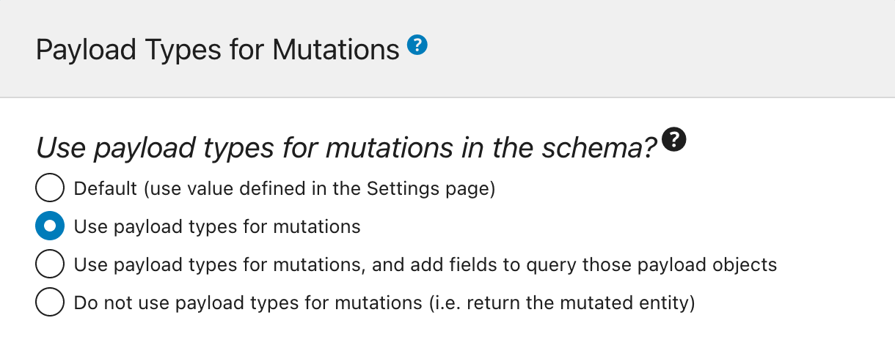

# Mutations

Mutations are operations that have side effects, such as performing an insert or update of data in the database. The available mutation fields are those under the `MutationRoot` type (or some of the fields under `Root` when using nested mutations), and these can be executed in the GraphQL document via the operation type `mutation`:

```graphql
mutation {
  updatePost(input: {
    id: 5,
    title: "New title"
  }) {
    title
  }
}
```

The **Mutations** module acts as an upstream dependency for all modules containing mutations. This allows us to remove all mutations from the GraphQL schema simply by disabling this module.

## Returning a Payload Object or the Mutated Entity

Mutation fields can be configured to return either of these 2 different entities:

- A payload object type
- Directly the mutated entity

### Payload object type

A payload object type contains all the data concerning the mutation:

- The status of the mutation (success or failure)
- The errors (if any) using distinctive GraphQL types, or
- The successfully mutated entity

For instance, mutation `updatePost` returns an object of type `PostUpdateMutationPayload` (please notice that we still need to query its field `post` to retrieve the updated post entity):

```graphql
mutation UpdatePost {
  updatePost(input: {
    id: 1724,
    title: "New title",
    status: publish
  }) {
    # This is the status of the mutation: SUCCESS or FAILURE
    status
    errors {
      __typename
      ...on ErrorPayload {
        message
      }
    }
    post {
      id
      title
      # This is the status of the post: publish, pending, trash, etc
      status
    }
  }
}
```

The payload object allows us to represent better the errors, even having a unique GraphQL type per kind of error. This allows us to present different reactions for different errors in the application, thus improving the user experience.

In the example above, the `PostUpdateMutationPayload` type contains field `errors`, which returns a list of `CustomPostUpdateMutationErrorPayloadUnion`. This is a union type which includes the list of all possible errors that can happen when modifying a custom post (to be queried via introspection field `__typename`):

- `CustomPostDoesNotExistErrorPayload`
- `GenericErrorPayload`
- `LoggedInUserHasNoEditingCustomPostCapabilityErrorPayload`
- `LoggedInUserHasNoPermissionToEditCustomPostErrorPayload`
- `LoggedInUserHasNoPublishingCustomPostCapabilityErrorPayload`
- `UserIsNotLoggedInErrorPayload`

If the operation was successful, we will receive:

```json
{
  "data": {
    "updatePost": {
      "status": "SUCCESS",
      "errors": null,
      "post": {
        "id": 1724,
        "title": "Some title",
        "status": "publish"
      }
    }
  }
}
```

If the user is not logged in, we will receive:

```json
{
  "data": {
    "updatePost": {
      "status": "FAILURE",
      "errors": [
        {
          "__typename": "UserIsNotLoggedInErrorPayload",
          "message": "You must be logged in to create or update custom posts"
        }
      ],
      "post": null
    }
  }
}
```

If the user doesn't have the permission to edit posts, we will receive:

```json
{
  "data": {
    "updatePost": {
      "status": "FAILURE",
      "errors": [
        {
          "__typename": "LoggedInUserHasNoEditingCustomPostCapabilityErrorPayload",
          "message": "Your user doesn't have permission for editing custom posts."
        }
      ],
      "post": null
    }
  }
}
```

As a consequence of all the additional `MutationPayload`, `MutationErrorPayloadUnion` and `ErrorPayload` types added, the GraphQL schema will have a bigger size:


#### Query the mutation payload objects

Every mutation in the schema has a corresponding field to query its recently-created payload objects, with name `{mutationName}MutationPayloadObjects`.

These fields include:

- `addCommentToCustomPostMutationPayloadObjects` (for `addCommentToCustomPost`)
- `createCustomPostMutationPayloadObjects` (for `createCustomPost`)
- `createMediaItemMutationPayloadObjects` (for `createMediaItem`)
- `createPageMutationPayloadObjects` (for `createPage`)
- `createPostMutationPayloadObjects` (for `createPost`)
- `removeFeaturedImageFromCustomPostMutationPayloadObjects` (for `removeFeaturedImageFromCustomPost`)
- `replyCommentMutationPayloadObjects` (for `replyComment`)
- `setCategoriesOnPostMutationPayloadObjects` (for `setCategoriesOnPost`)
- `setFeaturedImageOnCustomPostMutationPayloadObjects` (for `setFeaturedImageOnCustomPost`)
- `setTagsOnPostMutationPayloadObjects` (for `setTagsOnPost`)
- `updateCustomPostMutationPayloadObjects` (for `updateCustomPost`)
- `updatePageMutationPayloadObjects` (for `updatePage`)
- `updatePostMutationPayloadObjects` (for `updatePost`)

These fields enable us to retrieve the results of mutations executed using `@applyField` while iterating the items in an array.

For instance, the following query duplicates posts in bulk:

```graphql
query GetPostsAndExportData
{
  postsToDuplicate: posts {
    title
    rawContent
    excerpt

    # Already create (and export) the inputs for the mutation
    postInput: _echo(value: {
      title: $__title
      contentAs: {
        html: $__rawContent
      },
      excerpt: $__excerpt
    })
      @export(as: "postInput", type: LIST)
      @remove
  }
}

mutation CreatePosts
  @depends(on: "GetPostsAndExportData")
{
  createdPostMutationPayloadObjectIDs: _echo(value: $postInput)
    @underEachArrayItem(
      passValueOnwardsAs: "input"
    )
      @applyField(
        name: "createPost"
        arguments: {
          input: $input
        },
        setResultInResponse: true
      )
    @export(as: "createdPostMutationPayloadObjectIDs")
}

query DuplicatePosts
  @depends(on: "CreatePosts")
{
  createdPostMutationObjectPayloads: createPostMutationPayloadObjects(input: {
    ids: $createdPostMutationPayloadObjectIDs
  }) {
    status
    errors {
      __typename
      ...on ErrorPayload {
        message
      }
    }
    post {
      id
      title
      rawContent
      excerpt
    }
  }
}
```

By default, these fields are not added to the GraphQL schema. For that, we must select option "Use payload types for mutations, and add fields to query those payload objects" (see below).

### Mutated entity

The mutation will directly return the mutated entity in case of success, or <code>null</code> in case of failure, and any error message will be displayed in the JSON response's top-level <code>errors</code> entry.

For instance, mutation `updatePost` will return the object of type `Post`:

```graphql
mutation UpdatePost {
  updatePost(input: {
    id: 1724,
    title: "New title",
    status: publish
  }) {
    id
    title
    status
  }
}
```

If the operation was successful, we will receive:

```json
{
  "data": {
    "updatePost": {
      "id": 1724,
      "title": "Some title",
      "status": "publish"
    }
  }
}
```

In case of errors, these will appear under the `errors` entry of the response. For instance, if the user is not logged in, we will receive:

```json
{
    "errors": [
      {
        "message": "You must be logged in to create or update custom posts'",
        "locations": [
          {
            "line": 2,
            "column": 3
          }
        ]
      }
  ],
  "data": {
    "updatePost": null
  }
}
```

We must notice that, as a result, the top-level `errors` entry will contain not only syntax, schema validation and logic errors (eg: not passing a field argument's name, requesting a non-existing field, or calling `_sendHTTPRequest` and the network is down respectively), but also "content validation" errors (eg: "you're not authorized to modify this post").

Because there are no additional types added, the GraphQL schema will look leaner:


### Configuration

We can configure the GraphQL schema with one among three options:

- Use payload types for mutations
- Use payload types for mutations, and add fields to query those payload objects
- Do not use payload types for mutations (i.e. return the mutated entity)

Using payload object types for mutations in the schema can be configured as follows, in order of priority:

✅ Specific mode for the custom endpoint or persisted query, defined in the schema configuration



✅ Default mode, defined in the Settings

If the schema configuration has value `"Default"`, it will use the mode defined in the Settings:

<div class="img-width-1024" markdown=1>


</div>
