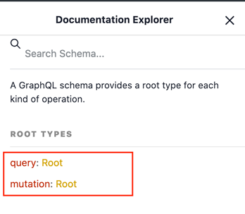
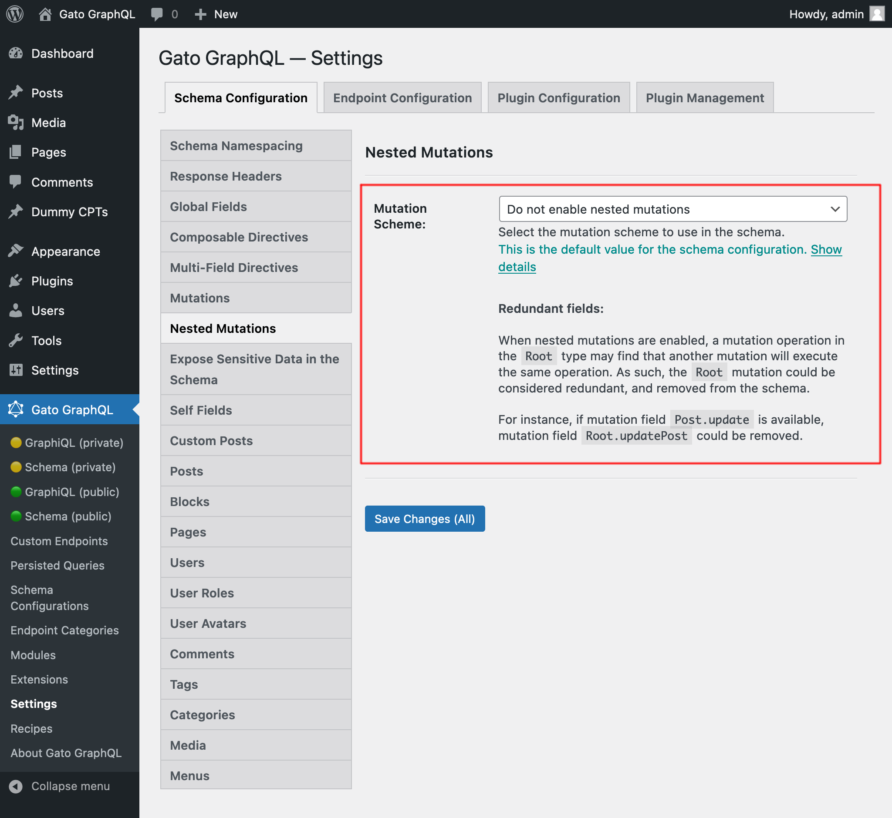
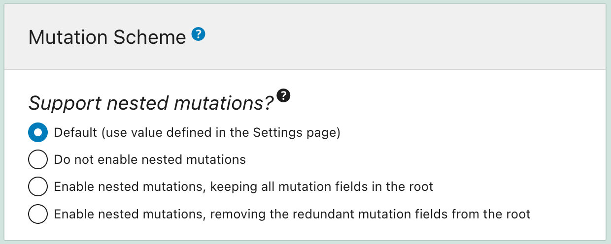

# Nested Mutations

Nested mutations enable to perform mutations on a type other than the root type in GraphQL.

## Description

The query below executes a standard mutation, using the mutation field `updatePost` from the `Root` type:

```graphql
mutation {
  updatePost(input: {
    id: 5,
    title: "New title"
  }) {
    title
  }
}
```

The query from above can also be executed through a nested mutation, where the post object is first queried through field `post`, and then mutation field `update`, which belongs to type `Post`, is applied on the post object:

```graphql
mutation {
  post(by:{ id: 5 }) {
    update(input: {
      title: "New title"
    }) {
      title
    }
  }
}
```

Mutations can also be nested, modifying data on the result from another mutation:

```graphql
mutation {
  createPost(input: {
    title: "First title"
  }) {
    id
    update(input: {
      title: "Second title",
      contentAs: { html: "Some content" }
    }) {
      title
      content
      addComment(input: {
        commentAs: { html: "My first comment" }
      }) {
        id
        content
        date
      }
    }
  }
}
```

## How it works

Nested mutations change the root type, from `QueryRoot` and `MutationRoot`, to a single `Root` type handling both queries and mutations:



With nested mutations, every type in the schema can contain both query and mutation fields. To differentiate them, the mutation field's description is prepended with label `"[Mutation] "`.

For instance, these are the fields for type `Root`:


## Settings

Item "Default Mutation scheme" in the module settings enables to configure if to enable nested mutations or not, and its behavior:

<div class="img-width-1024" markdown=1>



</div>

It has these options:

- Do no enable nested mutations
- Enable nested mutations, keeping all mutation fields in the root
- Enable nested mutations, removing the redundant mutation fields from the root

These options are set for the GraphQL server in general, but can be overridden for specific Custom Endpoints and Persisted Queries through the Schema Configuration (see the next section).

### Do no enable nested mutations

This option disables nested mutations (using the standard behavior instead) for the GraphQL server.

Disabling nested mutations can also be achieved by disabling the module, but in that case we can't enable nested mutations for specific Custom Endpoints and Persisted Queries through the Schema Configuration.

### Enable nested mutations, keeping all mutation fields in the root

When nested mutations are enabled, mutation fields may be added two times to the schema:

- once under the `Root` type
- once under the specific type

For instance:

- `Root.updatePost`
- `Post.update`

With this option, the "duplicated" mutation fields from the `Root` type are kept.

### Enable nested mutations, removing the redundant mutation fields from the root

Same option as above, but removing the "duplicated" mutation fields from the `Root` type.

## Schema configuration

A "Mutation Scheme" section has been added to a Schema Configuration, allowing to enable/disable/configure nested mutations for Custom Endpoints and Persisted Queries on an individual basis.



## GraphQL spec

This functionality is currently not part of the GraphQL spec, but it has been requested:

- [Issue #252 - Proposal: Serial fields (nested mutations)](https://github.com/graphql/graphql-spec/issues/252)
