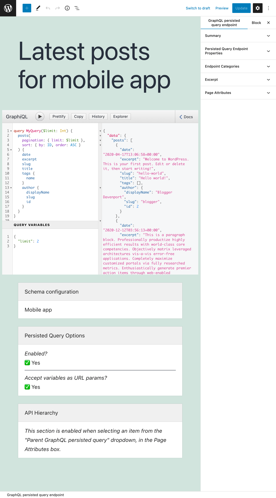
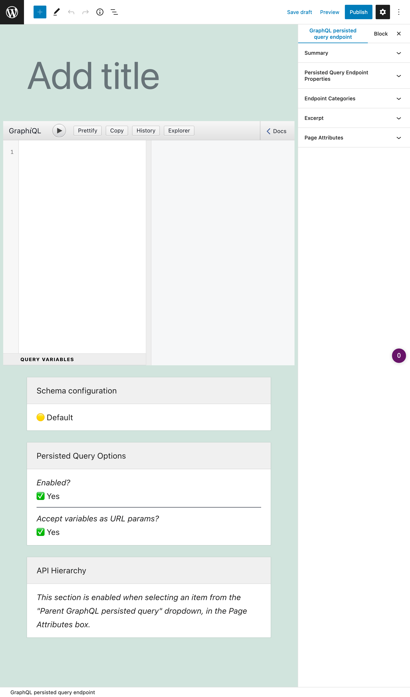
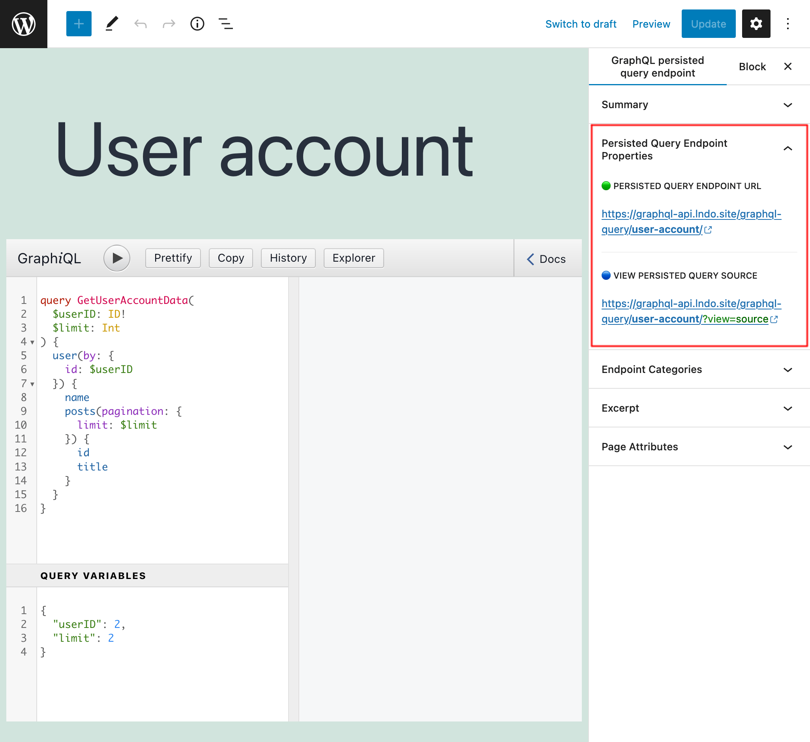
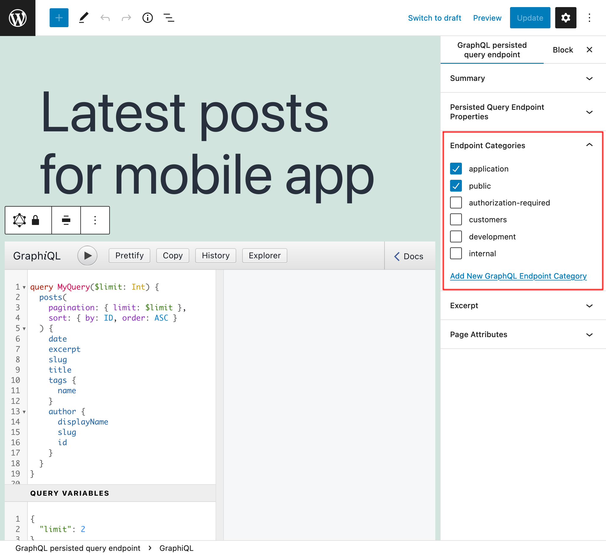
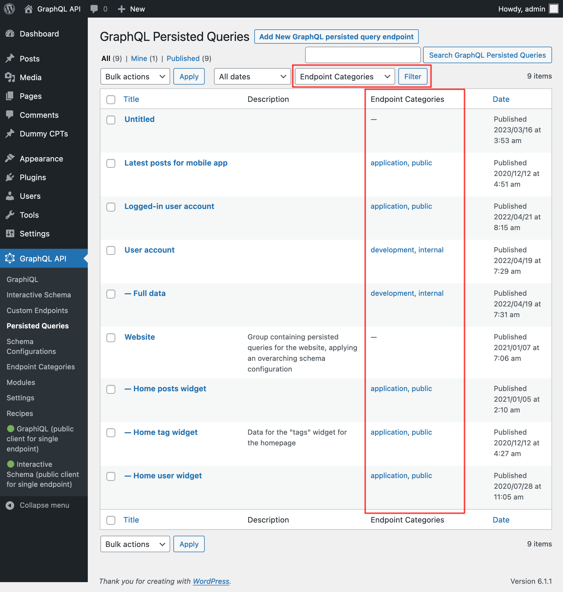
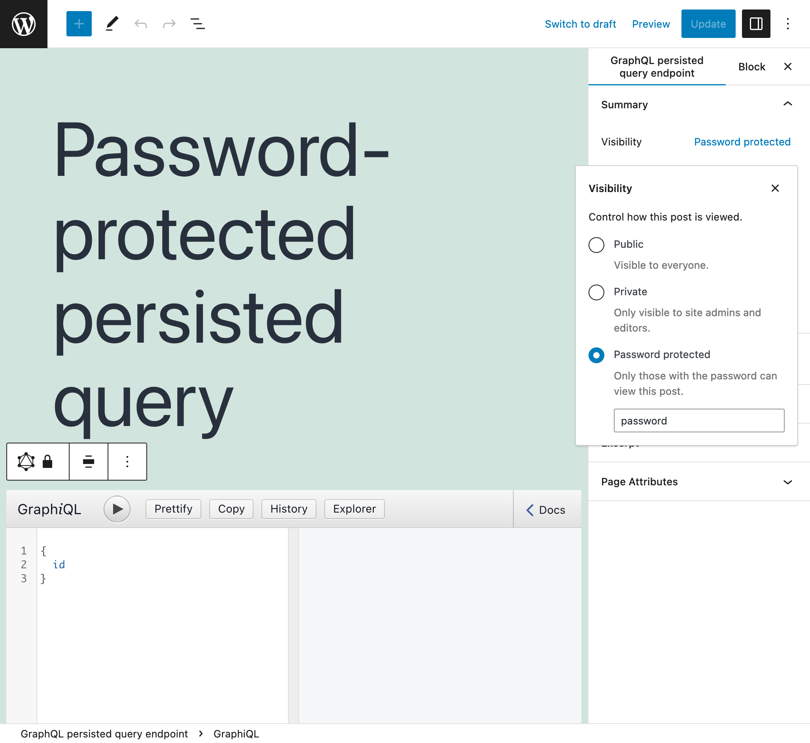
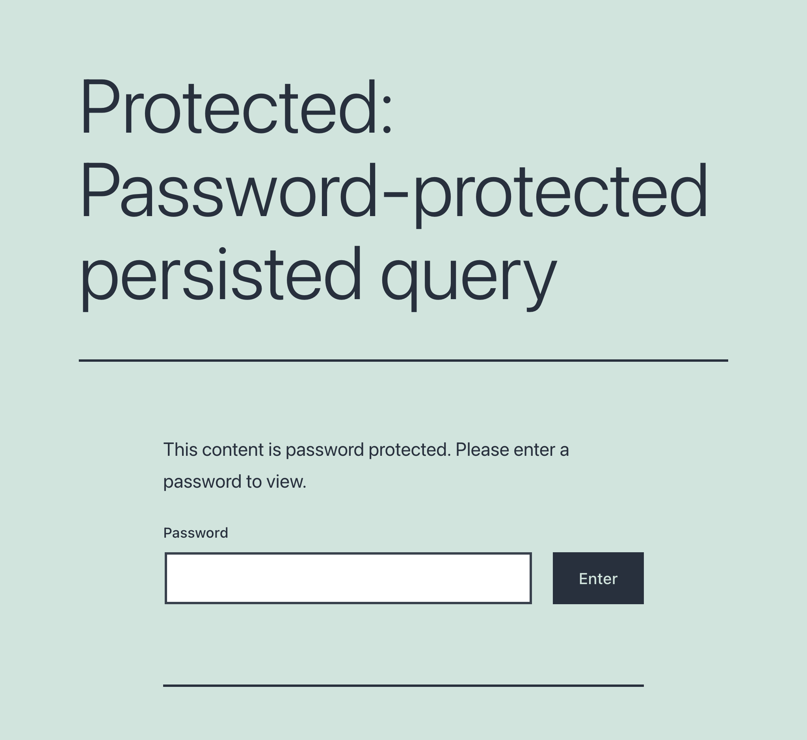
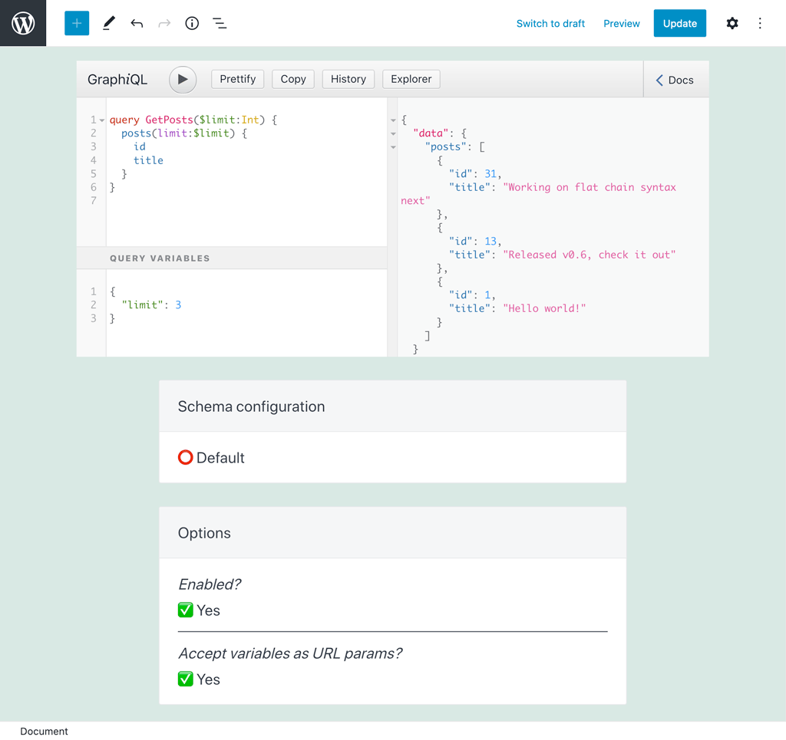
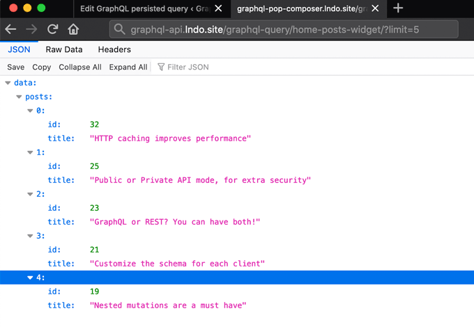

# Persisted Queries

Use GraphQL queries to create pre-defined enpoints as in REST, obtaining the benefits from both APIs.

## Description

With **REST**, you create multiple endpoints, each returning a pre-defined set of data.

| Advantages | Disadvantages |
| --- | --- |
| ✅ It's simple | ❌ It's tedious to create all the endpoints |
| ✅ Accessed via `GET` or `POST` | ❌ A project may face bottlenecks waiting for endpoints to be ready |
| ✅ Can be cached on the server or CDN | ❌ Producing documentation is mandatory |
| ✅ It's secure: only intended data is exposed | ❌ It can be slow (mainly for mobile apps), since the application may need several requests to retrieve all the data |

With **GraphQL**, you provide any query to a single endpoint, which returns exactly the requested data.

| Advantages | Disadvantages |
| --- | --- |
| ✅ No under/over fetching of data | ❌ Accessed only via `POST` |
| ✅ It can be fast, since all data is retrieved in a single request | ❌ It can't be cached on the server or CDN, making it slower and more expensive than it could be |
| ✅ It enables rapid iteration of the project | ❌ It may require to reinvent the wheel, such as uploading files or caching |
| ✅ It can be self-documented | ❌ Must deal with additional complexities, such as the N+1 problem |
| ✅ It provides an editor for the query (GraphiQL) that simplifies the task | &nbsp; |

**Persisted queries** combine these 2 approaches together:

- It uses GraphQL to create and resolve queries
- But instead of exposing a single endpoint, it exposes every pre-defined query under its own endpoint

Hence, we obtain multiple endpoints with predefined data, as in REST, but these are created using GraphQL, obtaining the advantages from each and avoiding their disadvantages:

<table>
<thead>
<tr>
    <th>Advantages</th>
    <th>Disadvantages</th>
</tr>
</thead>
<tbody>
<tr>
    <td>✅ Accessed via <code>GET</code> or <code>POST</code></td>
    <td><s>❌ It's tedious to create all the endpoints</s></td>
</tr>
<tr>
    <td>✅ Can be cached on the server or CDN</td>
    <td><s>❌ A project may face bottlenecks waiting for endpoints to be ready</s></td>
</tr>
<tr>
    <td>✅ It's secure: only intended data is exposed</td>
    <td><s>❌ Producing documentation is mandatory</s></td>
</tr>
<tr>
    <td>✅ No under/over fetching of data</td>
    <td><s>❌ It can be slow (mainly for mobile apps), since the application may need several requests to retrieve all the data</s></td>
</tr>
<tr>
    <td>✅ It can be fast, since all data is retrieved in a single request</td>
    <td><s>❌ Accessed only via <code>POST</code></s></td>
</tr>
<tr>
    <td>✅ It enables rapid iteration of the project</td>
    <td><s>❌ It can't be cached on the server or CDN, making it slower and more expensive than it could be</s></td>
</tr>
<tr>
    <td>✅ It can be self-documented</td>
    <td><s>❌ It may require to reinvent the wheel , such asuploading files or caching</s></td>
</tr>
<tr>
    <td>✅ It provides an editor for the query (GraphiQL) that simplifies the task</td>
    <td><s>❌ Must deal with additional complexities, such as the N+1 problem</s> 👈🏻 this issue is [resolved by the underlying engine](https://graphql-by-pop.com/docs/architecture/suppressing-n-plus-one-problem.html)</td>
</tr>
</tbody>
</table>

## Executing the Persisted Query

Once the persisted query is published, we can execute it via its permalink.

The persisted query can be executed directly in the browser, since it is accessed via `GET`, and we will obtain the requested data, in JSON format:

## Creating a Persisted Query

Clicking on the Persisted Queries link in the menu, it displays the list of all the created persisted queries:

A persisted query is a custom post type (CPT). To create a new persisted query, click on button "Add New GraphQL persisted query", which will open the WordPress editor:

The main input is the GraphiQL client, which comes with the Explorer by default. Clicking on the fields on the left side panel adds them to the query, and clicking on the "Run" button executes the query:

When the query is ready, publish it, and its permalink becomes its endpoint. The link to the endpoint (and to the source) is shown on the "Persisted Query Endpoint Overview" sidebar panel:

Appending `?view=source` to the permalink, it will show the persisted query and its configuration (as long as the user is logged-in and the user role has access to it):

By default, the persisted query's endpoint has path `/graphql-query/`, and this value is configurable through the Settings:

### Schema configuration

Defining what elements the schema contains, and what access will users have to it, is defined in the schema configuration.

So we must create a create a schema configuration, and then select it from the dropdown:

### Organizing Persisted Queries by Category

On the sidebar panel "Endpoint categories" we can add categories to help manage the Persisted Query:

For instance, we can create categories to manage endpoints by client, application, or any other required piece of information:

On the list of Persisted Queries, we can visualize their categories and, clicking on any category link, or using the filter at the top, will only display all entries for that category:

### Private persisted queries

By setting the status of the Persisted Query as `private`, the endpoint can only be accessed by the admin user. This prevents our data from being unintentionally shared with users who should not have access to the data.

For instance, we can create private Persisted Queries that help manage the application, such as retrieving data to create reports with our metrics.

### Password-protected persisted queries

If we create a Persisted Query for a specific client, we can assign a password to it, to provide an additional level of security that only that client will access the endpoint.

When first accessing a password-protected persisted query, we encounter a screen requesting the password:

Once the password is provided and validated, only then the user will access the intended endpoint.

### Making the persisted query dynamic via URL params

The value for each variable can be set via a URL param (with the variable name) when executing the persisted query. If option "Do URL params override variables?" is enabled, then the URL param will take priority. Otherwise, the value defined in the variables dictionary will take priority (if any).

For instance, in this query, the number of results is controlled via variable `$limit`, with a default value of 3:

When executing this persisted query, passing `?limit=5` will execute the query returning 5 results instead:

## Editor Inputs

These inputs in the body of the editor are shipped with the plugin (more inputs can be added by extensions):

<table>
<thead>
<tr>
    <th>Input</th>
    <th>Description</th>
</tr>
</thead>
<tbody>
<tr>
  <td><strong>Title</strong></td>
  <td>Persisted query's title</td>
</tr>
<tr>
  <td><strong>GraphiQL client</strong></td>
  <td>Editor to write and execute the GraphQL query: <ul><li>Write the query on the textarea</li><li>Declare variables inside the query, and declare their values on the variables input at the bottom</li><li>Click on the "Run" button to execute the query</li><li>Obtain the results on the input on the right side</li><li>Click on "Docs" to inspect the schema information</li></ul>The Explorer (shown only if module <code>GraphiQL Explorer</code> is enabled) allows to click on the fields, and these are automatically added to the query</td>
</tr>
<tr>
  <td><strong>Schema configuration</strong></td>
  <td>From the dropdown, select the schema configuration that applies to the persisted query, or one of these options: <ul><li><code>"Default"</code>: the schema configuration is the one selected on the plugin's Settings</li><li><code>"None"</code>: the persisted query will be unconstrained</li><li><code>"Inherit from parent"</code>: Use the same schema configuration as the parent persisted query. This option is available when module <code>API Hierarchy</code> is enabled, and the persisted query has a parent query (selected on the Document settings)</li></ul></td>
</tr>
<tr>
  <td><strong>Options</strong></td>
  <td>Customize the behavior of the persisted query: <ul><li><strong>Enabled?:</strong> If the persisted query is enabled. It's useful to disable a persisted query it's a parent query in an API hierarchy</li><li><strong>Do URL params override variables?:</strong> Allow URL params to override the values for variables defined in the GraphiQL client</li></ul></td>
</tr>
<tr>
  <td><strong>API Hierarchy:</strong></td>
  <td>Use the same query as the parent persisted query. This option is available when the persisted query has a parent query (selected on the Document settings)</td>
</tr>
</tbody>
</table>

These are the inputs in the Document settings:

| Input | Description |
| --- | --- |
| **Permalink** | The endpoint under which the persisted query will be available |
| **Categories** | Can categorize the persisted query. Eg: `mobile`, `app`, etc |
| **Excerpt** | Provide a description for the persisted query. This input is available when module `Excerpt as Description` is enabled |
| **Page attributes** | Select a parent persisted query. This input is available when module `API Hierarchy` is enabled |

<!-- ## Settings

| Option | Description | 
| --- | --- |
| **Endpoint base slug** | The base path for the custom endpoint URL. It defaults to `graphql-query` | -->

<!-- ## Resources

Video showing how to create a persisted query: <a href="https://vimeo.com/443790273" target="_blank">vimeo.com/443790273</a>. -->
