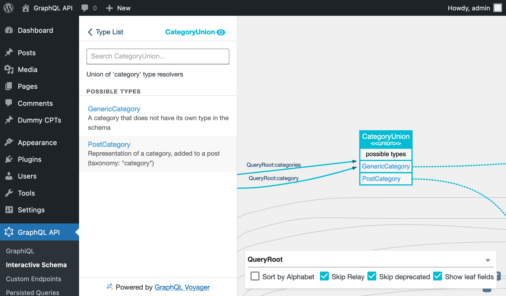
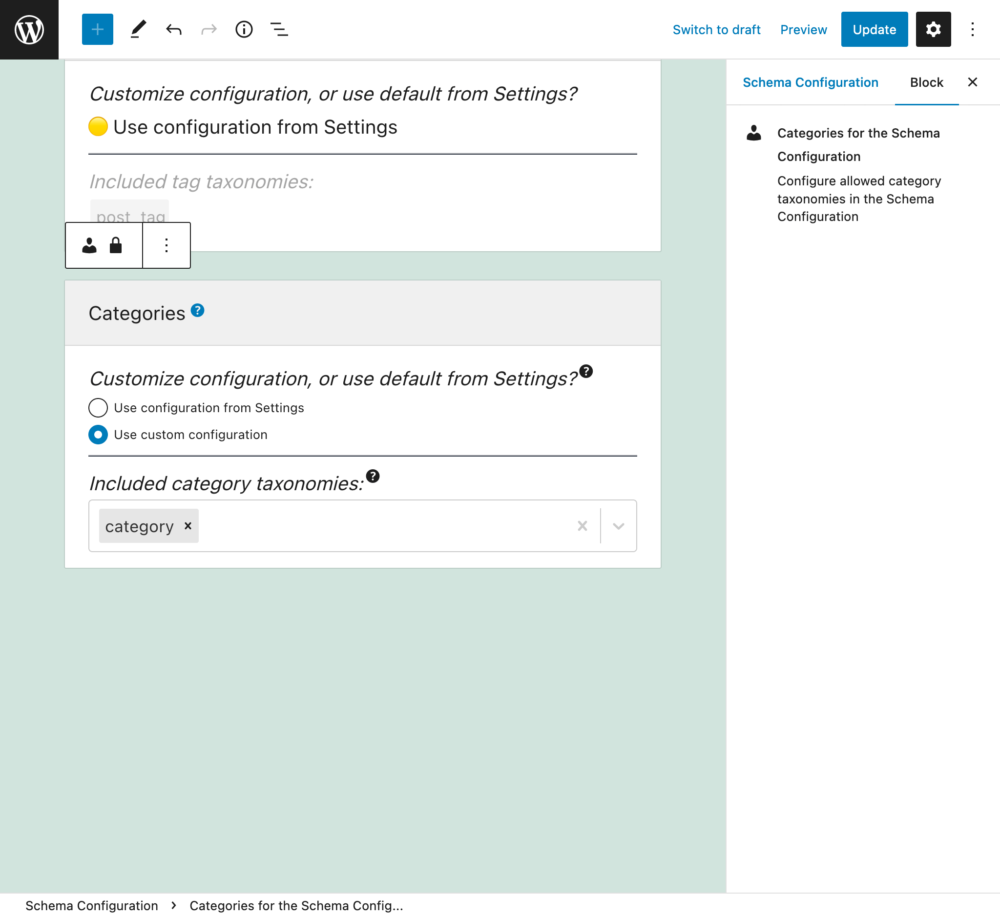
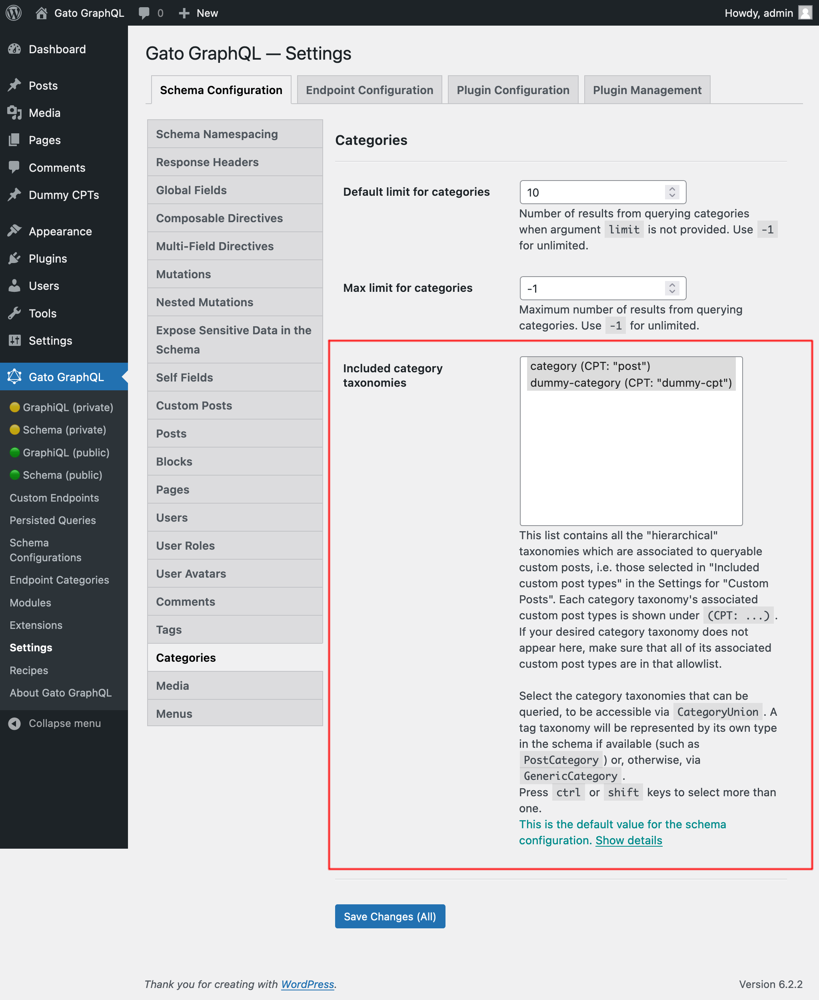
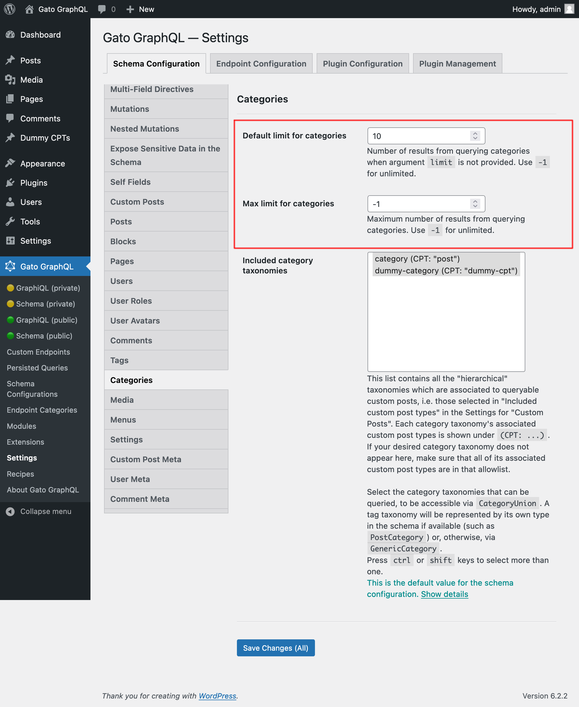

# Categories

Query post categories and custom categories

## Description

We can add categories to posts in WordPress (i.e. using the taxonomy with name `"category"`). This is already mapped in the GraphQL schema via the `PostCategory`, associated to a `Post` entry.

Custom Post Types defined by any theme or plugin (such as `"product"`) can likewise have their own category taxonomy associated to them (such as `"product-cat"`). As these category taxonomies don't ship their own specific type for the GraphQL schema (that would require an extension via PHP code), these are resolved via the `GenericCategory` type.

We use fields `category` and `categories` to fetch category data, which indicate which taxonomy they refer to via field argument `taxonomy`. The result is of the union type `CategoryUnion`, which includes entries from either `PostCategory` or `GenericCategory` (depending on the entry's taxonomy).



## Querying categories

This query retrieves categories with taxonomy `"product-category"`:

```graphql
{
  categories(taxonomy: "product-category") {
    __typename

    ...on Category {
      count
      description
      id
      name
      slug
      url
    }
    
    ...on GenericCategory {
      taxonomy   
      customPostCount
      customPosts {
        __typename
        ...on CustomPost {
          id
          title
        }
      }
    }
  }
}
```

Type `GenericCustomPost` has field `categories`, to retrieve the custom categories added to the custom post:

```graphql
{
  customPosts(
    filter: { customPostTypes: "product" }
  ) {
    __typename

    ... on GenericCustomPost {
      categories(taxonomy: "product-cat") {
        __typename
        id
        name
        taxonomy
      }
    }
  }
}
```

## Defining the allowed Category Taxonomies

The category taxonomies that can be queried must be explicitly configured. This can be done in 2 places.

In the Schema Configuration applied to the endpoint, by selecting option `"Use custom configuration"` under "Customize configuration? (Or use default from Settings?)" and then selecting the desired items:



_This list contains all the "hierarchical" taxonomies which are associated to queryable custom posts, i.e. those selected in "Included custom post types" in the Settings for "Custom Posts". If your desired category taxonomy does not appear here, make sure that all of its associated custom post types are in that allowlist._

Otherwise, the value defined under section "Included category taxonomies" in the Settings page for `Schema Custom Posts` is used:

<div class="img-width-1024" markdown=1>



</div>

## Additional configuration

Through the Settings for `Schema Categories`, we can also define:

- The default number of elements to retrieve (i.e. when field argument `limit` is not set) when querying for a list of any category taxonomy
- The maximum number of elements that can be retrieved in a single query execution

<div class="img-width-1024" markdown=1>



</div>
