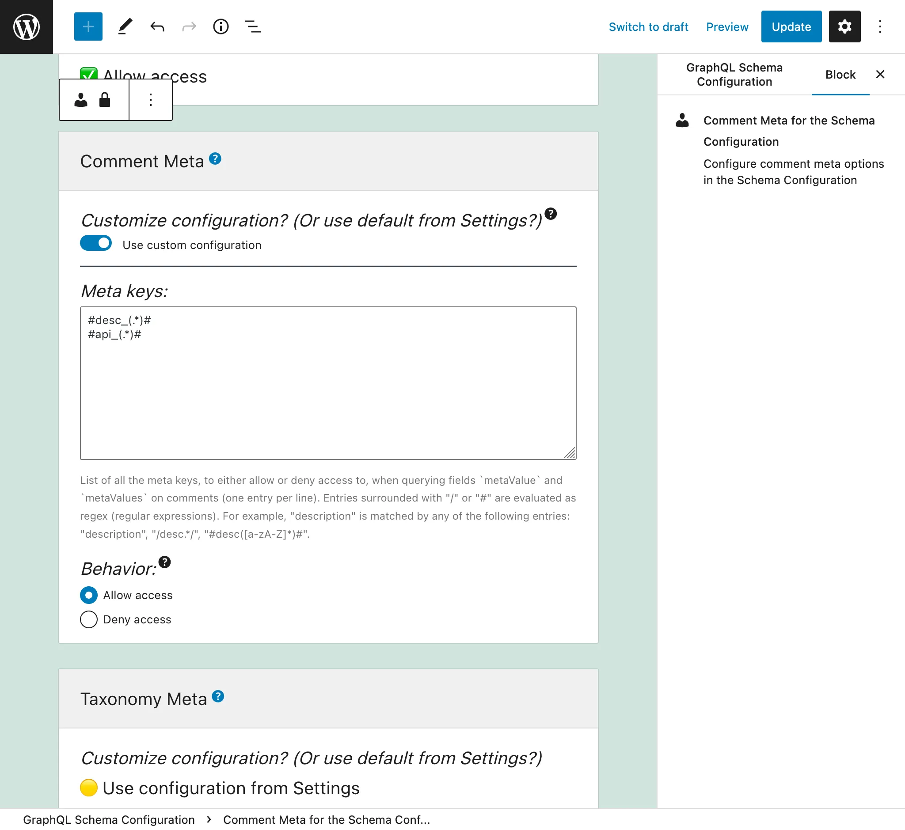
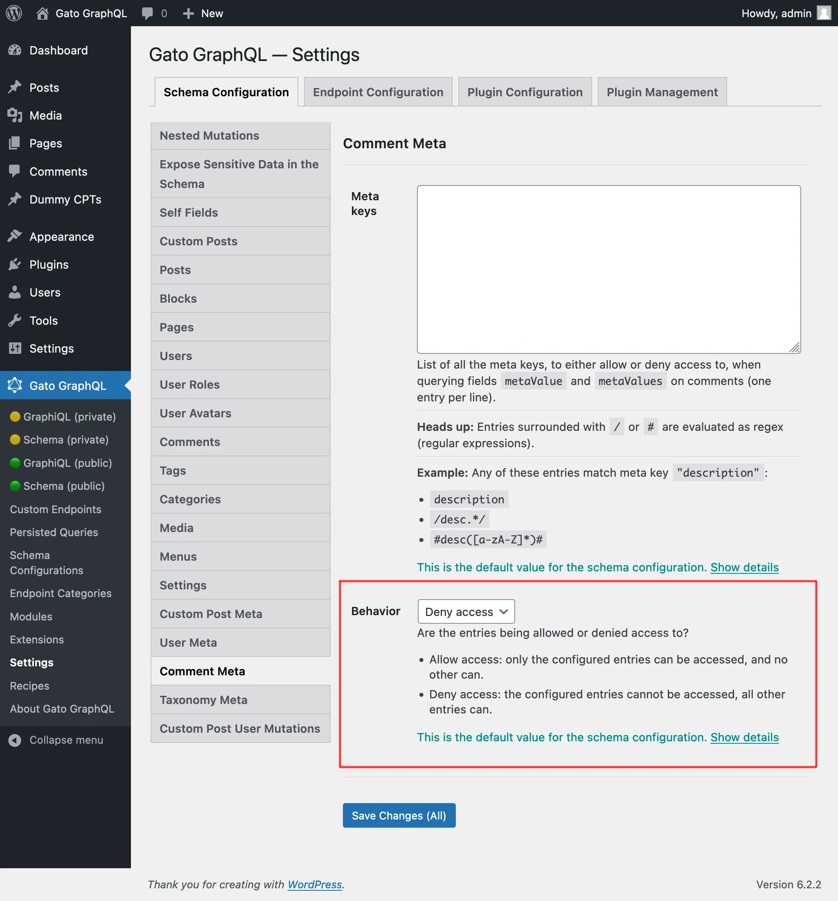

# Comment Meta

Retrieve meta values for comments, by querying fields `metaValue` and `metaValues`.

For security reasons, which meta keys can be queried must be explicitly configured. By default, the list is empty.

## Description

Query fields `metaValue` and `metaValues` on a comment, passing the required meta key as field argument `key`.

For instance, this query retrieves the comment's `description` meta value (as long as allowed by configuration):

```graphql
{
  posts {
    id
    comments {
      id
      description: metaValue(key: "description")
    }
  }
}
```

## Configuring the allowed meta keys

We must configure the list of meta keys that can be queried via the meta fields.

Each entry can either be:

- A regex (regular expression), if it's surrounded by `/` or `#`, or
- The full meta key, otherwise

For instance, any of these entries match meta key `"description"`:

- `description`
- `/desc.*/`
- `#desc([a-zA-Z]*)#`

There are 2 places where this configuration can take place, in order of priority:

1. Custom: In the corresponding Schema Configuration
2. General: In the Settings page

In the Schema Configuration applied to the endpoint, select option `"Use custom configuration"` and then input the desired entries:

<div class="img-width-1024" markdown=1>



</div>

Otherwise, the entries defined in the "Comment Meta" tab from the Settings will be used:

<div class="img-width-1024" markdown=1>


</div>

There are 2 behaviors, "Allow access" and "Deny access":

- **Allow access:** only the configured entries can be accessed, and no other can
- **Deny access:** the configured entries cannot be accessed, all other entries can

<div class="img-width-1024" markdown=1>



</div>

## Performance considerations

Fetching multiple meta keys for the same object requires a single database call.

However, every call to the database involves only 1 object.

When the query involves a large number of results, resolving the query could become slow.
