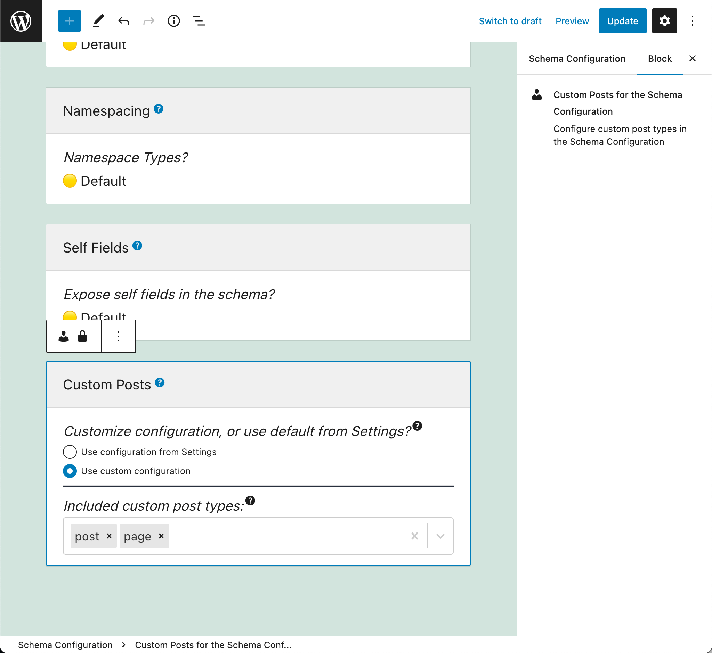
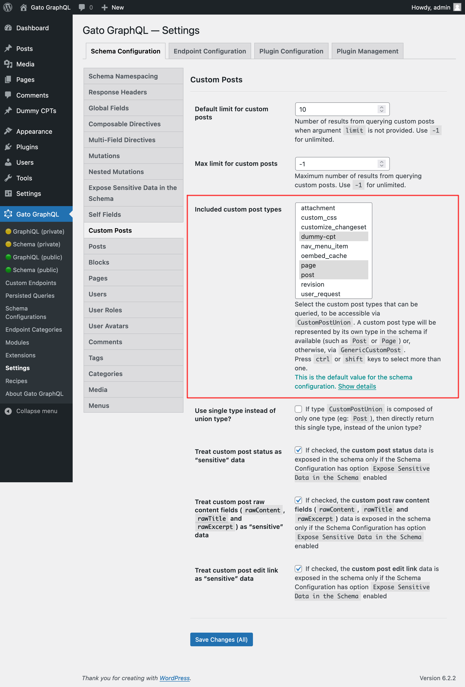
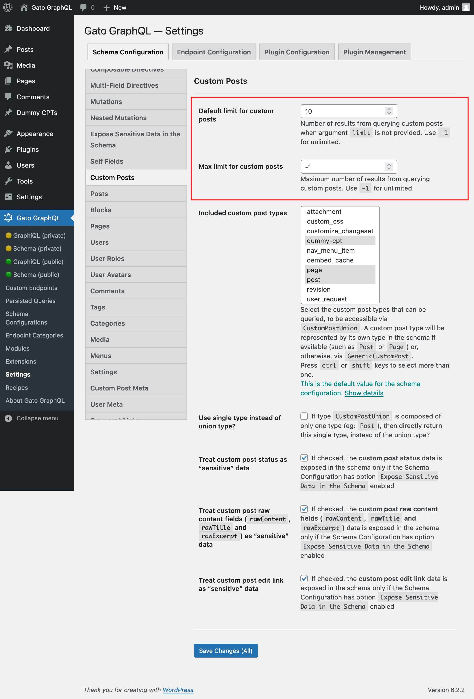
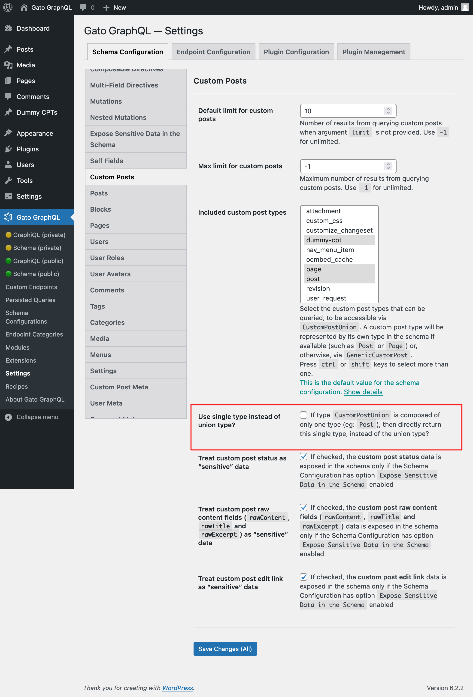

# Custom Posts

Query Custom Post Types

## Description

This module provides the basic schema functionality for custom posts, so it must also be enabled whenever any custom post entity (including posts, pages, or any Custom Post Type) is to be added to the schema.

It also provides type `CustomPostUnion`, which is used whenever an entity can return custom posts.

<div class="img-width-1024" markdown=1>


</div>

For instance, a comment can be added to a post, but also to a page and to a CPT, hence type `Comment` has field `customPost: CustomPostUnion!` (instead of field `post: Post!`) to retrieve the entity where the comment was added.

<div class="img-width-1024" markdown=1>


</div>

Because all Custom Posts implement interface `CustomPost`, we can retrieve data from `CustomPostUnion` using a fragment reference or an inline fragment:

```graphql
{
  comments {
    id
    date
    content
    customPost {
      __typename
      ...on CustomPost {
        id
        title
        url
      }
    }
  }
}
```

If we know that the comment was added to a post, we can also query fields specific to the `Post`:

```graphql
{
  comments {
    id
    date
    content
    customPost {
      __typename
      ...on CustomPost {
        id
        title
        url
      }
      ...on Post {
        categoryNames
      }
    }
  }
}
```

## Mapped and Unmapped CPTs

There are CPTs (such as `"post"` and `"page"`) which already have a corresponding GraphQL type in the schema (`Post` and `Page`), and these types are incorporated directly into `CustomPostUnion`.

For any CPT that has not been modeled in the schema (such as `"attachment"`, `"revision"` or `"nav_menu_item"`, or any CPT installed by any plugin), their data will be accessed via the `GenericCustomPost` type.

For instance, this query retrieves entries from multiple CPTS:

```graphql
{
  customPosts(
    filter: {
      customPostTypes: [
        "post",
        "page",
        "attachment",
        "nav_menu_item",
        "custom_css",
        "revision"
      ],
      status: [
        publish,
        inherit
      ]
    }
  ) {
    id
    title
    content
    status
    customPostType
    __typename
  }
}
```

## Defining the allowed Custom Post Types

The custom post types that can be queried must be explicitly configured. This can be done in 2 places.

In the Schema Configuration applied to the endpoint, by selecting option `"Use custom configuration"` under "Customize configuration? (Or use default from Settings?)" and then selecting the desired items:

<div class="img-width-1024" markdown=1>



</div>

Otherwise, the value defined under section "Included custom post types" in the Settings page for `Schema Custom Posts` is used:

<div class="img-width-1024" markdown=1>



</div>

## Additional configuration

Through the Settings page, we can also define:

- The default number of elements to retrieve (i.e. when field argument `limit` is not set) when querying for a list of any custom post type
- The maximum number of elements that can be retrieved in a single query execution

<div class="img-width-1024" markdown=1>



</div>

If there is only one type added to `CustomPostUnion` (eg: only `Post`), we can then have the fields that resolve to `CustomPostUnion` be instead resolved to that unique type instead:

<div class="img-width-1024" markdown=1>



</div>
