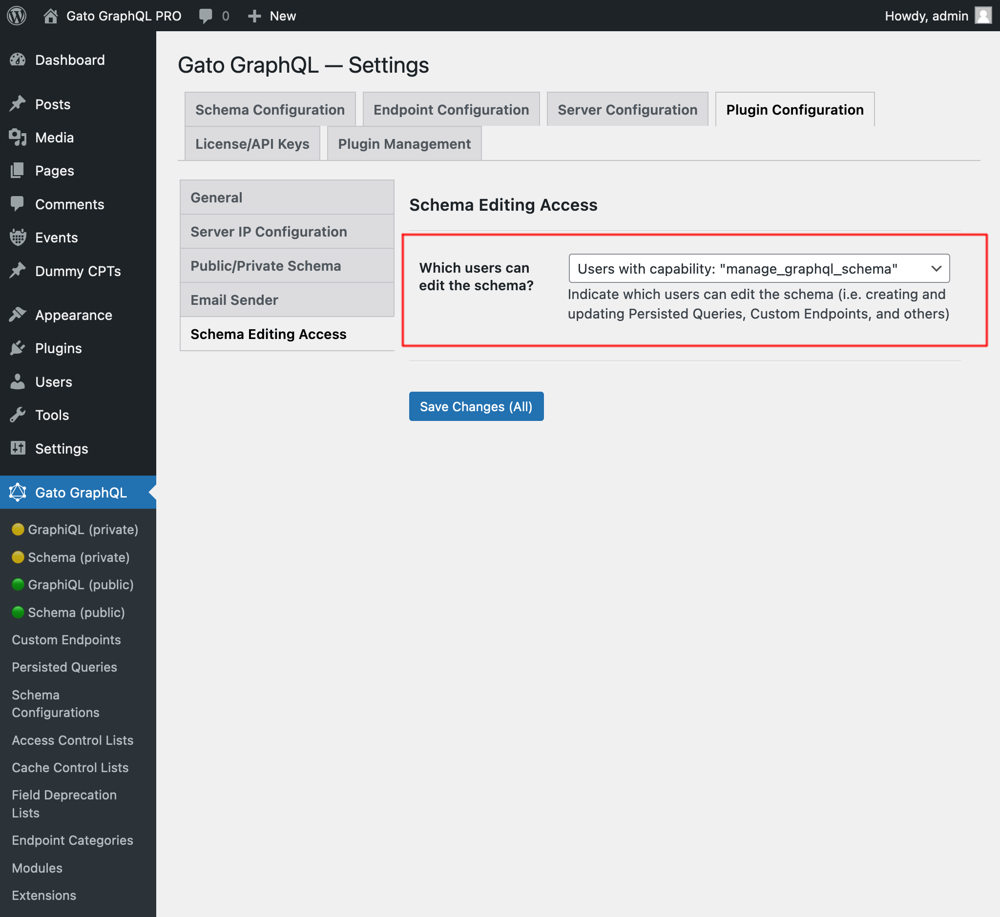

# Schema Editing Access

Grant access to users other than admins to edit the GraphQL schema

## Description

By default, only admin users (those with the `manage_options` capability) have access to the different screens of plugin Gato GraphQL in the admin.

This module `Schema Editing Access` enables to grant non-admin users access to the GraphiQL and Interactive schema clients in the admin, and to read and/or write the different Custom Post Types from this plugin:

- Persisted Queries
- Custom Endpoints
- Schema Configurations
- Access Control Lists
- Cache Control Lists
- Others

This is achieved via two different methods:

1. By assigning the custom capability `gatogql_manage_graphql_schema` to the user
2. By selecting the user roles that can edit the schema (down to the "Author" level)

<!-- The non-admin roles that can be selected are:

- Administrator (capability: `manage_options`)
- Editor (capability: `edit_others_posts`)
- Author (capability: `publish_posts`) -->

<!-- What permissions are given to non-admin users follows the same <a href="https://wordpress.org/support/article/roles-and-capabilities/#summary-of-roles" target="_blank">scheme as when editing posts in WordPress</a>, where users with different roles (`subscriber`, `contributor`, `author` and `editor`) have access to different capabilities:

| Role | Capabilities |
| --- | --- |
| Editor | Can publish and manage posts including the posts of other users |
| Author | Can publish and manage their own posts |
| Contributor | Can write and manage their own posts but cannot publish them |
| Subscriber | Can only read posts |

For instance, a contributor can create, but not publish, a persisted query:

-->

## How to use

Assign capability `gatogql_manage_graphql_schema` to any user role or any specific user that must be able to edit the schema.

(You can use a 3rd-party plugin to do this, such as [User Role Editor](https://wordpress.org/plugins/user-role-editor/).)

You can also select a group of user roles which can edit the GraphQL schema.

The appropriate configuration must be selected from the dropdown in the "Plugin Configuration > Schema Editing Access" tab on the Settings page:

- `Users with capability: "gatogql_manage_graphql_schema"`
- `Users with role: "administrator"`
- `Users with any role: "administrator", "editor"`
- `Users with any role: "administrator", "editor", "author"`

