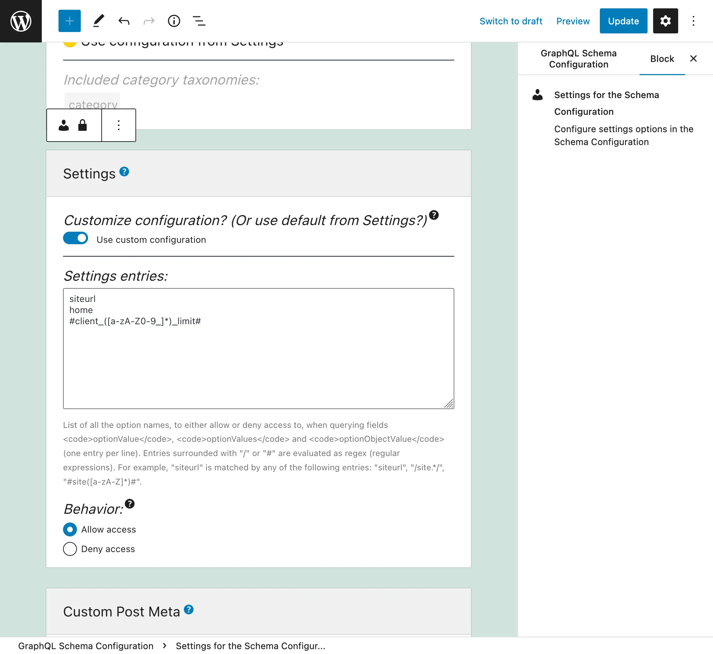
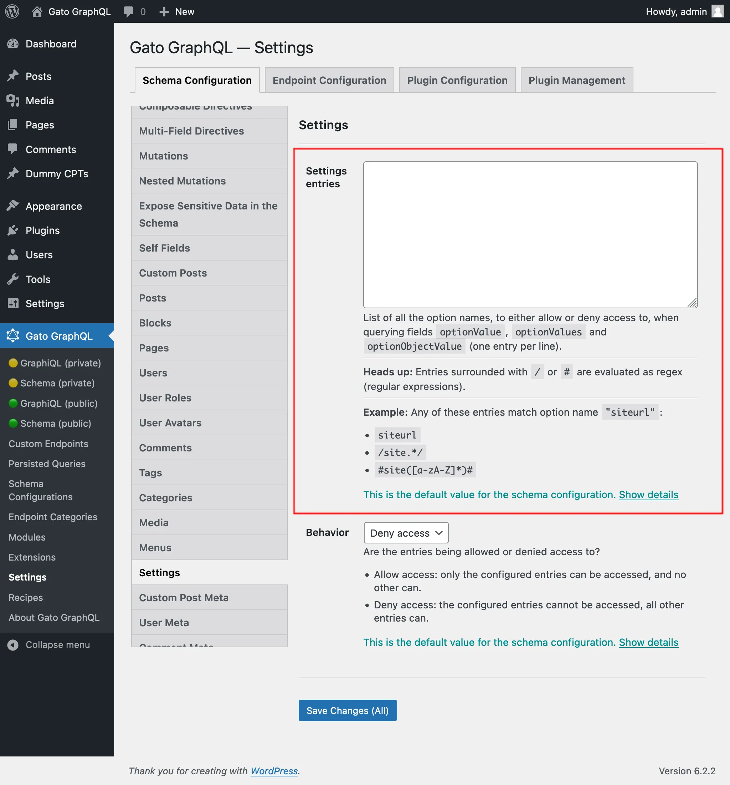
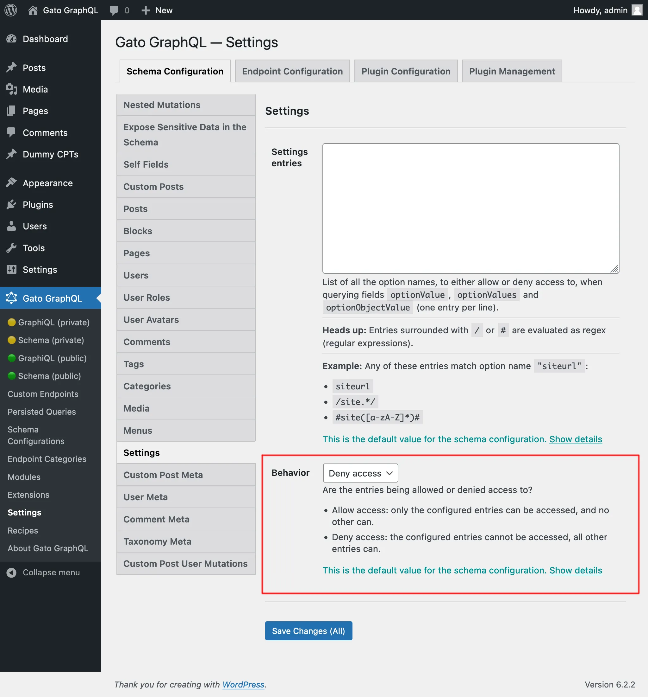

# Settings

Retrieve the settings from the site (stored in table `wp_options`), by querying fields `optionValue`, `optionValues`, `optionObjectValue`, `optionNames` and `options`.

For security reasons, which options can be queried must be explicitly configured.

## Description

The following `Root` fields receive argument `name` and retrieve the corresponding option from the `wp_options` table:

- `optionValue: AnyBuiltInScalar`
- `optionValues: [AnyBuiltInScalar]`
- `optionObjectValue: JSONObject`

For instance, this query retrieves the site's URL:

```graphql
{
  homeURL: optionValue(name: "home")
}
```

## Listing the allowed option names

Field `optionNames: [String!]!` returns the list of the allowed option names that are stored in the DB (any option that cannot be accessed is omitted from the list):

```graphql
{
  optionNames
}
```

It can receive an `IncludeExcludeFilterInput` argument `filterBy` to filter the returned names by those containing (`include`) or not containing (`exclude`) some string. For instance, this query returns all the allowed option names that contain `"blog"` in their name (such as `"blogname"` and `"blogdescription"`):

```graphql
{
  optionNames(filterBy: { include: "blog" })
}
```

## Retrieving multiple options at once

Field `options(names: [String!]!): JSONObject` returns a JSON object, with the option name as key and the option value as value, for the provided (allowed) option names:

```graphql
{
  options(names: ["blogname", "blogdescription"])
}
```

If any of the provided names cannot be accessed, an error is returned.

Both fields can be combined, feeding the result from `optionNames` as input to `options` (via the `$__optionNames` dynamic variable provided by the "Field to Input" module):

```graphql
{
  optionNames
  options(names: $__optionNames)
}
```

## Configure the allowed options

We must configure the list of option names that can be queried.

Each entry can either be:

- A regex (regular expression), if it's surrounded by `/` or `#`, or
- The full option name, otherwise

For instance, any of these entries match meta key `"siteurl"`:

- `siteurl`
- `/site.*/`
- `#site([a-zA-Z]*)#`

There are 2 places where this configuration can take place, in order of priority:

1. Custom: In the corresponding Schema Configuration
2. General: In the Settings page

In the Schema Configuration applied to the endpoint, select option `"Use custom configuration"` and then input the desired entries:

<div class="img-width-1024" markdown=1>



</div>

Otherwise, the entries defined in the "Settings" tab from the Settings will be used:

<div class="img-width-1024" markdown=1>



</div>

There are 2 behaviors, "Allow access" and "Deny access":

- **Allow access:** only the configured entries can be accessed, and no other can
- **Deny access:** the configured entries cannot be accessed, all other entries can

<div class="img-width-1024" markdown=1>



</div>

## Default options

When the plugin is installed, the following options are pre-defined to be accessible:

- `"siteurl"`
- `"home"`
- `"blogname"`
- `"blogdescription"`
- `"WPLANG"`
- `"posts_per_page"`
- `"comments_per_page"`
- `"date_format"`
- `"time_format"`
- `"blog_charset"`
