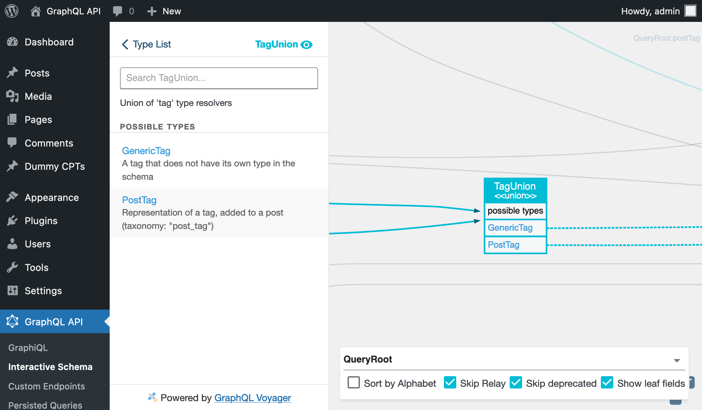
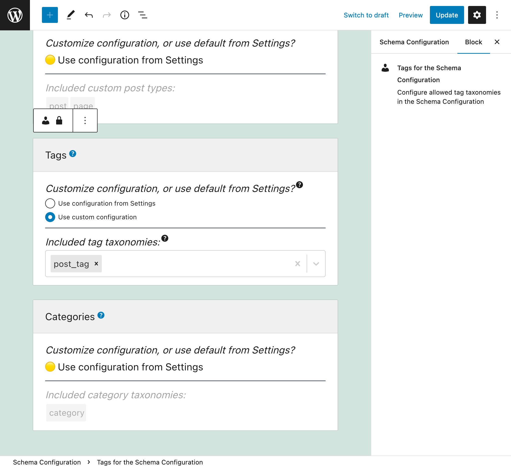
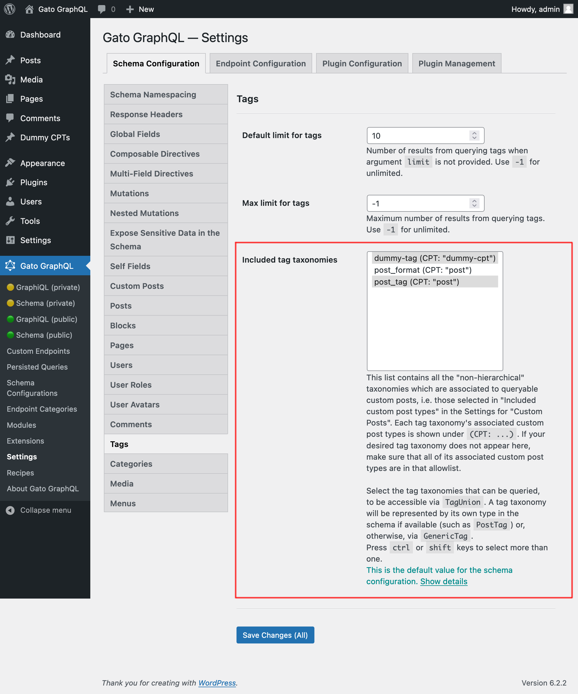
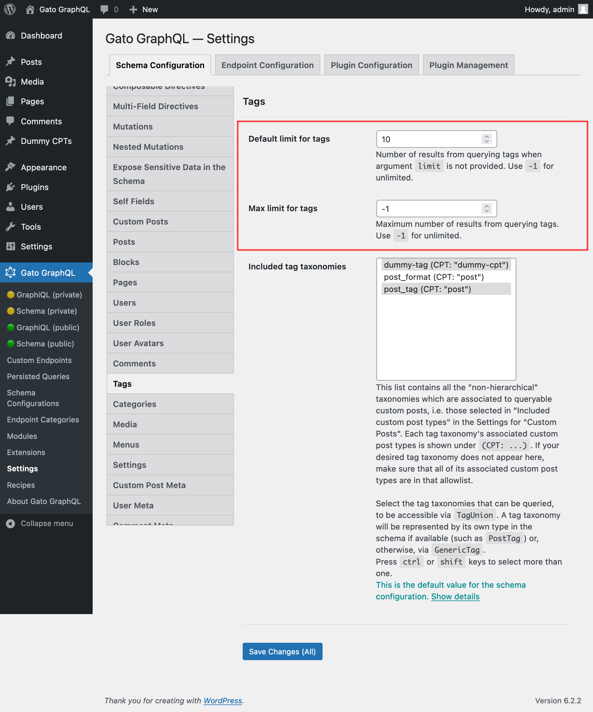

# Tags

Query post tags and custom tags

## Description

We can add tags to posts in WordPress (i.e. using the taxonomy with name `"post_tag"`). This is already mapped in the GraphQL schema via the `PostTag`, associated to a `Post` entry.

Custom Post Types defined by any theme or plugin (such as `"product"`) can likewise have their own tag taxonomy associated to them (such as `"product-tag"`). As these tag taxonomies don't ship their own specific type for the GraphQL schema (that would require an extension via PHP code), these are resolved via the `GenericTag` type.

We use fields `tag` and `tags` to fetch tag data, which indicate which taxonomy they refer to via field argument `taxonomy`. The result is of the union type `TagUnion`, which includes entries from either `PostTag` or `GenericTag` (depending on the entry's taxonomy).



## Querying tags

This query retrieves tags with taxonomy `"product-tag"`:

```graphql
{
  tags(taxonomy: "product-tag") {
    __typename

    ...on Tag {
      count
      description
      id
      name
      slug
      url
    }
    
    ...on GenericTag {
      taxonomy   
      customPostCount
      customPosts {
        __typename
        ...on CustomPost {
          id
          title
        }
      }
    }
  }
}
```

Type `GenericCustomPost` has field `tags`, to retrieve the custom tags added to the custom post:

```graphql
{
  customPosts(
    filter: { customPostTypes: "product" }
  ) {
    __typename

    ... on GenericCustomPost {
      tags(taxonomy: "product-tag") {
        __typename
        id
        name
        taxonomy
      }
    }
  }
}
```

## Defining the allowed Tag Taxonomies

The tag taxonomies that can be queried must be explicitly configured. This can be done in 2 places.

In the Schema Configuration applied to the endpoint, by selecting option `"Use custom configuration"` under "Customize configuration? (Or use default from Settings?)" and then selecting the desired items:



_This list contains all the "non-hierarchical" taxonomies which are associated to queryable custom posts, i.e. those selected in "Included custom post types" in the Settings for "Custom Posts". If your desired tag taxonomy does not appear here, make sure that all of its associated custom post types are in that allowlist._

Otherwise, the value defined under section "Included tag taxonomies" in the Settings page for `Schema Custom Posts` is used:

<div class="img-width-1024" markdown=1>



</div>

## Additional configuration

Through the Settings for `Schema Tags`, we can also define:

- The default number of elements to retrieve (i.e. when field argument `limit` is not set) when querying for a list of any tag taxonomy
- The maximum number of elements that can be retrieved in a single query execution

<div class="img-width-1024" markdown=1>



</div>
