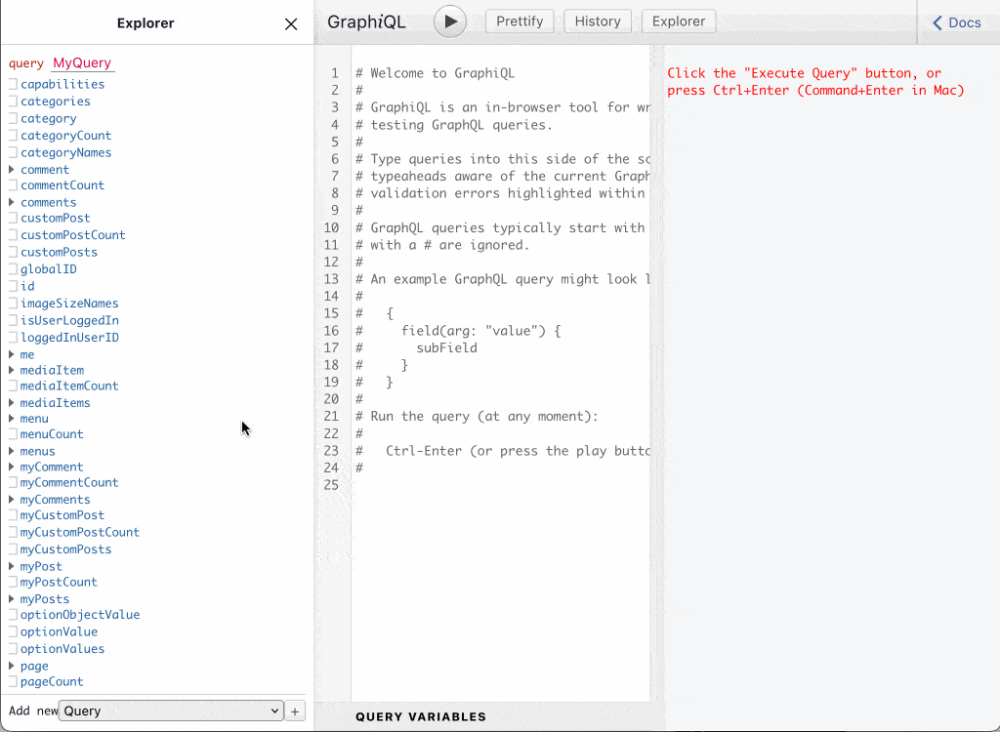
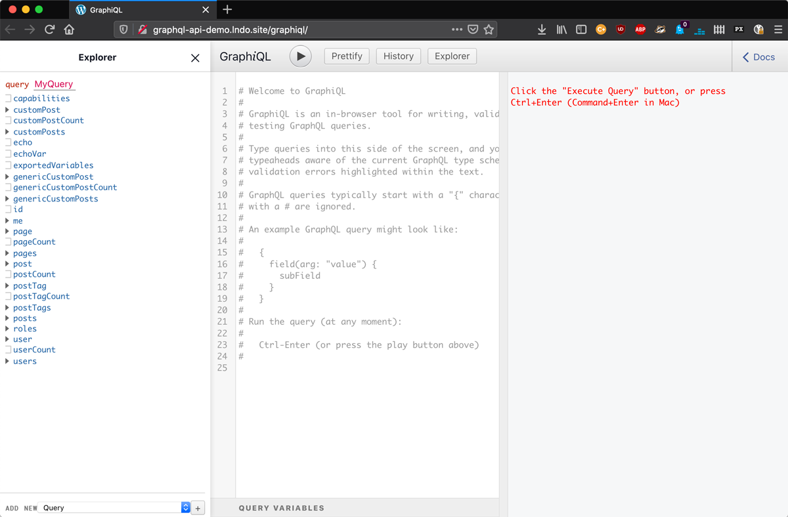
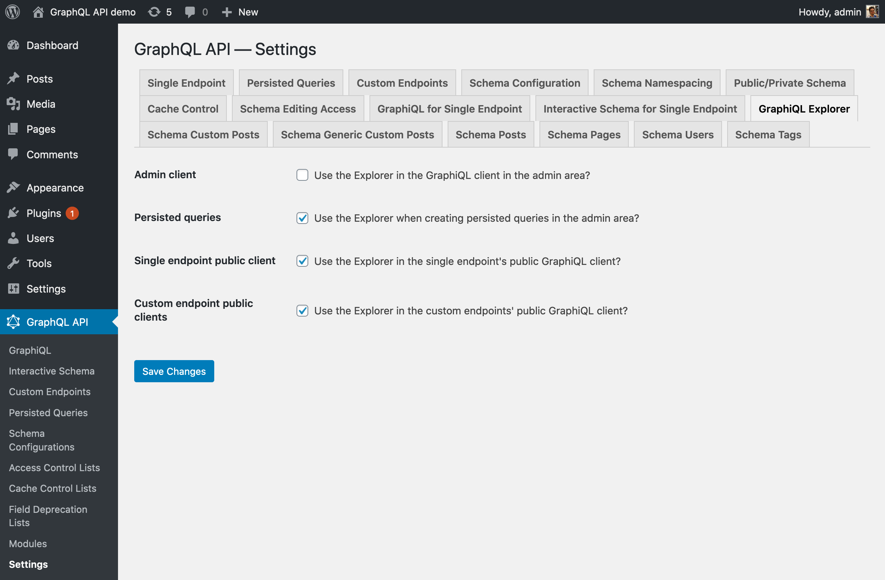
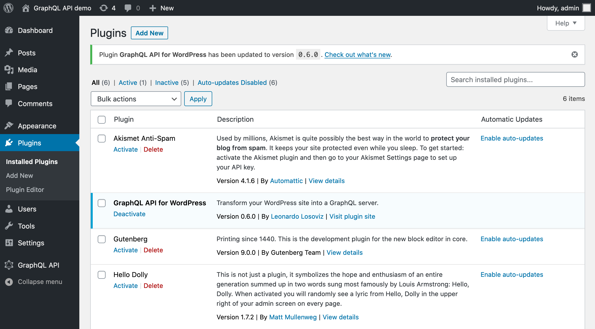
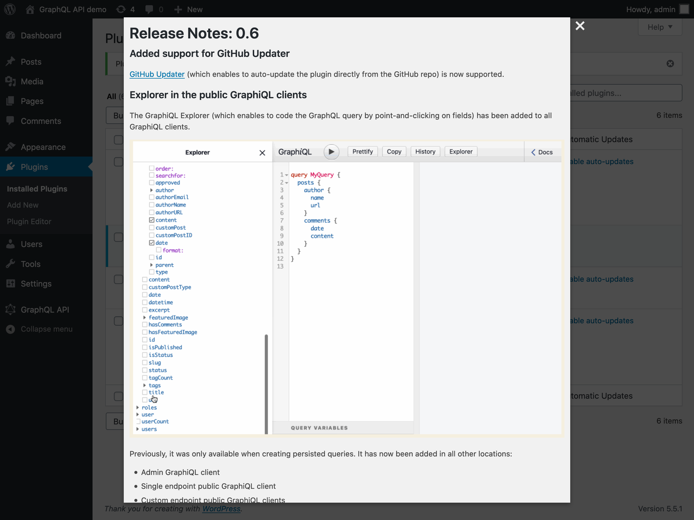

# Release Notes: 0.6

## Added support for GitHub Updater

You can now use [GitHub Updater](https://github.com/afragen/github-updater/) to auto-update the plugin directly from the GitHub repo.

## Explorer in the public GraphiQL clients

The GraphiQL Explorer enables to code the GraphQL query by point-and-clicking on fields:

<div class="img-width-1024" markdown=1>



</div>

Previously, it was only available on the GraphiQL client for creating persisted queries. It has now been also added in the other locations:

- Admin GraphiQL client
- Single endpoint public GraphiQL client
- Custom endpoint public GraphiQL clients

<div class="img-width-1024" markdown=1>



</div>

Enabled by default, the GraphiQL Explorer can be disabled for selected clients via the Settings:

<div class="img-width-1024" markdown=1>



</div>

## Embeddable fields

Embeddable fields is a syntax construct for the GraphQL query, which is currently not part of the GraphQL spec.

It enables to resolve a field within an argument for another field from the same type, using syntax `{{ fieldName }}`.

For instance, this query produces a string containing the values from several fields:

```graphql
query {
  posts {
    description: echoStr(value: "'{{ title }}' was posted on {{ date }}")
  }
}
```

The embedded field can also include arguments, using `{{ fieldName(fieldArgs) }}`, and be used within directive arguments.

For instance, this query changes the title of the post depending on the post having comments or not, and formats the date as `"d/m/Y"`:

```graphql
query {
  posts {
    title: echoStr(value: "({{ commentCount }}) {{ title }} - posted on {{ date(format: \"d/m/Y\") }}") @include(if: "{{ hasComments }}")
    title @skip(if: "{{ hasComments }}")
  }
}
```

By default, the `Embeddable fields` module is disabled; you must click on `"Enable"` in the `Modules` page.

Read more about this new functionality on link `"View details"` from the `Embeddable fields` module.

## Plugin now runs on PHP 7.1 (for production)

The plugin code is transpiled via [Rector](https://github.com/rectorphp/rector/) when generating the installable plugin.

Now, the PHP requirements are:

- PHP 8.1+ for development
- PHP 7.2+ for production

This enables the plugin to make use of the latest features from PHP, while not restricting its userbase.

The list of supported PHP features is [on the project's GitHub repo](https://github.com/GraphQLAPI/graphql-api-for-wp#supported-php-features).

## PHPStan upgraded to level 8

[PHPStan](https://phpstan.org/) is a static analysis tool to avoid bugs. It has been upgraded to level 8 (the strictest level).

## New About page

A new About page has been added containing:

- Information on how to fund the project
- The Slack workspace for support
- The list of the release notes for each version

## Release notes

Starting from this version, immediately after updating the plugin, an admin notice will display a link to read the release notes for the new version:

<div class="img-width-1024" markdown=1>



</div>

When clicking on the link, the release notes are shown on a modal window:

<div class="img-width-1024" markdown=1>



</div>
