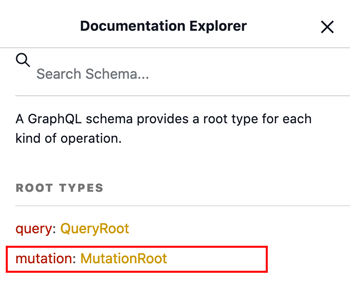
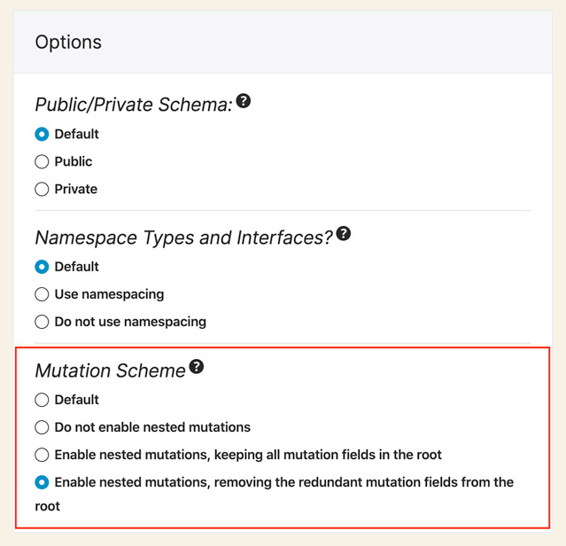

# Release Notes: 0.7

## Mutations

Added support for [GraphQL mutations](https://graphql.org/learn/queries/#mutations)!



Through mutations, you are now able to modify data through your GraphQL queries:

```graphql
mutation {
  updatePost(id: 5, title: "New title") {
    title
  }
}
```

## New mutation fields

The following mutation fields have been added to the schema:

- `createPost`
- `updatePost`
- `setFeaturedImageforCustomPost`
- `removeFeaturedImageforCustomPost`
- `addCommentToCustomPost`
- `replyComment`
- `loginUser`
- `logoutUser`

## Nested mutations

Nested mutations is the ability to perform mutations on a type other than the root type in GraphQL.

For instance, the mutation query from above can also be executed through this nested mutation, on type `Post`:

```graphql
mutation {
  post(id: 5) {
    update(title: "New title") {
      title
    }
  }
}
```

Mutations can also modify data on the result from another mutation:

```graphql
mutation {
  createPost(title: "First title") {
    id
    update(title: "Second title", contentAs: { html: "Some content" } ) {
      title
      content
      addComment(commentAs: { html: "My first comment" }) {
        id
        content
        date
      }
    }
  }
}
```

Nested mutations have been [requested for the GraphQL spec](https://github.com/graphql/graphql-spec/issues/252) but not yet approved, hence Gato GraphQL adds support for them as an opt-in feature, via module "Nested Mutations" (which must be enabled).

Nested mutations change the root type, from `QueryRoot` and `MutationRoot`, to a single `Root` type handling both queries and mutations:


In addition, a "Mutation Scheme" section has been added to a Schema Configuration, allowing to enable/disable nested mutations for a specific Custom Endpoint or Persisted Query.

<div class="img-width-620" markdown=1>



</div>

## New nested mutation fields

The following nested mutation fields have been added to the schema:

- `CustomPost.update`
- `CustomPost.setFeaturedImage`
- `CustomPost.removeFeaturedImage`
- `CustomPost.addComment`
- `Comment.reply`

## Support for PHP 8.1

Starting from this version, the plugin runs without any issue in PHP 8.1.
