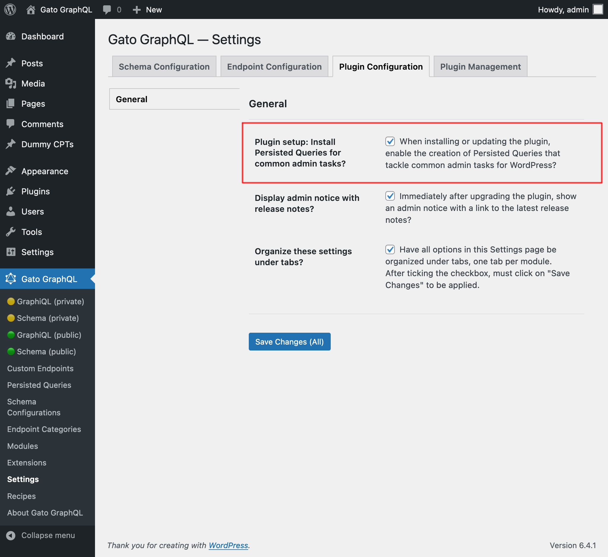

# Release Notes: 1.1

Here's a description of all the changes.

## Tested with WordPress 6.4

The plugin has been tested with WordPress 6.4, and the corresponding entry in the plugin's header (`"Tested up to"`) has been updated.

## Install setup data: Private "Nested mutations" Custom Endpoint

A "Nested mutations" custom endpoint is already created by the plugin, with a "private" status (i.e. it is accessible only within the wp-admin).

This makes it convenient to compose and execute queries that make use of nested mutations (such as for doing bulk updates) for our internal tasks.

## Install setup data: Private Persisted Queries for common admin tasks

Several private persisted queries are already created by the plugin, handling common admin tasks:

- Fetch posts by thumbnail
- Fetch users by locale
- Fetch comments by period
- Fetch images in `core/image` blocks
- Duplicate post
- Duplicate posts in bulk
- Replace strings in post
- Replace string in posts in bulk
- Regex replace strings in post
- Regex replace string in posts in bulk
- Add missing links in post
- Replace `http` with `https` in post
- Replace and old domain with a new domain in posts in bulk
- Replace an old post slug with a new post slug in posts in bulk
- Insert a block in posts in bulk
- Remove a block from posts in bulk
- Translate post
- Translate posts in bulk
- Import a post from another WordPress site
- (Webhook for InstaWP) Register a new subscriber on Mailchimp (change status from `"draft"` to `"publish` to enable it)

## Added Settings to enable or disable installing the setup data

An option to enable/disable the installation of the setup data (i.e. the predefined custom endpoints and persisted queries described above) has been added to the Settings page, under "Plugin Configuration > General > Plugin setup: Install Persisted Queries for common admin tasks?":

<div class="img-width-1024" markdown=1>



</div>

Alternatively, we can define this value in `wp-config.php`:

```php
define( 'GATOGRAPHQL_INSTALL_PLUGIN_SETUP_DATA', false );
```

## Added `AnyStringScalar` wildcard scalar type

A new wildcard scalar type `AnyStringScalar` has been introduced, to represent every scalar type that is represented via a string (eg: `HTML`, `Email`, etc).

This is to enable directives performing operations on strings (such as `@strReplace`) to accept being applied to any of these fields.

## Purge container when autoupdating a depended-upon plugin

When executing a plugin update from the WP dashboard, if the plugin is a dependency by a Gato GraphQL extension, then the service container will be purged. This avoid a potential exception thrown when the plugin's new version has incompatible code with the previous version.
