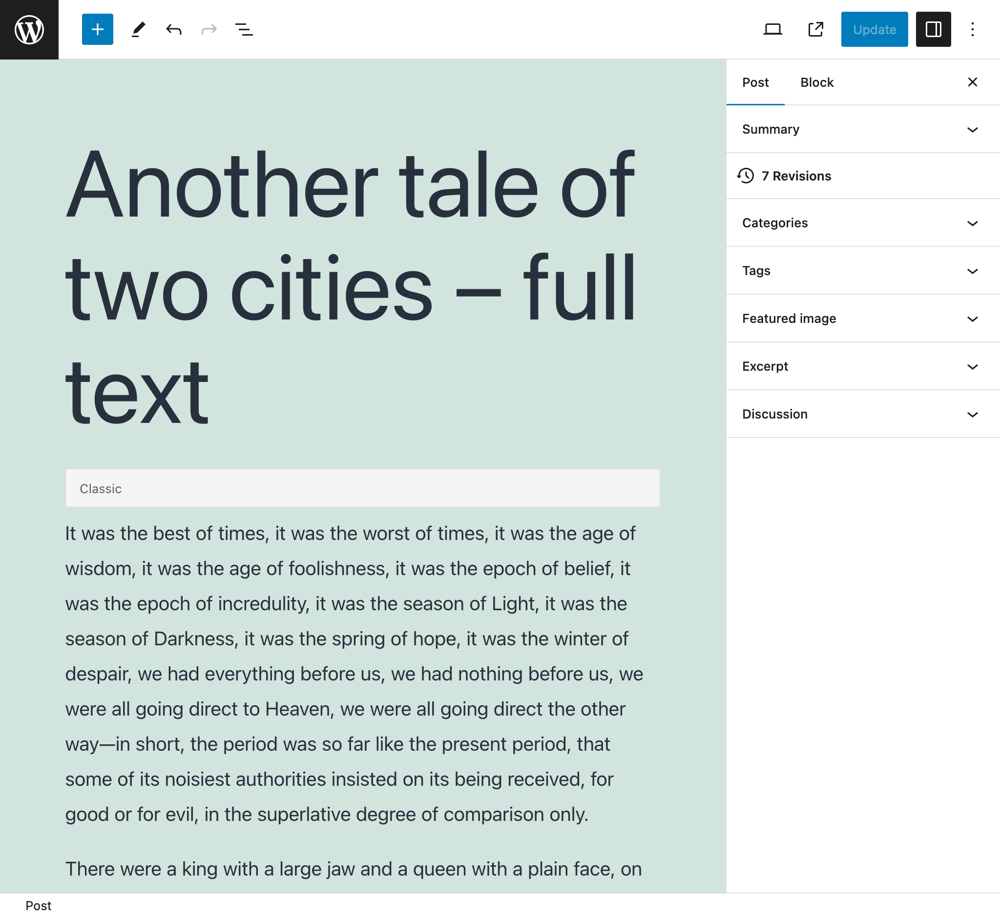
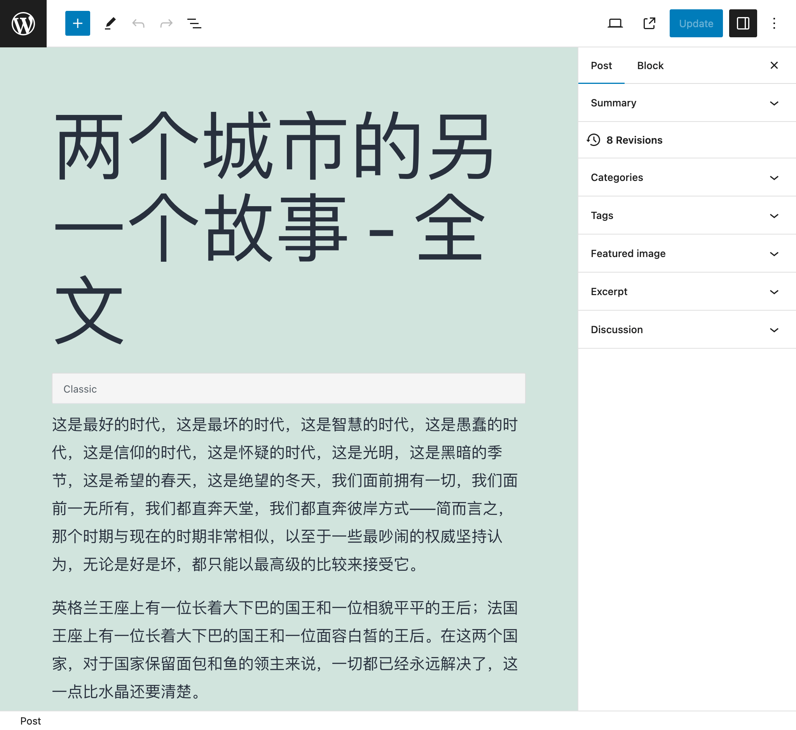
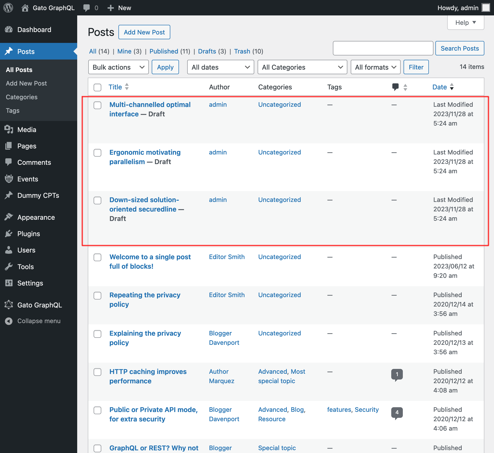

# Release Notes: 1.2

Here's a description of all the changes.

## Added several predefined Persisted Queries

The following Persisted Queries, to execute common admin tasks, are now provided:

### Translate content from URL

Given a URL as input, its language, and what language to translate it to, fetches the content from the URL and performs the translation using Google Translate:

```graphql
query TranslateContent(
  $url: URL!
  $fromLang: String!
  $toLang: String!
) {
  _sendHTTPRequest(input: {
    url: $url,
    method: GET
  }) {
    body
    translated: body @strTranslate(
      from: $fromLang
      to: $toLang
    )
  }
}
```

For instance, passing the [URL of some Markdown file in a GitHub repo](https://raw.githubusercontent.com/GatoGraphQL/GatoGraphQL/c870d8906ae1aec3c81acc039c53acc7aab5dff0/layers/GatoGraphQLForWP/plugins/gatographql/docs/modules/single-endpoint/en.md), and language code `"es"`:

```json
{
  "url": "https://raw.githubusercontent.com/GatoGraphQL/GatoGraphQL/c870d8906ae1aec3c81acc039c53acc7aab5dff0/layers/GatoGraphQLForWP/plugins/gatographql/docs/modules/single-endpoint/en.md",
  "fromLang": "en",
  "toLang": "es"
}
```

...will translate the Markdown content to Spanish:

```json
{
  "data": {
    "_sendHTTPRequest": {
      "body": "# Single Endpoint\n\nExecute queries against the GraphQL server through the public single endpoint.\n\nBy default the endpoint is `/graphql/`, and the path can be configured through the Settings.\n\n\n\nThe GraphQL single endpoint can be configured by assigning a Schema Configuration to it. To do this, on section \"Schema Configuration\" select the desired entry from the dropdown for \"Schema Configuration for the Single Endpoint\":\n\n<div class=\"img-width-1024\" markdown=1>\n\n\n\n</div>\n\n## Clients\n\nInteract with the single endpoint via the available clients.\n\n### GraphiQL\n\nIf module \"GraphiQL for Single Endpoint\" is enabled, then the single endpoint's GraphiQL client becomes publicly available.\n\nTo open it, click on link \"🟢 GraphiQL (public)\" on the plugin's menu:\n\n<div class=\"img-width-1024\" markdown=1>\n\n\n\n</div>\n\nBy default, the client is exposed under `/graphiql/`. This path can be modified on the Settings, under tab \"GraphiQL for Single Endpoint\":\n\n<div class=\"img-width-1024\" markdown=1>\n\n\n\n</div>\n\n### Interactive Schema (Voyager)\n\nIf module \"Interactive Schema for Single Endpoint\" is enabled, then the single endpoint's Voyager client becomes publicly available.\n\nTo open it, click on link \"🟢 Schema (public)\" on the plugin's menu:\n\n<div class=\"img-width-1024\" markdown=1>\n\n\n\n</div>\n\nBy default, the client is exposed under `/schema/`. This path can be modified on the Settings, under tab \"Interactive Schema for Single Endpoint\":\n\n<div class=\"img-width-1024\" markdown=1>\n\n\n\n</div>\n",
      "translated": "# Punto final único\n\nEjecute consultas en el servidor GraphQL a través del punto final único público.\n\nDe forma predeterminada, el punto final es `/graphql/` y la ruta se puede configurar a través de Configuración.\n\n\n\nEl punto final único GraphQL se puede configurar asignándole una configuración de esquema. Para hacer esto, en la sección \"Configuración del esquema\", seleccione la entrada deseada del menú desplegable para \"Configuración del esquema para el punto final único\":\n\n<div class=\"img-width-1024\" descuento=1>\n\n\n\n</div>\n\n## Clientes\n\nInteractúe con el punto final único a través de los clientes disponibles.\n\n### GrafiQL\n\nSi el módulo \"GraphiQL para punto final único\" está habilitado, el cliente GraphiQL del punto final único estará disponible públicamente.\n\nPara abrirlo, haga clic en el enlace \"🟢 GraphiQL (público)\" en el menú del complemento:\n\n<div class=\"img-width-1024\" descuento=1>\n\n\n\n</div>\n\nDe forma predeterminada, el cliente está expuesto en `/graphiql/`. Esta ruta se puede modificar en Configuración, en la pestaña \"GraphiQL para punto final único\":\n\n<div class=\"img-width-1024\" descuento=1>\n\n\n\n</div>\n\n### Esquema interactivo (Voyager)\n\nSi el módulo \"Esquema interactivo para punto final único\" está habilitado, el cliente Voyager del punto final único estará disponible públicamente.\n\nPara abrirlo, haga clic en el enlace \"🟢 Esquema (público)\" en el menú del complemento:\n\n<div class=\"img-width-1024\" descuento=1>\n\n\n\n</div>\n\nDe forma predeterminada, el cliente está expuesto en `/schema/`. Esta ruta se puede modificar en Configuración, en la pestaña \"Esquema interactivo para punto final único\":\n\n<div class=\"img-width-1024\" descuento=1>\n\n\n\n</div>\n"
    }
  }
}
```

It has been added to the Recipes section too, under "Translating content from URL".

### Translate post (Classic editor), and Translate posts (Classic editor)

There already were persisted queries "Translate post" and "Translate posts" (in bulk), which deal with translating all the properties inside the Gutenberg blocks in the post.

These have been duly renamed as "Translate post (Gutenberg)" and "Translate posts (Gutenberg)", and new persisted queries have been added to translate content for the Classic editor:

- **Translate post (Classic editor)**: Translate a single post
- **Translate posts (Classic editor)**: Translate multiple posts, in bulk

All these queries translate content by calling the Google Translate API, sending all the data within a single request.

Then, if using query "Translate posts (Classic editor)" to translate 5 posts, all data (title, content and excerpt) for all 5 posts is sent all together, providing a rich context that produces a greater accuracy in the translation.

For instance, after translating this post from English to Chinese:

<div class="img-width-1024" markdown=1>



</div>

...it became this:

<div class="img-width-1024" markdown=1>



</div>

### Import post from WordPress RSS feed

It reads the WordPress RSS feed for a post, and creates a new post with its data.

For instance, the query will parse the following RSS feed for a single post (normally accessible under `https://mysite.com/post-slug/feed/rss/?withoutcomments=1`):

```xml
<?xml version="1.0" encoding="UTF-8"?>
<rss version="2.0"
  xmlns:content="http://purl.org/rss/1.0/modules/content/"
  xmlns:wfw="http://wellformedweb.org/CommentAPI/"
  xmlns:dc="http://purl.org/dc/elements/1.1/"
  xmlns:atom="http://www.w3.org/2005/Atom"
  xmlns:sy="http://purl.org/rss/1.0/modules/syndication/"
  xmlns:slash="http://purl.org/rss/1.0/modules/slash/"
>
  <channel>
    <title>A tale of two cities &#8211; teaser &#8211; PoP API Demo</title>
    <atom:link href="https://mysite.com/blogroll/a-tale-of-two-cities-teaser/feed/?withoutcomments=1" rel="self" type="application/rss+xml" />
    <link>https://mysite.com</link>
    <description>Just another WordPress site</description>
    <lastBuildDate>Tue, 20 Jul 2021 23:03:59 +0000</lastBuildDate>
    <language>en-US</language>
    <sy:updatePeriod>hourly</sy:updatePeriod>
    <sy:updateFrequency>1	</sy:updateFrequency>
    <generator>https://wordpress.org/?v=6.1.1</generator>
    <item>
      <title>A tale of two cities &#8211; teaser</title>
      <link>https://mysite.com/blogroll/a-tale-of-two-cities-teaser/</link>
      <comments>https://mysite.com/blogroll/a-tale-of-two-cities-teaser/#comments</comments>
      <dc:creator><![CDATA[leo]]></dc:creator>
      <pubDate>Mon, 21 Dec 2020 08:24:18 +0000</pubDate>
      <category><![CDATA[Blogroll]]></category>
      <category><![CDATA[championship]]></category>
      <category><![CDATA[book]]></category>
      <guid isPermaLink="false">https://mysite.com/?p=1657</guid>
      <description></description>
      <content:encoded><![CDATA[
<p>It was the best of times, it was the worst of times, it was the age of wisdom, it was the age of foolishness, it was the epoch of belief, it was the epoch of incredulity, it was the season of Light, it was the season of Darkness, it was the spring of hope, it was the winter of despair, we had everything before us, we had nothing before us, we were all going direct to Heaven, we were all going direct the other way—in short, the period was so far like the present period, that some of its noisiest authorities insisted on its being received, for good or for evil, in the superlative degree of comparison only.</p>
<p>There were a king with a large jaw and a queen with a plain face, on the throne of England; there were a king with a large jaw and a queen with a fair face, on the throne of France. In both countries it was clearer than crystal to the lords of the State preserves of loaves and fishes, that things in general were settled for ever.</p>
<p>It was the year of Our Lord one thousand seven hundred and seventy-five. Spiritual revelations were conceded to England at that favoured period, as at this. Mrs. Southcott had recently attained her five-and-twentieth blessed birthday, of whom a prophetic private in the Life Guards had heralded the sublime appearance by announcing that arrangements were made for the swallowing up of London and Westminster. Even the Cock-lane ghost had been laid only a round dozen of years, after rapping out its messages, as the spirits of this very year last past (supernaturally deficient in originality) rapped out theirs. Mere messages in the earthly order of events had lately come to the English Crown and People, from a congress of British subjects in America: which, strange to relate, have proved more important to the human race than any communications yet received through any of the chickens of the Cock-lane brood.</p>
<p>France, less favoured on the whole as to matters spiritual than her sister of the shield and trident, rolled with exceeding smoothness down hill, making paper money and spending it. Under the guidance of her Christian pastors, she entertained herself, besides, with such humane achievements as sentencing a youth to have his hands cut off, his tongue torn out with pincers, and his body burned alive, because he had not kneeled down in the rain to do honour to a dirty procession of monks which passed within his view, at a distance of some fifty or sixty yards. It is likely enough that, rooted in the woods of France and Norway, there were growing trees, when that sufferer was put to death, already marked by the Woodman, Fate, to come down and be sawn into boards, to make a certain movable framework with a sack and a knife in it, terrible in history. It is likely enough that in the rough outhouses of some tillers of the heavy lands adjacent to Paris, there were sheltered from the weather that very day, rude carts, bespattered with rustic mire, snuffed about by pigs, and roosted in by poultry, which the Farmer, Death, had already set apart to be his tumbrils of the Revolution. But that Woodman and that Farmer, though they work unceasingly, work silently, and no one heard them as they went about with muffled tread: the rather, forasmuch as to entertain any suspicion that they were awake, was to be atheistical and traitorous.</p>
  ]]></content:encoded>          
      <wfw:commentRss>https://mysite.com/blogroll/a-tale-of-two-cities-teaser/feed/</wfw:commentRss>
      <slash:comments>45</slash:comments>
    </item>
  </channel>
</rss>
```

### Import posts from CSV

It reads a CSV, and creates posts (as `draft`) with the corresponding data for each entry (the title, excerpt, content, and author).

For instance, the CSV below will create 3 posts:

```csv
Title,Excerpt,Content,Author
Multi-channelled optimal interface,Inventore iste velit et expedita ipsa dolor,"<!-- wp:paragraph -->
<p>Inventore iste velit et expedita ipsa dolor. Optio suscipit qui id harum corporis dignissimos.</p>
<!-- /wp:paragraph -->",admin
Ergonomic motivating parallelism,Consequuntur velit quasi assumenda,"<!-- wp:paragraph -->
<p>Consequuntur velit quasi assumenda. Eum non saepe est. Ut dolorem harum eveniet eaque nemo impedit. Voluptatem commodi modi sed sed animi voluptatem.</p>
<!-- /wp:paragraph -->
<!-- wp:image {""id"":5,""sizeSlug"":""large""} -->
<figure class=""wp-block-image size-large""></figure>
<!-- /wp:image -->
<!-- wp:image {""id"":7,""sizeSlug"":""large""} -->
<figure class=""wp-block-image size-large""></figure>
<!-- /wp:image -->",admin
Down-sized solution-oriented securedline,Ipsam minima qui asperiores dolorum unde voluptas quia voluptate,"<!-- wp:paragraph -->
<p>Ipsam minima qui asperiores dolorum unde voluptas quia voluptate. Incidunt omnis cumque beatae quo deleniti ex. Praesentium nihil et consectetur neque commodi tempora ipsa adipisci. Praesentium perferendis sint est.</p>
<!-- /wp:paragraph -->
<!-- wp:paragraph -->
<p>Et aut fuga aliquam consequuntur dolore sunt ut ut. Quibusdam in voluptas vitae quia eaque. Eligendi dolorum dolorem vitae et vitae et ut.</p>
<!-- /wp:paragraph -->",admin
```

After executing the query, we get the results:

<div class="img-width-1024" markdown=1>



</div>

### Fetch post links

It finds all `<a href="(...)">(...)</a>` strings in all posts, and lists them down in the response as `{ href: (...), text: (...) }`.

For instance, it may produce this response:

```json
{
  "data": {
    "posts": [
      {
        "id": 1435,
        "title": "Citations from famous authors",
        "links": [
          {
            "href": "https://www.azquotes.com/author/4085-Fyodor_Dostoevsky",
            "text": "Quote by Fyodor Dostoevsky"
          },
          {
            "href": "https://www.azquotes.com/author/14706-Leo_Tolstoy",
            "text": "Quote by Leon Tolstoi"
          },
          {
            "href": "https://www.azquotes.com/author/15138-Voltaire",
            "text": "Quote by Voltaire"
          }
        ]
      },
      {
        "id": 1,
        "title": "Hello world!",
        "links": []
      }
    ]
  }
}
```

## Added `XML` scalar type

We can now input XML strings via the new `XML` scalar type, which will validate the correctness of the XML string.

For instance, this query:

```graphql
{
  _strDecodeXMLAsJSON(xml: """<?xml version="1.0" encoding="UTF-8"?>
  <body>
    <message>Hello world!</message>
  </body>
  """)
}
```

...will produce:

```json
{
  "data": {
    "_strDecodeXMLAsJSON": {
      "message": "Hello world!"
    }
  }
}
```

Whereas this query:

```graphql
{
  _strDecodeXMLAsJSON(xml: """<?xml version="1.0" encoding="UTF-8"?>
  <body>
    <message>Hello world!</message>
  """)
}
```

...will produce:

```json
{
  "errors": [
    {
      "message": "Cannot cast value '<?xml version=\"1.0\" encoding=\"UTF-8\"?>\n  <body>\n  <message>Hello world!<\/message>\n  ' for type 'XML'",
      "locations": [
        {
          "line": 2,
          "column": 31
        }
      ],
      "extensions": {
        "field": "_strDecodeXMLAsJSON(xml: \"<?xml version=\"1.0\" encoding=\"UTF-8\"?>\n  <body>\n  <message>Hello world!<\/message>\n  \")",
        "problems": [
          "Premature end of data in tag body line 2\n"
        ]
      }
    }
  ],
  "data": {
    "_strDecodeXMLAsJSON": null
  }
}
```

## Improved documentation

- Added documentation for new fields from the [Helper Function Collection](https://gatographql.com/extensions/helper-function-collection/) extension:
  - `_strDecodeXMLAsJSON`
  - `_strParseCSV`

## Fixed

- In predefined persisted queries "Translate post" and "Translate posts", added `failIfNonExistingKeyOrPath: false` when selecting a block's `attributes.{something}` property (as it may sometimes not be defined)
- In predefined persisted query "Import post from WordPress site", added status `any` to select the post
- Renamed persisted query "Translate post" to "Translate post (Gutenberg)", and "Translate posts" to "Translate posts (Gutenberg)"
