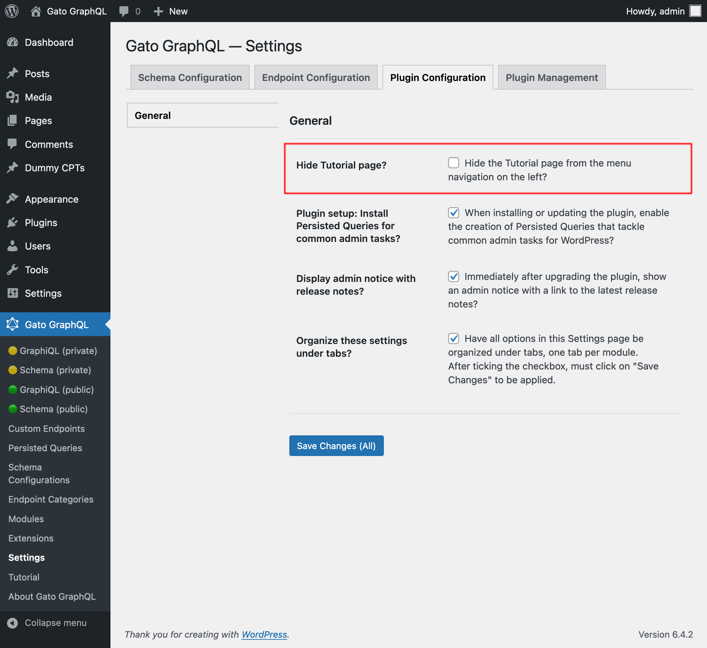

# Release Notes: 1.4

Here's a description of all the changes.

## Added predefined custom endpoint "Nested mutations + Entity as mutation payload type"

The new predefined custom endpoint "Nested mutations + Entity as mutation payload type", installed as `private`, is useful for executing queries that create resources in bulk.

For instance, the "Import posts from CSV" persisted query would need to be run on that client.

## Added "Request headers" to GraphiQL clients on single public/private endpoint, and custom endpoints

The GraphiQL client on the single public and private GraphQL endpoints now have the "Request headers" input:

Same for custom endpoints:

(GraphiQL clients on Persisted queries do not have this addition.)

## Renamed page "Recipes" to "Tutorial", and added settings to hide it

The page "Recipes" has been renamed to "Tutorial", to better represent its nature. (At the same time, the new ["Queries Library" section at gatographql.com](https://gatographql.com/library/) demonstrates GraphQL queries to solve common use cases.)

An option to hide the Tutorial section has been added to the Settings page, under "Plugin Configuration > General > Hide Tutorial page?":

## Fixed

- HTML codes were printed in select inputs in the WordPress editor, they have now been removed
