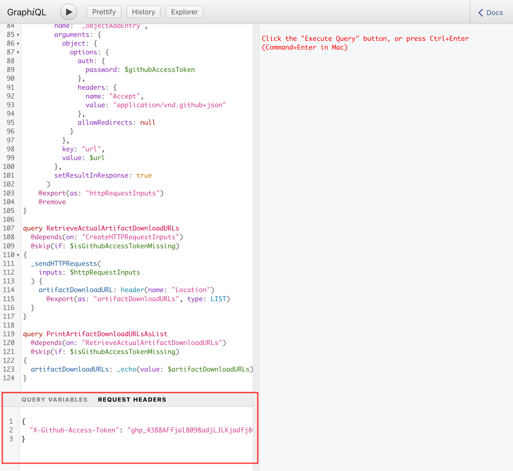

# Release Notes: 1.4

Here's a description of all the changes.

## Added "Request headers" to GraphiQL clients on single public/private endpoint, and custom endpoints

The GraphiQL client on the single public and private GraphQL endpoints now have the "Request headers" input:

Same for custom endpoints:

(GraphiQL clients on Persisted queries do not have this addition.)
