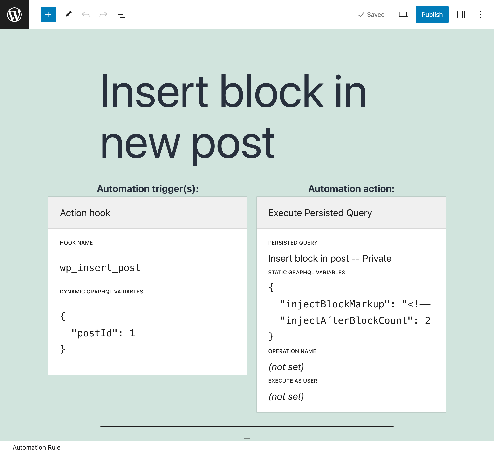
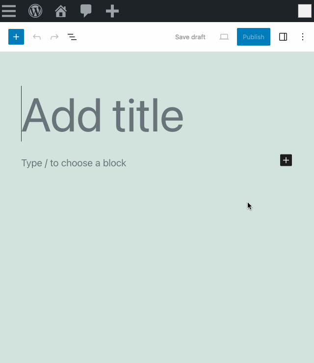

# Release Notes: 2.1

## Added

### Support providing the Schema Configuration to apply when invoking the Internal GraphQL Server

Gato GraphQL now supports providing the Schema Configuration to apply when executing a query via an internal GraphQL Server (i.e. directly within the PHP application, not via an endpoint).

_This new feature enhances several PRO extensions._

The [Internal GraphQL Server](https://gatographql.com/extensions/internal-graphql-server/) extension makes use of this feature. It now accepts a `$schemaConfigurationIDOrSlug` parameter on methods `executeQuery` and `executeQueryInFile` from the `GraphQLServer` class, and already extracts the schema configuration used by the persisted query on `executePersistedQuery`:

```diff
class GraphQLServer {
  
  public static function executeQuery(
    string $query,
    array $variables = [],
    ?string $operationName = null,
+   // Accept parameter 
+   int|string|null $schemaConfigurationIDOrSlug = null,
  ): Response {
    // ...
  }

  public static function executeQueryInFile(
    string $file,
    array $variables = [],
    ?string $operationName = null,
+   // Accept parameter 
+   int|string|null $schemaConfigurationIDOrSlug = null,
  ): Response {
    // ...
  }

+ // Schema Configuration is taken from the Persisted Query
  public static function executePersistedQuery(
    string|int $persistedQueryIDOrSlug,
    array $variables = [],
    ?string $operationName = null,
  ): Response {
    // ...
  }
```

The [Automation](https://gatographql.com/extensions/automation/) extension also benefits from this new feature.

It now provides a user interface for its "automator" functionality (directly via the WordPress editor), called [Automation Configurator](https://gatographql.com/extensions/automation/#heading-automation-configurator). The automation trigger is any WordPress action hook, and the action is the execution of a GraphQL persisted query.

<div class="img-width-1024" markdown=1>



</div>

For instance, when creating a new post, automation rule **Add comments block to new post** checks if the `core/comments` block is present and, if not, it adds it at the bottom of the post:

<div class="img-width-640" markdown=1>



</div>

### Predefined persisted query "Insert block in post"

The newly-added persisted GraphQL query "Insert block in post" allows to inject a block in a post. It identifies the nth block of a given type (`wp:paragraph` by default) in a post, and places the provided custom block's HTML content right after it.

Used with the [Automation](https://gatographql.com/extensions/automation/) extension, this persisted query can be used to automatically inject mandatory blocks to a newly-published post (eg: a CTA block to promote an ongoing campaign).

## Improvements

- If initializing the service container from the cache fails, fallback to initializing PHP object from memory (#2638)
- Give unique operationName to all predefined persisted queries (#2644)
- Improved error message when fetching blocks from a post, and the block content has errors
- Completed documentation for the Automation extension (#2651)
- On the "Generate a post's featured image using AI and optimize it" predefined persisted query, execute logic only if the post title is not empty (#ec931dd)

## Fixed

- Bug in multi-control JS component used by extensions (Access Control, Cache Control, and Field Deprecation) showing "undefined" on the block on the Schema Configuration (#2639)
- Bug in regex replacements in predefined persisted queries (#2649)
- Avoid reinstalling plugin setup data if deactivating/reactivating the plugin (#2641)
