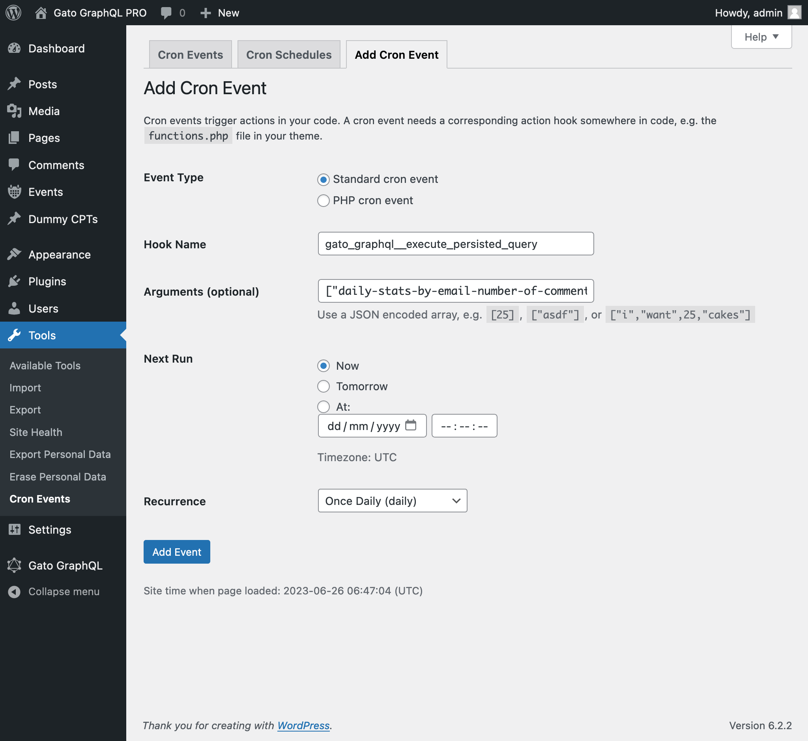

# Lesson 15: Sending a daily summary of activity

We can integrate Gato GraphQL with [WP-Cron](https://developer.wordpress.org/plugins/cron/), as to automate the execution GraphQL queries that perform admin tasks, with some time interval. (The [**Automation**](https://gatographql.com/extensions/automation/) extension is required.)

In this tutorial lesson, we set-up WP-Cron to, every 24 hs, execute a GraphQL query that retrieves the number of new comments added to the site, and sends these stats to the desired email account.

## GraphQL query with daily stats of new comments

This GraphQL query sends an email indicating the number of new comments added to the site for several periods of time:

- In the last 24 hs
- In the last 1 year
- Since the beginning of the month
- Since the beginning of the year

We create a Persisted Query with slug `"daily-stats-by-email-number-of-comments"` and content:

```graphql
query CountComments {
  DATE_ISO8601: _env(name: DATE_ISO8601) @remove

  timeToday: _time
  dateToday: _date(format: $__DATE_ISO8601, timestamp: $__timeToday)
  
  timeYesterday: _intSubstract(substract: 86400, from: $__timeToday)
  dateYesterday: _date(format: $__DATE_ISO8601, timestamp: $__timeYesterday)
  
  time1YearAgo: _intSubstract(substract: 31536000, from: $__timeToday)
  date1YearAgo: _date(format: $__DATE_ISO8601, timestamp: $__time1YearAgo)

  timeBegOfThisMonth: _makeTime(hour: 0, minute: 0, second: 0, day: 1)
  dateBegOfThisMonth: _date(format: $__DATE_ISO8601, timestamp: $__timeBegOfThisMonth)

  timeBegOfThisYear: _makeTime(hour: 0, minute: 0, second: 0, month: 1, day: 1)
  dateBegOfThisYear: _date(format: $__DATE_ISO8601, timestamp: $__timeBegOfThisYear)
  
  commentsAddedInLast24Hs: commentCount(filter: { dateQuery: { after: $__dateYesterday } } )
    @export(as: "commentsAddedInLast24Hs")
  commentsAddedInLast1Year: commentCount(filter: { dateQuery: { after: $__date1YearAgo } } )
    @export(as: "commentsAddedInLast1Year")
  commentsAddedSinceBegOfThisMonth: commentCount(filter: { dateQuery: { after: $__dateBegOfThisMonth } } )
    @export(as: "commentsAddedSinceBegOfThisMonth")
  commentsAddedSinceBegOfThisYear: commentCount(filter: { dateQuery: { after: $__dateBegOfThisYear } } )
    @export(as: "commentsAddedSinceBegOfThisYear")
}

query CreateEmailMessage @depends(on: "CountComments") {
  emailMessageTemplate: _strConvertMarkdownToHTML(
    text: """

This is the number of comments added to the site:

| Period | # Comments added |
| --- | --- |
| **In the last 24 hs**: | {$commentsAddedInLast24Hs} |
| **In the last 365 days**: | {$commentsAddedInLast1Year} |
| **Since beggining of this month**: | {$commentsAddedSinceBegOfThisMonth} |
| **Since beggining of this year**: | {$commentsAddedSinceBegOfThisYear} |

    """
  )
  emailMessage: _strReplaceMultiple(
    search: [
      "{$commentsAddedInLast24Hs}",
      "{$commentsAddedInLast1Year}",
      "{$commentsAddedSinceBegOfThisMonth}",
      "{$commentsAddedSinceBegOfThisYear}"
    ],
    replaceWith: [
      $commentsAddedInLast24Hs,
      $commentsAddedInLast1Year,
      $commentsAddedSinceBegOfThisMonth,
      $commentsAddedSinceBegOfThisYear
    ],
    in: $__emailMessageTemplate
  )
    @export(as: "emailMessage")
}

mutation SendDailyStatsByEmailNumberOfComments(
  $to: [String!]!
)
  @depends(on: "CreateEmailMessage")
{
  _sendEmail(
    input: {
      to: $to
      subject: "Daily stats: Number of new comments"
      messageAs: {
        html: $emailMessage
      }
    }
  ) {
    status
  }
}
```

## Scheduling the execution of the GraphQL query via WP-Cron

We must schedule the WP-Cron event to execute the Gato GraphQL hook `gatographql__execute_persisted_query`, passing along the email to send the email to as argument, and the recurrence (daily).

We do this either via PHP:

```php
wp_schedule_event(
  time(),
  'daily',
  'gatographql__execute_persisted_query',
  [
    'daily-stats-by-email-number-of-comments',
    [
      'to' => ['admin@mysite.com']
    ],
    'SendDailyStatsByEmailNumberOfComments',
    1 // This is the admin user's ID
  ]
);
```

Or via the [WP-Crontrol](https://wordpress.org/plugins/wp-crontrol/) plugin:

- Hook name: `gatographql__execute_persisted_query`
- Arguments: `["daily-stats-by-email-number-of-comments",{"to":["admin@mysite.com"]},"SendDailyStatsByEmailNumberOfComments",1]`
- Recurrence: Once Daily

<div class="img-width-1024" markdown=1>



</div>

<div class="doc-highlight" markdown=1>

🔥 **Tips:**

The 4th argument passed to the WP-Cron event is the ID (as an int) or username (as a string) of the user that must be logged-in when executing the GraphQL query.

(In this case, value `1` is the ID of the admin user, and could have provided username `"admin"` too.)

Passing this argument is typically needed when executing mutations, as most of these require a user (with the proper capabilities) to be logged-in.

</div>
