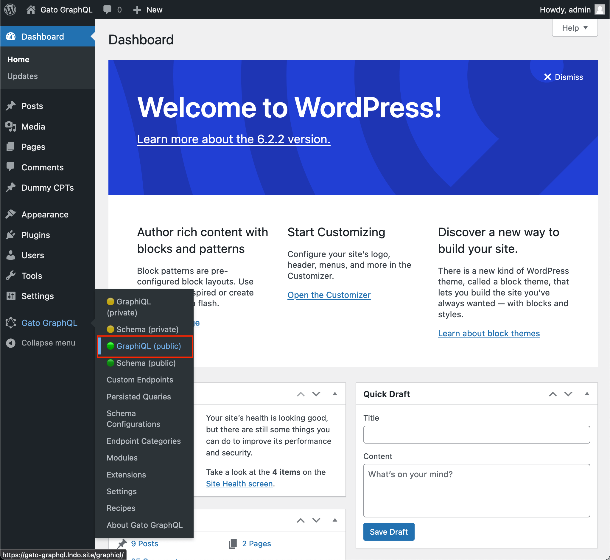
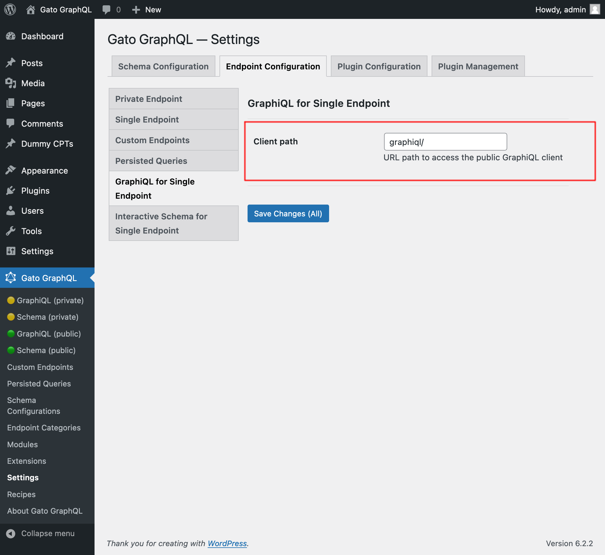
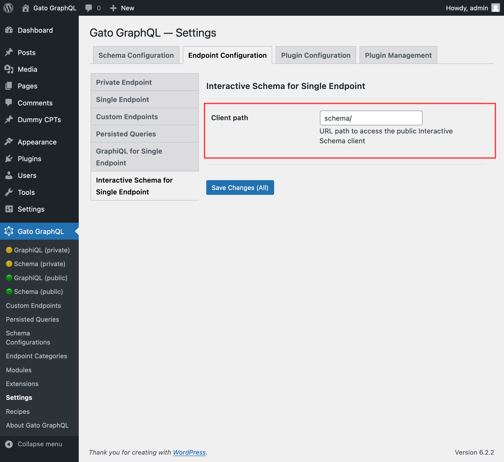

# Lesson 24: Translating content from URL

We can combine the fields to execute HTTP requests (provided by the [**HTTP Client**](https://gatographql.com/extensions/http-client/) extension) with directive `@strTranslate` (provided by the [**Google Translate**](https://gatographql.com/extensions/google-translate/) extension), to translate the content from any URL.

## GraphQL query to translate content from a URL

This query, given a URL as input, its language, and what language to translate it to, fetches the content from the URL and performs the translation using Google Translate:

```graphql
query TranslateContent(
  $url: URL!
  $fromLang: String!
  $toLang: String!
) {
  _sendHTTPRequest(input: {
    url: $url,
    method: GET
  }) {
    body
    translated: body @strTranslate(
      from: $fromLang
      to: $toLang
    )
  }
}
```

For instance, passing the [URL of some Markdown file in a GitHub repo](https://raw.githubusercontent.com/GatoGraphQL/GatoGraphQL/c870d8906ae1aec3c81acc039c53acc7aab5dff0/layers/GatoGraphQLForWP/plugins/gatographql/docs/modules/single-endpoint/en.md), and language code `"es"`:

```json
{
  "url": "https://raw.githubusercontent.com/GatoGraphQL/GatoGraphQL/c870d8906ae1aec3c81acc039c53acc7aab5dff0/layers/GatoGraphQLForWP/plugins/gatographql/docs/modules/single-endpoint/en.md",
  "fromLang": "en",
  "toLang": "es"
}
```

...will translate the Markdown content to Spanish:

```json
{
  "data": {
    "_sendHTTPRequest": {
      "body": "# Single Endpoint\n\nExecute queries against the GraphQL server through the public single endpoint.\n\nBy default the endpoint is `/graphql/`, and the path can be configured through the Settings.\n\n\n\nThe GraphQL single endpoint can be configured by assigning a Schema Configuration to it. To do this, on section \"Schema Configuration\" select the desired entry from the dropdown for \"Schema Configuration for the Single Endpoint\":\n\n<div class=\"img-width-1024\" markdown=1>\n\n\n\n</div>\n\n## Clients\n\nInteract with the single endpoint via the available clients.\n\n### GraphiQL\n\nIf module \"GraphiQL for Single Endpoint\" is enabled, then the single endpoint's GraphiQL client becomes publicly available.\n\nTo open it, click on link \"🟢 GraphiQL (public)\" on the plugin's menu:\n\n<div class=\"img-width-1024\" markdown=1>\n\n\n\n</div>\n\nBy default, the client is exposed under `/graphiql/`. This path can be modified on the Settings, under tab \"GraphiQL for Single Endpoint\":\n\n<div class=\"img-width-1024\" markdown=1>\n\n\n\n</div>\n\n### Interactive Schema (Voyager)\n\nIf module \"Interactive Schema for Single Endpoint\" is enabled, then the single endpoint's Voyager client becomes publicly available.\n\nTo open it, click on link \"🟢 Schema (public)\" on the plugin's menu:\n\n<div class=\"img-width-1024\" markdown=1>\n\n\n\n</div>\n\nBy default, the client is exposed under `/schema/`. This path can be modified on the Settings, under tab \"Interactive Schema for Single Endpoint\":\n\n<div class=\"img-width-1024\" markdown=1>\n\n\n\n</div>\n",
      "translated": "# Punto final único\n\nEjecute consultas en el servidor GraphQL a través del punto final único público.\n\nDe forma predeterminada, el punto final es `/graphql/` y la ruta se puede configurar a través de Configuración.\n\n\n\nEl punto final único GraphQL se puede configurar asignándole una configuración de esquema. Para hacer esto, en la sección \"Configuración del esquema\", seleccione la entrada deseada del menú desplegable para \"Configuración del esquema para el punto final único\":\n\n<div class=\"img-width-1024\" descuento=1>\n\n\n\n</div>\n\n## Clients\n\nInteractúe con el punto final único a través de los clients disponibles.\n\n### GrafiQL\n\nSi el módulo \"GraphiQL para punto final único\" está habilitado, el cliente GraphiQL del punto final único estará disponible públicamente.\n\nPara abrirlo, haga clic en el enlace \"🟢 GraphiQL (público)\" en el menú del complemento:\n\n<div class=\"img-width-1024\" descuento=1>\n\n\n\n</div>\n\nDe forma predeterminada, el cliente está expuesto en `/graphiql/`. Esta ruta se puede modificar en Configuración, en la pestaña \"GraphiQL para punto final único\":\n\n<div class=\"img-width-1024\" descuento=1>\n\n\n\n</div>\n\n### Esquema interaction (Voyager)\n\nSi el módulo \"Esquema interaction para punto final único\" está habilitado, el cliente Voyager del punto final único estará disponible públicamente.\n\nPara abrirlo, haga clic en el enlace \"🟢 Esquema (público)\" en el menú del complemento:\n\n<div class=\"img-width-1024\" descuento=1>\n\n\n\n</div>\n\nDe forma predeterminada, el cliente está expuesto en `/schema/`. Esta ruta se puede modificar en Configuración, en la pestaña \"Esquema interaction para punto final único\":\n\n<div class=\"img-width-1024\" descuento=1>\n\n\n\n</div>\n"
    }
  }
}
```
