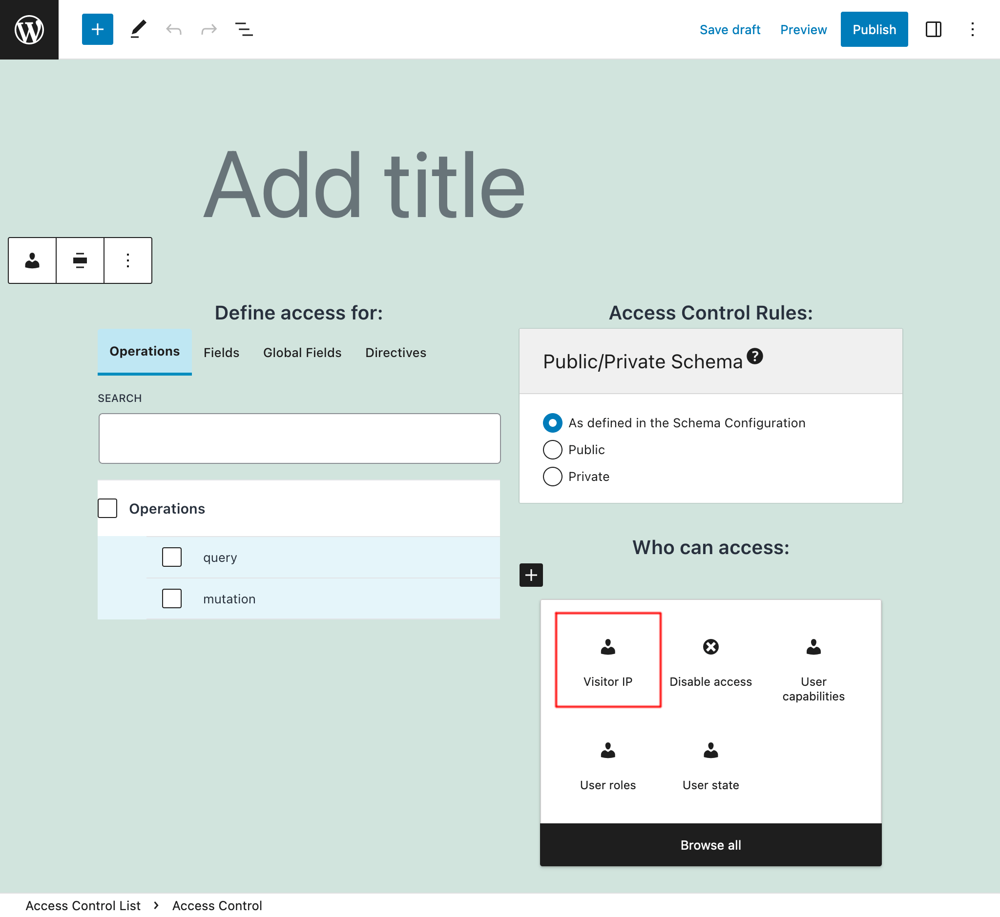

# Access Control: Visitor IP

Grant access to the schema based on the visitor's IP address (Access Control extension is required).

## Description

In the Access Control editor, a new rule "Visitor IP" is made available:

<div class="img-width-1024" markdown=1>



</div>

We configure the rule with the list of IP addresses that can either access, or are denied access to, the schema elements.

Each entry can either be:

- A regex (regular expression), if it's surrounded by `/` or `#`, or
- The full IP address, otherwise

For instance, any of these entries match IP address `"203.23.88.100"`:

- `203.23.88.100`
- `#^203\.23\.[0-9]{1,3}\.[0-9]{1,3}$#`

And under Behavior, select if to "Allow access" or "Deny access" to the schema for those entries.

<div class="img-width-600" markdown=1>


</div>

When access is denied, the response will contain an error message like this one (in the public mode):

```json
{
  "errors": [
    {
      "message": "The client IP address must satisfy constraint '#^255\\.[0-9]{1,3}\\.[0-9]{1,3}\\.[0-9]{1,3}$#' to access field 'karma' for type 'Comment' (your IP address is '172.19.0.2')",
      "locations": [
        {
          "line": 15,
          "column": 5
        }
      ]
    }
  ]
}
```
