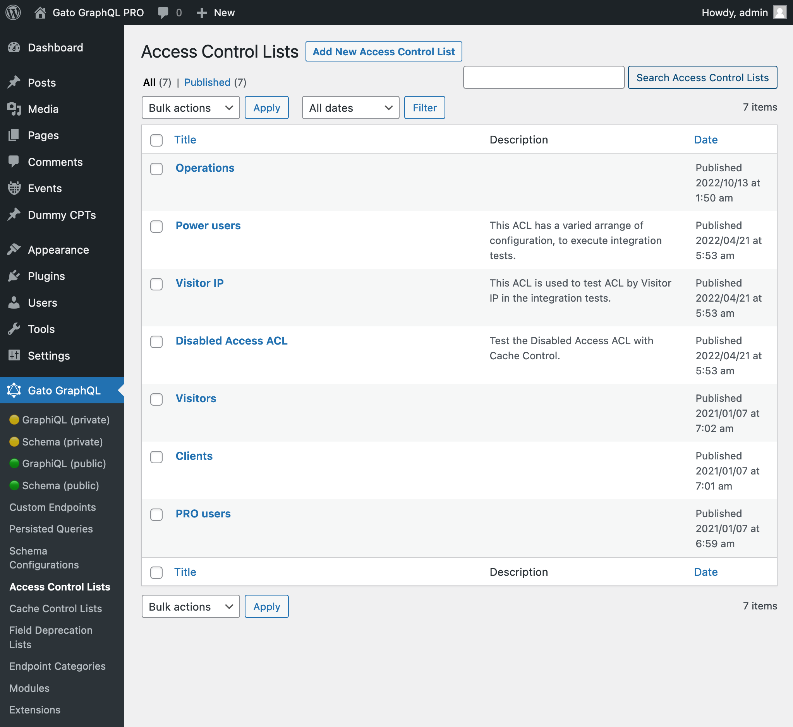
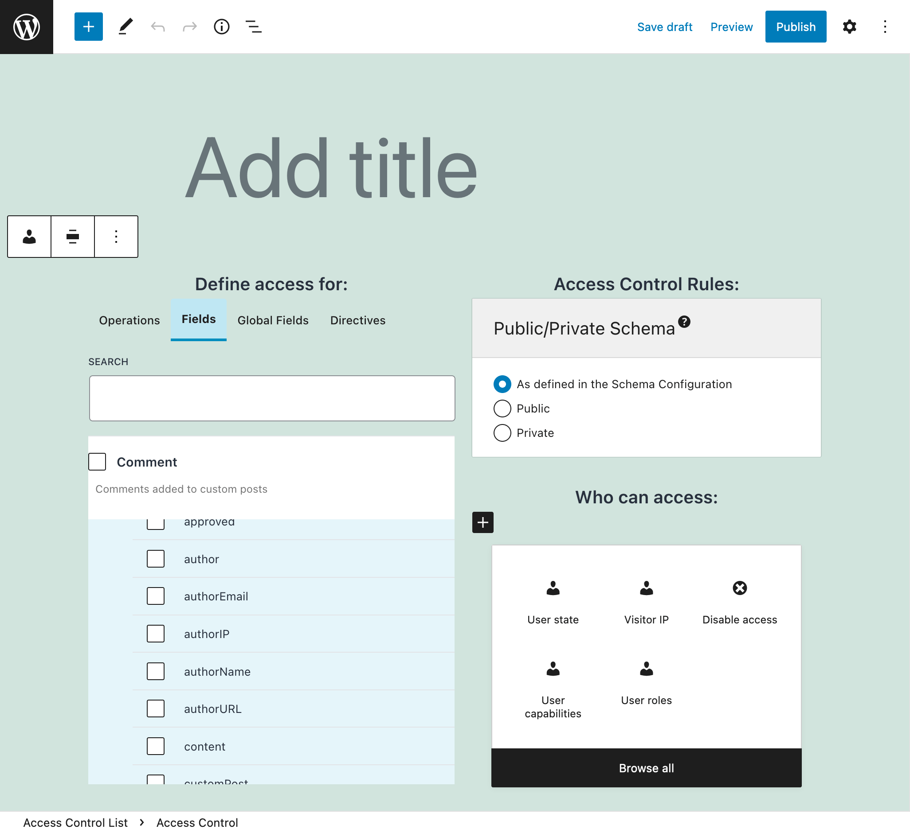
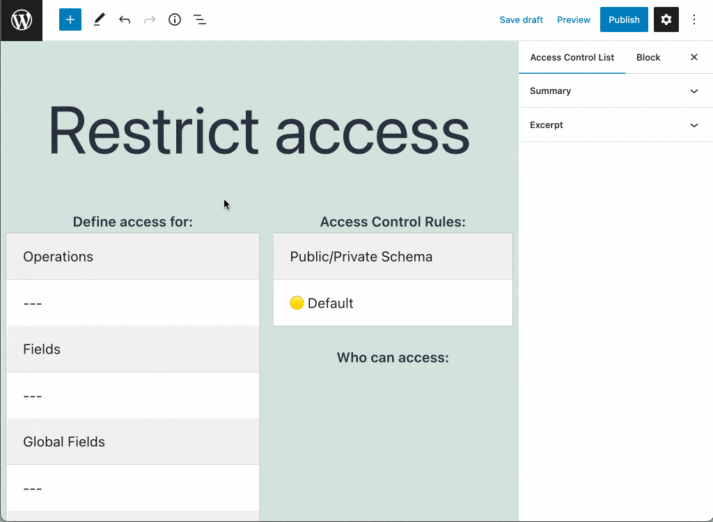
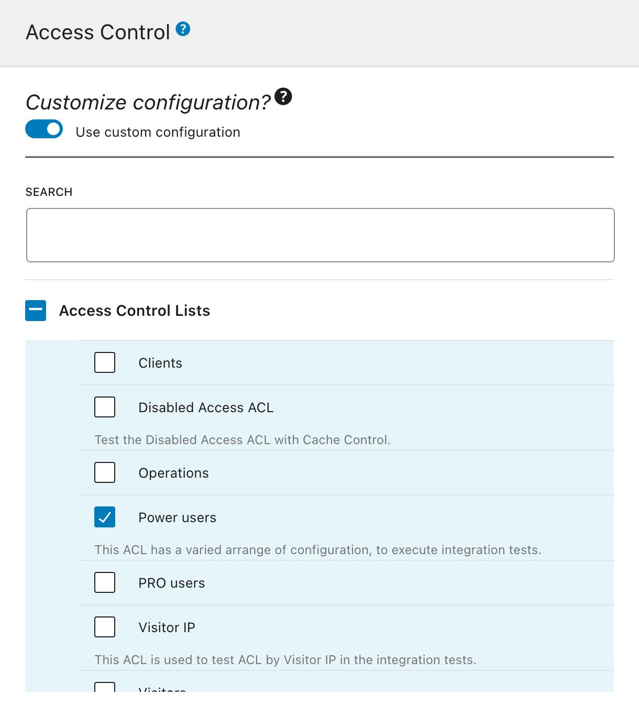

# Access Control

Grant granular access to the schema, based on the user being logged-in (or not), having a certain role or capability, and more.

## Description

This extension allows us to create Access Control Lists, to manage who can access the different elements (operations, fields and directives) from the GraphQL schema.

A new "Access Control List" Custom Post Type is added to the site. We can browse its entries on the "Access Control Lists" page in the menu, and click on "Add New Access Control List" to add a new entry in the editor.

<div class="img-width-1024" markdown=1>



</div>



In the editor, we indicate what rules must be satisfied to access what schema elements, from among operations (`query` or `mutation`), fields, global fields, and directives.



We assign the Access Control List to the desired endpoint (private endpoint, single endpoint, custom endpoints or persisted queries) via the Schema Configuration.

<div class="img-width-610" markdown=1>



</div>

When executing a GraphQL query, if it contains any of the selected schema elements in the Access Control List, the chosen rules are evaluated.

If any rule is not satisfied, access to that operation, field or directive is denied, and we can configure how the API must provide the response:

- Public mode: Provide an error message to the user, indicating why access is denied
- Private mode: The error message indicates that the operation, field or directive does not exist

For instance, in the _public mode_, we may get this response:

```json
{
  "errors": [
    {
      "message": "You must have role 'author' to access field 'title' for type 'Post'",
      "locations": [
        {
          "line": 86,
          "column": 3
        }
      ]
    }
  ]
}
```

While in the _private mode_ we may get this response:

```json
{
  "errors": [
    {
      "message": "There is no field 'title' on type 'Post'",
      "locations": [
        {
          "line": 86,
          "column": 3
        }
      ]
    }
  ]
}
```

## List of Access Control rules

The extension provides the following Access Control rules:

- Disable access
- Grant access only if the user is logged-in or out
- Grant access only if the user has some role
- Grant access only if the user has some capability

## Bundles including extension

- [“All in One Toolbox for WordPress” Bundle](../../../../../bundle-extensions/all-in-one-toolbox-for-wordpress/docs/modules/all-in-one-toolbox-for-wordpress/en.md)
- [“Responsible WordPress Public API” Bundle](../../../../../bundle-extensions/responsible-wordpress-public-api/docs/modules/responsible-wordpress-public-api/en.md)

## Tutorial lessons referencing extension

- [Exposing public and private endpoints](../../../../../docs/tutorial/exposing-public-and-private-endpoints/en.md)
