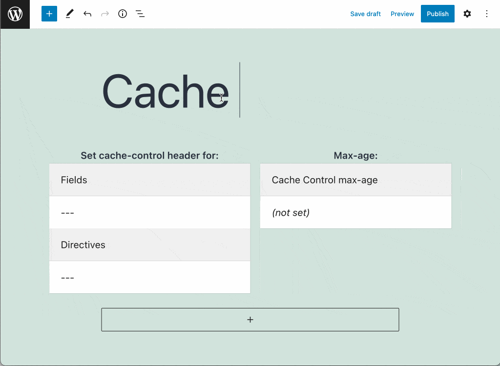
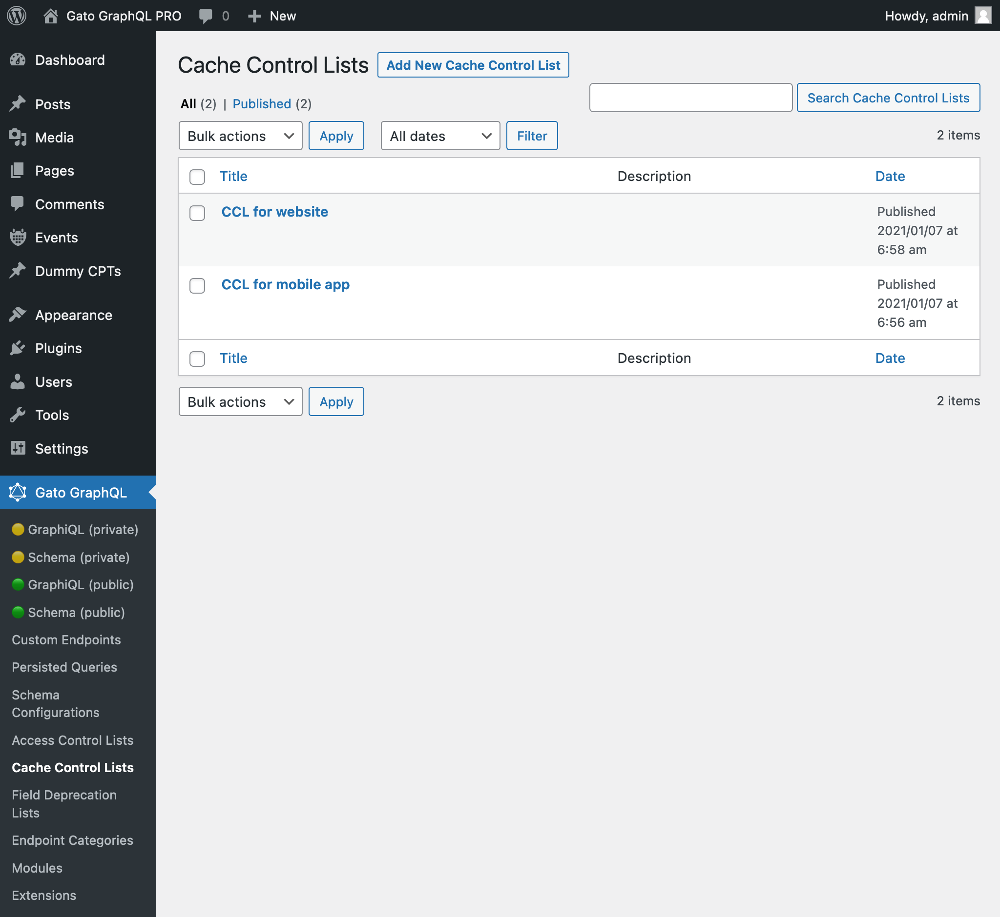
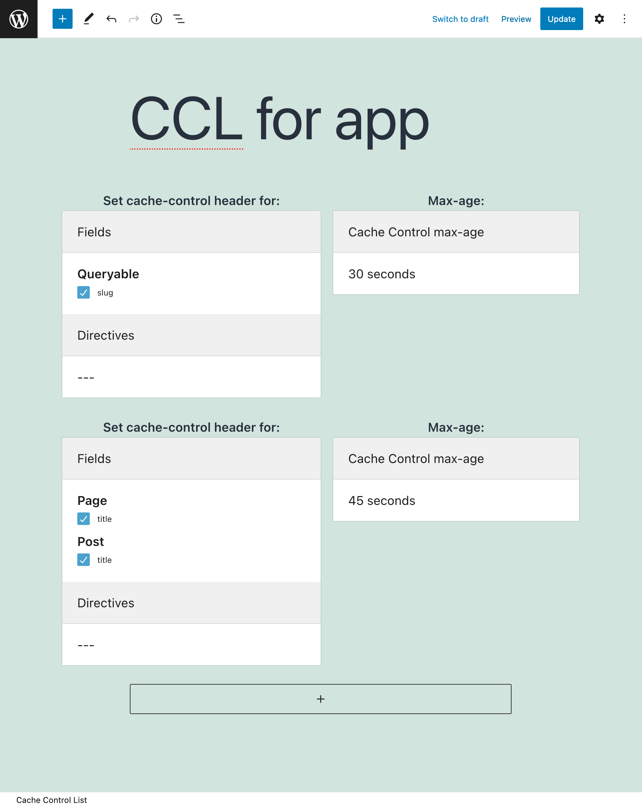
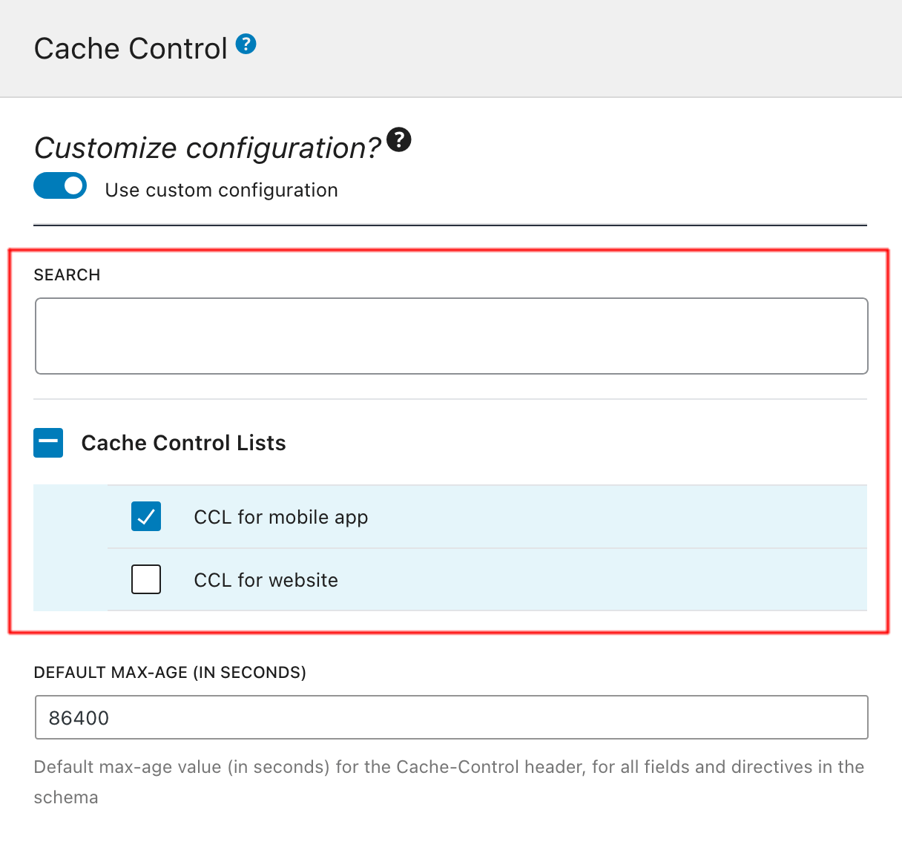

# Cache Control

When executing queries against the GraphQL server via the `GET` method, the GraphQL response can be cached on the client-side or intermediate stages between client and server (such as a CDN), by relying on standard HTTP caching.

This works naturally for persisted queries, and for the single endpoint and custom endpoints it works by appending param `?query={ GraphQL query }` to the endpoint.

## Description

HTTP caching works by sending a `Cache-Control` header with a `max-age` value in the response, indicating for how long the response must be cached.

The Cache Control extension offers Cache Control Lists, where custom `max-age` values are defined for fields and directives. Hence, different queries containing different combinations of fields and directives will produce a different `max-age` value.

The response's `max-age` value is automatically calculated by the GraphQL engine. Its value is the lowest `max-age` from all the fields and directives in the requested query (as defined in the Cache Control List), or `no-store` if either:

- any mutation is executed
- any field or directive has `max-age` with value `0`
- an Access Control rule must check the user state for any field or directive (in which case, the response is specific to the user, so it cannot be cached)

## Cache Control Lists

A new "Cache Control List" Custom Post Type is added to the site. We can browse its entries on the "Cache Control Lists" page in the menu, and click on "Add New Cache Control List" to add a new entry in the editor.

Every Cache Control List contains one or many entries, each of them with the following elements:

- The fields and directives which, if they appear on the GraphQL query, the selected max-age takes effect
- The max-age

After creating the Cache Control List, we can have the endpoint use it by editing the corresponding Schema Configuration, and selecting the item from the list under block "Cache Control Lists".

## Bundles including extension

- [“All Extensions” Bundle](../../../../../bundle-extensions/all-extensions/docs/modules/all-extensions/en.md)
- [“WordPress Public API” Bundle](../../../../../bundle-extensions/wordpress-public-api/docs/modules/wordpress-public-api/en.md)

## Tutorial lessons referencing extension

- [Exposing public and private endpoints](../../../../../docs/tutorial/exposing-public-and-private-endpoints/en.md)
