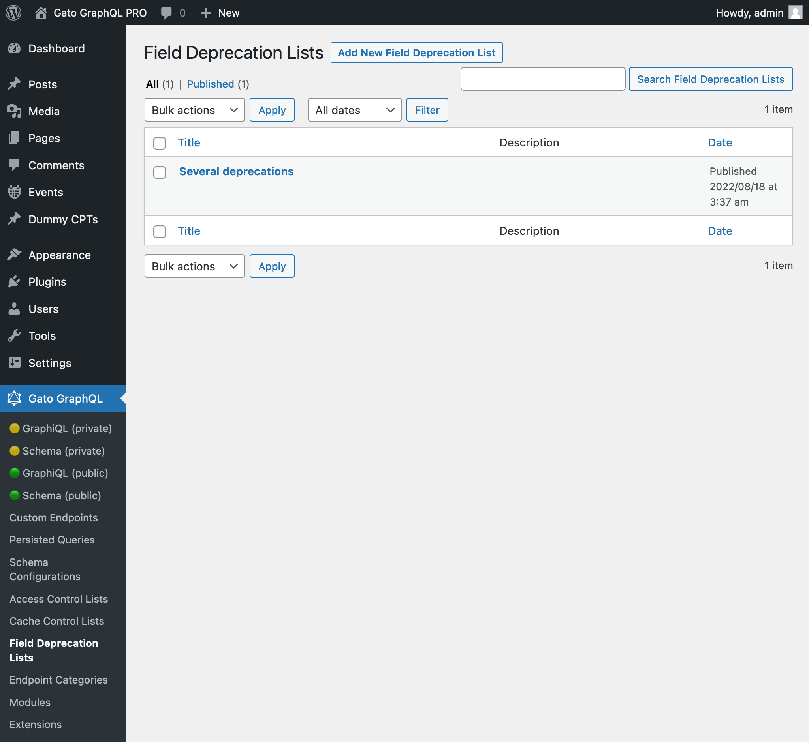
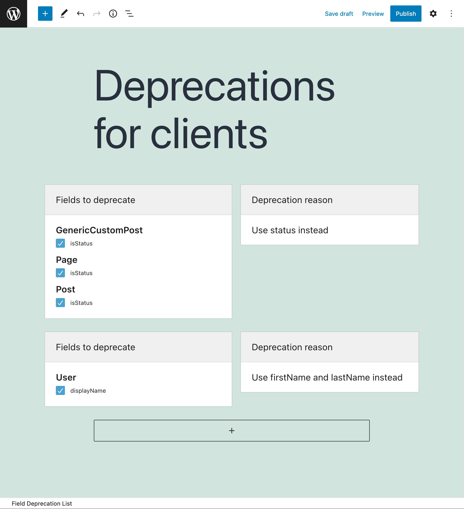
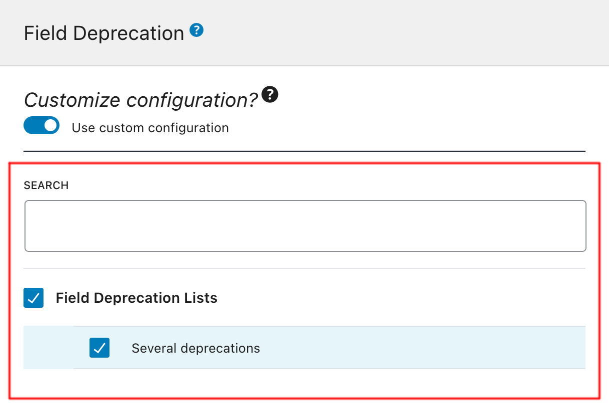

# Field Deprecation

When upgrading our GraphQL schemas, some fields may not be needed anymore, possibly replaced by better implementation of that field. We can then deprecate the obsolete fields, providing a deprecation reason that will inform and urge our users to switch to the new field in their clients.

This extension provides a user interface to deprecate fields.

## Description

A new "Field Deprecation List" Custom Post Type is added to the site. We can browse its entries on the "Field Deprecation Lists" page in the menu, and click on "Add New Field Deprecation List" to add a new entry in the editor.

Every Field Deprecation List contains one or many entries, each of them with the following elements:

- The fields to deprecate
- The deprecation reason (to be shown in the GraphQL response when the deprecated field is queried)

After creating the Field Deprecation List, we can have the Custom Endpoint and Persisted Query use it by editing the corresponding Schema Configuration, and selecting the item from the list under block "Field Deprecation Lists".

<!-- 
## Bundles including extension

- [“All Extensions” Bundle](../../../../../bundle-extensions/all-feature-bundled-extensions/docs/modules/all-feature-bundled-extensions/en.md)
- [“Responsible WordPress Public API” Bundle](../../../../../bundle-extensions/responsible-wordpress-public-api/docs/modules/responsible-wordpress-public-api/en.md) -->
