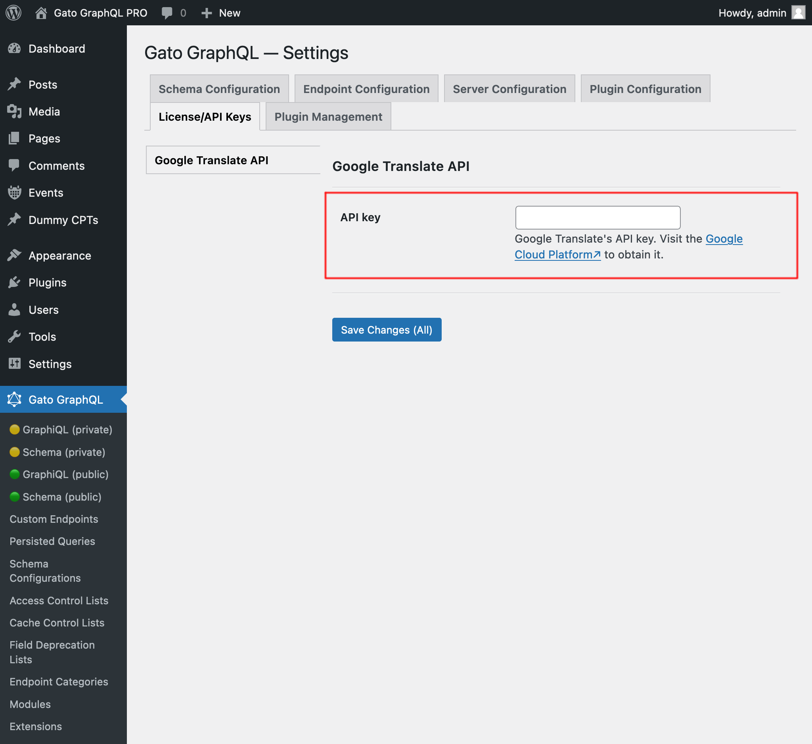
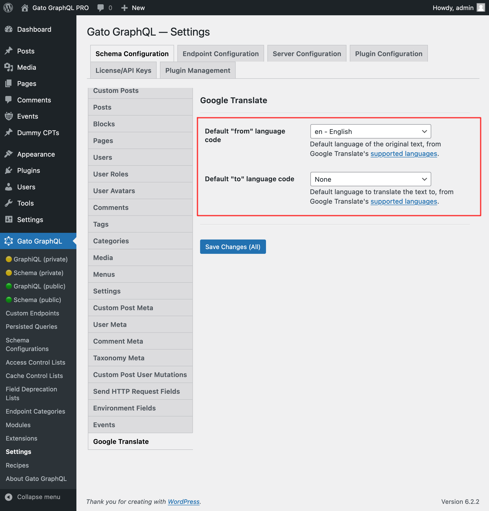

# Google Translate

Directive `@strTranslate` to translate a field value to over 130 languages using the Google Translate API.

## Description

Add directive `@strTranslate` to any field of type `String`, to translate it to the desired language.

For instance, this query translates the post's `title` and `excerpt` fields from English to French:

```graphql
{
  posts {
    enTitle: title
    frTitle: title @strTranslate(from: "en", to: "fr")

    enExcerpt: excerpt    
    frExcerpt: excerpt @strTranslate(from: "en", to: "fr")
  }
}
```

...producing:

```json
{
  "data": {
    "posts": [
      {
        "enTitle": "Welcome to a single post full of blocks!",
        "frTitle": "Bienvenue dans un poste unique plein de blocs !",
        "enExcerpt": "When I look back on my past and think how much time I wasted on nothing, how much time has been lost in futilities, errors, laziness, incapacity to live; how little I appreciated it, how many times I sinned against my heart and soul-then my heart bleeds. Life is a gift, life is happiness, every&hellip;",
        "frExcerpt": "Quand je repense à mon passé et que je pense au temps que j'ai perdu pour rien, au temps perdu en futilités, en erreurs, en paresse, en incapacité de vivre ; combien je l'ai peu apprécié, combien de fois j'ai péché contre mon cœur et mon âme, alors mon cœur saigne. La vie est un cadeau, la vie est un bonheur, chaque&hellip;"
      },
      {
        "enTitle": "Explaining the privacy policy",
        "frTitle": "Expliquer la politique de confidentialité",
        "enExcerpt": "Our privacy policy is at https://gatographql-pro.lndo.site/privacy/, and we are based in Carimano.",
        "frExcerpt": "Notre politique de confidentialité se trouve sur https://gatographql-pro.lndo.site/privacy/, et nous sommes basés à Carimano."
      },
      {
        "enTitle": "HTTP caching improves performance",
        "frTitle": "La mise en cache HTTP améliore les performances",
        "enExcerpt": "Categories Block Latest Posts Block Did you know? We are not rich by what we possess but by what we can do without. Patience is the strength of the weak, impatience is the weakness of the strong.",
        "frExcerpt": "Catégories Bloquer les derniers messages Bloquer Le saviez-vous ? Nous ne sommes pas riches de ce que nous possédons mais de ce dont nous pouvons nous passer. La patience est la force du faible, l'impatience est la faiblesse du fort."
      }
    ]
  }
}
```

## List of languages

You can translate your content to any of the following languages:

| Code | Language |
| --- | --- |
| `af` | Afrikaans |
| `sq` | Albanian |
| `am` | Amharic |
| `ar` | Arabic |
| `hy` | Armenian |
| `as` | Assamese |
| `ay` | Aymara |
| `az` | Azerbaijani |
| `bm` | Bambara |
| `eu` | Basque |
| `be` | Belarusian |
| `bn` | Bengali |
| `bho` | Bhojpuri |
| `bs` | Bosnian |
| `bg` | Bulgarian |
| `ca` | Catalan |
| `ceb` | Cebuano |
| `zh-CN` or `zh (BCP-47)` | Chinese (Simplified) |
| `zh-TW` (BCP-47)` | Chinese (Traditional) |
| `co` | Corsican |
| `hr` | Croatian |
| `cs` | Czech |
| `da` | Danish |
| `dv` | Dhivehi |
| `doi` | Dogri |
| `nl` | Dutch |
| `en` | English |
| `eo` | Esperanto |
| `et` | Estonian |
| `ee` | Ewe |
| `fil` | Filipino (Tagalog) |
| `fi` | Finnish |
| `fr` | French |
| `fy` | Frisian |
| `gl` | Galician |
| `ka` | Georgian |
| `de` | German |
| `el` | Greek |
| `gn` | Guarani |
| `gu` | Gujarati |
| `ht` | Haitian Creole |
| `ha` | Hausa |
| `haw` | Hawaiian |
| `he` or `iw` | Hebrew |
| `hi` | Hindi |
| `hmn` | Hmong |
| `hu` | Hungarian |
| `is` | Icelandic |
| `ig` | Igbo |
| `ilo` | Ilocano |
| `id` | Indonesian |
| `ga` | Irish |
| `it` | Italian |
| `ja` | Japanese |
| `jv` or `jw` | Javanese |
| `kn` | Kannada |
| `kk` | Kazakh |
| `km` | Khmer |
| `rw` | Kinyarwanda |
| `gom` | Konkani |
| `ko` | Korean |
| `kri` | Krio |
| `ku` | Kurdish |
| `ckb` | Kurdish (Sorani) |
| `ky` | Kyrgyz |
| `lo` | Lao |
| `la` | Latin |
| `lv` | Latvian |
| `ln` | Lingala |
| `lt` | Lithuanian |
| `lg` | Luganda |
| `lb` | Luxembourgish |
| `mk` | Macedonian |
| `mai` | Maithili |
| `mg` | Malagasy |
| `ms` | Malay |
| `ml` | Malayalam |
| `mt` | Maltese |
| `mi` | Maori |
| `mr` | Marathi |
| `mni-Mtei` | Meiteilon (Manipuri) |
| `lus` | Mizo |
| `mn` | Mongolian |
| `my` | Myanmar (Burmese) |
| `ne` | Nepali |
| `no` | Norwegian |
| `ny` | Nyanja (Chichewa) |
| `or` | Odia (Oriya) |
| `om` | Oromo |
| `ps` | Pashto |
| `fa` | Persian |
| `pl` | Polish |
| `pt` | Portuguese (Portugal, Brazil) |
| `pa` | Punjabi |
| `qu` | Quechua |
| `ro` | Romanian |
| `ru` | Russian |
| `sm` | Samoan |
| `sa` | Sanskrit |
| `gd` | Scots Gaelic |
| `nso` | Sepedi |
| `sr` | Serbian |
| `st` | Sesotho |
| `sn` | Shona |
| `sd` | Sindhi |
| `si` | Sinhala (Sinhalese) |
| `sk` | Slovak |
| `sl` | Slovenian |
| `so` | Somali |
| `es` | Spanish |
| `su` | Sundanese |
| `sw` | Swahili |
| `sv` | Swedish |
| `tl` | Tagalog (Filipino) |
| `tg` | Tajik |
| `ta` | Tamil |
| `tt` | Tatar |
| `te` | Telugu |
| `th` | Thai |
| `ti` | Tigrinya |
| `ts` | Tsonga |
| `tr` | Turkish |
| `tk` | Turkmen |
| `ak` | Twi (Akan) |
| `uk` | Ukrainian |
| `ur` | Urdu |
| `ug` | Uyghur |
| `uz` | Uzbek |
| `vi` | Vietnamese |
| `cy` | Welsh |
| `xh` | Xhosa |
| `yi` | Yiddish |
| `yo` | Yoruba |
| `zu` | Zulu |

<!-- ## Google Translate API Configuration

In order to use Google Translate, it is mandatory to provide the API key, via tab "Plugin Management => Google Translate API" on the Settings page.

Create the API key in [Google Cloud Platform](https://console.cloud.google.com/apis/api/translate.googleapis.com/overview), following the [instructions here](https://cloud.google.com/translate/docs/setup).

Then follow one of the methods below to input the value.

### By Settings

Input the API key in the corresponding input in the Settings page, and click on "Save Changes (All)":

<div class="img-width-1024" markdown=1>



</div>

### In `wp-config.php`

Add constant `GATOGRAPHQL_GOOGLE_TRANSLATE_API_KEY` in `wp-config.php`:

```php
define( 'GATOGRAPHQL_GOOGLE_TRANSLATE_API_KEY', '{your API key}' );
```

### By environment variable

Define environment variable `GOOGLE_TRANSLATE_API_KEY`.

## Schema Configuration

Directive `@strTranslate` requires passing two arguments:

- `from`: the language code of the text
- `to`: the language code to translate to

We can define a default value for these properties in tab "Schema Configuration => Google Translate" on the Settings page. These values will be used whenever any of those arguments is not provided in the query:

```graphql
{
  posts {
    title @strTranslate
  }
}
```

In addition, when defining default values, the corresponding argument in the GraphQL schema becomes non-mandatory.

By default, the default `from` value is the language used in WordPress.

### By Settings

Input the `from`/`to` fields in the corresponding input in the Settings page, and click on "Save Changes (All)":

<div class="img-width-1024" markdown=1>



</div>

### In `wp-config.php`

Add constants in `wp-config.php`:

- `GATOGRAPHQL_TRANSLATION_DEFAULT_FROM_LANG_CODE`
- `GATOGRAPHQL_TRANSLATION_DEFAULT_TO_LANG_CODE`

For instance:

```php
define( 'GATOGRAPHQL_TRANSLATION_DEFAULT_TO_LANG_CODE', 'fr' );
```

### By environment variable

Define environment variables:

- `TRANSLATION_DEFAULT_FROM_LANG_CODE`
- `TRANSLATION_DEFAULT_TO_LANG_CODE`
 -->

## Bundles including extension

- [“All in One Toolbox for WordPress” Bundle](../../../../../bundle-extensions/all-in-one-toolbox-for-wordpress/docs/modules/all-in-one-toolbox-for-wordpress/en.md)
- [“Automated Content Translation & Sync for WordPress Multisite” Bundle](../../../../../bundle-extensions/automated-content-translation-and-sync-for-wordpress-multisite/docs/modules/automated-content-translation-and-sync-for-wordpress-multisite/en.md)
- [“Simplest WordPress Content Translation” Bundle](../../../../../bundle-extensions/simplest-wordpress-content-translation/docs/modules/simplest-wordpress-content-translation/en.md)
