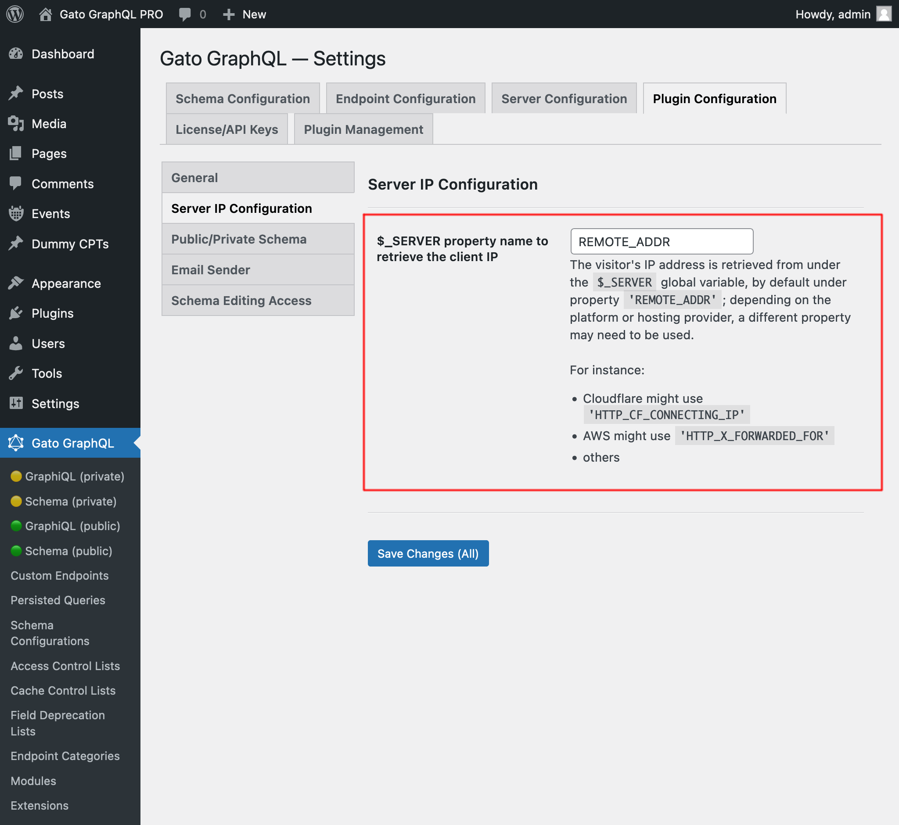

# HTTP Request via Schema

Addition of fields to the GraphQL schema to retrieve the current HTTP request data.

## List of fields

The following fields are added to the schema:

### `_httpRequestBody`

Body of the HTTP request.

### `_httpRequestClientHost`

Client host.

### `_httpRequestClientIP`

Retrieves the client IP address. If the server is not properly configured (see below), the response is `null`.

<!-- #### Configuration

The client's IP address is retrieved from under the `$_SERVER` global variable, normally from under property `'REMOTE_ADDR'`. However, different platforms may require to use a different property name to retrieve this information.

For instance:

- Cloudflare might use `'HTTP_CF_CONNECTING_IP'`
- AWS might use `'HTTP_X_FORWARDED_FOR'`

The property name to use can be configured in the "Plugin Configuration > Server IP Configuration" tab on the Settings page:

<div class="img-width-1024" markdown=1>



</div>

-->

### `_httpRequestCookie`

Request cookie value.

### `_httpRequestCookies`

Request cookies.

### `_httpRequestDomain`

Domain of the requested URL.

### `_httpRequestFullURL`

Requested URL (including the query params).

### `_httpRequestHasCookie`

Does the request contain a certain cookie?.

### `_httpRequestHasHeader`

Does the request contain a certain header?.

### `_httpRequestHasParam`

Does the request contain a certain parameter?.

### `_httpRequestHeader`

Request header value.

### `_httpRequestHeaders`

Request headers.

### `_httpRequestHost`

Host of the requested URL.

### `_httpRequestMethod`

Request method.

### `_httpRequestParams`

JSON object with all the params (passed via POST or GET).

Param values can be:

- Strings: `?param=value`
- Arrays: `?someArray[]=1&someArray[]=2`
- Array of arrays: `?someMatrix[0][0]=3&someMatrix[0][1]=4&someMatrix[1][0]=5&someMatrix[1][1]=6`
- Associative arrays (i.e. objects): `?someAssocArray["admins"]=20&someAssocArray["authors"]=30`
- Associative array of arrays: `?someAssocMatrix["admins"][0]=7&someAssocMatrix["admins"][1]=8&someAssocMatrix["authors"][0]=9&someAssocMatrix["authors"][1]=10`
- Other combinations

To get the value of the param, we can use fields `_httpRequestStringParam` and `_httpRequestStringListParam` for the first two cases respectively, but there are no fields for the other cases.

For those, use this field `_httpRequestParams` to obtain the JSON object, and then retrieve the corresponding value from within.

### `_httpRequestProtocol`

Request protocol.

### `_httpRequestQuery`

Query params string.

### `_httpRequestReferer`

Request referer.

### `_httpRequestRequestTime`

Timestamp of the start of the request.

### `_httpRequestScheme`

Scheme of the requested URL.

### `_httpRequestServerIP`

Server IP address.

### `_httpRequestStringListParam`

Value of a param (passed via POST or GET) of type `?param[]=value1&param[]=value2`.

### `_httpRequestStringParam`

Value of a param (passed via POST or GET) of type `?param=value`.

### `_httpRequestURL`

Requested URL (without query params).

### `_httpRequestURLPath`

Asolute path (starting with "/") of the requested URL.

### `_httpRequestUserAgent`

User agent.

## Examples

This query:

```graphql
query {
  _httpRequestHeaders
  existingHeader: _httpRequestHeader(name: "Accept")
  caseInsensitiveExistingHeader: _httpRequestHeader(name: "accept")
  nonExistingHeader: _httpRequestHeader(name: "Non-existing")
  existingHasHeader: _httpRequestHasHeader(name: "Accept")
  caseInsensitiveExistingHasHeader: _httpRequestHasHeader(name: "accept")
  nonExistingHasHeader: _httpRequestHasHeader(name: "Non-existing")
  _httpRequestBody
  _httpRequestMethod
  _httpRequestDomain
  _httpRequestScheme
  _httpRequestHost
  _httpRequestURL
  _httpRequestFullURL
  _httpRequestURLPath
  _httpRequestQuery
  _httpRequestParams
  existingParam: _httpRequestStringParam(name: "page")
  caseInsensitiveExistingParam: _httpRequestStringParam(name: "PAge")
  existingArrayParam: _httpRequestStringListParam(name: "someArray")
  nonExistingParam: _httpRequestStringParam(name: "also-non-existing")
  nonExistingListParam: _httpRequestStringListParam(name: "also-non-existing")
  existingHasParam: _httpRequestHasParam(name: "page")
  caseInsensitiveExistingHasParam: _httpRequestHasParam(name: "PAge")
  nonExistingHasParam: _httpRequestHasParam(name: "also-non-existing")
  existingCookie: _httpRequestCookie(name: "wordpress_test_cookie")
  caseInsentiveExistingCookie: _httpRequestCookie(name: "Wordpress_Test_Cookie")
  nonExistingCookie: _httpRequestCookie(name: "not_existing")
  existingHasCookie: _httpRequestHasCookie(name: "wordpress_test_cookie")
  caseInsentiveExistingHasCookie: _httpRequestHasCookie(name: "Wordpress_Test_Cookie")
  nonExistingHasCookie: _httpRequestHasCookie(name: "not_existing")
  _httpRequestProtocol
  _httpRequestReferer
  _httpRequestServerIP
  _httpRequestClientIP
  _httpRequestClientHost
  _httpRequestUserAgent
  _httpRequestCookies
  _httpRequestRequestTime
}
```

...produces:

```json
{
  "data": {
    "_httpRequestHeaders": {
      "authorization": "",
      "host": "gatographql-pro.lndo.site",
      "user-agent": "Mozilla/5.0 (Macintosh; Intel Mac OS X 10.15; rv:109.0) Gecko/20100101 Firefox/114.0",
      "content-length": "1924",
      "accept": "application/json",
      "accept-encoding": "gzip, deflate, br",
      "accept-language": "en-US,en;q=0.5",
      "content-type": "application/json",
      "cookie": "wordpress_sec_f21902903273c44cc3a47d07e23af599=admin%7C1687924210%7CcMlLArK65w5nACJHlglLMMd52rRVZRmu2LRUJmCi7n1%7Cad6b03a20093f342a4107076432f7857e244174ab4d866c1887417c2e304e3fe; wp-settings-time-1=1686559494; wp-settings-1=libraryContent%3Dbrowse; wordpress_test_cookie=WP%20Cookie%20check; wp_lang=en_US; wordpress_logged_in_f21902903273c44cc3a47d07e23af599=admin%7C1687924210%7CcMlLArK65w5nACJHlglLMMd52rRVZRmu2LRUJmCi7n1%7C0ec85ac4a275aff3c464e139d40061aa0062a4e7376666b99ec8063a6715788a",
      "dnt": "1",
      "origin": "https://gatographql-pro.lndo.site",
      "referer": "https://gatographql-pro.lndo.site/wp-admin/admin.php?page=gatographql&query=%7B%0A%20%20_httpRequestHeaders%0A%20%20existingHeader%3A%20_httpRequestHeader(name%3A%20%22Accept%22)%0A%20%20caseInsensitiveExistingHeader%3A%20_httpRequestHeader(name%3A%20%22accept%22)%0A%20%20nonExistingHeader%3A%20_httpRequestHeader(name%3A%20%22Non-existing%22)%0A%20%20existingHasHeader%3A%20_httpRequestHasHeader(name%3A%20%22Accept%22)%0A%20%20caseInsensitiveExistingHasHeader%3A%20_httpRequestHasHeader(name%3A%20%22accept%22)%0A%20%20nonExistingHasHeader%3A%20_httpRequestHasHeader(name%3A%20%22Non-existing%22)%0A%20%20_httpRequestBody%0A%20%20_httpRequestMethod%0A%20%20_httpRequestDomain%0A%20%20_httpRequestScheme%0A%20%20_httpRequestHost%0A%20%20_httpRequestURL%0A%20%20_httpRequestFullURL%0A%20%20_httpRequestURLPath%0A%20%20_httpRequestQuery%0A%20%20_httpRequestParams%0A%20%20existingParam%3A%20_httpRequestStringParam(name%3A%20%22page%22)%0A%20%20caseInsensitiveExistingParam%3A%20_httpRequestStringParam(name%3A%20%22PAge%22)%0A%20%20existingArrayParam%3A%20_httpRequestStringListParam(name%3A%20%22someArray%22)%0A%20%20nonExistingParam%3A%20_httpRequestStringParam(name%3A%20%22also-non-existing%22)%0A%20%20nonExistingListParam%3A%20_httpRequestStringListParam(name%3A%20%22also-non-existing%22)%0A%20%20existingHasParam%3A%20_httpRequestHasParam(name%3A%20%22page%22)%0A%20%20caseInsensitiveExistingHasParam%3A%20_httpRequestHasParam(name%3A%20%22PAge%22)%0A%20%20nonExistingHasParam%3A%20_httpRequestHasParam(name%3A%20%22also-non-existing%22)%0A%20%20existingCookie%3A%20_httpRequestCookie(name%3A%20%22wordpress_test_cookie%22)%0A%20%20caseInsentiveExistingCookie%3A%20_httpRequestCookie(name%3A%20%22Wordpress_Test_Cookie%22)%0A%20%20nonExistingCookie%3A%20_httpRequestCookie(name%3A%20%22not_existing%22)%0A%20%20existingHasCookie%3A%20_httpRequestHasCookie(name%3A%20%22wordpress_test_cookie%22)%0A%20%20caseInsentiveExistingHasCookie%3A%20_httpRequestHasCookie(name%3A%20%22Wordpress_Test_Cookie%22)%0A%20%20nonExistingHasCookie%3A%20_httpRequestHasCookie(name%3A%20%22not_existing%22)%0A%20%20_httpRequestProtocol%0A%20%20_httpRequestReferer%0A%20%20_httpRequestServerIP%0A%20%20_httpRequestClientIP%0A%20%20_httpRequestClientHost%0A%20%20_httpRequestUserAgent%0A%0A%20%20_httpRequestCookies%0A%20%20_httpRequestRequestTime%0A%7D&variables=%7B%2B%2B%22postID%22%3A%2B40%2C%2B%2B%22translateToLang%22%3A%2B%22es%22%7D&operationName=SendEmail",
      "sec-fetch-dest": "empty",
      "sec-fetch-mode": "cors",
      "sec-fetch-site": "same-origin",
      "sec-gpc": "1",
      "te": "trailers",
      "x-forwarded-for": "172.19.0.1",
      "x-forwarded-host": "gatographql-pro.lndo.site",
      "x-forwarded-port": "443",
      "x-forwarded-proto": "https",
      "x-forwarded-server": "6de0a38d2bbe",
      "x-lando": "on",
      "x-real-ip": "172.19.0.1",
      "x-wp-nonce": "258a8aed3b"
    },
    "existingHeader": "application/json",
    "caseInsensitiveExistingHeader": "application/json",
    "nonExistingHeader": null,
    "existingHasHeader": true,
    "caseInsensitiveExistingHasHeader": true,
    "nonExistingHasHeader": false,
    "_httpRequestBody": "{\"query\":\"{\\n  _httpRequestHeaders\\n  existingHeader: _httpRequestHeader(name: \\\"Accept\\\")\\n  caseInsensitiveExistingHeader: _httpRequestHeader(name: \\\"accept\\\")\\n  nonExistingHeader: _httpRequestHeader(name: \\\"Non-existing\\\")\\n  existingHasHeader: _httpRequestHasHeader(name: \\\"Accept\\\")\\n  caseInsensitiveExistingHasHeader: _httpRequestHasHeader(name: \\\"accept\\\")\\n  nonExistingHasHeader: _httpRequestHasHeader(name: \\\"Non-existing\\\")\\n  _httpRequestBody\\n  _httpRequestMethod\\n  _httpRequestDomain\\n  _httpRequestScheme\\n  _httpRequestHost\\n  _httpRequestURL\\n  _httpRequestFullURL\\n  _httpRequestURLPath\\n  _httpRequestQuery\\n  _httpRequestParams\\n  existingParam: _httpRequestStringParam(name: \\\"page\\\")\\n  caseInsensitiveExistingParam: _httpRequestStringParam(name: \\\"PAge\\\")\\n  existingArrayParam: _httpRequestStringListParam(name: \\\"someArray\\\")\\n  nonExistingParam: _httpRequestStringParam(name: \\\"also-non-existing\\\")\\n  nonExistingListParam: _httpRequestStringListParam(name: \\\"also-non-existing\\\")\\n  existingHasParam: _httpRequestHasParam(name: \\\"page\\\")\\n  caseInsensitiveExistingHasParam: _httpRequestHasParam(name: \\\"PAge\\\")\\n  nonExistingHasParam: _httpRequestHasParam(name: \\\"also-non-existing\\\")\\n  existingCookie: _httpRequestCookie(name: \\\"wordpress_test_cookie\\\")\\n  caseInsentiveExistingCookie: _httpRequestCookie(name: \\\"Wordpress_Test_Cookie\\\")\\n  nonExistingCookie: _httpRequestCookie(name: \\\"not_existing\\\")\\n  existingHasCookie: _httpRequestHasCookie(name: \\\"wordpress_test_cookie\\\")\\n  caseInsentiveExistingHasCookie: _httpRequestHasCookie(name: \\\"Wordpress_Test_Cookie\\\")\\n  nonExistingHasCookie: _httpRequestHasCookie(name: \\\"not_existing\\\")\\n  _httpRequestProtocol\\n  _httpRequestReferer\\n  _httpRequestServerIP\\n  _httpRequestClientIP\\n  _httpRequestClientHost\\n  _httpRequestUserAgent\\n\\n  _httpRequestCookies\\n  _httpRequestRequestTime\\n}\",\"variables\":{\"postID\":40,\"translateToLang\":\"es\"}}",
    "_httpRequestMethod": "POST",
    "_httpRequestDomain": "lndo.site",
    "_httpRequestScheme": "https",
    "_httpRequestHost": "gatographql-pro.lndo.site",
    "_httpRequestURL": "https://gatographql-pro.lndo.site/wp-admin/edit.php",
    "_httpRequestFullURL": "https://gatographql-pro.lndo.site/wp-admin/edit.php?page=gatographql&action=execute_query",
    "_httpRequestURLPath": "/wp-admin/edit.php",
    "_httpRequestQuery": "page=gatographql&action=execute_query",
    "_httpRequestParams": {
      "page": "gatographql",
      "action": "execute_query"
    },
    "existingParam": "gatographql",
    "caseInsensitiveExistingParam": null,
    "existingArrayParam": null,
    "nonExistingParam": null,
    "nonExistingListParam": null,
    "existingHasParam": true,
    "caseInsensitiveExistingHasParam": false,
    "nonExistingHasParam": false,
    "existingCookie": "WP Cookie check",
    "caseInsentiveExistingCookie": null,
    "nonExistingCookie": null,
    "existingHasCookie": true,
    "caseInsentiveExistingHasCookie": false,
    "nonExistingHasCookie": false,
    "_httpRequestProtocol": "HTTP/1.1",
    "_httpRequestReferer": "https://gatographql-pro.lndo.site/wp-admin/admin.php?page=gatographql&query=%7B%0A%20%20_httpRequestHeaders%0A%20%20existingHeader%3A%20_httpRequestHeader(name%3A%20%22Accept%22)%0A%20%20caseInsensitiveExistingHeader%3A%20_httpRequestHeader(name%3A%20%22accept%22)%0A%20%20nonExistingHeader%3A%20_httpRequestHeader(name%3A%20%22Non-existing%22)%0A%20%20existingHasHeader%3A%20_httpRequestHasHeader(name%3A%20%22Accept%22)%0A%20%20caseInsensitiveExistingHasHeader%3A%20_httpRequestHasHeader(name%3A%20%22accept%22)%0A%20%20nonExistingHasHeader%3A%20_httpRequestHasHeader(name%3A%20%22Non-existing%22)%0A%20%20_httpRequestBody%0A%20%20_httpRequestMethod%0A%20%20_httpRequestDomain%0A%20%20_httpRequestScheme%0A%20%20_httpRequestHost%0A%20%20_httpRequestURL%0A%20%20_httpRequestFullURL%0A%20%20_httpRequestURLPath%0A%20%20_httpRequestQuery%0A%20%20_httpRequestParams%0A%20%20existingParam%3A%20_httpRequestStringParam(name%3A%20%22page%22)%0A%20%20caseInsensitiveExistingParam%3A%20_httpRequestStringParam(name%3A%20%22PAge%22)%0A%20%20existingArrayParam%3A%20_httpRequestStringListParam(name%3A%20%22someArray%22)%0A%20%20nonExistingParam%3A%20_httpRequestStringParam(name%3A%20%22also-non-existing%22)%0A%20%20nonExistingListParam%3A%20_httpRequestStringListParam(name%3A%20%22also-non-existing%22)%0A%20%20existingHasParam%3A%20_httpRequestHasParam(name%3A%20%22page%22)%0A%20%20caseInsensitiveExistingHasParam%3A%20_httpRequestHasParam(name%3A%20%22PAge%22)%0A%20%20nonExistingHasParam%3A%20_httpRequestHasParam(name%3A%20%22also-non-existing%22)%0A%20%20existingCookie%3A%20_httpRequestCookie(name%3A%20%22wordpress_test_cookie%22)%0A%20%20caseInsentiveExistingCookie%3A%20_httpRequestCookie(name%3A%20%22Wordpress_Test_Cookie%22)%0A%20%20nonExistingCookie%3A%20_httpRequestCookie(name%3A%20%22not_existing%22)%0A%20%20existingHasCookie%3A%20_httpRequestHasCookie(name%3A%20%22wordpress_test_cookie%22)%0A%20%20caseInsentiveExistingHasCookie%3A%20_httpRequestHasCookie(name%3A%20%22Wordpress_Test_Cookie%22)%0A%20%20nonExistingHasCookie%3A%20_httpRequestHasCookie(name%3A%20%22not_existing%22)%0A%20%20_httpRequestProtocol%0A%20%20_httpRequestReferer%0A%20%20_httpRequestServerIP%0A%20%20_httpRequestClientIP%0A%20%20_httpRequestClientHost%0A%20%20_httpRequestUserAgent%0A%0A%20%20_httpRequestCookies%0A%20%20_httpRequestRequestTime%0A%7D&variables=%7B%2B%2B%22postID%22%3A%2B40%2C%2B%2B%22translateToLang%22%3A%2B%22es%22%7D&operationName=SendEmail",
    "_httpRequestServerIP": "172.19.0.4",
    "_httpRequestClientIP": "172.19.0.2",
    "_httpRequestClientHost": null,
    "_httpRequestUserAgent": "Mozilla/5.0 (Macintosh; Intel Mac OS X 10.15; rv:109.0) Gecko/20100101 Firefox/114.0",
    "_httpRequestCookies": {
      "wordpress_sec_f21902903273c44cc3a47d07e23af599": "admin|1687924210|cMlLArK65w5nACJHlglLMMd52rRVZRmu2LRUJmCi7n1|ad6b03a20093f342a4107076432f7857e244174ab4d866c1887417c2e304e3fe",
      "wp-settings-time-1": "1686559494",
      "wp-settings-1": "libraryContent=browse",
      "wordpress_test_cookie": "WP Cookie check",
      "wp_lang": "en_US",
      "wordpress_logged_in_f21902903273c44cc3a47d07e23af599": "admin|1687924210|cMlLArK65w5nACJHlglLMMd52rRVZRmu2LRUJmCi7n1|0ec85ac4a275aff3c464e139d40061aa0062a4e7376666b99ec8063a6715788a"
    },
    "_httpRequestRequestTime": 1687836456
  }
}
```
<!-- 
## Bundles including extension

- [“All in One Toolbox for WordPress” Bundle](../../../../../bundle-extensions/all-in-one-toolbox-for-wordpress/docs/modules/all-in-one-toolbox-for-wordpress/en.md)
- [“Better WordPress Webhooks” Bundle](../../../../../bundle-extensions/better-wordpress-webhooks/docs/modules/better-wordpress-webhooks/en.md)
- [“Private GraphQL Server for WordPress” Bundle](../../../../../bundle-extensions/private-graphql-server-for-wordpress/docs/modules/private-graphql-server-for-wordpress/en.md)
- [“Tailored WordPress Automator” Bundle](../../../../../bundle-extensions/tailored-wordpress-automator/docs/modules/tailored-wordpress-automator/en.md)
- [“Versatile WordPress Request API” Bundle](../../../../../bundle-extensions/versatile-wordpress-request-api/docs/modules/versatile-wordpress-request-api/en.md) -->
