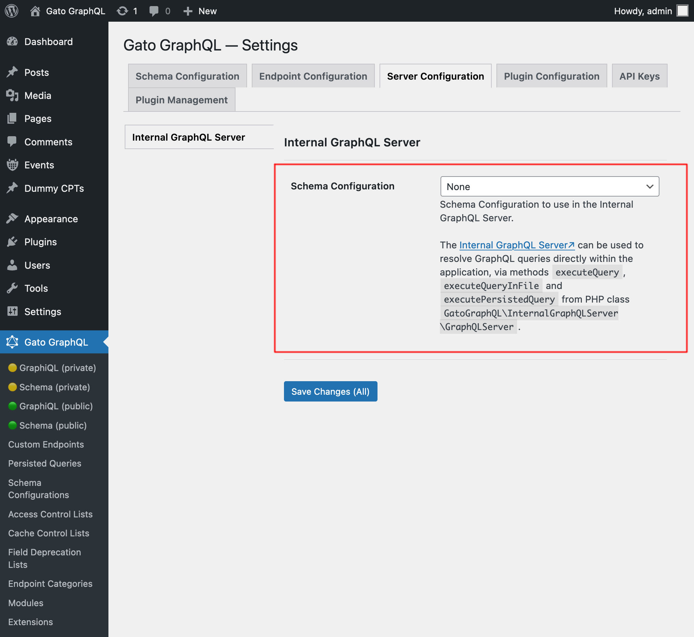

# Internal GraphQL Server

This extension installs an internal GraphQL Server, that can be invoked within your application, using PHP code.

Among other use cases, you can trigger the execution of a GraphQL query whenever some action happens, to perform some related task (such as sending a notification, adding a log entry, validating a condition, etc).

## Description

The internal GraphQL server is accessed via class `GatoGraphQL\InternalGraphQLServer\GraphQLServer`, through these three methods:

- `executeQuery`: Execute a GraphQL query
- `executeQueryInFile`: Execute a GraphQL query contained in a (`.gql`) file
- `executePersistedQuery`: Execute a persisted GraphQL query (providing its ID as an int, or slug as a string)

These are the method signatures:

```php
namespace GatoGraphQL\InternalGraphQLServer;

use PoP\Root\HttpFoundation\Response;

class GraphQLServer {
  /**
   * Execute a GraphQL query
   */
  public static function executeQuery(
      string $query,
      array $variables = [],
      ?string $operationName = null
  ): Response {
    // ...
  }


  /**
   * Execute a GraphQL query contained in a (`.gql`) file
   */
  public static function executeQueryInFile(
      string $file,
      array $variables = [],
      ?string $operationName = null
  ): Response {
    // ...
  }


  /**
   * Execute a persisted GraphQL query (providing its ID as an int, or slug as a string)
   */
  public static function executePersistedQuery(
      string|int $persistedQueryIDOrSlug,
      array $variables = [],
      ?string $operationName = null
  ): Response {
    // ...
  }
}
```

To execute a GraphQL query and obtain the response content:

```php
use GatoGraphQL\InternalGraphQLServer\GraphQLServer;

// Provide the GraphQL query
$query = "{ ... }";

// Execute the query against the internal server
$response = GraphQLServer::executeQuery($query);

// Get the content and decode it
$responseContent = json_decode($response->getContent(), true);

// Access the data and errors from the response
$responseData = $responseContent["data"] ?? [];
$responseErrors = $responseContent["errors"] ?? [];
```

The Response object also contains any produced header (eg: if some Cache Control List was applied, it would add the `Cache-Control` header):

```php
$responseHeaders = $response->getHeaders();
$responseCacheControlHeader = $response->getHeaderLine('Cache-Control');
```

Please notice that class `GraphQLServer` is not ready before the WordPress core `init` hook.

<!-- ## Schema Configuration

The internal GraphQL Server applies the Schema Configuration selected in the Settings page, under tab "Server Configuration > Internal GraphQL Server".



This is the case even when executing `GraphQLServer::executePersistedQuery` (i.e. if the Persisted Query defines a Schema Configuration, this one is ignored).

This configuration also applies whenever the query executed against the internal GraphQL server was triggered by some other GraphQL query while being resolved in an endpoint with a different configuration (such as the public endpoint `graphql/`).

For instance, let's say that we have configured the single endpoint `graphql/` to apply an Access Control List to validate users by IP, and we execute mutation `createPost` against this endpoint:

```graphql
mutation {
  createPost(input: {...}) {
    # ...
  }
}
```

As such, only visitors from that IP will be able to execute this mutation.

Then there is a hook on `wp_insert_post` that executes some query against the internal GraphQL server (eg: to send a notification to the site admin):

```php
add_action(
  "wp_insert_post",
  fn (int $post_id) => GraphQLServer::executeQuery("...", ["postID" => $post_id])
);
```

This GraphQL query will be resolved using the schema configuration applied to the internal GraphQL server, and not to the single endpoint `graphql/`.

As a result, the validation by user IP will not take place (that is, unless that Access Control List was also applied to the internal GraphQL server). -->

## Example

In this example workflow (which also uses **Multiple Query Execution**, **Helper Function Collection** and **Field to Input** modules), when a new post is created in the site, we send a notification to the admin user.

We hook into the WordPress core action `wp_insert_post`, retrieve the data from the newly-created post, and call `GraphQLServer::executeQuery`:

```php
add_action(
  'wp_insert_post',
  function (int $postID, WP_Post $post) {
    if ($post->post_type !== 'post' || $post->post_status !== 'publish') {
      return;
    }
    // Check the contents of the query below
    $query = ' ... ';
    $variables = [
      'postTitle' => $post->post_title,
      'postContent' => $post->post_content,
    ];
    GraphQLServer::executeQuery($query, $variables, 'SendEmail');
  },
  10,
  2
);
```

...with this GraphQL query:

```graphql
query GetEmailData(
  $postTitle: String!,
  $postContent: String!
) {
  emailMessageTemplate: _strConvertMarkdownToHTML(
    text: """

There is a new post on the site: 

**{$postTitle}**:

{$postContent}

    """
  )
  emailMessage: _strReplaceMultiple(
    search: ["{$postTitle}", "{$postContent}"],
    replaceWith: [$postTitle, $postContent],
    in: $__emailMessageTemplate
  )
    @export(as: "emailMessage")
}

mutation SendEmail @depends(on: "GetEmailData") {
  _sendEmail(
    input: {
      to: "admin@site.com"
      subject: "There is a new post"
      messageAs: {
        html: $emailMessage
      }
    }
  ) {
    status
  }
}
```

## Bundles including extension

- [“All in One Toolbox for WordPress” Bundle](../../../../../bundle-extensions/all-in-one-toolbox-for-wordpress/docs/modules/all-in-one-toolbox-for-wordpress/en.md)
- [“Automated Content Translation & Sync for WordPress Multisite” Bundle](../../../../../bundle-extensions/automated-content-translation-and-sync-for-wordpress-multisite/docs/modules/automated-content-translation-and-sync-for-wordpress-multisite/en.md)
- [“Private GraphQL Server for WordPress” Bundle](../../../../../bundle-extensions/private-graphql-server-for-wordpress/docs/modules/private-graphql-server-for-wordpress/en.md)
- [“Tailored WordPress Automator” Bundle](../../../../../bundle-extensions/tailored-wordpress-automator/docs/modules/tailored-wordpress-automator/en.md)

<!-- ## Tutorial lessons referencing extension

- [DRY code for blocks in Javascript and PHP](../../../../../docs/tutorial/dry-code-for-blocks-in-javascript-and-php/en.md)
- [Sending a notification when there is a new post](../../../../../docs/tutorial/sending-a-notification-when-there-is-a-new-post/en.md)
- [Sending a daily summary of activity](../../../../../docs/tutorial/sending-a-daily-summary-of-activity/en.md)
- [Automatically adding a mandatory block](../../../../../docs/tutorial/automatically-adding-a-mandatory-block/en.md) -->
