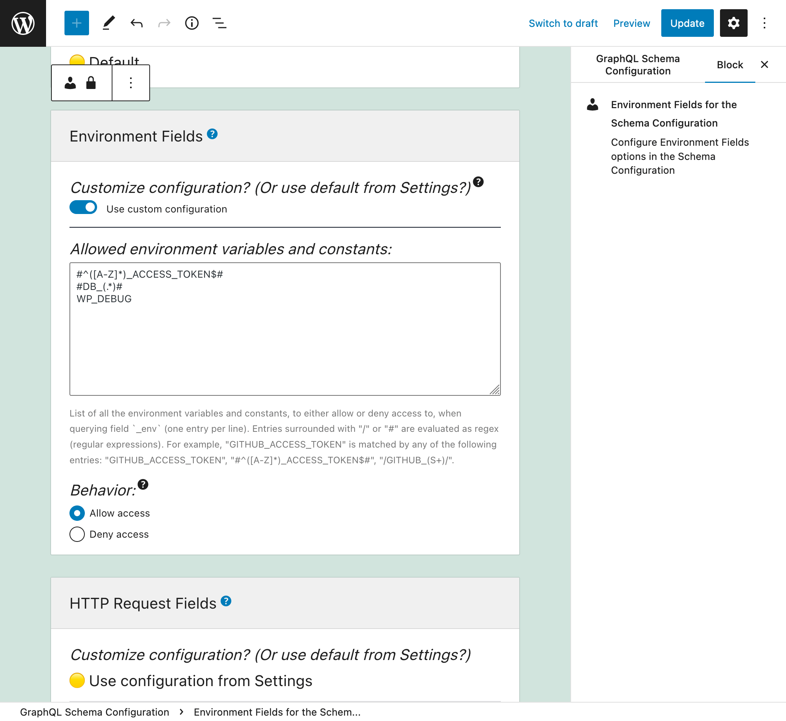
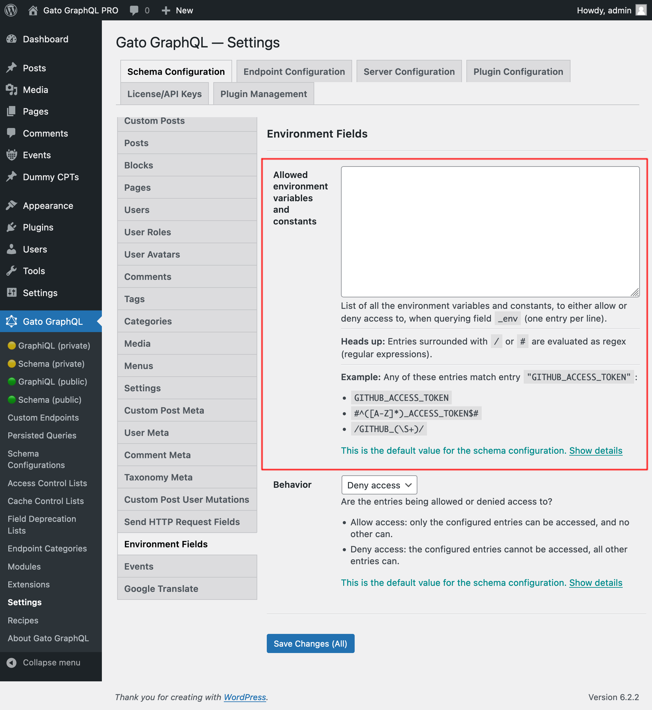
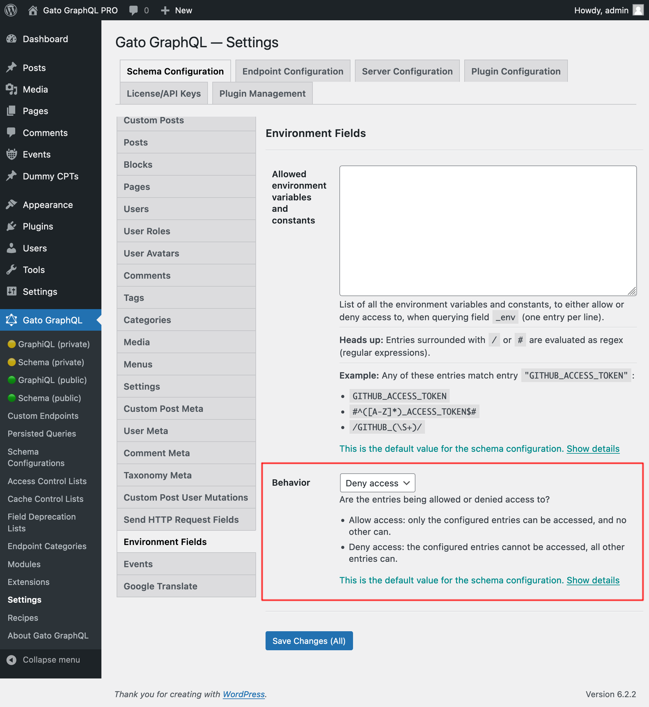

# PHP Constants and Environment Variables via Schema

Query the value from an environment variable or PHP constant.

## Description

This extension adds global field `_env` to the GraphQL schema, which allows to obtain a value from an environment variable, or from a PHP constant (most commonly defined in `wp-config.php`, but can also be defined elsewhere).

Due to security reasons, the name of the environment variable and constants that can be accessed must be explicitly configured.

Field `_env` receives the name of the environment variable or constant under parameter `"name"`, and is resolved like this:

- If there is an environment variable with that name, it returns it
- Otherwise, if there is a constant with that name, it returns it
- Otherwise, it returns `null` and adds an error to the GraphQL output.

For instance, this query retrieves the environment constant `GITHUB_ACCESS_TOKEN` which we might set-up to access a private repository in GitHub:

```graphql
{
  githubAccessToken: _env(name: "GITHUB_ACCESS_TOKEN")
}
```

This query retrieves the DB configuration defined in the `wp-config.php` file:

```graphql
{
  dbName: _env(name: "DB_NAME")
  dbUser: _env(name: "DB_USER")
  dbPassword: _env(name: "DB_PASSWORD")
  dbHost: _env(name: "DB_HOST")
}
```

## Configuring access to the environment constants

We must configure the list of allowed environment variables and constants that can be queried.

Each entry can either be:

- A regex (regular expression), if it's surrounded by `/` or `#`, or
- The full variable or constant name, otherwise

For instance, any of these entries match environment variable `"GITHUB_ACCESS_TOKEN"`:

- `GITHUB_ACCESS_TOKEN`
- `#^([A-Z]*)_ACCESS_TOKEN$#`
- `/GITHUB_(\S+)/`

There are 2 places where this configuration can take place, in order of priority:

1. Custom: In the corresponding Schema Configuration
2. General: In the Settings page

In the Schema Configuration applied to the endpoint, select option `"Use custom configuration"` and then input the desired entries:



Otherwise, the entries defined in the "Environment Fields" tab from the Settings will be used:

<div class="img-width-1024" markdown=1>



</div>

There are 2 behaviors, "Allow access" and "Deny access":

- **Allow access:** only the configured entries can be accessed, and no other can
- **Deny access:** the configured entries cannot be accessed, all other entries can

<div class="img-width-1024" markdown=1>



</div>

## Security: Not exposing credentials

Unless our GraphQL API is not publicly exposed (such as when building a static site), we must be careful for the GraphQL query to not expose private data:

- In the response of the query
- In the output when an error happens
- In the logs

For instance, the following query:

```graphql
{
  githubAccessToken: _env(name: "GITHUB_ACCESS_TOKEN")
}
```

...will directly print the credentials in the response:

```json
{
  "data": {
    "githubAccessToken": "{some access token}"
  }
}
```

We can use several of the other features in the plugin to make the GraphQL query secure:

- **Field to Input** to inject the environment value into another field via a dynamic variable
- **Field Response Removal** to avoid printing the environment variable's value on the output
- **HTTP Client** to directly connect to an external service already from within the GraphQL query

For instance, the following query connects to the GitHub REST API using a private access token:

```graphql
{
  githubAccessToken: _env(name: "GITHUB_ACCESS_TOKEN")
    # This directive will remove this entry from the output
    @remove

  # Create the authorization header to send to GitHub
  authorizationHeader: _sprintf(
    string: "Bearer %s",
    # "Field to Input" feature to access value from the field above
    values: [$__githubAccessToken]
  )
    # Do not print in output
    @remove
  
  # Use the field from "Send HTTP Request Fields" to connect to GitHub
  gitHubArtifactData: _sendJSONObjectCollectionHTTPRequest(
    input: {
      url: "https://api.github.com/repos/GatoGraphQL/GatoGraphQL/actions/artifacts",
      options: {
        headers: [
          {
            name: "Accept"
            value: "application/vnd.github+json"
          },
          {
            name: "Authorization"
            # "Field to Input" feature to access value from the field above
            value: $__authorizationHeader
          },
        ]
      }
    }
  )
}
```

In this query, fields `githubAccessToken` and `authorizationHeader` (which contain sensitive data) are both removed from the output, and field `gitHubArtifactData` will already print the results of the API call, without leaking any of its inputs (eg: an error will print the string `"$__authorizationHeader"` instead of the variable's value).

## Bundles including extension

- [“All in One Toolbox for WordPress” Bundle](../../../../../bundle-extensions/all-in-one-toolbox-for-wordpress/docs/modules/all-in-one-toolbox-for-wordpress/en.md)
- [“Tailored WordPress Automator” Bundle](../../../../../bundle-extensions/tailored-wordpress-automator/docs/modules/tailored-wordpress-automator/en.md)

## Tutorial lessons referencing extension

- [Querying dynamic data](../../../../../docs/tutorial/querying-dynamic-data/en.md)
- [Not leaking credentials when connecting to services](../../../../../docs/tutorial/not-leaking-credentials-when-connecting-to-services/en.md)
- [Creating an API gateway](../../../../../docs/tutorial/creating-an-api-gateway/en.md)
- [Automatically sending newsletter subscribers from InstaWP to Mailchimp](../../../../../docs/tutorial/automatically-sending-newsletter-subscribers-from-instawp-to-mailchimp/en.md)
