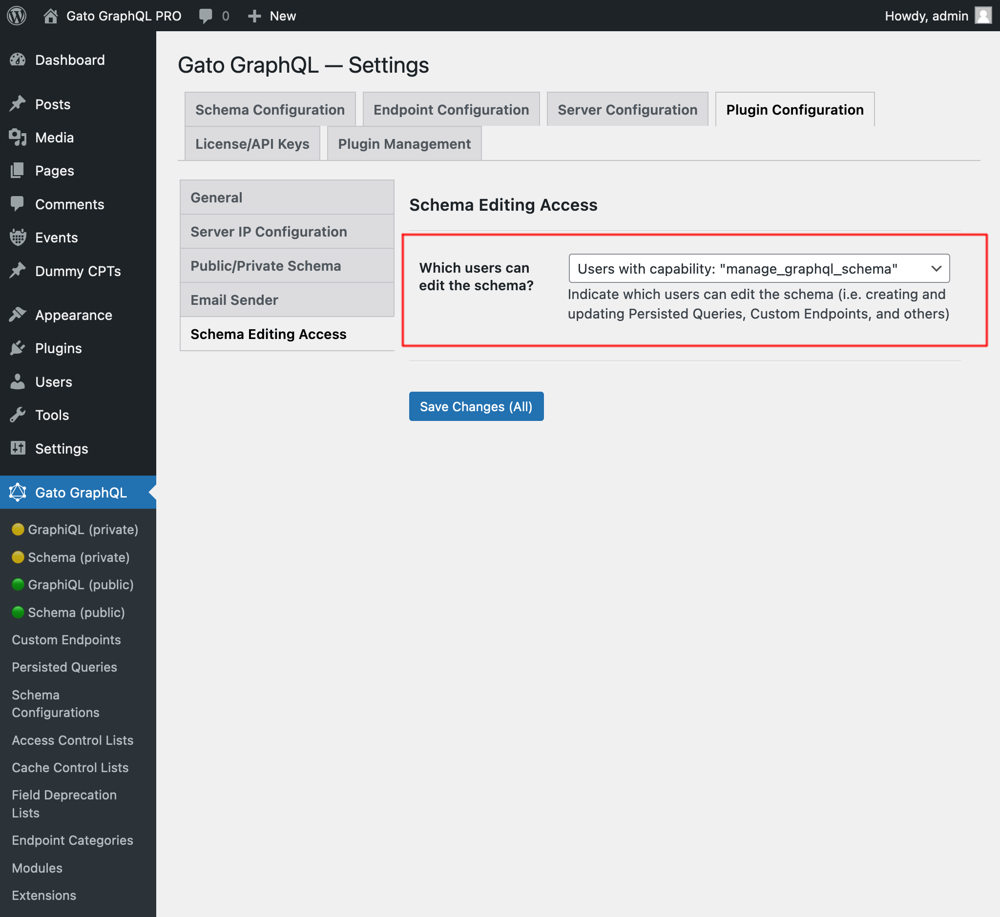

# Schema Editing Access

Grant access to users other than admins to edit the GraphQL schema

## Description

By default, only admin users (those with the `manage_options` capability) have access to the different screens of plugin Gato GraphQL in the admin.

This extension `Schema Editing Access` enables to grant non-admin users access to the GraphiQL and Interactive schema clients in the admin, and to read and/or write the different Custom Post Types from this plugin:

- Persisted Queries
- Custom Endpoints
- Schema Configurations
- Access Control Lists
- Cache Control Lists
- Others

This is achieved via two different methods:

1. By assigning the custom capability `manage_graphql_schema` to the user
2. By selecting the user roles that can edit the schema (down to the "Author" level)

## Granting access to users

Assign capability `manage_graphql_schema` to any user role or any specific user that must be able to edit the schema.

(You can use a 3rd-party plugin to do this, such as [User Role Editor](https://wordpress.org/plugins/user-role-editor/).)

You can also select a group of user roles which can edit the GraphQL schema.

The appropriate configuration must be selected from the dropdown in the "Plugin Configuration > Schema Editing Access" tab on the Settings page:

- `Users with capability: "manage_graphql_schema"`
- `Users with role: "administrator"`
- `Users with any role: "administrator", "editor"`
- `Users with any role: "administrator", "editor", "author"`

## Bundles including extension

- [“All in One Toolbox for WordPress” Bundle](../../../../../bundle-extensions/all-in-one-toolbox-for-wordpress/docs/modules/all-in-one-toolbox-for-wordpress/en.md)
- [“Automated Content Translation & Sync for WordPress Multisite” Bundle](../../../../../bundle-extensions/automated-content-translation-and-sync-for-wordpress-multisite/docs/modules/automated-content-translation-and-sync-for-wordpress-multisite/en.md)
- [“Responsible WordPress Public API” Bundle](../../../../../bundle-extensions/responsible-wordpress-public-api/docs/modules/responsible-wordpress-public-api/en.md)
- [“Tailored WordPress Automator” Bundle](../../../../../bundle-extensions/tailored-wordpress-automator/docs/modules/tailored-wordpress-automator/en.md)

<!-- ## Tutorial lessons referencing extension -->
