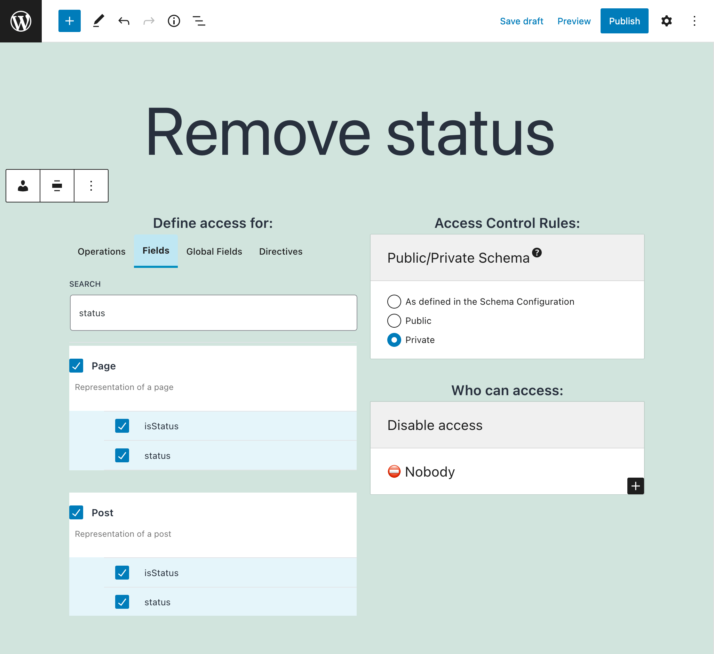

# Access Control Rule: Disable Access

Remove fields and directives from the GraphQL schema.

## Description

To remove fields and directives from the GraphQL schema, create an **Access Control** entry containing:

- The private visibility mode
- The "Disable access" rule
- The fields and directives to remove access to

## Removing access to all mutations

This rule can also be used to remove access to all mutations in the schema. For that, select the `"mutation"` operation.
