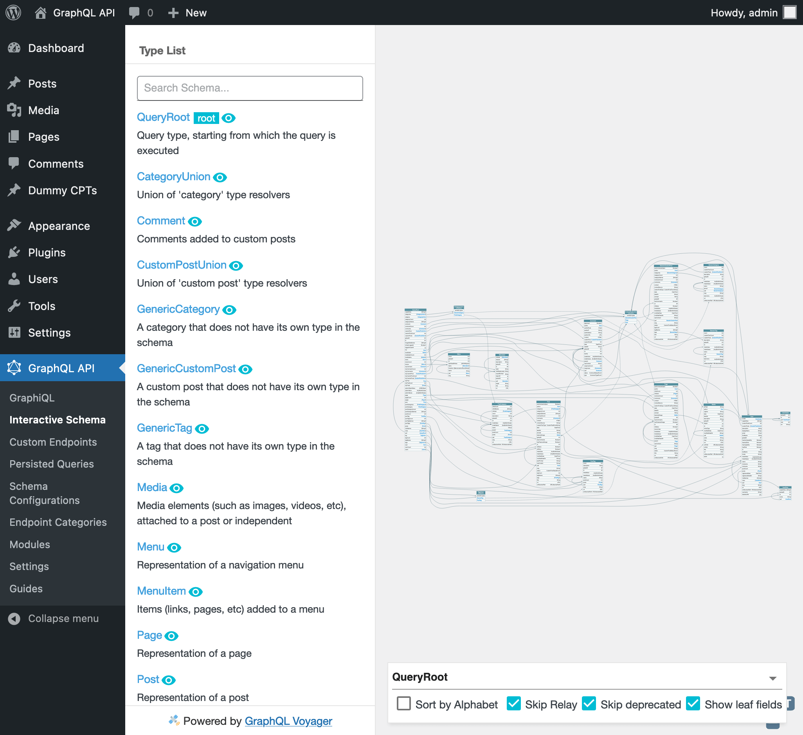

# GraphQL API for WordPress

Transform your WordPress site into a modern GraphQL server.

This layer provides the implementation for WordPress of [GraphQL by PoP](https://graphql-by-pop.com/).

The main plugin is [graphql-api-for-wp](plugins/graphql-api-for-wp). The other ones are extensions, providing extra functionalities and optional entities for the GraphQL schema.

