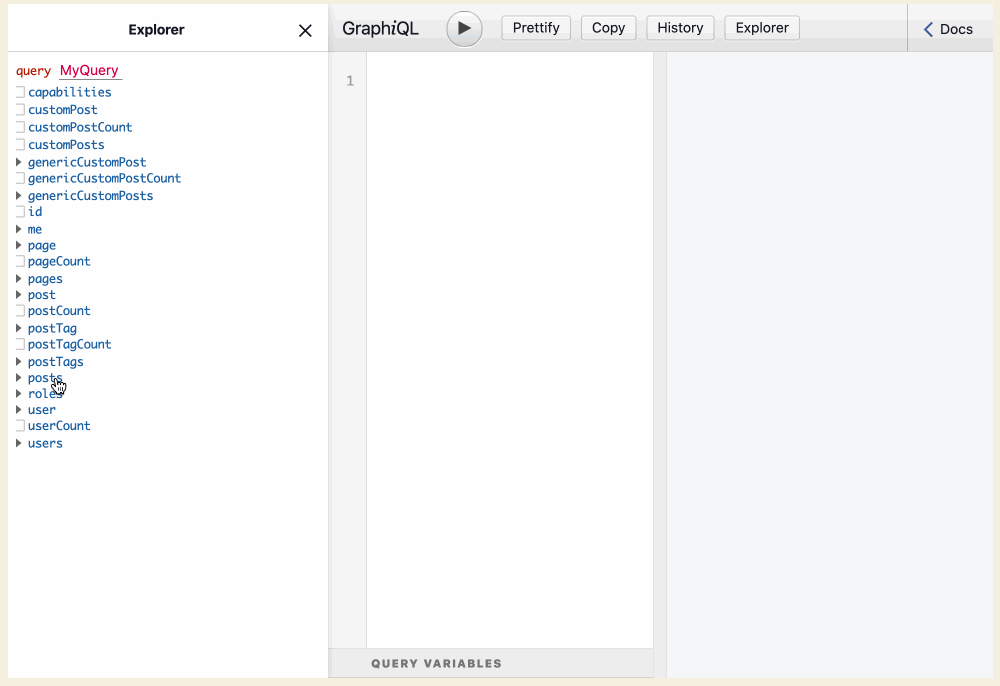
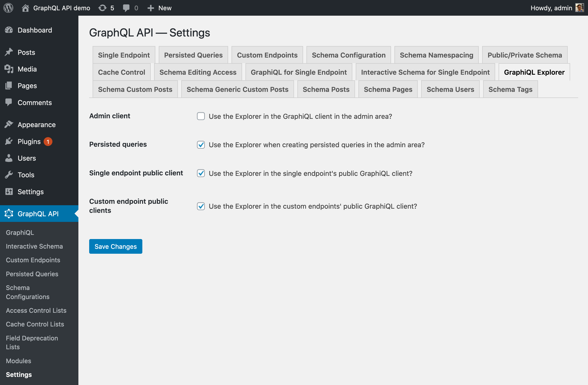

# GraphiQL Explorer

Interactive explorer plugin for GraphiQL

## Description

The Explorer is an addon for the GraphiQL client, which enables to compose the GraphQL persisted query by point-and-clicking on fields:

## How to use

Customize in the Settings which GraphiQL clients will have the Explorer enabled, from the following locations:

- GraphiQL client in the admin area
- When creating persisted queries in the admin area
- In the single endpoint's public GraphiQL client
- In the custom endpoints' public GraphiQL client

