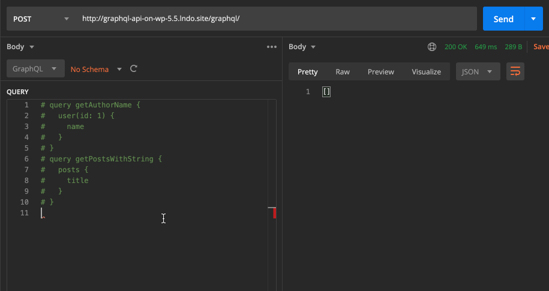
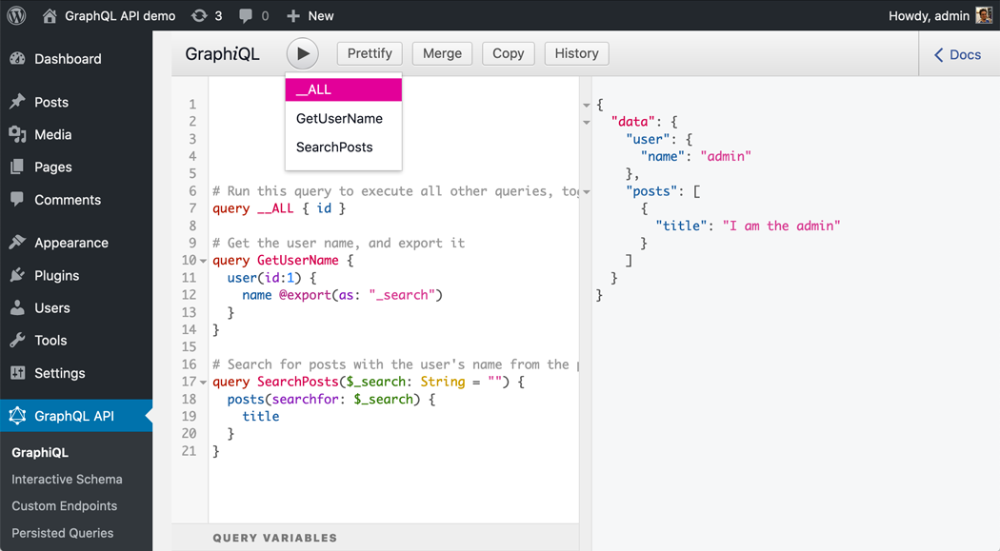

# Multiple Query Execution

Multiple queries are combined together, and executed as a single operation, reusing their state and their data. For instance, if a first query fetches some data, and a second query also accesses the same data, this data is retrieved only once, not twice.

This feature improves performance, for whenever we need to execute an operation against the GraphQL server, then wait for its response, and then use that result to perform another operation. By combining them together, we are avoiding the latency from the extra request(s).

This feature is shipped together with the `@export` directive, which enables to have the results of a query injected as an input into another query.

## How it works

Multiple query execution combines the multiple queries into a single query, making sure they are executed in the same requested order.



This is different from query batching, in which the GraphQL server also executes multiple queries in a single request, but those queries are merely executed one after the other, independently from each other.

## When to use

Let's suppose we want to search all posts which mention the name of the logged-in user. Normally, we would need 2 queries to accomplish this: 

We first retrieve the user's `name`:

```graphql
query GetLoggedInUserName {
  me {
    name
  }
}
```

...and then, having executed the first query, we can pass the retrieved user's `name` as variable `$_search` to perform the search in a second query:

```graphql
query GetPostsContainingString($_search: String = "") {
  posts(search: $_search) {
    id
    title
  }
}
```

The `@export` directive exports the value from a field, and inject this value into a second field through a dynamic variable (whose name is defined under argument `as`), thus combining the 2 queries into 1:

```graphql
query GetLoggedInUserName {
  me {
    name @export(as: "_search")
  }
}

query GetPostsContainingString($_search: String = "") {
  posts(search: $_search) {
    id
    title
  }
}
```

## How to use `@export`

Directive `@export` exports the value of a field (or set of fields) into a variable, to be used somewhere else in the query.

### Implementation details

In order for `@export` to work, the variable to export the value to must:

1. Have a name starting with `"_"` (eg: `$_search`, not `$search`)
2. Be declared in the operation name, and always receive a default value (eg: `query SearchPosts($_search: String = "")`)

### Exportable data

`@export` handles these 4 cases:

1. Exporting a single value from a single field
2. Exporting a list of values from a single field
3. Exporting a dictionary of values, containing several fields from the same object
4. Exporting a list of a dictionary of values, with each dictionary containing several fields from the same object

#### 1. Exporting a single value from a single field

`@export` must handle exporting a single value from a single field, such as the user's `name` in this query:

```graphql
query GetLoggedInUserName {
  me {
    name @export(as: "_search")
  }
}

query GetPostsContainingString($_search: String = "") {
  posts(search: $_search) {
    id
    title
  }
}
```

#### 2. Exporting a list of values from a single field

Fields returning lists should also be exportable. For instance, in the query below, the exported value is the list of names from the logged-in user's friends (hence the type of the `$search` variable went from `String` to `[String]`):

```graphql
query GetLoggedInUserFriendNames {
  me {
    friends {
      name @export(as: "_search")
    }
  }
}

query GetPostsContainingLoggedInUserFriendNames($_search: [String] = []) {
  posts(searchAny: $_search) {
    id
    title
  }
}
```

#### 3. Exporting a dictionary of values, containing several fields from the same object

We may also need to export several properties from a same object. Then, `@export` also allows to export these properties to the same variable, as a dictionary of values.

For instance, the query could export both the `name` and `surname` fields from the user, and have a `searchByAnyProperty` input that receives a dictionary (for which, the input type changed to `Map`):

```graphql
query GetLoggedInUserNameAndSurname {
  me {
    name @export(as: "_search")
    surname @export(as: "_search")
  }
}

query GetPostsContainingLoggedInUserNameAndSurname($_search: Map = {}) {
  posts(searchByAnyProperty: $_search) {
    id
    title
  }
}
```

#### 4. Exporting a list of a dictionary of values, with each dictionary containing several fields from the same object

Similar to upgrading from a single value to a list of values, we can upgrade from a single dictionary to a list of dictionaries.

For instance, we could export fields `name` and `surname` from the list of the logged-in user's friends (for which, the input type changed to `[Map]`):

```graphql
query GetLoggedInUserFriendNamesAndSurnames {
  me {
    friends {
      name @export(as: "_search")
      surname @export(as: "_search")
    }
  }
}

query GetPostsContainingLoggedInUserFriendNamesAndSurnames($_search: [Map] = []) {
  posts(searchAnyByAnyProperty: $_search) {
    id
    title
  }
}
```

## Execution in GraphiQL

The GraphiQL client currently <a href="https://github.com/graphql/graphiql/issues/1635" target="_blank">does not allow to execute multiple operations</a>.

To bypass this issue, whenever the executed operation has name `__ALL`, the GraphQL server will execute all queries. Hence, within the GraphiQL editor, append the following code, and execute this operation:

```graphql
query __ALL { id }
```

<a href="../../images/executing-multiple-queries-in-graphiql.png" target="_blank"></a>

## GraphQL spec

This functionality is currently not part of the GraphQL spec, but it has been requested:

- <a href="https://github.com/graphql/graphql-spec/issues/375" target="_blank">Issue #375 - [RFC] Executing multiple operations in a query</a>
- <a href="https://github.com/graphql/graphql-spec/issues/377" target="_blank">Issue #377 - [RFC] exporting variables between queries</a>
