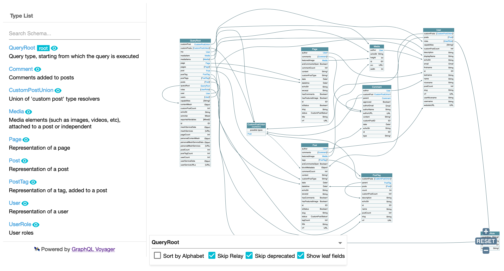
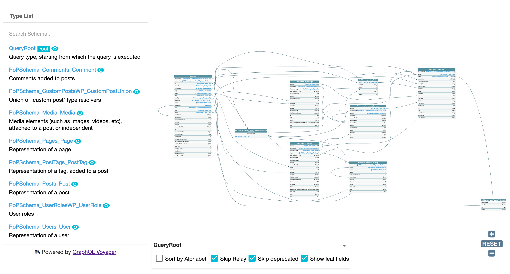
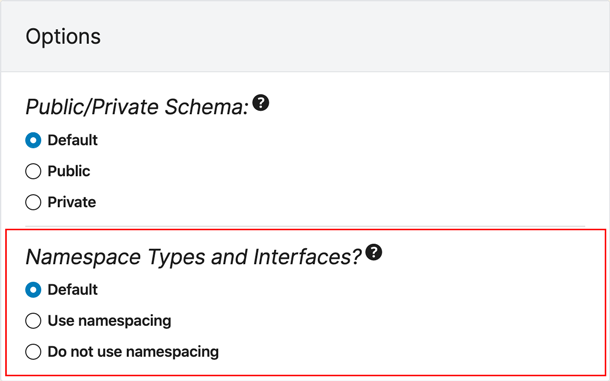
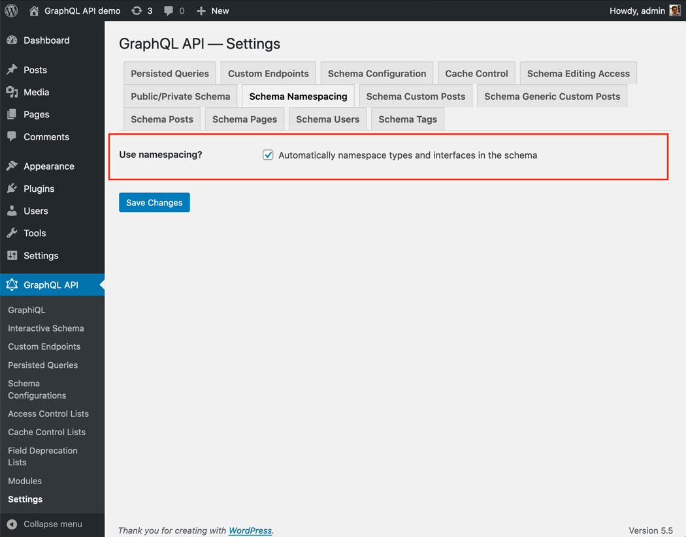

# Schema Namespacing

This module allows to have all types and interfaces in the schema be automatically namespaced, by prepending their names with the corresponding PHP package's owner and name.

Namespacing the schema avoids naming conflicts, which happens when different owners (eg: different teams in the company, or 3rd party plugins) use the same name for a type or interface.

## How it works

In the namespaced schema, type `Post` becomes `PoPSchema_Posts_Post`, interface `IsCustomPost` becomes `PoPSchema_CustomPosts_IsCustomPost`, and so on.

While the schema normally looks like this:

...its namespaced version looks like this:

## How to use

Namespacing the schema can be configured as follows, in order of priority:

✅ Specific mode for the custom endpoint or persisted query, defined in the schema configuration

✅ Default mode, defined in the Settings

If the schema configuration has value `"Default"`, it will use the mode defined in the Settings:

## When to use

If plugins WooCommerce and Easy Digital Downloads both implemented a `Product` type for the GraphQL API, then we could not normally install both plugins at the same time. By enabling the Schema namespacing module, this conflict is avoided because their type names would be converted into `Automattic_WooCommerce_Product` and `SandhillsDevelopment_EasyDigitalDownloads_Product` respectively.

Similarly, the Marketing and Tutorials teams from the same company can release their own type `Discount`, instead of `Marketing_Discount` and `Tutorial_Discount`.

## GraphQL spec

This functionality is currently not part of the GraphQL spec, but it has been requested in <a href="https://github.com/graphql/graphql-spec/issues/163" target="_blank">issue #163 - Namespaces</a>.
