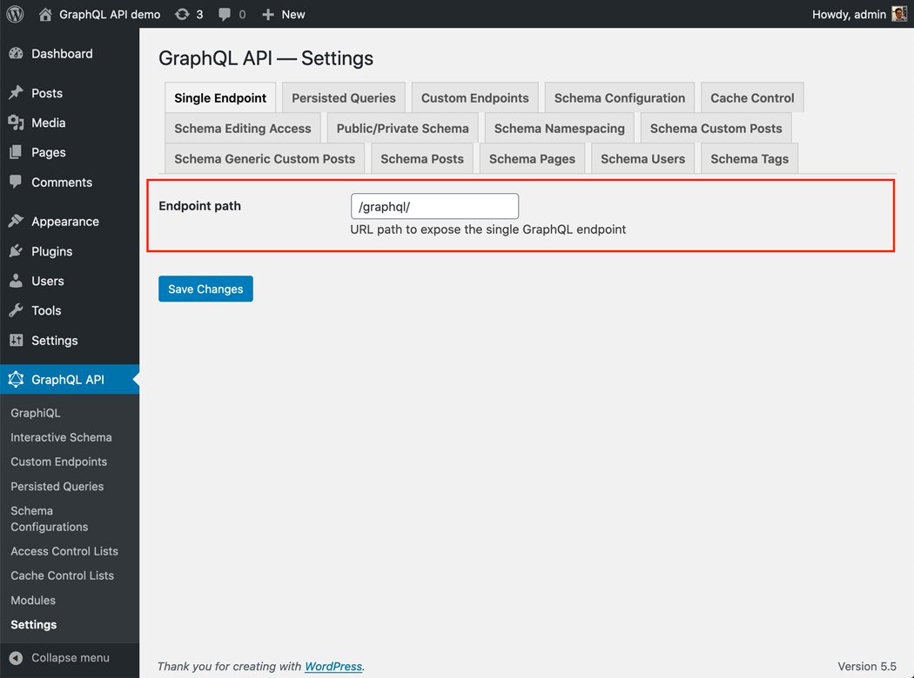

# Single Endpoint

Execute queries against the GraphQL server through the public single endpoint, with unrestrained access.

By default the endpoint is `/graphql/`, and the path can be configured through the Settings.

