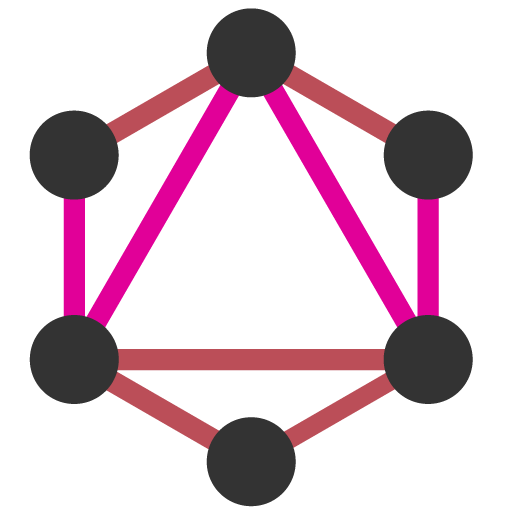

<p align="center"></p>

# GraphQL API for WordPress

[![Build Status][ico-travis]][link-travis]
[![Quality Score][ico-code-quality]][link-code-quality]
[![Software License][ico-license]](LICENSE.md)
<!-- [![GitHub release][ico-release]][link-release] -->
<!-- [![Github all releases][ico-downloads]][link-downloads] -->

Transform your WordPress site into a modern GraphQL server.


This plugin is the implementation for WordPress of [GraphQL by PoP](https://graphql-by-pop.com/), a CMS-agnostic GraphQL server in PHP.

## Why

Please read the author's [introduction to the GraphQL API for WordPress](https://leoloso.com/posts/introducing-the-graphql-api-for-wordpress/), which describes:

- How does it compare with the existing solutions: WP REST API and WPGraphQL
- An overview of all its features
- Q&A

## Requirements

- WordPress 5.4 or above
- PHP 7.4+ for development
- PHP 7.1+ for production

## Install

_Ready for production?_

This plugin requires 3rd party dependencies, but they have not been scoped yet (see [issue #9](https://github.com/GraphQLAPI/graphql-api/issues/9)). So please install this plugin in a development environment first, to make sure there are no conflicts with the other plugins installed in the site.

<!-- If any problem arises, either installing or running the plugin, please [create a new issue](https://github.com/GraphQLAPI/graphql-api/issues/new). -->

<!-- After installed, there will be a new "GraphQL API" section on the menu: -->

### Upload

Download [the latest release of the plugin][latest-release-url] as a .zip file.

Then, in the WordPress admin:

- Go to `Plugins => Add New`
- Click on `Upload Plugin`
- Select the .zip file
- Click on `Install Now` (it may take a few minutes)
- Once installed, click on `Activate`

#### Timeout in Nginx?

Nginx has a time limit to process the response from the PHP backend, and installing large WordPress plugins may exceed the default time limit.

If when installing the plugin you get a "504 Gateway Timeout" error, or an entry `"upstream timed out (110: Connection timed out) while reading upstream"` in the log, increase the timeout to `300` seconds in the Nginx config, as [explained here](https://wordpress.org/support/topic/504-gateway-time-out-504-gateway-time-out-nginx/#post-13423918).

### Composer

Add the following configuration to your `composer.json`:

```json
{
    "require": {
        "graphql-api/graphql-api-for-wp": "^0.7.4"
    },
    "minimum-stability": "dev",
    "repositories": [
        {
            "type": "package",
            "package": {
                "name": "graphql-api/graphql-api-for-wp",
                "type": "wordpress-plugin",
                "version": "0.7.4",
                "dist": {
                    "url": "https://github.com/GraphQLAPI/graphql-api-for-wp/releases/latest/download/graphql-api.zip",
                    "type": "zip"
                },
                "require": {
                    "composer/installers": "^1"
                }
            }
        }
    ],
    "extra": {
        "installer-paths": {
            "wp-content/plugins/{$name}/": [
                "type:wordpress-plugin"
            ],
            "wp-content/themes/{$name}/": [
                "type:wordpress-theme"
            ]
        }
    }
}
```

### WP-CLI

To install via [WP-CLI](http://wp-cli.org/), execute this command:

```bash
wp plugin install --activate https://github.com/GraphQLAPI/graphql-api-for-wp/releases/latest/download/graphql-api.zip
```

### GitHub Updater

This plugin support automatic updating via the [GitHub Updater](https://github.com/afragen/github-updater).

## Development

The source code is hosted on the [PoP monorepo](https://github.com/leoloso/PoP), under [`GraphQLAPIForWP/plugins/graphql-api-for-wp`](https://github.com/leoloso/PoP/tree/master/layers/GraphQLAPIForWP/plugins/graphql-api-for-wp).

To set it up:

1. Clone the monorepo:

```bash
git clone https://github.com/leoloso/PoP.git && cd PoP
```

2. Install Composer dependencies:

```bash
cd layers/GraphQLAPIForWP/plugins/graphql-api-for-wp && composer install
```

### Using Lando

Launch a server, with WordPress installed and the GraphQL API plugin activated, through [Lando](https://lando.dev/).

The first time, to install the server, execute:

```bash
composer init-server
```

From then on, to start the server, execute:

```bash
composer start-server
```

The site will be available under `http://graphql-api-dev.lndo.site`.

To access the [wp-admin](http://graphql-api-dev.lndo.site/wp-admin/):

- User: `admin`
- Password: `admin`

#### Enable XDebug

To enable debugging, update the following configuration in `.lando.yml`:

```yaml
config:
  xdebug: true
```

And then rebuild the server:

```bash
composer rebuild-server
```

<!-- ### Pulling code

Whenever pulling changes from this repo, install again the dependencies:

```bash
composer update
``` -->

### Gutenberg JS builds

Compiled JavaScript code (such as all files under a block's `build/` folder) is added to the repo, but only as compiled for production, i.e. after running `npm run build`.

Code compiled for development, i.e. after running `npm start`, cannot be commited/pushed to the repo.

<!-- ### CMS-agnosticism

Even though this plugin is already the implementation for WordPress, it is recommended to develop components following the [CMS-agnostic method employed by GraphQL by PoP](https://graphql-by-pop.com/docs/architecture/cms-agnosticism.html), so that they can benefit from architectural optimizations and future developments.

In particular, support for serverless PHP (a feature which is [on the roadmap](https://graphql-by-pop.com/docs/roadmap/serverless-wordpress.html)) may require to decouple the codebase from WordPress.

This method requires the code for the component to be divided into 2 separate packages:

- A CMS-agnostic package, containing the business code and generic contracts, but without using any WordPress code (eg: [posts](https://github.com/PoPSchema/posts))
- A CMS-specific package, containing the implementation of the contracts for WordPress (eg: [posts-wp](https://github.com/PoPSchema/posts-wp)) -->

## PHP versions

Requirements:

- PHP 7.4+ for development
- PHP 7.1+ for production (through release [`graphql-api.zip`][latest-release-url])

### Supported PHP features

| PHP Version | Features |
| --- | --- |
| 7.1 | Everything |
| 7.2 | [`object` type](https://www.php.net/manual/en/migration72.new-features.php#migration72.new-features.object-type)<br/><br/>[parameter type widening](https://www.php.net/manual/en/migration72.new-features.php#migration72.new-features.param-type-widening)<br/><br/>Functions:<ul><li>[`spl_object_id`](https://php.net/spl_object_id)</li><li>[`utf8_encode`](https://php.net/utf8_encode)</li><li>[`utf8_decode`](https://php.net/utf8_decode)</li></ul>Constants:<ul><li>[`PHP_FLOAT_*`](https://php.net/reserved.constants#constant.php-float-dig)</li><li>[`PHP_OS_FAMILY`](https://php.net/reserved.constants#constant.php-os-family)</li></ul> |
| 7.3 | [Reference assignments in `list()`/array destructuring](https://www.php.net/manual/en/migration73.new-features.php#migration73.new-features.core.destruct-reference) => `[&$a, [$b, &$c]] = $d`<br/>_Except inside `foreach` ([#4376](https://github.com/rectorphp/rector/issues/4376))_<br/><br/>[Flexible Heredoc and Nowdoc syntax](https://www.php.net/manual/en/migration73.new-features.php#migration73.new-features.core.heredoc)<br/><br/>[Trailing commans in functions calls](https://www.php.net/manual/en/migration73.new-features.php#migration73.new-features.core.trailing-commas)<br/><br/>[`set(raw)cookie` accepts $option argument](https://www.php.net/manual/en/migration73.other-changes.php#migration73.other-changes.core.setcookie)<br/><br/>Functions:<ul><li>[`array_key_first`](https://php.net/array_key_first)</li><li>[`array_key_last`](https://php.net/array_key_last)</li><li>[`hrtime`](https://php.net/function.hrtime)</li><li>[`is_countable`](https://php.net/is_countable)</li></ul>Exceptions:<ul><li>[`JsonException`](https://php.net/JsonException)</li></ul> |
| 7.4 | [Typed properties](https://www.php.net/manual/en/migration74.new-features.php#migration74.new-features.core.typed-properties)<br/><br/>[Arrow functions](https://www.php.net/manual/en/functions.arrow.php)<br/><br/>[Null coalescing assignment operator](https://www.php.net/manual/en/migration74.new-features.php#migration74.new-features.core.null-coalescing-assignment-operator) => `??=`<br/><br/>[Unpacking inside arrays](https://www.php.net/manual/en/migration74.new-features.php#migration74.new-features.core.unpack-inside-array) => `$nums = [3, 4]; $merged = [1, 2, ...$nums, 5];`<br/><br/>[Numeric literal separator](https://www.php.net/manual/en/migration74.new-features.php#migration74.new-features.core.numeric-literal-separator) => `1_000_000`<br/><br/>[`strip_tags()` with array of tag names](https://www.php.net/manual/en/migration74.new-features.php#migration74.new-features.standard.strip-tags) => `strip_tags($str, ['a', 'p'])`<br/><br/>[covariant return types and contravariant param types](https://www.php.net/manual/en/migration74.new-features.php#migration74.new-features.core.type-variance)<br/><br/>Functions:<ul><li>[`get_mangled_object_vars`](https://php.net/get_mangled_object_vars)</li><li>[`mb_str_split`](https://php.net/mb_str_split)</li><li>[`password_algos`](https://php.net/password_algos)</li></ul> |
<!-- @todo Uncomment when PHP 8.0 released -->
<!--
| 8.0 | [Union types](https://php.watch/versions/8.0/union-types)<br/><br/>[`mixed` pseudo type](https://php.watch/versions/8.0#mixed-type)<br/><br/>[`static` return type](https://wiki.php.net/rfc/static_return_type)<br/><br/>Interfaces:<ul><li>`Stringable`</li></ul>Classes:<ul><li>`ValueError`</li><li>`UnhandledMatchError`</li></ul>Constants:<ul><li>`FILTER_VALIDATE_BOOL`</li></ul>Functions:<ul><li>[`fdiv`](https://php.net/fdiv)</li><li>[`get_debug_type`](https://php.net/get_debug_type)</li><li>[`preg_last_error_msg`](https://php.net/preg_last_error_msg)</li><li>[`str_contains`](https://php.net/str_contains)</li><li>[`str_starts_with`](https://php.net/str_starts_with)</li><li>[`str_ends_with`](https://php.net/str_ends_with)</li><li>[`get_resource_id`](https://php.net/get_resource_id)</li></ul> |
-->

## Modules

GraphQL API is extensible, and ships with the following modules (organized by category):

<table>
<thead>
<tr><th>Module</th><th>Description</th></tr>
</thead>
<tbody>

<tr><th colspan="2"><br/>Endpoint</th></tr>
<tr><td><a href="docs/en/modules/single-endpoint.md">Single Endpoint</a></td><td>Expose a single GraphQL endpoint under <code>/graphql/</code>, with unrestricted access</td></tr>
<tr><td><a href="docs/en/modules/persisted-queries.md">Persisted Queries</a></td><td>Expose predefined responses through a custom URL, akin to using GraphQL queries to publish REST endpoints</td></tr>
<tr><td><a href="docs/en/modules/custom-endpoints.md">Custom Endpoints</a></td><td>Expose different subsets of the schema for different targets, such as users (clients, employees, etc), applications (website, mobile app, etc), context (weekday, weekend, etc), and others</td></tr>
<tr><td><a href="docs/en/modules/api-hierarchy.md">API Hierarchy</a></td><td>Create a hierarchy of API endpoints extending from other endpoints, and inheriting their properties</td></tr>
<tr><th colspan="2"><br/>Schema Configuration</th></tr>
<tr><td><a href="docs/en/modules/schema-configuration.md">Schema Configuration</a></td><td>Customize the schema accessible to different Custom Endpoints and Persisted Queries, by applying a custom configuration (involving namespacing, access control, cache control, and others) to the grand schema</td></tr>
<tr><td><a href="docs/en/modules/schema-namespacing.md">Schema Namespacing</a></td><td>Automatically namespace types and interfaces with a vendor/project name, to avoid naming collisions</td></tr>
<tr><td><a href="docs/en/modules/public-private-schema.md">Public/Private Schema</a></td><td>Enable to communicate the existence of some field from the schema to certain users only (private mode) or to everyone (public mode). If disabled, fields are always available to everyone (public mode)</td></tr>
<tr><th colspan="2"><br/>Access Control</th></tr>
<tr><td><a href="docs/en/modules/access-control.md">Access Control</a></td><td>Set-up rules to define who can access the different fields and directives from a schema</td></tr>
<tr><td>Access Control Rule: Disable Access</td><td>Remove access to the fields and directives</td></tr>
<tr><td>Access Control Rule: User State</td><td>Allow or reject access to the fields and directives based on the user being logged-in or not</td></tr>
<tr><td>Access Control Rule: User Roles</td><td>Allow or reject access to the fields and directives based on the user having a certain role</td></tr>
<tr><td>Access Control Rule: User Capabilities</td><td>Allow or reject access to the fields and directives based on the user having a certain capability</td></tr>
<tr><th colspan="2"><br/>Versioning</th></tr>
<tr><td><a href="docs/en/modules/field-deprecation.md">Field Deprecation</a></td><td>Deprecate fields, and explain how to replace them, through a user interface</td></tr>
<tr><th colspan="2"><br/>User Interface</th></tr>
<tr><td><a href="docs/en/modules/low-level-persisted-query-editing.md">Low-Level Persisted Query Editing</a></td><td>Have access to schema-configuration low-level directives when editing GraphQL queries in the admin</td></tr>
<tr><td><a href="docs/en/modules/excerpt-as-description.md">Excerpt as Description</a></td><td>Provide a description of the different entities (Custom Endpoints, Persisted Queries, and others) through their excerpt</td></tr>
<tr><th colspan="2"><br/>Performance</th></tr>
<tr><td><a href="docs/en/modules/cache-control.md">Cache Control</a></td><td>Provide HTTP Caching for Persisted Queries, sending the Cache-Control header with a max-age value calculated from all fields in the query</td></tr>
<tr><td><a href="docs/en/modules/configuration-cache.md">Configuration Cache</a></td><td>Cache the generated application configuration to disk</td></tr>
<tr><td><a href="docs/en/modules/schema-cache.md">Schema Cache</a></td><td>Cache the generated schema to disk</td></tr>
<tr><th colspan="2"><br/>Operational</th></tr>
<tr><td><a href="docs/en/modules/multiple-query-execution.md">Multiple Query Execution</a></td><td>Execute multiple GraphQL queries in a single operation</td></tr>
<tr><td><a href="docs/en/modules/remove-if-null-directive.md">Remove if Null</a></td><td>Addition of <code>@removeIfNull</code> directive, to remove an output from the response if it is <code>null</code></td></tr>
<tr><td><a href="docs/en/modules/proactive-feedback.md">Proactive Feedback</a></td><td>Usage of the top-level entry <code>extensions</code> to send deprecations, warnings, logs, notices and traces in the response to the query</td></tr>
<tr><td><a href="docs/en/modules/embeddable-fields.md">Embeddable Fields</a></td><td>Resolve a field within an argument for another field from the same type, using syntax <code>{{ fieldName }}</code></td></tr>
<tr><td><a href="docs/en/modules/composable-directives.md">Composable Directives</a></td><td>Have directives modify the behavior of other directives</td></tr>
<tr><td><a href="docs/en/modules/mutations.md">Mutations</a></td><td>Modify data by executing mutations</td></tr>
<tr><td><a href="docs/en/modules/nested-mutations.md">Nested Mutations</a></td><td>Execute mutations from any type in the schema, not only from the root</td></tr>
<tr><th colspan="2"><br/>Plugin Management</th></tr>
<tr><td><a href="docs/en/modules/schema-editing-access.md">Schema Editing Access</a></td><td>Grant access to users other than admins to edit the GraphQL schema</td></tr>
<tr><th colspan="2"><br/>Clients</th></tr>
<tr><td><a href="docs/en/modules/graphiql-for-single-endpoint.md">GraphiQL for Single Endpoint</a></td><td>Make a public GraphiQL client available under <code>/graphiql/</code>, to execute queries against the single endpoint. It requires pretty permalinks enabled</td></tr>
<tr><td><a href="docs/en/modules/interactive-schema-for-single-endpoint.md">Interactive Schema for Single Endpoint</a></td><td>Make a public Interactive Schema client available under <code>/schema/</code>, to visualize the schema accessible through the single endpoint. It requires pretty permalinks enabled</td></tr>
<tr><td><a href="docs/en/modules/graphiql-for-custom-endpoints.md">GraphiQL for Custom Endpoints</a></td><td>Enable custom endpoints to be attached their own GraphiQL client, to execute queries against them</td></tr>
<tr><td><a href="docs/en/modules/interactive-schema-for-custom-endpoints.md">Interactive Schema for Custom Endpoints</a></td><td>Enable custom endpoints to be attached their own Interactive schema client, to visualize the custom schema subset</td></tr>
<tr><td><a href="docs/en/modules/graphiql-explorer.md">GraphiQL Explorer</a></td><td>Add the Explorer widget to the GraphiQL client, to simplify coding the query (by point-and-clicking on the fields)</td></tr>
<tr><th colspan="2"><br/>Schema Type</th></tr>
<tr><td><a href="docs/en/modules/schema-customposts.md">Schema Custom Posts</a></td><td>Base functionality for all custom posts</td></tr>
<tr><td><a href="docs/en/modules/schema-generic-customposts.md">Schema Generic Custom Posts</a></td><td>Query any custom post type (added to the schema or not), through a generic type <code>GenericCustomPost</code></td></tr>
<tr><td>Schema Posts</td><td>Query posts, through type <code>Post</code> added to the schema</td></tr>
<tr><td>Schema Pages</td><td>Query pages, through type <code>Page</code> added to the schema</td></tr>
<tr><td>Schema Users</td><td>Query users, through type <code>User</code> added to the schema</td></tr>
<tr><td>Schema User Roles</td><td>Query user roles, through type <code>UserRole</code> added to the schema</td></tr>
<tr><td>Schema Comments</td><td>Query comments, through type <code>Comment</code> added to the schema</td></tr>
<tr><td>Schema Tags</td><td>Base functionality for all tags</td></tr>
<tr><td>Schema Post Tags</td><td>Query post tags, through type <code>PostTag</code> added to the schema</td></tr>
<tr><td>Schema Media</td><td>Query media elements, through type <code>Media</code> added to the schema</td></tr>
<tr><td><a href="docs/en/modules/schema-user-state-mutations.md">Schema User State Mutations</a></td><td>Have the user log-in, and be able to perform mutations</td></tr>
<tr><td>Schema Custom Post Mutations</td><td>Base functionality to mutate custom posts</td></tr>
<tr><td>Schema Post Mutations</td><td>Execute mutations on podyd</td></tr>
<tr><td>Schema Custom Post Media Mutations</td><td>Execute mutations concerning media items on custom posts</td></tr>
<tr><td>Schema Comment Mutations</td><td>Create comments</td></tr>
</tbody>
</table>

## Resources

### Videos

The following videos demonstrate several features:

- [Persisted queries](https://vimeo.com/413503547)
- [Custom endpoints](https://vimeo.com/413503485)
- [Access control](https://vimeo.com/413503383)
- [Public/private API](https://vimeo.com/413503284)
- [HTTP caching](https://vimeo.com/413503188)
- [Field deprecation](https://vimeo.com/413503110)
- [Query inheritance](https://vimeo.com/413503010)

### PHP Architecture

Articles explaining how the plugin is coded using PHP 7.4 but can run on PHP 7.1:

1. [Transpiling PHP code from 8.0 to 7.x via Rector](https://blog.logrocket.com/transpiling-php-code-from-8-0-to-7-x-via-rector/)
2. [Coding in PHP 7.4 and deploying to 7.1 via Rector and GitHub Actions](https://blog.logrocket.com/coding-in-php-7-4-and-deploying-to-7-1-via-rector-and-github-actions/)

### GraphQL by PoP documentation

GraphQL API for WordPress is powered by the CMS-agnostic GraphQL server [GraphQL by PoP](https://graphql-by-pop.com).

For technical information on how it works, check out [its documentation](https://graphql-by-pop.com/docs/getting-started/intro.html).

These articles explain the concepts, design and implementation of GraphQL by PoP:

1. [Designing a GraphQL server for optimal performance](https://blog.logrocket.com/designing-graphql-server-optimal-performance/)
2. [Simplifying the GraphQL data model](https://blog.logrocket.com/simplifying-the-graphql-data-model/)
3. [Schema-first vs code-first development in GraphQL](https://blog.logrocket.com/code-first-vs-schema-first-development-graphql/)
4. [Speeding-up changes to the GraphQL schema](https://blog.logrocket.com/speeding-up-changes-to-the-graphql-schema/)
5. [Versioning fields in GraphQL](https://blog.logrocket.com/versioning-fields-graphql/)
6. [GraphQL directives are underrated](https://blog.logrocket.com/graphql-directives-are-underrated/)
7. [Treating GraphQL directives as middleware](https://blog.logrocket.com/treating-graphql-directives-as-middleware/) 
8. [Creating an @export GraphQL directive](https://blog.logrocket.com/creating-an-export-graphql-directive/)
9. [Adding directives to the schema in code-first GraphQL servers](https://blog.logrocket.com/adding-directives-schema-code-first-graphql-servers/)
10. [Coding a GraphQL server in JavaScript vs. WordPress](https://blog.logrocket.com/coding-a-graphql-server-in-javascript-vs-wordpress/)

### Gutenberg

These articles explain the integration with Gutenberg (the WordPress editor).

1. [Adding a Custom Welcome Guide to the WordPress Block Editor](https://css-tricks.com/adding-a-custom-welcome-guide-to-the-wordpress-block-editor/)
2. [Using Markdown and Localization in the WordPress Block Editor](https://css-tricks.com/using-markdown-and-localization-in-the-wordpress-block-editor/)

## Feature Roadmap

- [Baseline features](https://github.com/leoloso/PoP/projects/2)
- [Sponsored features](https://github.com/leoloso/PoP/projects/1)

## Sponsorship

Ongoing development for this project is funded via [Leonardo Losoviz](https://leoloso.com)'s GitHub sponsors:

[Become a sponsor to Leonardo Losoviz ❤️](https://github.com/sponsors/leoloso)

<!-- Please [browse the list of sponsorable requested features](https://github.com/GraphQLAPI/graphql-api-for-wp/projects/2). If you can benefit from them, be welcome to up-vote (👍) them, and to [sponsor Leonardo](https://github.com/sponsors/leoloso) on any of the available 3 tiers ❤️ .

<br/>_Leo and wife_ -->

## Sponsors

<a href="https://getrector.org/"></a>

## Standards

[PSR-1](https://www.php-fig.org/psr/psr-1), [PSR-4](https://www.php-fig.org/psr/psr-4) and [PSR-12](https://www.php-fig.org/psr/psr-12).

## Release notes

- [0.8](docs/en/release-notes/0.8.md) (upcoming)
- **[0.7](docs/en/release-notes/0.7.md)**
- [0.6](docs/en/release-notes/0.6.md)

## Change log

Please see [CHANGELOG](CHANGELOG.md) for more information on what has changed recently.

## Testing

``` bash
composer test
```

## Static Analysis

Execute [phpstan](https://github.com/phpstan/phpstan) with level 8:

``` bash
composer analyse
```

To run checks for level 0 (or any level from 0 to 8):

``` bash
./vendor/bin/phpstan analyse -l 0 src tests
```

## Downgrading code

To visualize how [Rector](https://github.com/rectorphp/rector) will downgrade the code to PHP 7.1:

```bash
composer preview-code-downgrade
```

## Contributing

Please see [CONTRIBUTING](CONTRIBUTING.md) and [CODE_OF_CONDUCT](CODE_OF_CONDUCT.md) for details.

## Security

If you discover any security related issues, please email leo@getpop.org instead of using the issue tracker.

## Credits

- [Leonardo Losoviz][link-author]

## License

GPLv2 or later. Please see [License File](LICENSE.md) for more information.

[ico-license]: https://img.shields.io/badge/license-GPL%20(%3E%3D%202)-brightgreen.svg?style=flat-square
[ico-travis]: https://img.shields.io/travis/GraphQLAPI/graphql-api-for-wp/master.svg?style=flat-square
[ico-scrutinizer]: https://img.shields.io/scrutinizer/coverage/g/GraphQLAPI/graphql-api-for-wp.svg?style=flat-square
[ico-code-quality]: https://img.shields.io/scrutinizer/g/GraphQLAPI/graphql-api-for-wp.svg?style=flat-square
[ico-release]: https://img.shields.io/github/release/GraphQLAPI/graphql-api-for-wp.svg
[ico-downloads]: https://img.shields.io/github/downloads/GraphQLAPI/graphql-api-for-wp/total.svg

[link-travis]: https://travis-ci.com/github/GraphQLAPI/graphql-api-for-wp
[link-scrutinizer]: https://scrutinizer-ci.com/g/GraphQLAPI/graphql-api-for-wp/code-structure
[link-code-quality]: https://scrutinizer-ci.com/g/GraphQLAPI/graphql-api-for-wp
[link-downloads]: https://GitHub.com/GraphQLAPI/graphql-api-for-wp/releases/
[link-release]: https://GitHub.com/GraphQLAPI/graphql-api-for-wp/releases/
[link-downloads]: https://GitHub.com/GraphQLAPI/graphql-api-for-wp/releases/
[link-contributors]: ../../../../../../contributors
[link-author]: https://github.com/leoloso

[latest-release-url]: https://github.com/GraphQLAPI/graphql-api-for-wp/releases/latest/download/graphql-api.zip
