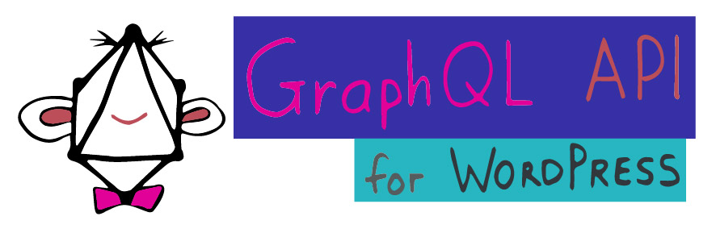
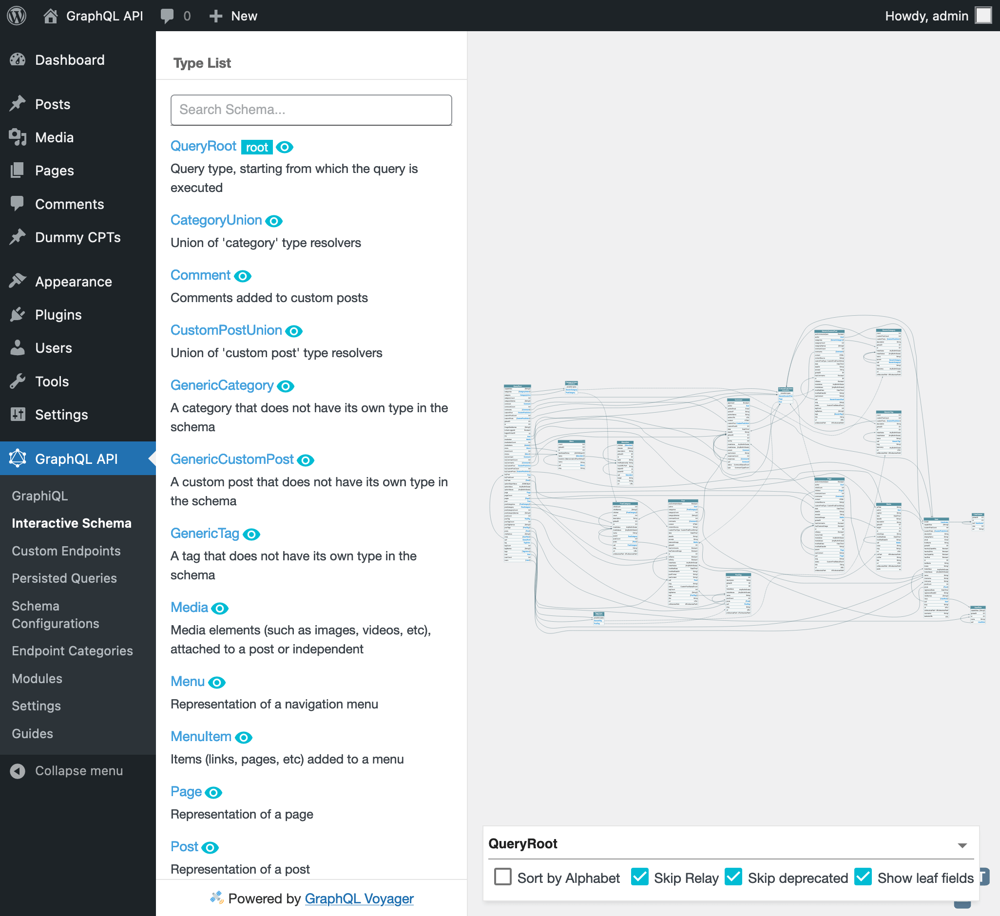

<p align="center"></p>

# GraphQL API for WordPress

<!--
[![Build Status][ico-travis]][link-travis]
[![Quality Score][ico-code-quality]][link-code-quality]
[![Software License][ico-license]](LICENSE.md) -->
<!-- [![GitHub release][ico-release]][link-release] -->
<!-- [![Github all releases][ico-downloads]][link-downloads] -->

Transform your WordPress site into a modern GraphQL server: [graphql-api.com](https://graphql-api.com).



This plugin is the implementation for WordPress of [GraphQL by PoP](https://graphql-by-pop.com/), a CMS-agnostic GraphQL server in PHP.

<!-- ## Why

Please read the author's [introduction to the GraphQL API for WordPress](https://leoloso.com/posts/introducing-the-graphql-api-for-wordpress/), which describes:

- How does it compare with the existing solutions: WP REST API and WPGraphQL
- An overview of all its features
- Q&A -->

<!-- ## Requirements

- WordPress 5.4 or above
- PHP 8.1+ for development
- PHP 7.1+ for production -->

## Installing the plugin (for production)

👀 Instructions: [Installing the GraphQL API for WordPress plugin](https://github.com/leoloso/PoP/blob/master/docs/installing-graphql-api-for-wordpress.md).

## Development

<!-- The source code is hosted on the [`leoloso/PoP` monorepo](https://github.com/leoloso/PoP), under [`GraphQLAPIForWP/plugins/graphql-api-for-wp`](https://github.com/leoloso/PoP/tree/master/layers/GraphQLAPIForWP/plugins/graphql-api-for-wp). -->

👀 Instructions: [Setting-up the development environment](https://github.com/leoloso/PoP/blob/master/docs/development-environment.md).

### Supported PHP features

Check the list of [Supported PHP features](https://github.com/leoloso/PoP/blob/master/docs/supported-php-features.md)

### Gutenberg JS builds

Compiled JavaScript code (such as all files under a block's `build/` folder) is added to the repo, but only as compiled for production, i.e. after running `npm run build`.

Code compiled for development, i.e. after running `npm start`, cannot be commited/pushed to the repo.

### Building static sites

The GraphQL API for WordPress provides safe default settings, to make "live" sites secure. However, these safe default settings are not needed when building "static" sites, where the WordPress site is not exposed to the Internet.

This is how the "safe" and "unsafe" default behaviors compare:

| Feature | Safe behavior | Unsafe behavior |
| --- | --- | --- |
| Single endpoint | Disabled | Enabled |
| “Sensitive” data fields | Not added to the schema | Added to the schema |
| Settings from `wp_options` | Only a few predefined options are queryable | All options are queryable |
| Meta (posts, users, comments, taxonomies) | No keys are queryable | All keys are queryable |
| Max limit to query entities (posts, users, etc) | Limited | Unlimited |
| Environment Fields | No environment variables or PHP constants are queryable | All environment variables and PHP constants are queryable |
| Send HTTP Request Fields | No URL can be requested | All URLs can be requested |

In development, to enable unsafe defaults, execute:

```bash
composer enable-unsafe-defaults
```

On a site in production, set in `wp-config.php`:

```php
define( 'GRAPHQL_API_SETTINGS_OPTION_ENABLE_UNSAFE_DEFAULT_BEHAVIOR', true );
```

Or define this same key/value as an environment variable.

<!-- ### CMS-agnosticism

Even though this plugin is already the implementation for WordPress, it is recommended to develop components following the [CMS-agnostic method employed by GraphQL by PoP](https://graphql-by-pop.com/docs/architecture/cms-agnosticism.html), so that they can benefit from architectural optimizations and future developments.

In particular, support for serverless PHP (a feature which is [on the roadmap](https://graphql-by-pop.com/docs/roadmap/serverless-wordpress.html)) may require to decouple the codebase from WordPress.

This method requires the code for the component to be divided into 2 separate packages:

- A CMS-agnostic package, containing the business code and generic contracts, but without using any WordPress code (eg: [posts](https://github.com/PoPSchema/posts))
- A CMS-specific package, containing the implementation of the contracts for WordPress (eg: [posts-wp](https://github.com/PoPSchema/posts-wp)) -->

## Modules

GraphQL API is extensible, and ships with the following modules (organized by category):

<table>
<thead>
<tr><th>Module</th><th>Description</th></tr>
</thead>
<tbody>

<tr><th colspan="2"><br/>Endpoint</th></tr>
<tr><td><a href="docs/modules/single-endpoint/en.md">Single Endpoint</a></td><td>Expose the single GraphQL endpoint under <code>/graphql/</code></td></tr>
<tr><td><a href="docs/modules/persisted-queries/en.md">Persisted Queries</a></td><td>Expose predefined responses through a custom URL, akin to using GraphQL queries to publish REST endpoints</td></tr>
<tr><td><a href="docs/modules/custom-endpoints/en.md">Custom Endpoints</a></td><td>Expose different subsets of the schema for different targets, such as users (clients, employees, etc), applications (website, mobile app, etc), context (weekday, weekend, etc), and others</td></tr>
<tr><td><a href="docs/modules/api-hierarchy/en.md">API Hierarchy</a></td><td>Create a hierarchy of API endpoints extending from other endpoints, and inheriting their properties</td></tr>
<tr><th colspan="2"><br/>Schema Configuration</th></tr>
<tr><td><a href="docs/modules/schema-configuration/en.md">Schema Configuration</a></td><td>Customize the schema accessible to different Custom Endpoints and Persisted Queries, by applying a custom configuration (involving namespacing, access control, cache control, and others) to the grand schema</td></tr>
<tr><td><a href="docs/modules/schema-namespacing/en.md">Schema Namespacing</a></td><td>Automatically namespace types with a vendor/project name, to avoid naming collisions</td></tr>
<tr><td><a href="docs/modules/nested-mutations/en.md">Nested Mutations</a></td><td>Execute mutations from any type in the schema, not only from the root</td></tr>
<tr><td><a href="docs/modules/public-private-schema/en.md">Public/Private Schema</a></td><td>Enable to communicate the existence of some field from the schema to certain users only (private mode) or to everyone (public mode). If disabled, fields are always available to everyone (public mode)</td></tr>
<tr><th colspan="2"><br/>User Interface</th></tr>
<tr><td><a href="docs/modules/excerpt-as-description/en.md">Excerpt as Description</a></td><td>Provide a description of the different entities (Custom Endpoints, Persisted Queries, and others) through their excerpt</td></tr>
<tr><th colspan="2"><br/>Clients</th></tr>
<tr><td><a href="docs/modules/graphiql-for-single-endpoint/en.md">GraphiQL for Single Endpoint</a></td><td>Make a public GraphiQL client available under <code>/graphiql/</code>, to execute queries against the single endpoint. It requires pretty permalinks enabled</td></tr>
<tr><td><a href="docs/modules/interactive-schema-for-single-endpoint/en.md">Interactive Schema for Single Endpoint</a></td><td>Make a public Interactive Schema client available under <code>/schema/</code>, to visualize the schema accessible through the single endpoint. It requires pretty permalinks enabled</td></tr>
<tr><td><a href="docs/modules/graphiql-for-custom-endpoints/en.md">GraphiQL for Custom Endpoints</a></td><td>Enable custom endpoints to be attached their own GraphiQL client, to execute queries against them</td></tr>
<tr><td><a href="docs/modules/interactive-schema-for-custom-endpoints/en.md">Interactive Schema for Custom Endpoints</a></td><td>Enable custom endpoints to be attached their own Interactive schema client, to visualize the custom schema subset</td></tr>
<tr><td><a href="docs/modules/graphiql-explorer/en.md">GraphiQL Explorer</a></td><td>Add the Explorer widget to the GraphiQL client, to simplify coding the query (by point-and-clicking on the fields)</td></tr>
<tr><th colspan="2"><br/>Schema Type</th></tr>
<tr><td><a href="docs/modules/schema-expose-sensitive-data/en.md">Expose Sensitive Data in the Schema</a></td><td>Expose “sensitive” data elements in the GraphQL schema (such as field <code>Root.roles</code>, field arg <code>Root.posts(status:)</code>, and others), which provide access to potentially private user data</td></tr>
<tr><td><a href="docs/modules/schema-self-fields/en.md">Self Fields</a></td><td>Expose "self" fields in the GraphQL schema (such as <code>Post.self</code> and <code>User.self</code>), which can help give a particular shape to the GraphQL response</td></tr>
<tr><td><a href="docs/modules/schema-customposts/en.md">Schema Custom Posts</a></td><td>Query Custom Post Types</td></tr>
<tr><td>Schema Posts</td><td>Query posts, through type <code>Post</code> added to the schema</td></tr>
<tr><td>Schema Pages</td><td>Query pages, through type <code>Page</code> added to the schema</td></tr>
<tr><td>Schema Users</td><td>Query users, through type <code>User</code> added to the schema</td></tr>
<tr><td>Schema User Roles</td><td>Query user roles, through type <code>UserRole</code> added to the schema</td></tr>
<tr><td>Schema User Avatars</td><td>Query user avatars, through type <code>UserAvatar</code> added to the schema</td></tr>
<tr><td>Schema Comments</td><td>Query comments, through type <code>Comment</code> added to the schema</td></tr>
<tr><td>Schema Tags</td><td>Base functionality for all tags</td></tr>
<tr><td>Schema Post Tags</td><td>Query post tags, through type <code>PostTag</code> added to the schema</td></tr>
<tr><td>Schema Categories</td><td>Base functionality for all categories</td></tr>
<tr><td>Schema Post Categories</td><td>Query post categories, through type <code>PostCategory</code> added to the schema</td></tr>
<tr><td>Schema Media</td><td>Query media elements, through type <code>Media</code> added to the schema</td></tr>
<tr><td><a href="docs/modules/schema-custompost-meta/en.md">Schema Custom Post Meta</a></td><td>Add the <code>option</code> field to custom posts, such as type <code>Post</code></td></tr>
<tr><td><a href="docs/modules/schema-user-meta/en.md">Schema User Meta</a></td><td>Add the <code>option</code> field to type <code>User</code></td></tr>
<tr><td><a href="docs/modules/schema-comment-meta/en.md">Schema Comment Meta</a></td><td>Add the <code>option</code> field to type <code>Comment</code></td></tr>
<tr><td><a href="docs/modules/schema-taxonomy-meta/en.md">Schema Taxonomy Meta</a></td><td>Add the <code>option</code> field to taxonomies, such as types <code>PostTag</code> and <code>PostCategory</code></td></tr>
<tr><td>Schema Menus</td><td>Query menus, through type <code>Menu</code> added to the schema</td></tr>
<tr><td><a href="docs/modules/schema-settings/en.md">Schema Settings</a></td><td>Fetch settings from the site</td></tr>
<tr><td><a href="docs/modules/mutations/en.md">Mutations</a></td><td>Modify data by executing mutations</td></tr>
<tr><td><a href="docs/modules/schema-user-state-mutations/en.md">Schema User State Mutations</a></td><td>Have the user log-in, and be able to perform mutations</td></tr>
<tr><td>Schema Custom Post Mutations</td><td>Base functionality to mutate custom posts</td></tr>
<tr><td>Schema Post Mutations</td><td>Execute mutations on podyd</td></tr>
<tr><td>Schema Custom Post Media Mutations</td><td>Execute mutations concerning media items on custom posts</td></tr>
<tr><td>Schema Post Media Mutations</td><td>Execute mutations concerning media items on posts</td></tr>
<tr><td>Schema Post Tag Mutations</td><td>Add tags to posts</td></tr>
<tr><td>Schema Post Category Mutations</td><td>Add categories to posts</td></tr>
<tr><td>Schema Comment Mutations</td><td>Create comments</td></tr>
</tbody>
</table>

## Resources

- [YouTube video: GraphQL API for WordPress demo](https://youtu.be/LnyNyT2RwwI)
- [Making GraphQL Work In WordPress](https://www.smashingmagazine.com/2021/04/making-graphql-work-in-wordpress/)
- [Rendering the WordPress philosophy in GraphQL](https://css-tricks.com/rendering-the-wordpress-philosophy-in-graphql/)
- [Comparing the GraphQL API for WordPress vs WPGraphQL](https://graphql-api.com/blog/graphql-api-vs-wpgraphql-the-fight/)

<details>

<summary>Architectural resources</summary>

### PHP Architecture

Articles explaining how the plugin is "downgraded", using PHP 8.1 for development but deployable to PHP 7.1 for production:

1. [Transpiling PHP code from 8.0 to 7.x via Rector](https://blog.logrocket.com/transpiling-php-code-from-8-0-to-7-x-via-rector/)
2. [Coding in PHP 7.4 and deploying to 7.1 via Rector and GitHub Actions](https://blog.logrocket.com/coding-in-php-7-4-and-deploying-to-7-1-via-rector-and-github-actions/)
3. [Tips for transpiling code from PHP 8.0 down to 7.1](https://blog.logrocket.com/tips-transpiling-code-from-php-8-0-to-7-1/)
4. [Including both PHP 7.1 and 8.0 code in the same plugin … or not?](https://blog.logrocket.com/including-php-7-1-and-8-0-code-same-plugin-or-not/)

Service container implementation:

- [Building extensible PHP apps with Symfony DI](https://blog.logrocket.com/building-extensible-php-apps-with-symfony-di/)

Explanation of how the codebase is split into granular packages, to enable CMS-agnosticism:

1. [Abstracting WordPress Code To Reuse With Other CMSs: Concepts (Part 1)](https://www.smashingmagazine.com/2019/11/abstracting-wordpress-code-cms-concepts/)
2. [Abstracting WordPress Code To Reuse With Other CMSs: Implementation (Part 2)](https://www.smashingmagazine.com/2019/11/abstracting-wordpress-code-reuse-with-other-cms-implementation/)

Description of how the plugin is scoped:

- [GraphQL API for WordPress is now scoped, thanks to PHP-Scoper!](https://graphql-api.com/blog/graphql-api-for-wp-is-now-scoped-thanks-to-php-scoper/)

### GraphQL by PoP documentation

GraphQL API for WordPress is powered by the CMS-agnostic GraphQL server [GraphQL by PoP](https://graphql-by-pop.com).

Technical information on how the GraphQL server works:

- [GraphQL by PoP documentation](https://graphql-by-pop.com/docs/getting-started/intro.html).

Description of how a GraphQL server using server-side components works:

- [Implementing a GraphQL server with components in PHP](https://www.wpkube.com/implementing-graphql-server/)

These articles explain the concepts, design and implementation of GraphQL by PoP:

1. [Designing a GraphQL server for optimal performance](https://blog.logrocket.com/designing-graphql-server-optimal-performance/)
2. [Simplifying the GraphQL data model](https://blog.logrocket.com/simplifying-the-graphql-data-model/)
3. [Schema-first vs code-first development in GraphQL](https://blog.logrocket.com/code-first-vs-schema-first-development-graphql/)
4. [Speeding-up changes to the GraphQL schema](https://blog.logrocket.com/speeding-up-changes-to-the-graphql-schema/)
5. [Versioning fields in GraphQL](https://blog.logrocket.com/versioning-fields-graphql/)
6. [GraphQL directives are underrated](https://blog.logrocket.com/graphql-directives-are-underrated/)
7. [Treating GraphQL directives as middleware](https://blog.logrocket.com/treating-graphql-directives-as-middleware/) 
8. [Creating an @export GraphQL directive](https://blog.logrocket.com/creating-an-export-graphql-directive/)
9. [Adding directives to the schema in code-first GraphQL servers](https://blog.logrocket.com/adding-directives-schema-code-first-graphql-servers/)
10. [Coding a GraphQL server in JavaScript vs. WordPress](https://blog.logrocket.com/coding-a-graphql-server-in-javascript-vs-wordpress/)
11. [Supporting opt-in nested mutations in GraphQL](https://blog.logrocket.com/supporting-opt-in-nested-mutations-in-graphql/)
12. [HTTP caching in GraphQL](https://blog.logrocket.com/http-caching-graphql/)

### Gutenberg

These articles explain the integration with Gutenberg (the WordPress editor).

1. [Adding a Custom Welcome Guide to the WordPress Block Editor](https://css-tricks.com/adding-a-custom-welcome-guide-to-the-wordpress-block-editor/)
2. [Using Markdown and Localization in the WordPress Block Editor](https://css-tricks.com/using-markdown-and-localization-in-the-wordpress-block-editor/)

</details>

## Standards

[PSR-1](https://www.php-fig.org/psr/psr-1), [PSR-4](https://www.php-fig.org/psr/psr-4) and [PSR-12](https://www.php-fig.org/psr/psr-12).

To check the coding standards via [PHP CodeSniffer](https://github.com/squizlabs/PHP_CodeSniffer), run:

``` bash
composer check-style
```

To automatically fix issues, run:

``` bash
composer fix-style
```

## Release notes

- [1.0](docs/release-notes/1.0/en.md)
- **[0.10](docs/release-notes/0.10/en.md)** (current)
- [0.9](docs/release-notes/0.9/en.md)
- [0.8](docs/release-notes/0.8/en.md)
- [0.7](docs/release-notes/0.7/en.md)
- [0.6](docs/release-notes/0.6/en.md)

## Change log

Please see [CHANGELOG](CHANGELOG.md) for more information on what has changed recently.

## Testing

To execute [PHPUnit](https://phpunit.de/), run:

``` bash
composer test
```

## Static Analysis

To execute [PHPStan](https://github.com/phpstan/phpstan), run:

``` bash
composer analyse
```

## Downgrading code

To visualize how [Rector](https://github.com/rectorphp/rector) will downgrade the code to PHP 7.1:

```bash
composer preview-code-downgrade
```

## Report issues

To report a bug or request a new feature please do it on the [PoP monorepo issue tracker](https://github.com/leoloso/PoP/issues).

## Contributing

We welcome contributions for this package on the [PoP monorepo](https://github.com/leoloso/PoP) (where the source code for this package is hosted).

Please see [CONTRIBUTING](CONTRIBUTING.md) and [CODE_OF_CONDUCT](CODE_OF_CONDUCT.md) for details.

## Security

If you discover any security related issues, please email leo@getpop.org instead of using the issue tracker.

## Credits

- [Leonardo Losoviz][link-author]

## License

GPLv2 or later. Please see [License File](LICENSE.md) for more information.

[ico-license]: https://img.shields.io/badge/license-GPL%20(%3E%3D%202)-brightgreen.svg?style=flat-square
[ico-travis]: https://img.shields.io/travis/GraphQLAPI/graphql-api-for-wp/master.svg?style=flat-square
[ico-scrutinizer]: https://img.shields.io/scrutinizer/coverage/g/GraphQLAPI/graphql-api-for-wp.svg?style=flat-square
[ico-code-quality]: https://img.shields.io/scrutinizer/g/GraphQLAPI/graphql-api-for-wp.svg?style=flat-square
[ico-release]: https://img.shields.io/github/release/GraphQLAPI/graphql-api-for-wp.svg
[ico-downloads]: https://img.shields.io/github/downloads/GraphQLAPI/graphql-api-for-wp/total.svg

[link-travis]: https://travis-ci.com/github/GraphQLAPI/graphql-api-for-wp
[link-scrutinizer]: https://scrutinizer-ci.com/g/GraphQLAPI/graphql-api-for-wp/code-structure
[link-code-quality]: https://scrutinizer-ci.com/g/GraphQLAPI/graphql-api-for-wp
[link-downloads]: https://GitHub.com/GraphQLAPI/graphql-api-for-wp/releases/
[link-release]: https://GitHub.com/GraphQLAPI/graphql-api-for-wp/releases/
[link-downloads]: https://GitHub.com/GraphQLAPI/graphql-api-for-wp/releases/
[link-contributors]: ../../../../../../contributors
[link-author]: https://github.com/leoloso

[latest-release-url]: https://github.com/leoloso/PoP/releases/latest/download/graphql-api.zip


<!--

## Composer merge plugin

Add into `composer.json`:

```json
{
    "require-dev": {
        "wikimedia/composer-merge-plugin": "dev-feature/composer-v2"
    },
    "repositories": [
        {
            "type": "vcs",
            "url": "https://github.com/mcaskill/composer-merge-plugin.git"
        }
    ],
    "extra": {
        "merge-plugin": {
            "include": [
                "composer.local.json"
            ],
            "recurse": true,
            "replace": false,
            "ignore-duplicates": false,
            "merge-dev": true,
            "merge-extra": false,
            "merge-extra-deep": false,
            "merge-scripts": false
        }
    }
}
```

Add into .gitignore:

```
composer.local.json
```

-->
